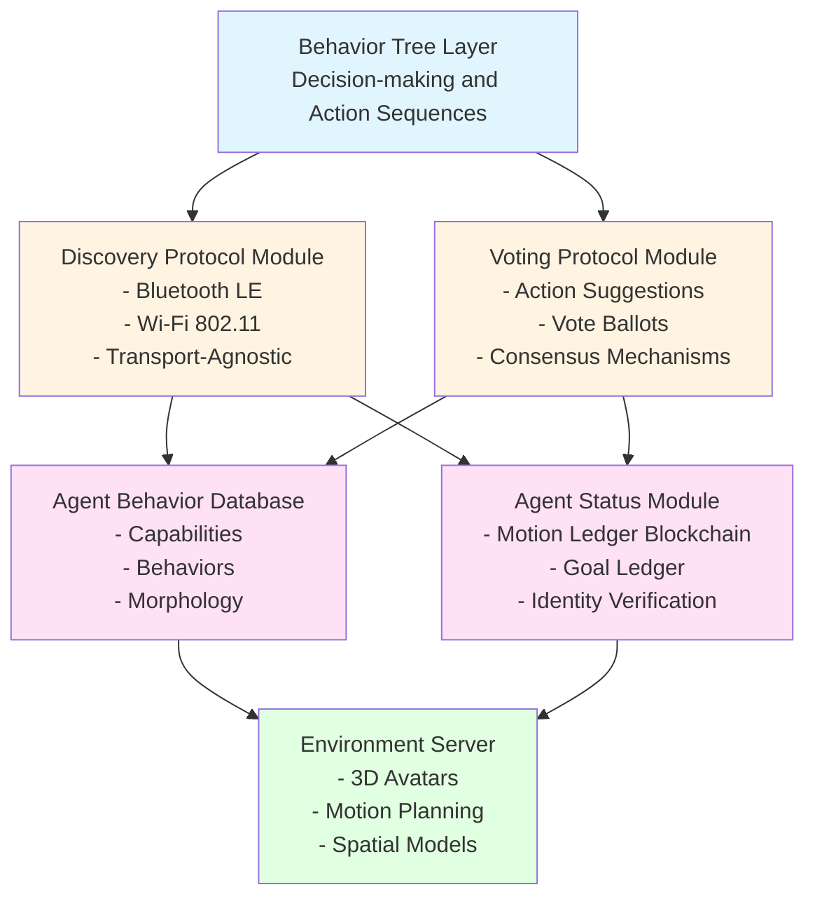
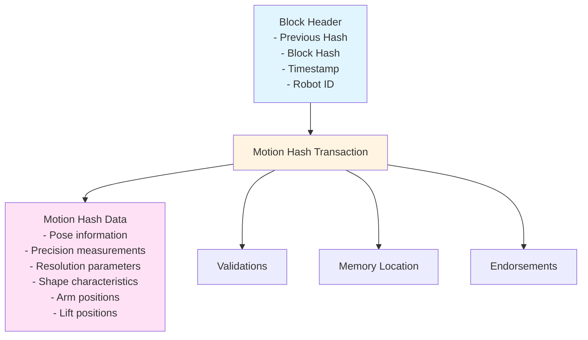
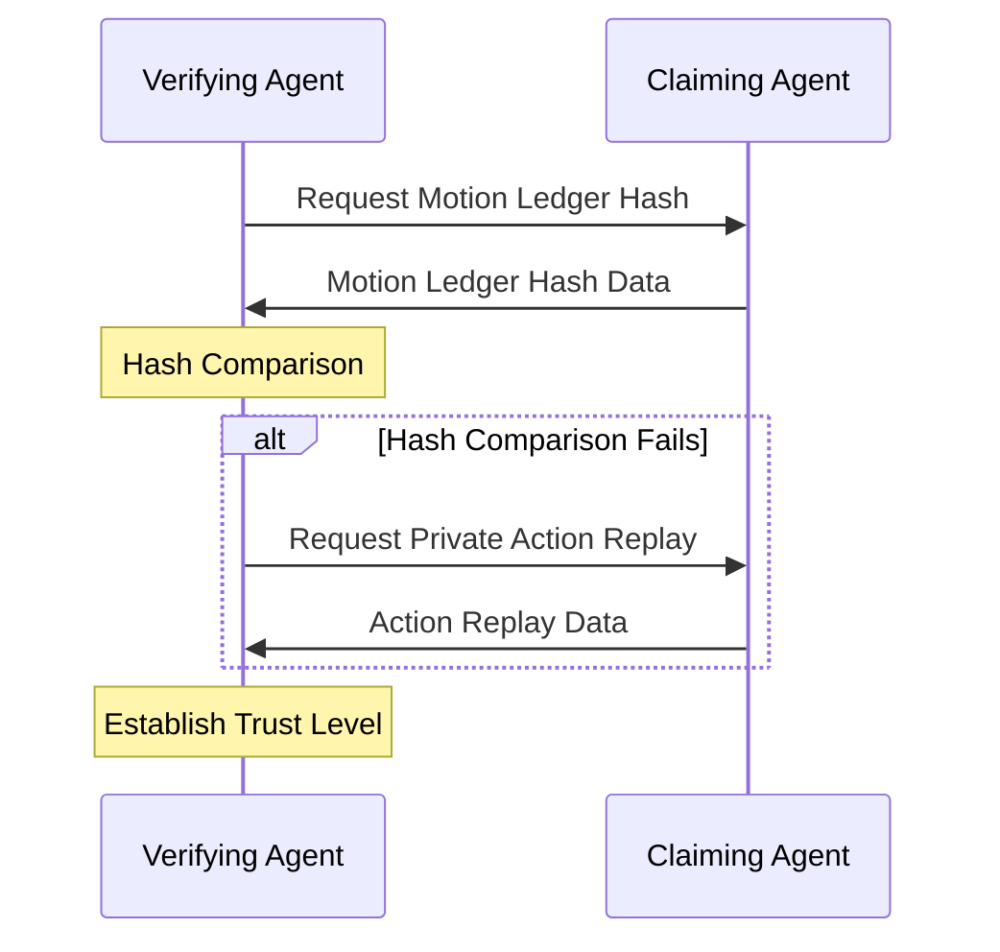

# Multi-Robot Communication Protocol

The ROBOCON OS implements a **consensus-based multi-robot task allocation system** that enables distributed decision-making among robotic agents through voting protocols while providing zero-trust identity verification and motion ledger authentication.

## Overview

The multi-robot communication protocol operates without requiring a centralized scheduler, allowing robotic agents to coordinate tasks through distributed consensus mechanisms. The system implements a zero-trust security model where identity verification is performed through progressive verification mechanisms rather than assuming signed credentials are genuine.

## System Architecture



## Core Components

### Discovery Protocol Module

The discovery protocol enables robotic agents to locate and identify other nearby agents within the operational environment.

**Transport Layers:**
- **Bluetooth LE**: Used for proximity discovery bursts when agents need to quickly identify nearby peers
- **Wi-Fi 802.11**: Used for longer-range exchanges requiring substantial data transmission
- **Transport-Agnostic**: Supports additional mechanisms (Ethernet, 5G, satellite links) based on deployment environment

**Discovery Process:**
1. Agents broadcast discovery beacons containing:
   - Robot ID and capabilities
   - Current location (if available)
   - Motion ledger hash (for initial verification)
2. Receiving agents respond with:
   - Confirmation of receipt
   - Their own identification and capabilities
   - Request for capability exchange
3. Upon successful discovery, agents:
   - Insert 3D avatars into shared environment model
   - Establish initial communication channels
   - Begin capability assessment

### Voting Protocol Module

The voting protocol facilitates consensus-based decision making between robotic agents for task allocation.

**Voting Process:**

1. **Action Suggestion Phase**
   - First robotic agent broadcasts an action suggestion packet
   - Packet includes:
     - Proposed action subtree or undecomposed goal
     - Cryptographic hash of expected world-state change
     - Required capabilities
     - Estimated resource requirements

2. **Vote Intent Response**
   - Receiving agents transmit vote intent responses
   - Responses indicate:
     - Whether agent can participate
     - Capability assessment
     - Resource availability

3. **Vote Ballot Phase**
   - Participating agents transmit vote ballots
   - Ballots contain:
     - Vote (approve/reject/abstain)
     - Reasoning (optional)
     - Alternative suggestions (if rejecting)

4. **Consensus Achievement**
   - Consensus requires simple majority of responding agents
   - Must be achieved within predetermined time window
   - Deterministic tie-breaker uses robot-ID hash when votes are tied

5. **Action Insertion**
   - Upon consensus, corresponding action subtrees are inserted into behavior trees
   - All participating agents update their local behavior trees
   - Execution begins with synchronized start

**Fault Tolerance:**
- Voting retries up to N times (configurable at protocol level)
- Escalation to human operator if consensus fails after retries
- Timeout mechanisms for unresponsive agents

### Agent Behavior Database

The agent behavior database stores comprehensive information about robotic agents within the system.

**Data Structures:**

**Agent Capabilities:**
- Weight lifting capacity
- Movement speed/range
- Sensor capabilities
- End effector configurations
- Manufacturer codes and machine IDs

**Agent Behaviors:**
- Current behavior tree state
- Planned action sequences
- Resource allocation status
- Task assignments

**Morphological Data:**
- Physical dimensions
- Joint configurations
- Sensor placements
- Affects motion planning calculations

### Agent Status Module

The agent status module provides comprehensive tracking and verification capabilities.

#### Motion Ledger (Blockchain Structure)

The motion ledger maintains a tamper-evident record of agent movements and actions over time.

**Block Structure:**



**Motion Hash Data Includes:**
- Fine-grained motion data
- Pose information (position, orientation)
- Precision measurements
- Resolution parameters
- Shape characteristics
- Joint/actuator states

**Hash Calculation:**
- Uses SHA-256 (or configurable algorithm)
- Previous hash links blocks linearly
- Block hash calculated from entire block or header portion

#### Goal Ledger

The goal ledger stores high-level natural-language goals and cross-links to constituent motion-ledger entries.

**Structure:**
- Natural language description of goal
- Links to motion ledger entries
- Hierarchical relationship between abstract objectives and physical actions
- Temporal relationships

**Privacy Hierarchy:**
1. **Behavior Trees**: Most private
2. **Motion Ledgers**: Mid-level privacy (hashes may be shared)
3. **Goal Ledgers**: Most public (facilitates coordination)

### Environment Server

The environment server provides comprehensive environmental awareness and spatial representation.

**Functionality:**
- Creates and maintains 3D avatars of discovered robots
- Enables motion planning and visualization
- Generates 3D models based on morphological data
- Integrates with discovery protocol to instantiate new avatars
- Provides 3D representation from each robot's point of view

**Integration:**
- Receives behavioral information from behavior trees
- Predicts future agent positions
- Identifies potential collision scenarios
- Provides spatial constraints for voting protocol
- Supports simulation and verification of motion sequences

## Zero-Trust Identity Verification

The system implements progressive identity verification through multiple mechanisms without assuming signed IDs are genuine.

### Verification Levels

**Level 1: Motion Ledger Hash Verification**
1. Agent receives identity claim from peer
2. Requests motion ledger hash data
3. Compares received hashes with expected values
4. Verifies continuity of recorded motions
5. Establishes initial trust level

**Level 2: Private Action Replay**
- Triggered when hash comparison fails
- Request verification of sequence of fine-grained motions
- Validates motion ledger consistency
- Includes sensor data (LiDAR, vision, encoders)

**Level 3: Multimodal Morphology Scanning**
- Stereo vision analysis
- LiDAR point cloud analysis
- Physical dimension verification
- Joint configuration validation

**Progressive Disclosure:**
- Agents initially provide limited information
- Gradually reveal more detailed data as trust relationships develop
- Verification requirements increase with task sensitivity

### Trust Level Establishment

Trust levels determine:
- What information can be shared
- What actions can be requested
- What verification mechanisms are required
- Resource sharing permissions

## Communication Flow

### Task Allocation Flow

```mermaid
sequenceDiagram
    participant A as Agent A
    participant B as Agent B
    participant C as Agent C
    
    A->>B: Action Suggestion Packet
    A->>C: Action Suggestion Packet
    
    B->>A: Vote Intent Response
    C->>A: Vote Intent Response
    
    B->>A: Vote Ballot
    C->>A: Vote Ballot
    
    Note over A: Consensus Achieved
    
    A->>B: Insert Action Subtree into BT
    A->>C: Insert Action Subtree into BT
    Note over A,B,C: Behavior Trees synchronized
```

### Identity Verification Flow



## ROS 2 Integration

The multi-robot communication protocol integrates with ROS 2 Jazzy through:

### Topics

- `/robocon/multi_robot/discovery` - Discovery beacon broadcasts
- `/robocon/multi_robot/action_suggestion` - Action suggestion packets
- `/robocon/multi_robot/vote_intent` - Vote intent responses
- `/robocon/multi_robot/vote_ballot` - Vote ballots
- `/robocon/multi_robot/motion_ledger` - Motion ledger updates
- `/robocon/multi_robot/goal_ledger` - Goal ledger updates
- `/robocon/multi_robot/environment` - Environment server updates

### Services

- `/robocon/multi_robot/request_ledger` - Request motion ledger data
- `/robocon/multi_robot/request_replay` - Request private action replay
- `/robocon/multi_robot/verify_identity` - Identity verification requests

### Actions

- `/robocon/multi_robot/task_allocation` - Long-running task allocation process

## Configuration Parameters

**Voting Protocol:**
- `consensus_timeout_ms`: Time window for consensus (default: 5000ms)
- `max_retry_attempts`: Maximum voting retries before escalation (default: 3)
- `consensus_threshold`: Required majority percentage (default: 0.5 = simple majority)

**Discovery Protocol:**
- `bluetooth_scan_duration_ms`: Bluetooth LE scan duration (default: 2000ms)
- `wifi_broadcast_interval_ms`: Wi-Fi beacon interval (default: 5000ms)
- `discovery_timeout_ms`: Discovery timeout (default: 10000ms)

**Identity Verification:**
- `ledger_hash_algorithm`: Hash algorithm (default: "SHA-256")
- `min_trust_level_for_task`: Minimum trust level for task participation
- `progressive_verification_enabled`: Enable progressive verification (default: true)

## Security Considerations

1. **Zero-Trust Model**: No assumption that credentials are genuine
2. **Progressive Verification**: Increasing verification requirements for sensitive tasks
3. **Motion Ledger Authentication**: Blockchain-based tamper-evident records
4. **Privacy Hierarchy**: Selective information sharing based on trust levels
5. **Cryptographic Hashing**: SHA-256 for motion ledger integrity

## Best Practices

1. **Discovery**: Regularly update discovery beacons to maintain network awareness
2. **Voting**: Clear action descriptions improve consensus success rates
3. **Identity**: Maintain up-to-date motion ledgers for faster verification
4. **Environment**: Keep environment server models synchronized
5. **Retries**: Configure appropriate retry counts based on network reliability

## Zero-Trust Consensus Protocol

The multi-robot communication system implements the **Zero-Trust Consensus Protocol**, a comprehensive protocol for distributed task allocation and coordination.

For detailed documentation on the Zero-Trust Consensus Protocol, including API reference, flow diagrams, and code examples, see:

- [Zero-Trust Consensus Protocol Overview](../zero-trust-consensus-protocol/overview.md) - Complete protocol overview
- [Zero-Trust Consensus Protocol API Reference](../zero-trust-consensus-protocol/api-reference.md) - Complete API documentation
- [Discovery Flow](../zero-trust-consensus-protocol/discovery-flow.md) - Discovery protocol flow diagrams
- [Voting Flow](../zero-trust-consensus-protocol/voting-flow.md) - Voting protocol flow diagrams
- [Code Examples](../zero-trust-consensus-protocol/examples.md) - Example code in C, C++, and Python 3

## Next Steps

- [Zero-Trust Consensus Protocol](../zero-trust-consensus-protocol/overview.md) - Complete protocol documentation
- [Multi-Robot Communication API Reference](../api-reference/multi-robot-communication.md) - Complete API documentation
- [ROS 2 Custom Messages](../ros2/custom-messages.md) - Message definitions
- [Behavior Trees API](../api-reference/behavior-trees.md) - Behavior tree integration
- [ROBOCON OS](robocon-os.md) - Overall system architecture

