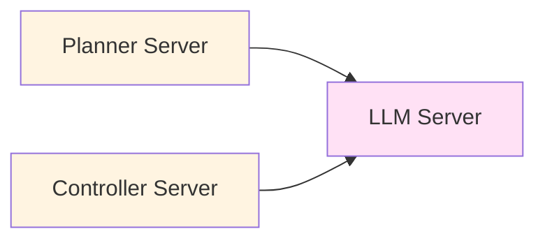
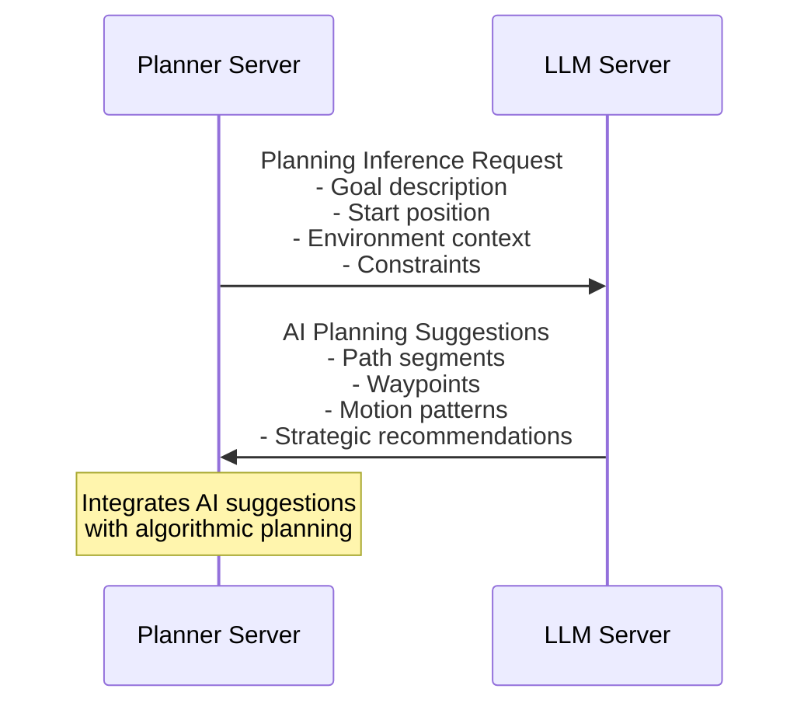
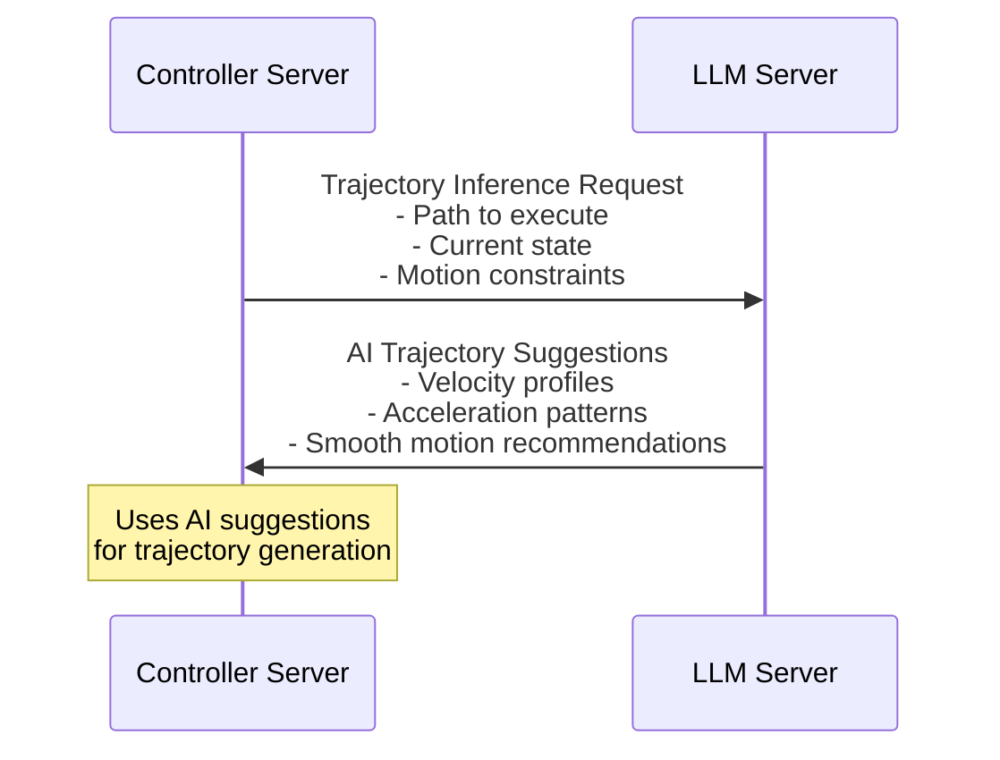
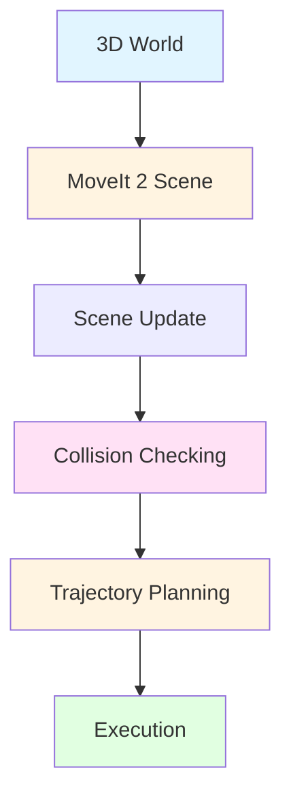
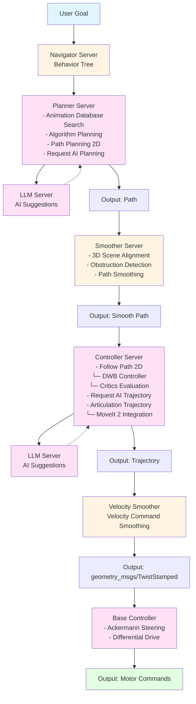

# Nav 2 Integration

Nav 2 provides comprehensive autonomous navigation capabilities for ROBOCON robots, featuring a modular server architecture that delegates navigation tasks through behavior trees.

## Overview

The ROBOCON OS Nav 2 implementation extends the standard ROS 2 Nav 2 framework with:

- **Behavior Tree Navigation**: Navigator Server delegates tasks to specialized servers via behavior tree nodes
- **Marketplace Integration**: Custom navigation servers available as installable `.deb` packages
- **Hybrid Planning**: Combines algorithmic planning with AI-based action inference
- **Articulation Support**: Full integration with MoveIt 2 for articulated robots
- **3D Scene Integration**: Path planning aligned with 3D world representations

## Architecture

### Navigator Server

The Navigator Server is the central coordinator that manages the navigation behavior tree. As the behavior tree ticks through nodes, it delegates execution to specialized servers:

```
Navigator Server
    ├── Behavior Tree Execution
    │   ├── Tick through behavior nodes
    │   └── Delegate to specialized servers
    ├── Server Management
    │   ├── Built-in Nav 2 servers
    │   └── Marketplace-installed servers
    └── Goal Management
        ├── Goal validation
        └── Execution monitoring
```

### Behavior Tree Execution Flow

The Navigator Server uses behavior trees to orchestrate navigation:

1. **Goal Received**: Navigation goal arrives at Navigator Server
2. **Behavior Tree Execution**: Navigator Server ticks through behavior tree nodes
3. **Server Delegation**: Each behavior node delegates to appropriate server
4. **Server Execution**: Specialized server processes the request
5. **Feedback Loop**: Results feed back into behavior tree
6. **Iteration**: Process continues until goal is reached or fails

## Built-in Nav 2 Servers

### Behavior Server

The Behavior Server executes navigation behaviors defined in the behavior tree.

**Implementation**: Standard Nav 2 behavior server with ROBOCON extensions

**Key Features**:
- Executes behavior tree nodes sequentially
- Handles behavior state transitions
- Manages behavior timeouts and retries
- Integrates with marketplace behavior nodes

**Usage**:
```python
from nav2_msgs.action import NavigateToPose
from rclpy.action import ActionClient

# Behavior Server automatically handles behavior tree execution
nav_client = ActionClient(self, NavigateToPose, 'navigate_to_pose')
```

### Recovery Server

The Recovery Server handles recovery behaviors when navigation encounters issues.

#### Stuck Detection

**Condition**: Controller iterates but no pose change occurs

**Recovery Sequence**:

1. **Detect Stuck Condition**
   ```
   IF: Controller Iterates && No Pose Change
   THEN: Call Planner Server to find new path
   ```

2. **Attempt Replanning**
   ```
   IF: Planner Server finds solution
   THEN: Execute new path
   ELSE: Call human operator or next recovery action
   ```

3. **Human Intervention**
   ```
   IF: No solution found algorithmically
   THEN: Call human operator via notification/UI
   ```

#### Action Not Available

**Condition**: Required action node is not available in the system

**Recovery Sequence**:

1. **Vote for Action Addition**
   ```
   IF: Action is not available
   THEN: Vote to add action node to sequence of capable agents
   ```

2. **Marketplace Integration**
   ```
   IF: Action available in marketplace
   THEN: Install and add to behavior tree
   ELSE: Block action node and try alternative
   ```

3. **Alternative Path**
   ```
   IF: No solution with missing action
   THEN: Block action node and try alternative sequence
   ```

**Implementation Example**:
```python
from nav2_bt_navigator import BehaviorTreeNavigator

# Recovery behaviors are automatically triggered
# Custom recovery can be configured in behavior tree
```

### Smoother Server

The Smoother Server refines paths to ensure smooth, collision-free navigation.

#### Path Smoother

**Input**: Raw path from planner  
**Output**: Smoothed, optimized path

**Functionality**:
- **3D Scene Alignment**: Aligns path with 3D scene to detect obstructions
- **Obstruction Detection**: Identifies collisions with 3D world geometry
- **Path Modification**: Finds alternative move paths when obstructions detected
- **Smoothness Optimization**: Optimizes path curvature and jerk

**Process Flow**:
```
Input Path
    ↓
Align with 3D Scene
    ↓
Detect Obstructions
    ↓
IF: Obstruction Found
    THEN: Find Alternative Path
    ELSE: Smooth Path
    ↓
Output Smooth Path
```

**Configuration**:
```yaml
smoother_server:
  smoother_plugins: ["simple_smoother"]
  simple_smoother:
    smoother_plugin: "nav2_smoother::SimpleSmoother"
    tolerance: 1.0e-10
    max_its: 1000
    do_refinement: true
```

### Controller Server

The Controller Server handles trajectory execution and tracking. It supports two modes: Articulation Trajectory Processing for robotic arms and Follow Path 2D for base movement.

#### Articulation Trajectory Processing

**Purpose**: Process trajectories for articulated robot components (arms, manipulators)

**Implementation**: `moveit::trajectory_processing::TimeOptimalTrajectoryGeneration`

**Input Sources**:
- Local Frame transforms
- Odometry data

**Output**: `trajectory_msgs/JointTrajectory` - Joint trajectory commands for articulated components

**Integration**: Full MoveIt 2 integration for motion planning

**Process Flow**:
```
Input: Path + Local Frame + Odometry
    ↓
Time-Optimal Trajectory Generation
    ↓
Output: Joint Trajectory
    ↓
Execute via MoveIt 2
```

**Usage Example**:
```python
from trajectory_msgs.msg import JointTrajectory
from geometry_msgs.msg import PoseStamped

# Controller Server automatically processes articulation trajectories
# when MoveIt 2 planning is used
```

#### Follow Path 2D

**Purpose**: Execute 2D paths for mobile base navigation

**Implementation**: DWB (Dynamic Window Behavior) Controller

**Input**: Path from planner or smoother  
**Output**: Trajectory for execution

##### Trajectory Evaluation

Trajectories are evaluated using **Critics**:

**Critic Input**: Trajectory  
**Critic Output**: Rating/score

**Critic Types**:
- **Goal Alignment Critic**: Evaluates progress toward goal
- **Obstacle Critic**: Evaluates collision avoidance
- **Path Align Critic**: Evaluates adherence to planned path
- **Oscillation Critic**: Detects oscillatory behavior
- **Twirling Critic**: Penalizes unnecessary rotation

**Process Flow**:
```
Input: Path
    ↓
Generate Candidate Trajectories
    ↓
Evaluate with Critics
    ↓
Select Best Trajectory
    ↓
Output: Trajectory
    ↓
Send to Velocity Smoother
```

**Configuration**:
```yaml
controller_server:
  controller_frequency: 20.0
  min_x_velocity_threshold: 0.001
  min_y_velocity_threshold: 0.5
  min_theta_velocity_threshold: 0.001
  failure_tolerance: 0.3
  progress_checker_plugin: "progress_checker"
  goal_checker_plugins: ["general_goal_checker"]
  controller_plugins: ["FollowPath"]
  
  FollowPath:
    plugin: "dwb_core::DWBLocalPlanner"
    debug_trajectory_details: true
    critics: ["RotateToGoal", "Oscillation", "BaseObstacle", "PathAlign", "GoalAlign", "PathDist", "GoalDist"]
```

##### Velocity Smoother

The selected trajectory from Follow Path 2D is sent to the Velocity Smoother.

**Input**: `geometry_msgs/TwistStamped` (timestamped velocity command)  
**Output**: `geometry_msgs/TwistStamped` (smoothed velocity command)

**Message Format**:
```cpp
geometry_msgs::TwistStamped
  Header header
    stamp: Time
    frame_id: string
  Twist twist
    Vector3 linear
      float64 x  // Forward velocity
      float64 y  // Lateral velocity
      float64 z  // Vertical velocity (typically 0)
    Vector3 angular
      float64 x  // Roll rate
      float64 y  // Pitch rate
      float64 z  // Yaw rate (rotation)
```

**Functionality**:
- **Velocity Smoothing**: Smooths velocity commands to prevent jerky motion
- **Acceleration Limiting**: Enforces acceleration constraints
- **Jerk Limiting**: Reduces jerk for comfortable motion
- **Rate Limiting**: Limits rate of change

**Configuration**:
```yaml
velocity_smoother:
  smoothing_frequency: 20.0
  scale_velocities: false
  feedback: "OPEN_LOOP"
  max_velocity: [0.26, 0.0, 1.0]  # [x, y, theta]
  min_velocity: [-0.26, 0.0, -1.0]
  max_accel: [2.5, 0.0, 3.2]
  max_decel: [-2.5, 0.0, -3.2]
  odom_topic: "odom"
  odom_duration: 0.1
```

##### Base Controllers

The smoothed velocity commands are sent to base controllers, which convert them to motor commands.

###### Ackermann Steering

**Implementation**: `steering_controllers_library::ackermann_steering_controller`

**Input**: `geometry_msgs/TwistStamped`  
**Output**: Motor commands for Ackermann-style vehicles

**Functionality**:
- Converts vehicle speed to individual wheel speeds
- Handles steering angle calculation
- Manages wheel synchronization
- Supports front-wheel and rear-wheel steering configurations

**Configuration**:
```yaml
ackermann_steering_controller:
  front_wheel_name: "front_left_wheel"
  rear_wheel_name: "rear_left_wheel"
  wheel_base: 1.5
  wheel_radius: 0.15
  cmd_vel_timeout: 0.6
  base_frame_id: "base_link"
  odom_frame_id: "odom"
```

**Usage**:
```python
from geometry_msgs.msg import TwistStamped

# Velocity Smoother automatically sends to Ackermann controller
# when configured for Ackermann steering
```

###### Differential Drive

**Implementation**: `ros2_controllers::diff_drive_controller`

**Input**: `geometry_msgs/TwistStamped`  
**Output**: Motor commands for differential drive robots

**Functionality**:
- Converts linear and angular velocities to left/right wheel speeds
- Handles wheel separation calculation
- Supports various wheel configurations
- Provides odometry feedback

**Configuration**:
```yaml
diff_drive_controller:
  left_wheel_names: ["left_wheel"]
  right_wheel_names: ["right_wheel"]
  wheel_separation: 0.4
  wheel_radius: 0.1
  wheel_separation_multiplier: 1.0
  left_wheel_radius_multiplier: 1.0
  right_wheel_radius_multiplier: 1.0
  cmd_vel_timeout: 0.6
  base_frame_id: "base_link"
  odom_frame_id: "odom"
```

### Planner Server

The Planner Server generates paths from start to goal using a hybrid approach combining algorithmic planning with AI-based action inference.

**Important**: The Planner Server does **NOT** contain inference directly. Instead, it communicates with the **Language Model (LLM) Server** when AI/LLM inference is needed.

#### Action-Based Planning

**Action Type**: Planning action  
**Input**: Goal pose, start pose, costmap  
**Output**: Path

#### Hybrid Planning Approach

The Planner Server uses a combination of:

1. **Algorithmic Planning**: Traditional path planning algorithms (A*, Dijkstra, etc.)
2. **AI-Based Action Inference**: Communicates with **LLM Server** for AI-based intuitive path generation
   - Planner Server sends inference requests to LLM Server
   - LLM Server returns AI-generated planning suggestions
   - Planner Server integrates suggestions with algorithmic planning

**Process Flow**:
```
Input: Goal + Start + Costmap
    ↓
Algorithmic Planning (Fast, Deterministic)
    ↓
Action Inference Model (Intuitive, Adaptive)
    ↓
Combine/Switch Based on Context
    ↓
Output: Optimal Path
```

#### Action Animation Database

The Planner Server can utilize an **Action Animation Database** for preprocessing and optimization.

##### Local Vertex Animations

**Purpose**: Pre-recorded animations of robot/joint group movements between poses

**Process**:
1. **Animation Matching**: Match input goal to similar recorded animation
2. **Animation Reuse**: Reuse characteristics from matched animation
3. **Algorithmic Modification**: Edit animation to match exact requirements
4. **LLM Enhancement**: Use LLM for intuitive modifications

**Benefits**:
- Faster planning for common movements
- Natural motion patterns
- Reduced computational load
- Improved trajectory quality

**Animation Database Structure**:
```
Action Animation Database
  ├── Animation ID
  ├── Start Pose
  ├── End Pose
  ├── Joint Trajectory
  ├── Duration
  └── Metadata (environment, conditions, etc.)
```

**Usage Flow**:
```
Goal Received
    ↓
Search Animation Database
    ↓
IF: Similar Animation Found
    THEN: Reuse with Modification
    ELSE: Use Full Planning
    ↓
LLM-Assisted Refinement
    ↓
Output Path
```

#### Complex Action Decomposition

For complex high-level actions, the system breaks them down into simpler sequences:

**Process**:

1. **LLM Text Processing**
   ```
   Input Text → LLM Processing
       ↓
   Parse into: Paths, Coordinates, Transitions
       ↓
   Generate Sequence of Action Nodes
   ```

2. **Dynamic Behavior Tree Generation**
   ```
   Action Node Sequence → Behavior Tree
       ↓
   Insert into Navigator Server
   ```

3. **Sequential Execution**
   ```
   Tick Through Generated Sequence
       ↓
   Solve Each Path Individually
       ↓
   Use Multiple Methods:
     - Animation Matching + Algorithm/AI Correction
     - Pure Algorithm Planning
     - Full AI Planning
   ```

**Methods Available**:
- **Animation Matching + Correction**: Fast, uses prior knowledge
- **Algorithm Planning**: Deterministic, predictable
- **AI Planning**: Adaptive, handles complex scenarios

**Example**:
```python
# Complex action: "Navigate through construction site to deliver materials"
# LLM breaks this into:
#  1. Navigate to entrance (waypoint 1)
#  2. Avoid heavy equipment (path segment 2)
#  3. Navigate through narrow passage (path segment 3)
#  4. Reach delivery location (final goal)

# Each segment is solved using appropriate method
```

#### Trajectory Critiquing

After path planning, trajectories are generated and evaluated:

**Critique Process**:
```
Path → Generate Trajectories
    ↓
Algorithm Trajectory
    ↓
AI Trajectory (via LLM Server)
    Controller Server → LLM Server (trajectory request)
    LLM Server → Controller Server (AI trajectory suggestions)
    ↓
Critic Evaluation
    ↓
Select Best Based on:
  - Speed requirements
  - Accuracy requirements
  - Trade-off analysis
    ↓
Execute Selected Trajectory
```

**Critic Factors**:
- **Speed**: How quickly trajectory can be executed
- **Accuracy**: How precisely trajectory follows path
- **Safety**: Collision avoidance margin
- **Smoothness**: Jerk and acceleration limits
- **Energy**: Power consumption estimate

#### Path Planning 2D

For 2D navigation, the Planner Server uses standard path planning plugins.

**Plugin**: `nav2_navfn_planner::NavfnPlanner` or `nav2_planner::ComputePathToPose`

**Input**:
- **Costmap**: Global or local costmap representing environment
- **Footprint**: Robot footprint for collision checking

**Output**: Path (sequence of poses)

**Standard Planners Available**:
- **NavFn**: Gradient-based planner
- **Theta\***: Any-angle path planner
- **Smac Planner**: State Machine A* planner
- **Theta\* Hybrid**: Hybrid A* variant

**Configuration**:
```yaml
planner_server:
  planner_plugins: ["GridBased"]
  GridBased:
    plugin: "nav2_navfn_planner/NavfnPlanner"
    tolerance: 0.5
    use_astar: false
    allow_unknown: true
```

**Usage**:
```python
from nav2_msgs.action import ComputePathToPose
from rclpy.action import ActionClient

planner_client = ActionClient(self, ComputePathToPose, 'compute_path_to_pose')

goal_msg = ComputePathToPose.Goal()
goal_msg.start.header.frame_id = "map"
goal_msg.start.pose.position.x = 0.0
goal_msg.start.pose.position.y = 0.0
goal_msg.goal.header.frame_id = "map"
goal_msg.goal.pose.position.x = 5.0
goal_msg.goal.pose.position.y = 3.0

planner_client.wait_for_server()
future = planner_client.send_goal_async(goal_msg)
```

#### Global Frame

The Planner Server operates in the **Global Frame** (typically `map` frame), enabling:

- Global path planning across entire environment
- Long-range navigation
- Multi-waypoint planning
- Integration with SLAM/localization systems

## Language Model (LLM) Server

The Language Model (LLM) Server is a centralized service that provides AI/LLM inference capabilities to navigation servers.

### Purpose

The LLM Server handles all Large Language Model prompts and inference requests. It is called whenever AI/LLM inference is needed by other navigation servers.

### Key Features

- **Centralized Inference**: Single endpoint for all LLM operations
- **Model Management**: Handles LLM model loading, management, and updates
- **Planning Support**: Provides AI-based planning suggestions to Planner Server
- **Trajectory Generation**: Creates AI-optimized trajectories for Controller Server
- **Resource Efficiency**: Centralized model prevents duplicate model loading

### Communication Architecture

The LLM Server communicates with navigation servers through ROS 2 services or actions:



### Planner Server Integration

**Request Flow**:



### Controller Server Integration

**Request Flow**:



### Configuration

```yaml
llm_server:
  ros__parameters:
    model_path: "/opt/robocon/models/deepseek-chat"
    model_type: "deepseek"
    inference_timeout: 30.0
    max_context_length: 4096
    enable_caching: true
    cache_size: 1000
    
    # Service endpoints
    planning_service: "llm_server/planning_inference"
    trajectory_service: "llm_server/trajectory_inference"
    general_service: "llm_server/general_inference"
```

### Service Interface

#### Planning Inference Service

```python
# Request
PlanningInferenceRequest:
    goal_description: string
    start_pose: geometry_msgs/Pose
    goal_pose: geometry_msgs/Pose
    environment_context: string
    constraints: string[]

# Response
PlanningInferenceResponse:
    path_suggestions: nav_msgs/Path[]
    waypoints: geometry_msgs/Pose[]
    strategic_notes: string
    confidence: float
```

#### Trajectory Inference Service

```python
# Request
TrajectoryInferenceRequest:
    path: nav_msgs/Path
    current_state: RobotState
    motion_constraints: MotionConstraints

# Response
TrajectoryInferenceResponse:
    velocity_profile: VelocityProfile
    acceleration_pattern: AccelerationPattern
    smoothness_recommendations: string
    confidence: float
```

### Usage Example

```python
#!/usr/bin/env python3
import rclpy
from rclpy.node import Node
from robocon_llm_msgs.srv import PlanningInference

class LLMPlanningClient(Node):
    def __init__(self):
        super().__init__('llm_planning_client')
        self.llm_client = self.create_client(
            PlanningInference,
            'llm_server/planning_inference'
        )
    
    def request_ai_planning(self, goal_description, start, goal):
        """Request AI planning assistance from LLM Server"""
        request = PlanningInference.Request()
        request.goal_description = goal_description
        request.start_pose = start
        request.goal_pose = goal
        request.environment_context = "construction_site"
        
        self.llm_client.wait_for_service()
        future = self.llm_client.call_async(request)
        return future

def main(args=None):
    rclpy.init(args=args)
    node = LLMPlanningClient()
    
    # Request AI planning
    future = node.request_ai_planning(
        "Navigate to delivery point avoiding obstacles",
        start_pose,
        goal_pose
    )
    
    rclpy.spin_until_future_complete(node, future)
    response = future.result()
    
    print(f"AI suggestions: {response.path_suggestions}")
    
    rclpy.shutdown()
```

### Benefits of Centralized LLM Server

1. **Single Model Instance**: One LLM model loaded in memory, shared across all services
2. **Consistent Responses**: All services use the same model version and context
3. **Efficient Resource Usage**: GPU/CPU resources managed centrally
4. **Easy Updates**: Update model in one place, all services benefit
5. **Scalability**: Can handle multiple concurrent requests efficiently
6. **Caching**: Shared cache benefits all services

## MoveIt 2 Integration

The Controller Server uses **MoveIt 2** for articulated robot control.

### MoveIt 2 Scene Synchronization

**Integration**: MoveIt 2 scenes are synchronized with the 3D world

**Benefits**:
- **Collision Avoidance**: MoveIt 2 uses 3D scene for collision checking
- **Real-time Updates**: Scene updates reflect environment changes
- **Precise Planning**: 3D-aware path planning for articulated components

**Process Flow**:



**Configuration**:
```yaml
moveit_config:
  planning_scene_monitor:
    publish_planning_scene: true
    publish_geometry_updates: true
    publish_state_updates: true
```

## Marketplace Integration

### Custom Server Installation

Navigation servers can be installed through the ROBOCON marketplace:

**Installation Methods**:
1. **Purchase**: Buy `.deb` packages from marketplace
2. **Rent**: Temporarily rent server capabilities
3. **Self-Develop**: Develop custom servers and deploy

**Installation Process**:
```bash
# Install from marketplace
sudo apt install robocon-nav2-custom-planner

# Server automatically registers with Navigator Server
# Behavior tree nodes become available
```

**Server Registration**:
```yaml
# Servers register via plugin system
nav2_servers:
  custom_planner:
    plugin: "custom_nav2::CustomPlanner"
    behavior_tree_node: "CustomPlan"
```

### Marketplace Behavior Nodes

Custom behavior tree nodes can be added via marketplace packages:

**Example Behavior Node**:
```xml
<!-- Behavior tree with marketplace node -->
<root main_tree_to_execute="MainTree">
  <BehaviorTree ID="MainTree">
    <Sequence name="NavigationSequence">
      <CustomMarketplaceAction action_name="custom_nav"/>
      <FollowPath path="{path}"/>
    </Sequence>
  </BehaviorTree>
</root>
```

## Complete Navigation Flow

### Full Navigation Pipeline



## Configuration Examples

### Complete Nav 2 Configuration

```yaml
nav2_bringup:
  # Navigator Server
  bt_navigator:
    ros__parameters:
      global_frame: "map"
      robot_base_frame: "base_link"
      odom_topic: "odom"
      bt_loop_duration: 10
      default_server_timeout: 20
      enable_groot_monitoring: true
      groot_zmq_publisher_port: 1666
      groot_zmq_server_port: 1667
  
  # Planner Server
  planner_server:
    ros__parameters:
      planner_plugins: ["GridBased"]
      GridBased:
        plugin: "nav2_navfn_planner/NavfnPlanner"
        tolerance: 0.5
        use_astar: false
        allow_unknown: true
  
  # Controller Server
  controller_server:
    ros__parameters:
      controller_frequency: 20.0
      min_x_velocity_threshold: 0.001
      controller_plugins: ["FollowPath"]
      FollowPath:
        plugin: "dwb_core::DWBLocalPlanner"
        debug_trajectory_details: true
  
  # Smoother Server
  smoother_server:
    ros__parameters:
      smoother_plugins: ["simple_smoother"]
      simple_smoother:
        smoother_plugin: "nav2_smoother::SimpleSmoother"
  
  # Recovery Server
  recovery_server:
    ros__parameters:
      costmap_topic: local_costmap/costmap_raw
      footprint_topic: local_costmap/published_footprint
      cycle_frequency: 10.0
      recovery_plugins: ["spin", "backup", "wait"]
  
  # Velocity Smoother
  velocity_smoother:
    ros__parameters:
      smoothing_frequency: 20.0
      max_velocity: [0.26, 0.0, 1.0]
      min_velocity: [-0.26, 0.0, -1.0]
      max_accel: [2.5, 0.0, 3.2]
```

## Code Examples

### Basic Navigation

```python
#!/usr/bin/env python3
import rclpy
from rclpy.node import Node
from nav2_msgs.action import NavigateToPose
from rclpy.action import ActionClient
from geometry_msgs.msg import PoseStamped

class Nav2Control(Node):
    def __init__(self):
        super().__init__('nav2_control')
        self.nav_client = ActionClient(self, NavigateToPose, 'navigate_to_pose')
        
    def navigate_to_goal(self, x, y, yaw=0.0):
        """Navigate to a goal position"""
        goal_msg = NavigateToPose.Goal()
        goal_msg.pose.header.frame_id = 'map'
        goal_msg.pose.header.stamp = self.get_clock().now().to_msg()
        goal_msg.pose.pose.position.x = float(x)
        goal_msg.pose.pose.position.y = float(y)
        goal_msg.pose.pose.orientation.z = float(yaw)
        
        self.nav_client.wait_for_server()
        self.get_logger().info(f'Sending goal: x={x}, y={y}')
        
        send_goal_future = self.nav_client.send_goal_async(goal_msg)
        send_goal_future.add_done_callback(self.goal_response_callback)
    
    def goal_response_callback(self, future):
        """Handle goal response"""
        goal_handle = future.result()
        if not goal_handle.accepted:
            self.get_logger().info('Goal rejected')
            return
        
        self.get_logger().info('Goal accepted')
        get_result_future = goal_handle.get_result_async()
        get_result_future.add_done_callback(self.get_result_callback)
    
    def get_result_callback(self, future):
        """Handle result"""
        result = future.result().result
        self.get_logger().info(f'Navigation result: {result}')

def main(args=None):
    rclpy.init(args=args)
    node = Nav2Control()
    node.navigate_to_goal(5.0, 3.0, 1.57)
    rclpy.spin(node)
    rclpy.shutdown()

if __name__ == '__main__':
    main()
```

### Using Custom Marketplace Servers

```python
#!/usr/bin/env python3
import rclpy
from rclpy.node import Node
from custom_nav2_msgs.action import CustomPlan

class MarketplaceNavControl(Node):
    def __init__(self):
        super().__init__('marketplace_nav_control')
        # Custom planner from marketplace
        self.custom_planner = ActionClient(
            self, CustomPlan, 'custom_planner_server'
        )
    
    def use_custom_planner(self):
        """Use marketplace-installed custom planner"""
        goal = CustomPlan.Goal()
        goal.start = self.get_current_pose()
        goal.goal = self.get_target_pose()
        
        self.custom_planner.wait_for_server()
        future = self.custom_planner.send_goal_async(goal)
        return future
```

## Troubleshooting

### Common Issues

1. **Stuck Detection Triggering Frequently**
   - Check odometry quality
   - Verify costmap accuracy
   - Adjust stuck detection thresholds

2. **Action Not Available**
   - Install required marketplace package
   - Check behavior tree configuration
   - Verify server registration

3. **Animation Database Not Finding Matches**
   - Expand animation database
   - Adjust similarity thresholds
   - Use algorithm planning as fallback

## Next Steps

- [Navigation Stack](../nav2/navigation-stack.md) - Complete stack setup
- [Path Planning](../nav2/path-planning.md) - Advanced planning techniques
- [Planners](../nav2/planners.md) - Planner configuration
- [Costmaps](../nav2/costmaps.md) - Costmap setup
- [Marketplace Integration](../ai-programs/marketplace-integration.md) - Installing custom servers
