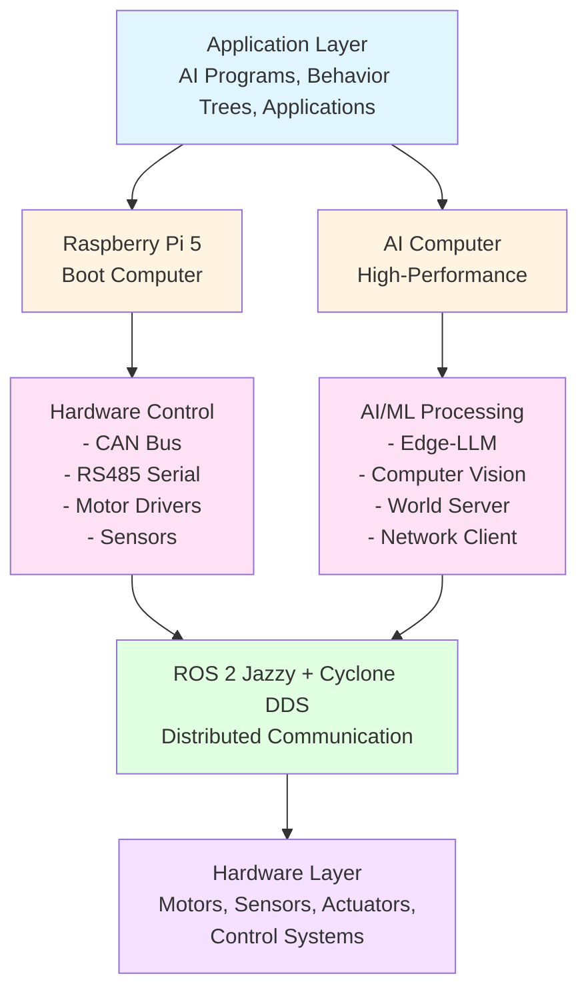

# ROBOCON OS

ROBOCON OS is the operating system that runs on ROBOCON robots, built on ROS 2 Jazzy, Edge-LLM, and distributed computing architecture.

## Architecture Overview

ROBOCON OS consists of a distributed dual-computer architecture:

## Core Components

### ROS 2 Jazzy Layer

- **Distribution**: ROS 2 Jazzy Jalisco
- **DDS Implementation**: Cyclone DDS (`rmw_cyclonedds_cpp`)
- **Communication**: Distributed message passing between Raspberry Pi 5 and AI Computer
- **Standard Components**: Nodes, topics, services, actions, parameters

### Raspberry Pi 5 (Boot Computer)

**Responsibilities:**
- CAN Bus communication (500kbps) for motor drivers
- RS485 serial communication for sensors and controllers
- Hardware monitoring and control
- Real-time hardware interfaces
- Hardware monitor GUI

**Hardware Interfaces:**
- CAN Bus: `/dev/can0` (motor drivers, LiDAR)
- RS485 Port 1: `/dev/ttySC0` (sensors, controllers)
- RS485 Port 2: `/dev/ttySC1` (IMU)

### AI Computer

**Responsibilities:**
- Edge-LLM processing for natural language commands
- Computer vision (YOLOv11, depth estimation)
- World Server for multi-robot coordination
- Network Client for robot-to-server communication
- Behavior tree execution
- Multi-robot communication protocol (consensus-based task allocation)

**Hardware:**
- ASRock B450M-HDV R4.0 AM4 motherboard
- GIGABYTE Radeon RX 7600 XT GPU (ROCm support)
- High-performance computing for AI/ML tasks

### TSBT-VLA System (Edge-LLM Layer)

The **Text Scene Behavior Tree Auditable Visual Language Action (TSBT-VLA)** system provides:

- **Natural language command interpretation** via DeepSeek LLM (DeepSeek-R1)
- **Text-first reasoning**: Fully auditable, symbolic reasoning pipeline
- **Behavior tree generation**: Dynamic XML subtree generation from natural language
- **Recursive decomposition**: High-level actions decomposed into low-level behaviors
- **Scene understanding**: Text world generation from 3D scene data
- **Sensor integration**: Temporal sensor logs for safety reasoning
- **Dynamic replanning**: Automatic subtree regeneration on scene changes
- **Auditable logging**: Complete traceability for regulation compliance

> **See Also**: [TSBT-VLA System Overview](tsbt-vla-system/overview.md) - Complete architecture documentation

### Edge-LLM Layer (DeepSeek Integration)

- DeepSeek-R1 LLM running on AI Computer (GPU-accelerated)
- Natural language to behavior tree conversion
- Context-aware decision making
- Edge-based processing (no cloud dependency)

## SDK Interface

The ROBOCON SDK provides the interface between applications and ROBOCON OS:

- **Motor Control API**: Direct motor/driver control
- **Sensor APIs**: Access to sensor data
- **ROS 2 Wrappers**: Simplified ROS 2 usage
- **LLM Interface**: DeepSeek LLM integration

## Supported Robot Types

ROBOCON OS supports multiple robot platforms:

- **Mini Crane** (`robot_mini_crane_bringup`) - Compact construction crane
- **Mini Loader** (`robot_mini_loader_bringup`) - Small-scale loader
- **Mini Excavator** (`robot_mini_excavator_bringup`) - Miniature excavator
- **Transporter** (`Robot_Transporter_bringup`) - Material transport
- **RoboCon Servicer Tracked** (`robot_oservicer_bringup`) - Tracked service robot variant
- **RoboCon Servicer Wheeled** (`Robot_iServicer_bringup`) - Wheeled intelligent service robot
- **RoboCon Sheather Tracked** (`Robot_oSheather_bringup`) - Tracked sheathing robot variant
- **RoboCon Sheather Wheeled** (`Robot_iSheather_bringup`) - Wheeled intelligent sheathing robot

Each robot type has:
- Custom launch files (`real_robot.launch.py`)
- Robot-specific hardware packages
- Hardware detection and automatic package loading
- Custom interfaces and message types

## Hardware Detection

ROBOCON OS automatically detects:
- Robot type (via hardware identifiers)
- Available sensors and actuators
- Communication interfaces (CAN, RS485)
- Platform type (Raspberry Pi 5 or AI Computer)

The system loads only relevant ROS 2 packages based on detected hardware.

## Runtime Environment

ROBOCON OS provides:

- **Containerized execution** for AI programs
- **Resource management** (CPU, memory, network)
- **Security sandboxing** for applications
- **Real-time scheduling** for critical tasks

## Multi-Robot Coordination

ROBOCON OS implements a **consensus-based multi-robot task allocation system** that enables distributed decision-making among robotic agents without requiring a centralized scheduler. The system provides:

- **Zero-trust identity verification** through motion ledger authentication
- **Consensus-based voting** for task allocation
- **Discovery protocol** for finding and identifying nearby agents
- **Behavior tree synchronization** across multiple robots
- **Environment server** for 3D avatar management and spatial coordination

> **See Also**: [Multi-Robot Communication Protocol](multi-robot-communication.md) - Complete protocol documentation

## Next Steps

- [Multi-Robot Communication Protocol](multi-robot-communication.md) - Consensus-based task allocation system
- [TSBT-VLA System](tsbt-vla-system/overview.md) - Text Scene Behavior Tree Auditable Visual Language Action System with LLM integration
- [Nav 2 Integration](nav2-integration.md) - Navigation stack
- [Deployment on ROBOCON Hardware](../deployment/robocon-hardware.md)
- [Third-Party Robot Setup](../deployment/third-party-robots.md)
- [Runtime Configuration](../deployment/runtime-configuration.md)

