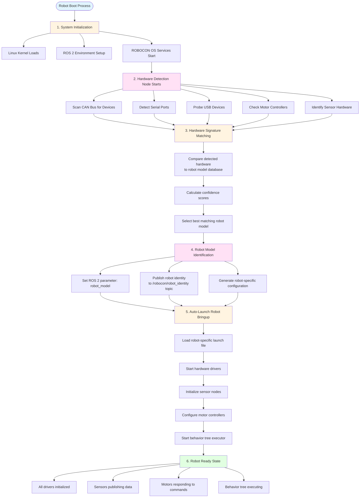

# ROS 2 Overview

ROBOCON SDK is built on ROS 2, providing a robust foundation for distributed robotics applications. The ROBOCON OS implements automatic hardware detection on boot to identify the robot model and load the appropriate ROS 2 drivers.

## Robot Boot Sequence and Hardware Detection

When a ROBOCON robot boots up, it automatically detects its hardware configuration and loads the correct ROS 2 drivers. This ensures that each robot model runs with its specific driver stack without manual configuration.

### Boot Sequence Flow



### Sequence of Files Called

```mermaid
flowchart TD
    Systemd[/etc/systemd/system<br/>robocon-os.service] --> BootMgr[robocon_boot_manager<br/>C++/Python executable]
    
    BootMgr --> HWDetector[hardware_detector node]
    BootMgr --> YAML[/etc/robocon<br/>hardware_signatures.yaml]
    
    HWDetector --> Identity[/robocon/robot_identity<br/>Topic]
    
    Identity --> IdentityHandler[robot_identity_handler]
    
    IdentityHandler --> Launch1[robot_mini_crane_bringup<br/>launch/robot_mini_crane.launch.py]
    IdentityHandler --> Launch2[robot_mini_loader_bringup<br/>launch/robot_mini_loader.launch.py]
    IdentityHandler --> Launch3[robot_oservicer_bringup<br/>launch/real_robot.launch.py]
    IdentityHandler --> Launch4[Robot_iServicer_bringup<br/>launch/robot_iservicer.launch.py]
    IdentityHandler --> Launch5[Other robot models...]
    
    Launch1 --> Drivers[motor_driver_ids830abs<br/>sensor_bw_mins50<br/>lidar_hinson_SE_1035<br/>...]
    Launch2 --> Drivers
    Launch3 --> Drivers
    Launch4 --> Drivers
    Launch5 --> Drivers
    
    Drivers --> Nodes[Individual Driver Nodes<br/>Publish to ROS 2 topics]
    
    style Systemd fill:#e1f5ff
    style BootMgr fill:#fff4e1
    style HWDetector fill:#ffe1f5
    style IdentityHandler fill:#fff4e1
    style Drivers fill:#ffe1f5
    style Nodes fill:#e1ffe1
```

## Hardware Detection Mechanism

The hardware detection system identifies the robot model by scanning and matching hardware signatures against a database of known robot configurations.

### Detection Methods

1. **CAN Bus Scanning**: Probes CAN bus for motor controllers and devices
2. **Serial Port Detection**: Scans `/dev/tty*` for serial devices
3. **USB Device Enumeration**: Checks USB device IDs and vendor codes
4. **Device Tree Inspection**: Reads Linux device tree for hardware info
5. **Motor Controller Signatures**: Identifies specific motor controllers by ID

### Hardware Signature Database

Each robot model has a unique hardware signature defined in `/etc/robocon/hardware_signatures.yaml`:

```yaml
robot_models:
  mini_crane:
    can_devices:
      - vendor_id: "0x1234"
        device_id: "0x5678"
        description: "Motor Golden 144VDC 20kW"
      - vendor_id: "0xABCD"
        device_id: "0xEF01"
        description: "Motor Driver IDS830ABS"
    serial_devices:
      - port_pattern: "/dev/ttyUSB*"
        device_id: "IMU_BW_MINS50"
    confidence_threshold: 0.85
    
  mini_loader:
    can_devices:
      - vendor_id: "0x1234"
        device_id: "0x5679"
        description: "Motor Controller Variant A"
    serial_devices:
      - port_pattern: "/dev/ttyACM*"
        device_id: "LiDAR_Hinson_SE_1035"
    confidence_threshold: 0.85
    
  oservicer:
    can_devices:
      - vendor_id: "0x2234"
        device_id: "0x6789"
        description: "Base Controller"
      - vendor_id: "0xABCD"
        device_id: "0xEF02"
        description: "Arm Controller"
    serial_devices:
      - port_pattern: "/dev/ttyUSB*"
        device_id: "IMU_BW_MINS50"
    usb_devices:
      - vendor_id: "0x1e10"
        product_id: "0x4000"
        description: "Depth Camera TM815"
    confidence_threshold: 0.80
```

## ROS 2 Integration

The ROBOCON SDK fully integrates with ROS 2, allowing you to use:

- **Nodes**: Distributed processing units
- **Topics**: Asynchronous pub/sub communication
- **Services**: Synchronous request/response communication
- **Actions**: Long-running tasks with feedback
- **Parameters**: Runtime configuration
- **Launch Files**: Multi-node orchestration

## Core ROS 2 Concepts

### Nodes

Nodes are executable processes that perform computation. In ROBOCON SDK:

```python
import rclpy
from rclpy.node import Node

class MyRoboconNode(Node):
    def __init__(self):
        super().__init__('my_robocon_node')
        self.get_logger().info('Node started')

def main():
    rclpy.init()
    node = MyRoboconNode()
    rclpy.spin(node)
    rclpy.shutdown()
```

### Topics

Topics provide asynchronous communication between nodes:

```python
from geometry_msgs.msg import Twist

# Publisher
self.publisher_ = self.create_publisher(Twist, '/cmd_vel', 10)
msg = Twist()
msg.linear.x = 0.5
self.publisher_.publish(msg)

# Subscriber
self.subscription = self.create_subscription(
    Twist,
    '/cmd_vel',
    self.callback,
    10
)
```

### Services

Services provide synchronous request/response:

```python
from std_srvs.srv import SetBool

# Service client
self.client = self.create_client(SetBool, '/enable_motors')
request = SetBool.Request()
request.data = True
future = self.client.call_async(request)
```

## Hardware Detection Implementation

### C++ Example: Hardware Detection Node

```cpp
#include <rclcpp/rclcpp.hpp>
#include <robot_custom_interfaces/msg/robot_identity.hpp>
#include <std_msgs/msg/header.hpp>
#include <linux/can.h>
#include <linux/can/raw.h>
#include <sys/socket.h>
#include <sys/ioctl.h>
#include <net/if.h>
#include <fcntl.h>
#include <unistd.h>
#include <yaml-cpp/yaml.h>
#include <string>
#include <vector>
#include <fstream>
#include <cmath>

class HardwareDetectorNode : public rclcpp::Node
{
public:
    HardwareDetectorNode() : Node("hardware_detector")
    {
        // Publisher for robot identity
        identity_pub_ = this->create_publisher<robot_custom_interfaces::msg::RobotIdentity>(
            "/robocon/robot_identity", 10);
        
        // Load hardware signatures
        loadHardwareSignatures();
        
        // Start detection timer
        detection_timer_ = this->create_wall_timer(
            std::chrono::seconds(1),
            std::bind(&HardwareDetectorNode::detectHardware, this));
        
        RCLCPP_INFO(this->get_logger(), "Hardware detector node started");
    }

private:
    struct HardwareSignature
    {
        std::string robot_model;
        std::vector<std::pair<uint16_t, uint16_t>> can_devices; // vendor_id, device_id
        std::vector<std::string> serial_patterns;
        std::vector<std::pair<uint16_t, uint16_t>> usb_devices; // vendor_id, product_id
        double confidence_threshold;
    };

    std::vector<HardwareSignature> signatures_;
    rclcpp::Publisher<robot_custom_interfaces::msg::RobotIdentity>::SharedPtr identity_pub_;
    rclcpp::TimerBase::SharedPtr detection_timer_;

    void loadHardwareSignatures()
    {
        std::string config_path = "/etc/robocon/hardware_signatures.yaml";
        
        try {
            YAML::Node config = YAML::LoadFile(config_path);
            
            for (const auto& model : config["robot_models"]) {
                HardwareSignature sig;
                sig.robot_model = model.first.as<std::string>();
                
                if (model.second["can_devices"]) {
                    for (const auto& device : model.second["can_devices"]) {
                        uint16_t vendor = std::stoul(device["vendor_id"].as<std::string>(), nullptr, 0);
                        uint16_t device_id = std::stoul(device["device_id"].as<std::string>(), nullptr, 0);
                        sig.can_devices.push_back({vendor, device_id});
                    }
                }
                
                if (model.second["serial_devices"]) {
                    for (const auto& serial : model.second["serial_devices"]) {
                        sig.serial_patterns.push_back(serial["port_pattern"].as<std::string>());
                    }
                }
                
                if (model.second["usb_devices"]) {
                    for (const auto& usb : model.second["usb_devices"]) {
                        uint16_t vendor = std::stoul(usb["vendor_id"].as<std::string>(), nullptr, 0);
                        uint16_t product = std::stoul(usb["product_id"].as<std::string>(), nullptr, 0);
                        sig.usb_devices.push_back({vendor, product});
                    }
                }
                
                sig.confidence_threshold = model.second["confidence_threshold"].as<double>();
                signatures_.push_back(sig);
            }
            
            RCLCPP_INFO(this->get_logger(), "Loaded %zu robot model signatures", signatures_.size());
        } catch (const std::exception& e) {
            RCLCPP_ERROR(this->get_logger(), "Failed to load hardware signatures: %s", e.what());
        }
    }

    std::vector<std::pair<uint16_t, uint16_t>> scanCANBus()
    {
        std::vector<std::pair<uint16_t, uint16_t>> devices;
        
        // Scan CAN interfaces (can0, can1, etc.)
        for (int i = 0; i < 4; i++) {
            std::string interface = "can" + std::to_string(i);
            int sock = socket(PF_CAN, SOCK_RAW, CAN_RAW);
            
            if (sock < 0) continue;
            
            struct sockaddr_can addr;
            struct ifreq ifr;
            strcpy(ifr.ifr_name, interface.c_str());
            
            if (ioctl(sock, SIOCGIFINDEX, &ifr) >= 0) {
                addr.can_family = AF_CAN;
                addr.can_ifindex = ifr.ifr_ifindex;
                
                if (bind(sock, (struct sockaddr *)&addr, sizeof(addr)) >= 0) {
                    // Try to read device ID (implementation specific)
                    // This is a simplified example
                    struct can_frame frame;
                    if (read(sock, &frame, sizeof(struct can_frame)) > 0) {
                        // Parse device ID from CAN frame
                        uint16_t vendor_id = (frame.data[0] << 8) | frame.data[1];
                        uint16_t device_id = (frame.data[2] << 8) | frame.data[3];
                        devices.push_back({vendor_id, device_id});
                    }
                }
            }
            
            close(sock);
        }
        
        return devices;
    }

    std::vector<std::string> scanSerialPorts()
    {
        std::vector<std::string> ports;
        
        // Scan common serial port patterns
        std::vector<std::string> patterns = {
            "/dev/ttyUSB*",
            "/dev/ttyACM*",
            "/dev/ttyS*"
        };
        
        for (const auto& pattern : patterns) {
            // Use glob or readdir to find matching ports
            // Simplified: check common ports
            for (int i = 0; i < 10; i++) {
                std::string port = pattern;
                size_t pos = port.find('*');
                if (pos != std::string::npos) {
                    port.replace(pos, 1, std::to_string(i));
                }
                
                if (access(port.c_str(), R_OK | W_OK) == 0) {
                    ports.push_back(port);
                }
            }
        }
        
        return ports;
    }

    std::vector<std::pair<uint16_t, uint16_t>> scanUSBDevices()
    {
        std::vector<std::pair<uint16_t, uint16_t>> devices;
        
        // Scan /sys/bus/usb/devices for USB devices
        std::ifstream devices_file("/sys/bus/usb/devices");
        std::string line;
        
        while (std::getline(devices_file, line)) {
            // Parse USB device information
            // This is simplified - actual implementation would parse /sys filesystem
            if (line.find("idVendor") != std::string::npos) {
                // Extract vendor and product IDs
                // Implementation would read from /sys/bus/usb/devices/*/idVendor
            }
        }
        
        return devices;
    }

    double calculateMatchScore(const HardwareSignature& sig,
                               const std::vector<std::pair<uint16_t, uint16_t>>& detected_can,
                               const std::vector<std::string>& detected_serial,
                               const std::vector<std::pair<uint16_t, uint16_t>>& detected_usb)
    {
        double score = 0.0;
        int total_checks = 0;
        int matches = 0;

        // Check CAN devices
        for (const auto& expected : sig.can_devices) {
            total_checks++;
            for (const auto& detected : detected_can) {
                if (expected.first == detected.first && expected.second == detected.second) {
                    matches++;
                    break;
                }
            }
        }

        // Check serial ports
        for (const auto& pattern : sig.serial_patterns) {
            total_checks++;
            for (const auto& port : detected_serial) {
                // Simple pattern matching (would use glob in real implementation)
                if (port.find(pattern.substr(0, pattern.find('*'))) != std::string::npos) {
                    matches++;
                    break;
                }
            }
        }

        // Check USB devices
        for (const auto& expected : sig.usb_devices) {
            total_checks++;
            for (const auto& detected : detected_usb) {
                if (expected.first == detected.first && expected.second == detected.second) {
                    matches++;
                    break;
                }
            }
        }

        if (total_checks > 0) {
            score = static_cast<double>(matches) / total_checks;
        }

        return score;
    }

    void detectHardware()
    {
        RCLCPP_INFO(this->get_logger(), "Starting hardware detection...");

        // Scan hardware
        auto detected_can = scanCANBus();
        auto detected_serial = scanSerialPorts();
        auto detected_usb = scanUSBDevices();

        RCLCPP_INFO(this->get_logger(), 
                   "Detected: %zu CAN devices, %zu serial ports, %zu USB devices",
                   detected_can.size(), detected_serial.size(), detected_usb.size());

        // Match against signatures
        std::string best_match = "unknown";
        double best_score = 0.0;

        for (const auto& sig : signatures_) {
            double score = calculateMatchScore(sig, detected_can, detected_serial, detected_usb);
            
            RCLCPP_INFO(this->get_logger(), 
                       "Robot model '%s' match score: %.2f (threshold: %.2f)",
                       sig.robot_model.c_str(), score, sig.confidence_threshold);

            if (score >= sig.confidence_threshold && score > best_score) {
                best_score = score;
                best_match = sig.robot_model;
            }
        }

        if (best_match != "unknown") {
            RCLCPP_INFO(this->get_logger(), "Identified robot model: %s (confidence: %.2f)", 
                       best_match.c_str(), best_score);

            // Publish robot identity
            auto identity_msg = robot_custom_interfaces::msg::RobotIdentity();
            identity_msg.header.stamp = this->now();
            identity_msg.header.frame_id = "base_link";
            identity_msg.robot_model = best_match;
            identity_msg.confidence = best_score;
            identity_msg.detected_can_devices = static_cast<uint32_t>(detected_can.size());
            identity_msg.detected_serial_ports = static_cast<uint32_t>(detected_serial.size());
            identity_msg.detected_usb_devices = static_cast<uint32_t>(detected_usb.size());

            identity_pub_->publish(identity_msg);

            // Set ROS parameter
            this->declare_parameter("robot_model", best_match);
            this->set_parameter(rclcpp::Parameter("robot_model", best_match));

            // Stop detection timer
            detection_timer_->cancel();
        } else {
            RCLCPP_WARN(this->get_logger(), 
                       "Could not identify robot model. Best score: %.2f", best_score);
        }
    }
};

int main(int argc, char * argv[])
{
    rclcpp::init(argc, argv);
    rclcpp::spin(std::make_shared<HardwareDetectorNode>());
    rclcpp::shutdown();
    return 0;
}
```

### Python 3 Example: Hardware Detection Node

```python
#!/usr/bin/env python3
import rclpy
from rclpy.node import Node
from rclpy.parameter import Parameter
from robot_custom_interfaces.msg import RobotIdentity
import yaml
import glob
import os
from pathlib import Path

class HardwareDetectorNode(Node):
    def __init__(self):
        super().__init__('hardware_detector')
        
        # Publisher for robot identity
        self.identity_pub = self.create_publisher(
            RobotIdentity,
            '/robocon/robot_identity',
            10
        )
        
        # Load hardware signatures
        self.signatures = self.load_hardware_signatures()
        
        # Start detection timer
        self.detection_timer = self.create_timer(
            1.0,
            self.detect_hardware
        )
        
        self.get_logger().info('Hardware detector node started')

    def load_hardware_signatures(self):
        """Load hardware signatures from YAML configuration file."""
        config_path = '/etc/robocon/hardware_signatures.yaml'
        signatures = []
        
        try:
            with open(config_path, 'r') as f:
                config = yaml.safe_load(f)
            
            for model_name, model_config in config.get('robot_models', {}).items():
                signature = {
                    'robot_model': model_name,
                    'can_devices': [],
                    'serial_patterns': [],
                    'usb_devices': [],
                    'confidence_threshold': model_config.get('confidence_threshold', 0.8)
                }
                
                # Load CAN devices
                for device in model_config.get('can_devices', []):
                    vendor_id = int(device['vendor_id'], 0)
                    device_id = int(device['device_id'], 0)
                    signature['can_devices'].append((vendor_id, device_id))
                
                # Load serial patterns
                for serial in model_config.get('serial_devices', []):
                    signature['serial_patterns'].append(serial['port_pattern'])
                
                # Load USB devices
                for usb in model_config.get('usb_devices', []):
                    vendor_id = int(usb['vendor_id'], 0)
                    product_id = int(usb['product_id'], 0)
                    signature['usb_devices'].append((vendor_id, product_id))
                
                signatures.append(signature)
            
            self.get_logger().info(f'Loaded {len(signatures)} robot model signatures')
            
        except Exception as e:
            self.get_logger().error(f'Failed to load hardware signatures: {e}')
        
        return signatures

    def scan_can_bus(self):
        """Scan CAN bus interfaces for connected devices."""
        devices = []
        
        # Try to read CAN device information
        # This is simplified - actual implementation would use python-can library
        for i in range(4):
            interface = f'can{i}'
            
            # Check if CAN interface exists
            can_path = Path(f'/sys/class/net/{interface}')
            if can_path.exists():
                try:
                    # Read device IDs from CAN bus
                    # Actual implementation would use socketcan or python-can
                    # This is a placeholder showing the concept
                    pass
                except Exception as e:
                    self.get_logger().debug(f'Error scanning {interface}: {e}')
        
        return devices

    def scan_serial_ports(self):
        """Scan for serial port devices."""
        ports = []
        
        # Common serial port patterns
        patterns = [
            '/dev/ttyUSB*',
            '/dev/ttyACM*',
            '/dev/ttyS*',
            '/dev/ttyAMA*'  # Raspberry Pi serial
        ]
        
        for pattern in patterns:
            found = glob.glob(pattern)
            ports.extend(found)
        
        # Filter to only accessible ports
        accessible_ports = [p for p in ports if os.access(p, os.R_OK | os.W_OK)]
        
        return accessible_ports

    def scan_usb_devices(self):
        """Scan USB bus for connected devices."""
        devices = []
        
        # Scan /sys/bus/usb/devices
        usb_devices_path = Path('/sys/bus/usb/devices')
        
        if usb_devices_path.exists():
            for device_dir in usb_devices_path.iterdir():
                if device_dir.is_dir():
                    id_vendor_file = device_dir / 'idVendor'
                    id_product_file = device_dir / 'idProduct'
                    
                    if id_vendor_file.exists() and id_product_file.exists():
                        try:
                            vendor_id = int(id_vendor_file.read_text().strip(), 16)
                            product_id = int(id_product_file.read_text().strip(), 16)
                            devices.append((vendor_id, product_id))
                        except ValueError:
                            continue
        
        return devices

    def calculate_match_score(self, signature, detected_can, detected_serial, detected_usb):
        """Calculate how well detected hardware matches a signature."""
        total_checks = 0
        matches = 0

        # Check CAN devices
        for expected_vendor, expected_device in signature['can_devices']:
            total_checks += 1
            for detected_vendor, detected_device in detected_can:
                if expected_vendor == detected_vendor and expected_device == detected_device:
                    matches += 1
                    break

        # Check serial ports
        for pattern in signature['serial_patterns']:
            total_checks += 1
            pattern_base = pattern.replace('*', '')
            for port in detected_serial:
                if pattern_base in port:
                    matches += 1
                    break

        # Check USB devices
        for expected_vendor, expected_product in signature['usb_devices']:
            total_checks += 1
            for detected_vendor, detected_product in detected_usb:
                if expected_vendor == detected_vendor and expected_product == detected_product:
                    matches += 1
                    break

        if total_checks > 0:
            return matches / total_checks
        return 0.0

    def detect_hardware(self):
        """Perform hardware detection and identify robot model."""
        self.get_logger().info('Starting hardware detection...')

        # Scan hardware
        detected_can = self.scan_can_bus()
        detected_serial = self.scan_serial_ports()
        detected_usb = self.scan_usb_devices()

        self.get_logger().info(
            f'Detected: {len(detected_can)} CAN devices, '
            f'{len(detected_serial)} serial ports, '
            f'{len(detected_usb)} USB devices'
        )

        # Match against signatures
        best_match = 'unknown'
        best_score = 0.0

        for signature in self.signatures:
            score = self.calculate_match_score(
                signature, detected_can, detected_serial, detected_usb
            )
            
            self.get_logger().info(
                f"Robot model '{signature['robot_model']}' match score: "
                f"{score:.2f} (threshold: {signature['confidence_threshold']:.2f})"
            )

            if (score >= signature['confidence_threshold'] and score > best_score):
                best_score = score
                best_match = signature['robot_model']

        if best_match != 'unknown':
            self.get_logger().info(
                f'Identified robot model: {best_match} (confidence: {best_score:.2f})'
            )

            # Publish robot identity
            identity_msg = RobotIdentity()
            identity_msg.header.stamp = self.get_clock().now().to_msg()
            identity_msg.header.frame_id = 'base_link'
            identity_msg.robot_model = best_match
            identity_msg.confidence = best_score
            identity_msg.detected_can_devices = len(detected_can)
            identity_msg.detected_serial_ports = len(detected_serial)
            identity_msg.detected_usb_devices = len(detected_usb)

            self.identity_pub.publish(identity_msg)

            # Set ROS parameter
            self.declare_parameter('robot_model', best_match)
            self.set_parameter(Parameter('robot_model', best_match))

            # Stop detection timer
            self.detection_timer.cancel()

        else:
            self.get_logger().warn(
                f'Could not identify robot model. Best score: {best_score:.2f}'
            )


def main(args=None):
    rclpy.init(args=args)
    node = HardwareDetectorNode()
    rclpy.spin(node)
    rclpy.shutdown()


if __name__ == '__main__':
    main()
```

### Auto-Launch Based on Hardware Detection

```python
#!/usr/bin/env python3
"""
Robot Identity Handler - Automatically launches robot-specific bringup
based on hardware detection results.
"""
import rclpy
from rclpy.node import Node
from robot_custom_interfaces.msg import RobotIdentity
import subprocess
import os
from ament_index_python.packages import get_package_share_directory

class RobotIdentityHandler(Node):
    def __init__(self):
        super().__init__('robot_identity_handler')
        
        # Subscribe to robot identity
        self.identity_sub = self.create_subscription(
            RobotIdentity,
            '/robocon/robot_identity',
            self.on_robot_identified,
            10
        )
        
        self.launched = False
        self.launch_process = None
        
        self.get_logger().info('Robot identity handler started, waiting for identification...')

    def on_robot_identified(self, msg):
        """Handle robot identity message and launch appropriate bringup."""
        if self.launched:
            return
        
        robot_model = msg.robot_model
        
        self.get_logger().info(
            f'Robot identified as: {robot_model} (confidence: {msg.confidence:.2f})'
        )
        
        # Map robot model to launch file
        launch_file_map = {
            'mini_crane': 'robot_mini_crane_bringup',
            'mini_loader': 'robot_mini_loader_bringup',
            'mini_excavator': 'robot_mini_excavator_bringup',
            'oservicer': 'robot_oservicer_bringup',
            'iservicer': 'Robot_iServicer_bringup',
            'osheather': 'Robot_oSheather_bringup',
            'isheather': 'Robot_iSheather_bringup',
            'transporter_tracked': 'Robot_Transporter_bringup',
            'transporter_wheeled': 'Robot_Transporter_bringup',
        }
        
        package_name = launch_file_map.get(robot_model)
        
        if not package_name:
            self.get_logger().error(f'No launch file mapping for robot model: {robot_model}')
            return
        
        # Construct launch file path
        try:
            package_share = get_package_share_directory(package_name)
            
            # Determine specific launch file based on robot model
            if robot_model in ['transporter_tracked', 'transporter_wheeled']:
                launch_file = os.path.join(package_share, 'launch', 
                                         f'robot_{robot_model}.launch.py')
            elif 'servicer' in robot_model or 'sheather' in robot_model:
                launch_file = os.path.join(package_share, 'launch', 'real_robot.launch.py')
            else:
                launch_file = os.path.join(package_share, 'launch', 
                                         f'robot_{robot_model}.launch.py')
            
            if not os.path.exists(launch_file):
                # Try alternative naming
                launch_file = os.path.join(package_share, 'launch', 'real_robot.launch.py')
            
            if not os.path.exists(launch_file):
                self.get_logger().error(f'Launch file not found: {launch_file}')
                return
            
            self.get_logger().info(f'Launching robot bringup: {launch_file}')
            
            # Launch the robot-specific bringup
            self.launch_process = subprocess.Popen(
                ['ros2', 'launch', package_name, os.path.basename(launch_file)],
                stdout=subprocess.PIPE,
                stderr=subprocess.PIPE
            )
            
            self.launched = True
            
            self.get_logger().info(
                f'Successfully launched bringup for {robot_model} '
                f'(PID: {self.launch_process.pid})'
            )
            
        except Exception as e:
            self.get_logger().error(f'Failed to launch robot bringup: {e}')


def main(args=None):
    rclpy.init(args=args)
    node = RobotIdentityHandler()
    rclpy.spin(node)
    
    # Cleanup
    if node.launch_process:
        node.launch_process.terminate()
    
    rclpy.shutdown()


if __name__ == '__main__':
    main()
```

### Boot Service Integration

Create a systemd service file `/etc/systemd/system/robocon-os.service`:

```ini
[Unit]
Description=ROBOCON OS Boot Manager
After=network.target

[Service]
Type=simple
User=robot
ExecStart=/usr/local/bin/robocon_boot_manager
Restart=on-failure
RestartSec=5

[Install]
WantedBy=multi-user.target
```

## ROBOCON ROS 2 Topics

### Standard Topics

- `/cmd_vel` - Velocity commands (geometry_msgs/Twist)
- `/odom` - Odometry data (nav_msgs/Odometry)
- `/scan` - Laser scan data (sensor_msgs/LaserScan)
- `/camera/image_raw` - Camera images (sensor_msgs/Image)

### ROBOCON-Specific Topics

- `/robocon/robot_identity` - Robot model identification (robot_custom_interfaces/RobotIdentity)
- `/robocon/motor_state` - Motor state information
- `/robocon/sensor_data` - Aggregated sensor data
- `/robocon/llm/decisions` - DeepSeek LLM decision output

**Note:** The `RobotIdentity` message type needs to be added to `robot_custom_interfaces`. Create `robot_custom_interfaces/msg/RobotIdentity.msg`:

```
std_msgs/Header header
string robot_model
float64 confidence
uint32 detected_can_devices
uint32 detected_serial_ports
uint32 detected_usb_devices
```

## Launch Files

ROBOCON SDK provides launch files for common scenarios:

```python
from launch import LaunchDescription
from launch_ros.actions import Node

def generate_launch_description():
    return LaunchDescription([
        Node(
            package='hardware_detector',
            executable='hardware_detector_node',
            name='hardware_detector'
        ),
        Node(
            package='robot_identity_handler',
            executable='robot_identity_handler_node',
            name='robot_identity_handler'
        ),
    ])
```

## DDS Implementation

ROBOCON SDK supports multiple DDS implementations:

- **Fast-DDS** (default)
- **Cyclone DDS**
- **RTI Connext**

Configure via environment variable:

```bash
export RMW_IMPLEMENTATION=rmw_fastrtps_cpp
# or
export RMW_IMPLEMENTATION=rmw_cyclonedx_cpp
```

## Next Steps

- [ROS 2 Topics and DDS Reference](../api-reference/ros2-topics-and-dds.md) - Complete topic and DDS reference
- [Nodes and Topics](../ros2/nodes-and-topics.md) - Detailed node development
- [Nav 2 Integration](nav2-integration.md) - Navigation stack
- [TSBT-VLA System Overview](tsbt-vla-system/overview.md) - Text Scene Behavior Tree system with LLM integration
