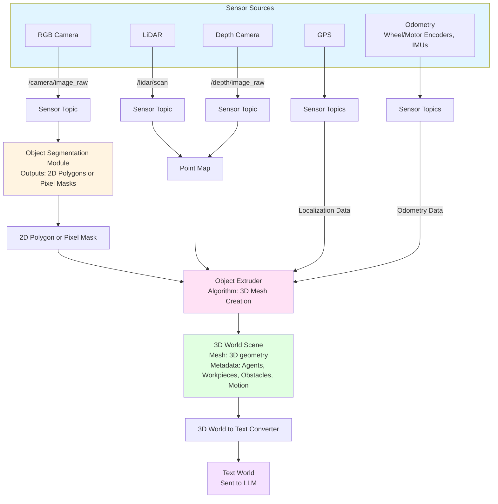

# Track: 3D World to Text

This track converts 3D scene data from multiple sensors into a semantic text representation (Text World) that the Large Language Model can reason about.

## Overview

The 3D World to Text track transforms raw sensor data (RGB images, LiDAR point clouds, depth maps) into a structured 3D scene representation, then converts that scene into natural language text that describes objects, their positions, relationships, and affordances.

## Processing Flow



## Component Details

### Sensor Sources

#### RGB Camera

**Sensor Topics:**
- `/camera/image_raw` (sensor_msgs/Image)

**Purpose**: Provides RGB image streams for object detection and scene understanding.

**Implementation**: Typically OAK-D S2 or TM815 IX E1 depth cameras with RGB capability.

#### LiDAR

**Sensor Topics:**
- `/lidar/scan` (sensor_msgs/LaserScan)

**Purpose**: Provides point cloud data for 3D spatial understanding.

**Implementation**: 
- Hinson SE-1035
- Hinson DE-4511
- Benewake TF03-180

#### Depth Camera

**Sensor Topics:**
- `/depth/image_raw` (sensor_msgs/Image)

**Purpose**: Provides depth information for each pixel in the RGB image.

**Implementation**: OAK-D S2 or TM815 IX E1 depth cameras.

#### Localization Data

**Sensor Sources:**
- LiDAR
- Depth Camera
- GPS

**Sensor Topics:**
- `/gps/position` (sensor_msgs/NavSatFix)
- `/lidar/scan` (for SLAM)
- `/depth/image_raw` (for visual SLAM)

**Purpose**: Provides global and relative position information for the 3D world coordinate frame.

#### Odometry Data

**Sensor Sources:**
- Wheel encoders
- Motor encoders
- IMUs (BW MINS50)

**Sensor Topics:**
- `/odom` (nav_msgs/Odometry)
- `/imu/data` (sensor_msgs/Imu)
- `/joint_states` (sensor_msgs/JointState)

**Purpose**: Provides motion and position tracking data for the robot base and manipulators.

---

### Object Segmentation Module

**Input**: RGB Image (sensor_msgs/Image from `/camera/image_raw`)

**Output**: 2D Polygons (bounding boxes) or Pixel Masks (segmentation masks)

The Object Segmentation Module provides a standardized interface for object detection that can be implemented using various computer vision models. The module processes RGB camera images and outputs either:
- **2D Polygons**: Bounding boxes defined by corner points
- **Pixel Masks**: Per-pixel segmentation masks

**See**: [Object Segmentation Module](object-segmentation-module.md) for detailed implementation, training, and inference information.

---

### Object Extruder

The Object Extruder combines multiple data sources to create 3D meshes:

**Inputs:**
- **2D Polygons or Pixel Masks** from Object Segmentation Module
- **Point Map** from LiDAR and depth camera
- **Localization Data** (robot position, orientation)
- **Odometry Data** (motion information)

**Algorithm**: 3D Mesh Creation

**Process:**
1. Takes 2D polygons (bounding boxes) or pixel masks from Object Segmentation Module
2. Extrudes polygons/masks into 3D space using depth information
3. Merges with point cloud data from LiDAR
4. Applies localization and odometry transformations
5. Creates watertight 3D meshes for each detected object

**Output**: 3D Mesh with spatial coordinates and extents

---

### 3D World Scene

The 3D World is a comprehensive scene representation containing:

#### Components

**3D Mesh**:
- Geometric representation of objects in 3D space
- Polygon meshes with vertices, edges, and faces
- Spatial coordinates relative to robot frame or world frame

**Metadata**:

1. **Agents**:
   - Other robots in the environment
   - Humans (workers, supervisors)
   - Dynamic entities with motion capabilities
   - Properties: ID, position, orientation, velocity, type

2. **Workpieces**:
   - Objects to be manipulated (sheathing, pipes, materials)
   - Objects being worked on
   - Properties: ID, position, orientation, affordances, material type, size

3. **Obstacles**:
   - Static and dynamic obstacles
   - Safety barriers
   - Environmental hazards
   - Properties: ID, position, dimensions, hazard level

4. **Motion**:
   - Information about motion of agents, workpieces, and obstacles
   - Velocity vectors
   - Acceleration data
   - Trajectory predictions
   - Collision risk assessments

#### Scene Graph Structure

The 3D World maintains a scene graph with:
- Spatial hierarchy
- Object relationships
- Temporal information
- Affordances and capabilities

---

### 3D World to Text Converter

Converts the structured 3D World scene into natural language text.

**Input**: 3D World Scene (mesh + metadata)

**Output**: Text World (semantic text description)

**Process**:
1. Traverse scene graph
2. Extract object properties (position, type, affordances)
3. Compute spatial relationships (above, below, near, far)
4. Generate natural language descriptions
5. Format as structured text

**Example Text World Output**:
```
Scene: Industrial Floor

- WeldingBot_02 is stationed at (5.1, 1.2, 0.0).
- Pipe_11 is positioned on Table_03, graspable and marked for welding.
- EmergencyStop is accessible at control panel.
- Red flag is positioned at (2.5, 0.8, 2.0), color: red.
- Sheathing is at (1.2, 0.5, 0.0), below the red flag.
- Obstacles detected: [ConcreteBlock_01 at (3.1, 1.5, 0.0)]
- Agent motion: [WeldingBot_02 moving at 0.3 m/s toward Pipe_11]
```

**Structured Format** (JSON):
```json
{
  "objects": [
    {
      "id": "sheathing",
      "category": "sheathing",
      "position": [1.2, 0.5, 0.0],
      "affordances": ["liftable", "transportable"]
    },
    {
      "id": "red_flag",
      "category": "flag",
      "color": "red",
      "position": [2.5, 0.8, 2.0]
    }
  ],
  "relations": [
    ["sheathing", "below", "red_flag"],
    ["WeldingBot_02", "near", "Pipe_11"]
  ],
  "environment": {
    "type": "construction_site",
    "safety_zones": ["EmergencyStop accessible"]
  },
  "motion": [
    {
      "agent": "WeldingBot_02",
      "velocity": [0.3, 0.0, 0.0],
      "direction": "toward Pipe_11"
    }
  ]
}
```

**Linearized Natural Language**:
```
The sheathing is at (1.2, 0.5, 0.0) and is below the red flag at (2.5, 0.8, 2.0).
WeldingBot_02 is stationed at (5.1, 1.2, 0.0) and moving toward Pipe_11.
Pipe_11 is positioned on Table_03 and is graspable.
```

---

## Integration with LLM

The Text World output is sent to the Large Language Model along with:
- High-Level Action (user command)
- Sensor Text (temporal sensor logs)

The LLM uses the Text World as context to generate appropriate Behavior Tree XML subtrees that account for the current scene state.

**See**: [Large Language Model Processing](llm-processing.md) for how Text World is used in LLM prompts.

---

## Configuration

```yaml
tsbt_vla:
  text_world:
    update_rate: 1.0  # Hz - How often to regenerate Text World
    include_relations: true  # Include spatial relationships
    include_affordances: true  # Include object affordances
    include_motion: true  # Include motion information
    coordinate_frame: "base_link"  # Reference frame
    max_objects: 50  # Maximum objects to include
    object_categories:  # Categories to track
      - "workpiece"
      - "obstacle"
      - "agent"
      - "tool"
  
  object_extruder:
    mesh_resolution: 0.05  # meters
    min_object_size: 0.1  # meters
    confidence_threshold: 0.5
    
  segmentation:
    model: "object_segmentation"  # Object segmentation module
    output_type: "polygon"  # or "pixel_mask"
    confidence_threshold: 0.6
    nms_threshold: 0.4
```

---

## ROS 2 Topics

**Input Topics:**
- `/camera/image_raw` (sensor_msgs/Image) - RGB images
- `/depth/image_raw` (sensor_msgs/Image) - Depth images
- `/lidar/scan` (sensor_msgs/LaserScan) - LiDAR point clouds
- `/gps/position` (sensor_msgs/NavSatFix) - GPS localization
- `/odom` (nav_msgs/Odometry) - Wheel odometry
- `/imu/data` (sensor_msgs/Imu) - IMU data
- `/joint_states` (sensor_msgs/JointState) - Joint positions

**Output Topics:**
- `/tsbt_vla/text_world` (std_msgs/String) - Text World output
- `/tsbt_vla/3d_world` (custom message) - 3D World scene data

**Services:**
- `/tsbt_vla/get_text_world` - Request current Text World
- `/tsbt_vla/get_3d_world` - Request current 3D World scene

---

## Next Steps

- [Sensor to Text Track](sensor-to-text.md) - Converting sensor data to text
- [Large Language Model Processing](llm-processing.md) - How Text World is used by LLM
- [Object Segmentation Module](object-segmentation-module.md) - Object segmentation implementation details
- [TSBT-VLA Implementation](../../tsbt-vla-system-implementation/overview.md) - Implementation with YOLOv11
- [Behavior Tree Node Reference](../../behavior-tree-node-reference.md) - Node reference

