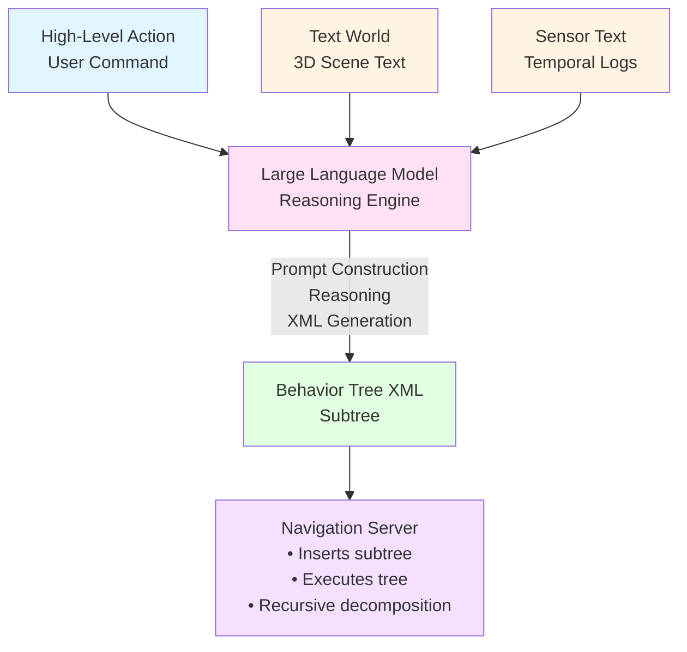

# Large Language Model Processing

The Large Language Model (LLM) is the core reasoning engine of the TSBT-VLA System. It combines multiple text inputs to generate Behavior Tree XML subtrees that accomplish high-level actions.

## Overview

The LLM receives three types of text input and generates executable Behavior Tree XML:

**Inputs:**
1. **High-Level Action** (from User Input to Action track)
2. **Text World** (from 3D World to Text track)
3. **Sensor Text** (from Sensor to Text track)

**Output:**
- **Behavior Tree XML** (subtree generation for Navigation Server)

## Processing Flow



## Input Processing

### Prompt Construction

The LLM receives a structured prompt combining all three inputs:

```
High-Level Action: {user_command}

Text World:
{text_world_description}

Sensor Text:
{sensor_logs}

Available Low-Level Actions:
- Outrigger_Rotate(rotation)
- Outrigger_Extend(extension)
- Boom_Slewing(rotation)
- Boom_Lift(extension)
- Pulley_Lift(distance)
- Visual_Find(ObjectClass, objectId)
- Hook_Release()
- NavigateToPose(goal)
- ComputePathToPose(goal)
- FollowPath(path)

Generate a Behavior Tree XML subtree that accomplishes the high-level action.
```

### Example Prompt

```
High-Level Action: Lift the sheathing to the red flag

Text World:
Scene: Industrial Floor

- WeldingBot_02 is stationed at (5.1, 1.2, 0.0).
- Red flag is positioned at (2.5, 0.8, 2.0), color: red.
- Sheathing is at (1.2, 0.5, 0.0), below the red flag.
- Obstacles detected: [ConcreteBlock_01 at (3.1, 1.5, 0.0)]

Sensor Text:
[ArmJointTorque] = [55.4Nm, 54.8Nm, 56.0Nm]
[BatteryTemp] = 52.3°C
[LaserDistance] = [0.5m, 0.49m, 0.48m]
[MotorCurrent] = [12.3A, 11.8A, 13.1A]
[SystemStatus] = normal
[EnergyRemaining] = 78%

Available Low-Level Actions:
- Outrigger_Rotate(rotation)
- Outrigger_Extend(extension)
- Boom_Slewing(rotation)
- Boom_Lift(extension)
- Pulley_Lift(distance)
- Visual_Find(ObjectClass, objectId)
- Hook_Release()
- NavigateToPose(goal)
- ComputePathToPose(goal)
- FollowPath(path)

Generate a Behavior Tree XML subtree that accomplishes the high-level action.
```

## LLM Implementation

The Large Language Model implementation provides a reasoning engine that processes text inputs and generates Behavior Tree XML. The LLM can be implemented using various edge-deployable models optimized for robotic applications.

**For ROBOCON OS implementation details using DeepSeek-R1-Distill-Llama-8B-GGUF, see**: [TSBT-VLA Implementation](../../tsbt-vla-system-implementation/track4-deepseek-llm.md)

### Usage Recommendations

**Temperature**: 0.5-0.7 (0.6 recommended)
- Prevents endless repetitions
- Ensures coherent behavior tree generation
- Balances creativity with determinism

**System Prompts**: **Avoid adding system prompts**
- All instructions should be in the user prompt
- Text World and Sensor Text provide context
- Direct instructions work best

**Mathematical/Reasoning Tasks**: Include directive in prompt
- Example: "Please reason step by step, and put your final answer within \\boxed{}"
- Helps with complex planning tasks

**Evaluation**: Conduct multiple tests and average results
- LLM outputs can vary
- Average over multiple runs for benchmarking

## LLM Output: Behavior Tree XML

The LLM generates Behavior Tree XML subtrees:

### Example Output

```
High-Level Action: Lift the sheathing to the red flag
```

**Generated Behavior Tree XML**:
```xml
<Sequence name="LiftSheathingToRedFlag">
    <Outrigger_Rotate rotation="170"/>
    <Outrigger_Extend extension="0.350"/>
    <Visual_Find ObjectClass="sheathing" objectId="{targetSheathing}"/>
    <Boom_Slewing rotation="45"/>
    <Boom_Lift extension="3.0"/>
    <Pulley_Lift Distance="2.5"/>
    <Boom_Slewing rotation="90"/>
    <Pulley_Lift Distance="-1.5"/>
    <Hook_Release/>
</Sequence>
```

### Output Characteristics

- **Valid XML**: Conforms to BehaviorTree.CPP XML format
- **Executable Nodes**: Uses available low-level and high-level action nodes
- **Context-Aware**: Accounts for Text World and Sensor Text
- **Parameterized**: Includes appropriate parameters from scene context
- **Sequential Logic**: Uses Sequence, Fallback, Parallel control nodes appropriately

## Recursive Decomposition

High-level actions in the generated Behavior Tree are decomposed recursively:

### Level 1: High-Level Command

```xml
<Sequence name="LiftSheathingToRedFlag">
    <NavigateToSheathing/>
    <GraspSheathing/>
    <NavigateToRedFlag/>
    <LiftToHeight height="2.0"/>
    <ReleaseSheathing/>
</Sequence>
```

### Level 2: Subtree Generation

When `<NavigateToSheathing/>` is encountered, the Navigation Server triggers LLM to generate a subtree:

**LLM Prompt** (simplified):
```
High-Level Action: Navigate to sheathing at (1.2, 0.5, 0.0)

Text World:
[Current scene state with sheathing position]

Sensor Text:
[Current sensor state]

Generate Behavior Tree XML for navigation.
```

**Generated Subtree**:
```xml
<Sequence name="NavigateToSheathing">
    <Prompt>
        <PromptInput>Navigate to sheathing at (1.2, 0.5, 0.0)</PromptInput>
        <RecoveryNode number_of_retries="6">
            <ComputePathToPose goal="{sheathing_pose}"/>
            <FollowPath path="{path}"/>
            <RoundRobin>
                <ClearCostmap/>
                <Spin/>
                <BackUp/>
            </RoundRobin>
        </RecoveryNode>
    </Prompt>
</Sequence>
```

### Level 3: Dynamic Replanning

If scene changes (e.g., sheathing moves), LLM can regenerate subtrees:

**Scene Diff Detection**:
```
Scene Diff Detected:
- Sheathing moved 0.3m to the right (new position: 1.5, 0.5, 0.0)
- Current subtree targets old position (1.2, 0.5, 0.0)
- Action: Replan sequence starting at NavigateToSheathing
```

**LLM Replanning**:
```xml
<!-- Regenerated subtree -->
<Sequence name="NavigateToSheathing">
    <Prompt>
        <PromptInput>Navigate to sheathing at (1.5, 0.5, 0.0)</PromptInput>
        <!-- Updated navigation subtree -->
    </Prompt>
</Sequence>
```

## Integration with Navigation Server

The Navigation Server:
1. **Receives** generated Behavior Tree XML from LLM
2. **Inserts** subtree into master behavior tree
3. **Executes** tree using behavior tree library
4. **Monitors** execution and scene changes
5. **Triggers** recursive decomposition when high-level nodes are encountered
6. **Initiates** replanning when scene changes invalidate current plan

### Behavior Tree Library Integration

The Navigation Server integrates with a behavior tree execution library to execute generated subtrees. The library provides:
- Tree construction from XML
- Node registration and factory pattern
- Tree execution and ticking
- Custom node types for TSBT-VLA operations

**For implementation details using BehaviorTree.CPP and ROS 2 Navigation Server, see**: [TSBT-VLA Implementation](../../tsbt-vla-system-implementation/behavior-tree-execution.md)

## Dynamic Replanning

The system supports dynamic replanning based on scene changes:

### Scene Diff Detection

```python
# On every tick, generate scene diff
previous_scene = get_previous_scene()
current_scene = get_current_scene()
scene_diff = compute_scene_diff(previous_scene, current_scene)

if scene_diff.has_significant_changes():
    # Validate active subtree
    if not is_subtree_valid(current_subtree, current_scene):
        # Regenerate subtree using LLM
        new_subtree = llm_client.regenerate_subtree(
            current_subtree,
            scene_diff,
            high_level_action
        )
        replace_subtree(current_subtree, new_subtree)
```

### Replanning Example

**Initial Plan**:
```xml
<Sequence>
    <NavigateToPose goal="{sheathing_old_position}"/>
    <GraspObject/>
</Sequence>
```

**After Scene Change** (Sheathing moved):
```xml
<!-- Regenerated subtree -->
<Sequence>
    <NavigateToPose goal="{sheathing_new_position}"/>
    <RecomputeGraspPose/>
    <GraspObject/>
</Sequence>
```

## Configuration

```yaml
tsbt_vla:
  llm:
    model: "llm_model_name"  # Model identifier
    endpoint: "http://localhost:8080/llm"
    max_tokens: 2048
    temperature: 0.6  # Recommended for behavior tree generation
    context_window: 131072  # 128k tokens
    
  behavior_tree:
    execution_rate: 10.0  # Hz
    enable_replanning: true
    replan_threshold: 0.3  # meters - scene change threshold
    recursive_decomposition: true
    max_recursion_depth: 5
```

## Python API

```python
from robocon_tsbt_vla import TSBTVLASystem
from robocon_edge_llm import LLMClient

# Initialize system with LLM client
llm_client = LLMClient(
    model="llm_model_name",
    endpoint="http://localhost:8080/llm",
    temperature=0.6  # Recommended for behavior tree generation
)
tsbt_vla = TSBTVLASystem(llm_client=llm_client)

# Process natural language command
result = tsbt_vla.process_command(
    command="Lift the sheathing to the red flag",
    scene_context=get_current_scene(),
    sensor_data=get_sensor_logs()
)

# Get generated behavior tree
behavior_tree_xml = result.behavior_tree
```

## Communication Protocol Integration

The LLM processing integrates with the robot's communication protocol for receiving commands and sending behavior tree output.

**Service Interface**:
```
/tsbt_vla/process_command - Process natural language command and generate behavior tree
```

## Next Steps

- [3D World to Text Track](3d-world-to-text.md) - Text World generation
- [Sensor to Text Track](sensor-to-text.md) - Sensor Text generation
- [User Input to Action Track](user-input-to-action.md) - High-level action input
- [TSBT-VLA Implementation](../../tsbt-vla-system-implementation/track4-deepseek-llm.md) - Implementation with DeepSeek, ROS 2, Nav 2
- [Behavior Tree Node Reference](../../behavior-tree-node-reference.md) - Available nodes
- [Object Segmentation Module](object-segmentation-module.md) - Object detection details

