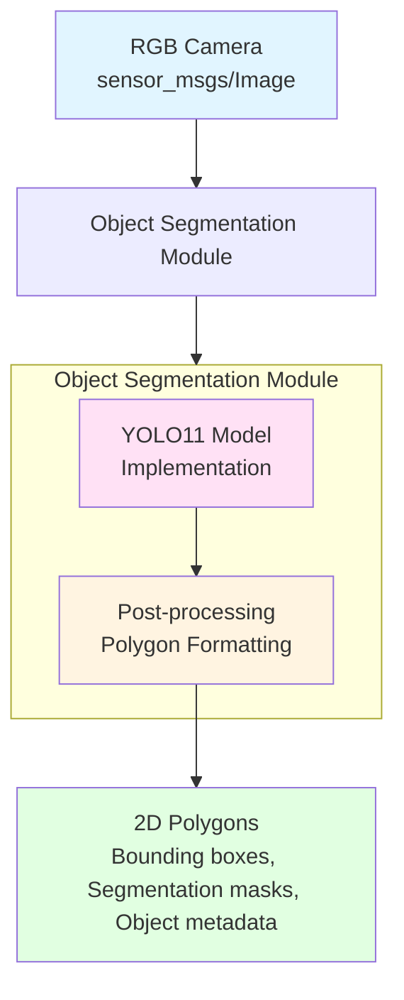

# Object Segmentation Module

The Object Segmentation Module processes RGB camera images to detect objects and output 2D polygons (bounding boxes or segmentation masks) that are used by the Object Extruder to create 3D meshes.

## Overview

The Object Segmentation Module is an abstraction layer that wraps an object detection model (implemented using YOLO11) to provide standardized 2D polygon output from RGB camera input.

**Input**: RGB Image (sensor_msgs/Image)
**Output**: 2D Polygons (bounding boxes or segmentation masks)

## Architecture



## YOLO11 Implementation

YOLO11 (You Only Look Once version 11) is the underlying object detection model used by the Object Segmentation Module.

### Model Overview

**YOLO11** is a state-of-the-art object detection model that:
- Detects objects in real-time
- Provides bounding boxes and segmentation masks
- Supports multiple object classes
- Runs efficiently on edge hardware with GPU acceleration

**Why YOLO11?**
- Fast inference (real-time capable)
- High accuracy
- Supports instance segmentation
- Well-suited for robotic applications
- Compatible with GPU acceleration (ROCm for AMD GPUs)

### Model Abstraction

The Object Segmentation Module abstracts YOLO11 to provide a consistent interface:

**Abstract Interface**:
```python
class ObjectSegmentationModule:
    def detect_objects(self, image: Image) -> List[Polygon]:
        """
        Input: RGB Image
        Output: List of 2D Polygons with metadata
        """
        pass
```

**YOLO11 Implementation**:
```python
class YOLO11Segmentation(ObjectSegmentationModule):
    def __init__(self, model_path: str):
        self.model = load_yolo11_model(model_path)
        
    def detect_objects(self, image: Image) -> List[Polygon]:
        # YOLO11 inference
        results = self.model.predict(image)
        
        # Convert to polygon format
        polygons = self._convert_to_polygons(results)
        
        return polygons
```

## Training

### Dataset Preparation

1. **Collect Images**:
   - RGB images from robot cameras
   - Various lighting conditions
   - Multiple angles and perspectives
   - Different object states

2. **Annotation**:
   - Label objects with bounding boxes
   - Assign object classes (workpiece, obstacle, agent, tool, etc.)
   - Include segmentation masks for instance segmentation
   - Tools: LabelImg, CVAT, Roboflow

3. **Dataset Format**:
   - YOLO format (txt annotations)
   - COCO format (JSON annotations)
   - Custom format (converted as needed)

### Training Process

**1. Install Dependencies**:
```bash
pip install ultralytics
```

**2. Prepare Dataset**:
```bash
dataset/
├── train/
│   ├── images/
│   └── labels/
├── val/
│   ├── images/
│   └── labels/
└── test/
    ├── images/
    └── labels/
```

**3. Configure Training**:
```python
from ultralytics import YOLO

# Load pre-trained YOLO11 model
model = YOLO('yolo11n.pt')  # nano version for edge devices

# Train model
results = model.train(
    data='dataset.yaml',  # Dataset configuration
    epochs=100,
    imgsz=640,
    batch=16,
    device='cuda',  # or 'cpu' or 'rocm'
    project='robocon_object_detection',
    name='yolo11_custom'
)
```

**4. Dataset Configuration** (`dataset.yaml`):
```yaml
path: /path/to/dataset
train: train/images
val: val/images
test: test/images

nc: 10  # Number of classes
names:
  0: workpiece
  1: obstacle
  2: agent
  3: tool
  4: sheathing
  5: red_flag
  6: pipe
  7: table
  8: emergency_stop
  9: control_panel
```

**5. Training Output**:
- Best model weights: `best.pt`
- Last checkpoint: `last.pt`
- Training metrics: `results.csv`
- Validation plots: `results.png`

### Model Optimization

**Quantization** (for edge deployment):
```python
from ultralytics import YOLO

# Load trained model
model = YOLO('best.pt')

# Export to ONNX (for quantization)
model.export(format='onnx')

# Quantize to INT8 (optional, for further optimization)
# Use TensorRT, ONNX Runtime, or similar tools
```

**ROCm Optimization** (for AMD GPUs):
```bash
# Use ROCm-compatible PyTorch
pip install torch torchvision --index-url https://download.pytorch.org/whl/rocm5.7

# Train with ROCm
export HIP_VISIBLE_DEVICES=0
python train.py --device rocm
```

## Inference

### ROS 2 Node Implementation

**Python Example**:
```python
import rclpy
from rclpy.node import Node
from sensor_msgs.msg import Image
from cv_bridge import CvBridge
from ultralytics import YOLO
from robocon_tsbt_vla_msgs.msg import Polygon2D, ObjectDetection

class ObjectSegmentationNode(Node):
    def __init__(self):
        super().__init__('object_segmentation_node')
        
        # Load YOLO11 model
        self.model = YOLO('best.pt')
        self.bridge = CvBridge()
        
        # Subscribe to camera topic
        self.subscription = self.create_subscription(
            Image,
            '/camera/image_raw',
            self.image_callback,
            10
        )
        
        # Publish detection results
        self.detection_pub = self.create_publisher(
            ObjectDetection,
            '/object_segmentation/detections',
            10
        )
        
    def image_callback(self, msg):
        # Convert ROS Image to OpenCV format
        cv_image = self.bridge.imgmsg_to_cv2(msg, 'rgb8')
        
        # Run YOLO11 inference
        results = self.model.predict(cv_image, verbose=False)
        
        # Convert to polygon format
        detections = self._convert_to_detections(results, msg.header)
        
        # Publish
        self.detection_pub.publish(detections)
    
    def _convert_to_detections(self, yolo_results, header):
        detection_msg = ObjectDetection()
        detection_msg.header = header
        
        for result in yolo_results:
            for box in result.boxes:
                # Extract bounding box
                x1, y1, x2, y2 = box.xyxy[0].cpu().numpy()
                
                # Create polygon (bounding box)
                polygon = Polygon2D()
                polygon.points = [
                    Point2D(x=x1, y=y1),
                    Point2D(x=x2, y=y1),
                    Point2D(x=x2, y=y2),
                    Point2D(x=x1, y=y2)
                ]
                
                # Add metadata
                polygon.object_class = int(box.cls[0])
                polygon.confidence = float(box.conf[0])
                
                detection_msg.polygons.append(polygon)
        
        return detection_msg
```

**C++ Example** (using YOLO C++ bindings or ONNX Runtime):
```cpp
#include <rclcpp/rclcpp.hpp>
#include <sensor_msgs/msg/image.hpp>
#include <cv_bridge/cv_bridge.h>
#include <robocon_tsbt_vla_msgs/msg/object_detection.hpp>

class ObjectSegmentationNode : public rclcpp::Node {
public:
    ObjectSegmentationNode() : Node("object_segmentation_node") {
        // Load ONNX model
        // Initialize ONNX Runtime or similar
        
        subscription_ = create_subscription<sensor_msgs::msg::Image>(
            "/camera/image_raw", 10,
            std::bind(&ObjectSegmentationNode::image_callback, this, std::placeholders::_1)
        );
        
        detection_pub_ = create_publisher<robocon_tsbt_vla_msgs::msg::ObjectDetection>(
            "/object_segmentation/detections", 10
        );
    }
    
private:
    void image_callback(const sensor_msgs::msg::Image::SharedPtr msg) {
        // Convert image
        cv_bridge::CvImagePtr cv_ptr = cv_bridge::toCvCopy(msg, "rgb8");
        
        // Run inference
        // Convert to polygon format
        // Publish
    }
};
```

### Inference Performance

**Expected Performance** (on AI Computer with AMD RX 7600 XT):
- **YOLO11n (nano)**: ~30-50 FPS
- **YOLO11s (small)**: ~20-30 FPS
- **YOLO11m (medium)**: ~10-20 FPS
- **YOLO11l (large)**: ~5-10 FPS

**Optimization Tips**:
- Use YOLO11n for real-time applications
- Reduce input image size (640x640 or 480x480)
- Use TensorRT or ONNX Runtime for faster inference
- Batch processing when possible

## Output Format

### Polygon Types

**1. Bounding Boxes**:
```python
{
    "type": "bounding_box",
    "points": [
        {"x": 100, "y": 150},  # Top-left
        {"x": 300, "y": 150},  # Top-right
        {"x": 300, "y": 400},  # Bottom-right
        {"x": 100, "y": 400}   # Bottom-left
    ],
    "object_class": "sheathing",
    "confidence": 0.95
}
```

**2. Segmentation Masks**:
```python
{
    "type": "segmentation_mask",
    "points": [
        {"x": 100, "y": 150},
        {"x": 120, "y": 160},
        # ... more points defining shape
    ],
    "object_class": "sheathing",
    "confidence": 0.92
}
```

### ROS 2 Message Format

```cpp
// robocon_tsbt_vla_msgs/msg/ObjectDetection.msg
std_msgs/Header header
Polygon2D[] polygons

// robocon_tsbt_vla_msgs/msg/Polygon2D.msg
geometry_msgs/Point2D[] points
string object_class
float32 confidence
```

## Integration with Object Extruder

The Object Segmentation Module outputs 2D polygons that are consumed by the Object Extruder:

**Flow**:
1. Object Segmentation Module detects objects → 2D Polygons
2. Object Extruder receives polygons + depth/point cloud data
3. Object Extruder extrudes 2D polygons to 3D using depth information
4. 3D meshes are created and added to 3D World

**See**: [3D World to Text Track](3d-world-to-text.md) for details on Object Extruder integration.

## Configuration

```yaml
object_segmentation:
  model:
    type: "yolo11"
    path: "/path/to/best.pt"
    size: "nano"  # nano, small, medium, large
    
  inference:
    image_size: 640  # Input image size
    confidence_threshold: 0.6
    nms_threshold: 0.4
    max_detections: 50
    
  output:
    polygon_type: "bounding_box"  # or "segmentation_mask"
    include_metadata: true
    
  performance:
    device: "cuda"  # or "cpu" or "rocm"
    batch_size: 1
    num_threads: 4
```

## ROS 2 Topics

**Input**:
- `/camera/image_raw` (sensor_msgs/Image) - RGB camera images

**Output**:
- `/object_segmentation/detections` (robocon_tsbt_vla_msgs/ObjectDetection) - Detected polygons

**Parameters**:
- `model_path` - Path to YOLO11 model file
- `confidence_threshold` - Minimum confidence for detections
- `nms_threshold` - Non-maximum suppression threshold

## Troubleshooting

### Low Detection Accuracy
- Check training dataset quality
- Increase training epochs
- Use larger YOLO11 model (s, m, or l)
- Fine-tune hyperparameters

### Slow Inference
- Use YOLO11n (nano) model
- Reduce input image size
- Enable GPU acceleration (CUDA/ROCm)
- Use model quantization

### Memory Issues
- Reduce batch size
- Use smaller model variant
- Optimize image preprocessing

## Next Steps

- [3D World to Text Track](3d-world-to-text.md) - How polygons are used for 3D reconstruction
- [Large Language Model Processing](llm-processing.md) - How object information flows to LLM
- [TSBT-VLA System Overview](overview.md) - Complete system architecture

