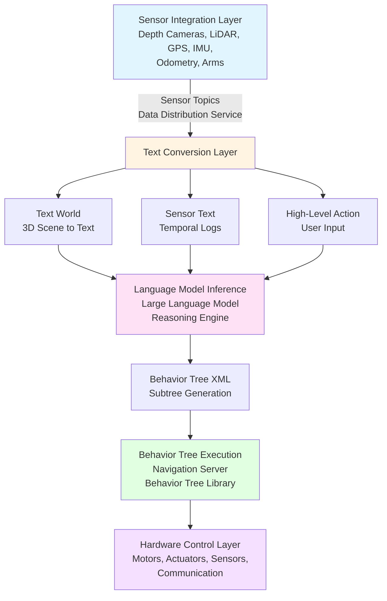
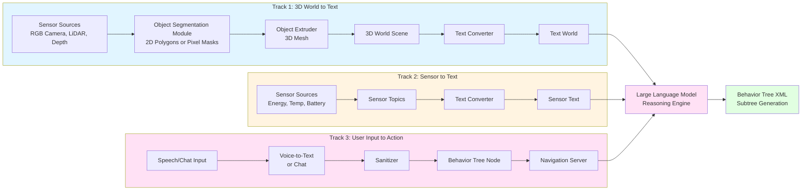
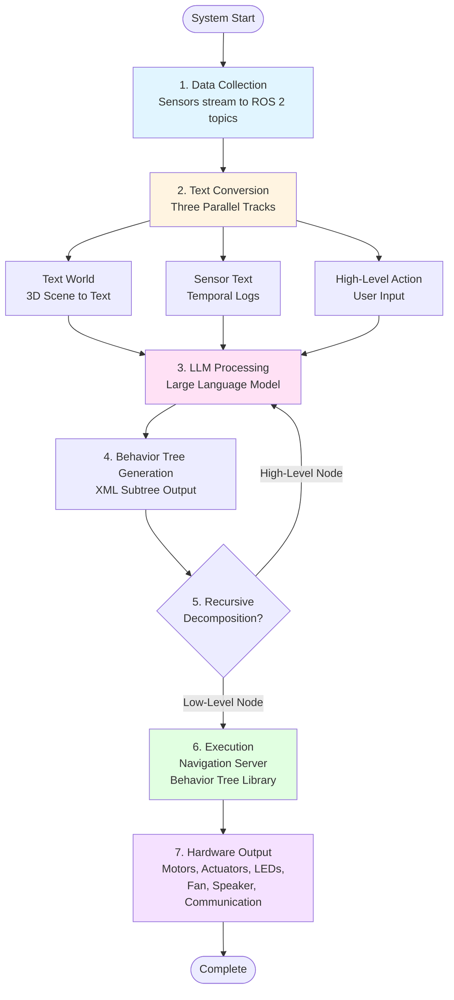
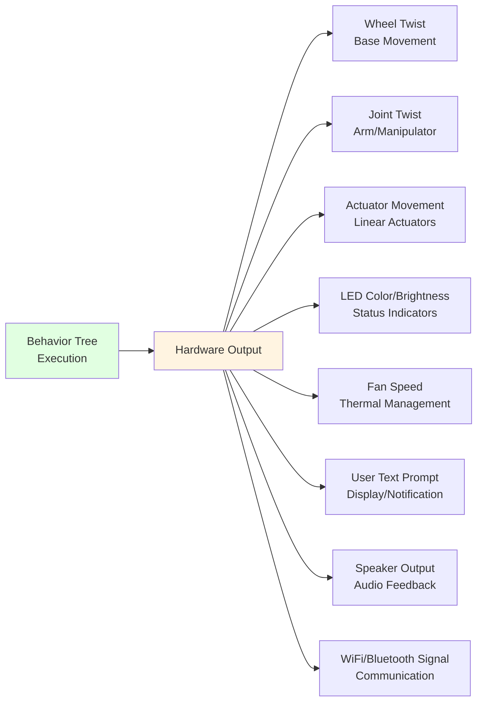
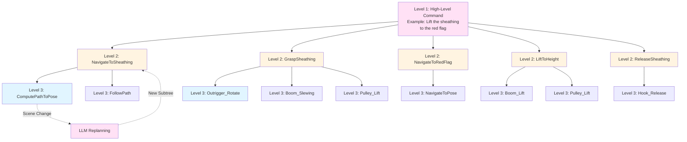

# TSBT-VLA System Overview

**Title:** Text Scene Behavior Tree Auditable Visual Language Action System for Autonomous Equipment  
**Inventors:** Brent Lee, Brad Lee

## Overview

The **Text Scene Behavior Tree Auditable Visual Language Action System (TSBT-VLA)** is a novel, fully auditable, text-based architecture that enables robust, interpretable, and recursively updatable robotic planning pipelines for autonomous equipment.

Unlike humanoid robots optimized for lightweight inference, autonomous equipment requires **auditable, robust, and real-time accountable** decision-making due to the severe consequences of errors in industrial and construction environments.

### Key Advantages

- ✅ **Full Auditability**: Every decision is traceable through text-based logs
- ✅ **Interpretable Reasoning**: Human-readable scene descriptions and behavior trees
- ✅ **Recursive Planning**: Dynamic subtrees generated based on changing context
- ✅ **Symbolic Text-First Approach**: All transformations explicitly represented in text
- ✅ **Regulation Compliance**: Suitable for safety-critical, high-risk environments
- ✅ **High Compute Support**: Optimized for edge systems with 100+ TFLOPS (FP16)

## System Architecture

## System Tracks

The TSBT-VLA System operates through four major processing tracks that work together to convert sensory input and user commands into executable behavior trees:

### Track 1: 3D World to Text

Converts 3D scene data from multiple sensors into a semantic text representation of the environment.

**Key Components:**
- RGB Camera → Object Segmentation Module → 2D Polygons or Pixel Masks
- LiDAR/Depth Camera → Point Clouds
- Object Extruder → 3D Mesh Reconstruction
- 3D World Scene Graph (Agents, Workpieces, Obstacles, Motion)
- Text Converter → Text World Output

**See**: [3D World to Text Track](3d-world-to-text.md) for detailed information.

---

### Track 2: Sensor to Text

Converts temporal sensor data into text logs for safety and feasibility reasoning.

**Key Components:**
- Sensor Sources (Energy, Temperature, Battery, etc.)
- Sensor Topics (ROS 2)
- Text Converter
- Sensor Text Output

**See**: [Sensor to Text Track](sensor-to-text.md) for detailed information.

---

### Track 3: User Input to Action

Processes natural language input from various interfaces into behavior tree nodes.

**Key Components:**
- Speech Input (Microphone → Voice-to-Text)
- Chat Input (Phone/Tablet/Laptop/Desktop)
- Text Sanitizer
- Behavior Tree Node Creation
- Navigation Server Integration

**See**: [User Input to Action Track](user-input-to-action.md) for detailed information.

---

### Track 4: Large Language Model Processing

The core reasoning engine that combines all text inputs to generate behavior tree XML.

**Inputs:**
- High-Level Action (from User Input)
- Text World (from 3D World to Text)
- Sensor Text (from Sensor to Text)

**Output:**
- Behavior Tree XML (subtree generation)

**Processing:**
- Recursive decomposition
- Dynamic subtree generation
- Context-aware planning

**See**: [Large Language Model Processing](llm-processing.md) for detailed information.

---

### Additional Components

#### Object Segmentation Module

The Object Segmentation Module processes RGB camera images to detect objects and outputs 2D polygons or pixel masks. The module provides a standardized interface for object detection that can be implemented using various computer vision models.

**Output**: 2D Polygons (bounding boxes) or Pixel Masks (segmentation masks)

**See**: [Object Segmentation Module](object-segmentation-module.md) for detailed implementation information.

## Execution Flow

## Output Hardware

The Behavior Tree Execution layer outputs commands to various hardware systems:

## Recursive Decomposition

High-level actions are preserved in the output Behavior Tree and decomposed recursively:

## Integration with ROBOCON OS

TSBT-VLA integrates seamlessly with ROBOCON OS components:

- **Large Language Model**: Edge-deployable reasoning engine via inference framework
- **Behavior Tree Library**: Behavior tree execution framework
- **Navigation Server**: Hosts and executes behavior trees
- **Sensor Integration**: Direct connection to ROBOCON sensor drivers
- **Hardware Control**: Output to ROBOCON motor controllers and actuators

**For implementation-specific details using YOLOv11, DeepSeek, ROS 2, and Nav 2, see**: [TSBT-VLA Implementation](../../tsbt-vla-system-implementation/overview.md)

## Safety and Auditing

Every inference step maintains complete logs for full traceability:

- **Input Prompt**: Full LLM prompt with all context
- **Scene State**: Snapshot of 3D world at inference time
- **Sensor Data**: Temporal logs used in reasoning
- **Generated Subtree**: Complete Behavior Tree XML output
- **Execution Log**: Node tick results and blackboard state
- **Hardware Actions**: All commands sent to actuators
- **Timestamp**: Precise timing for regulatory compliance

## Next Steps

- [Patent Documentation](patent.md) - Complete patent specification with diagrams
- [3D World to Text Track](3d-world-to-text.md) - Detailed 3D scene to text conversion
- [Sensor to Text Track](sensor-to-text.md) - Sensor data text conversion
- [User Input to Action Track](user-input-to-action.md) - Natural language to behavior tree
- [Large Language Model Processing](llm-processing.md) - LLM reasoning and subtree generation
- [Object Segmentation Module](object-segmentation-module.md) - Object segmentation implementation details
- [TSBT-VLA Implementation](../../tsbt-vla-system-implementation/overview.md) - Implementation using YOLOv11, DeepSeek, ROS 2, and Nav 2
- [Behavior Tree Node Reference](../../behavior-tree-node-reference.md) - Complete node reference

