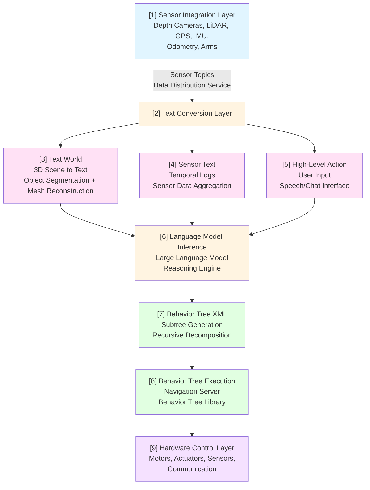
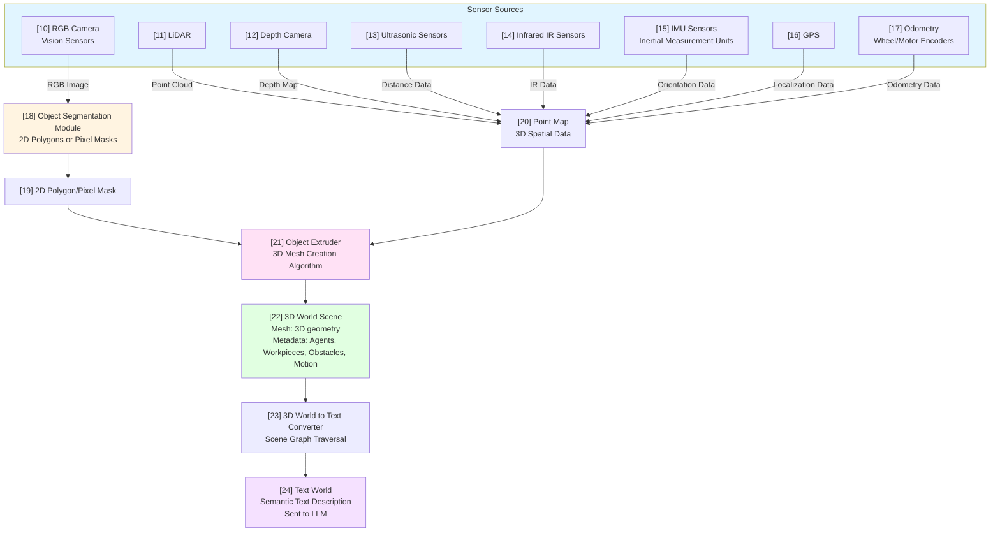
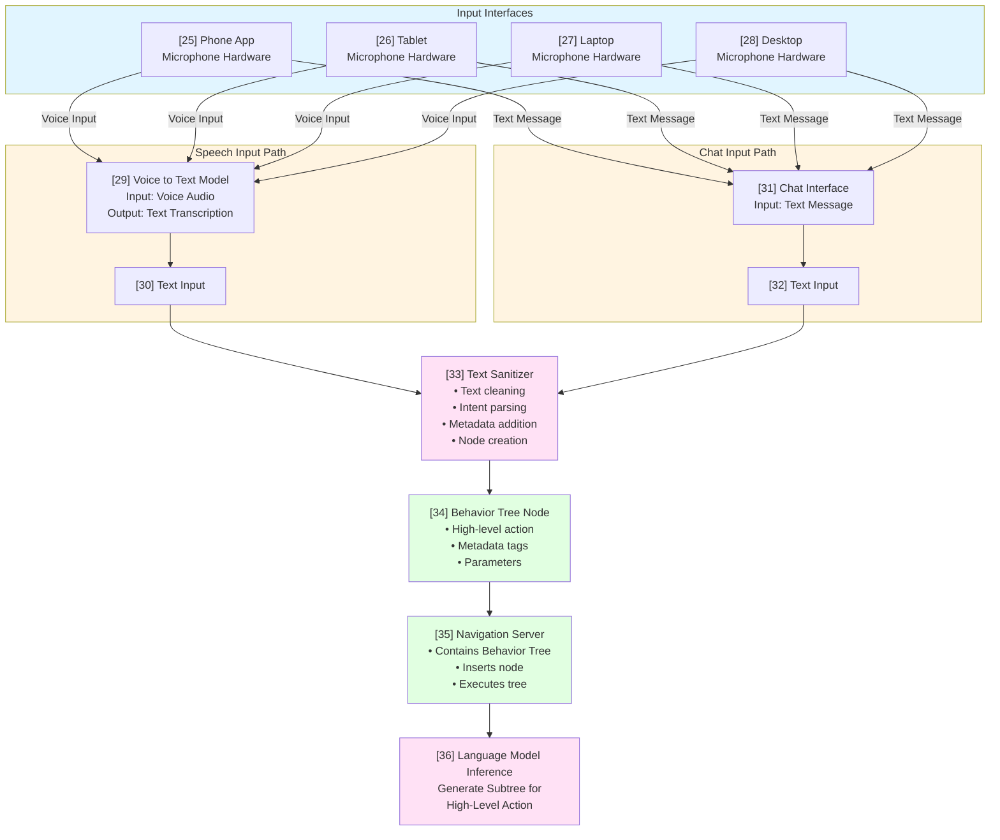
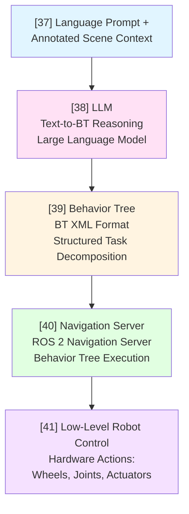
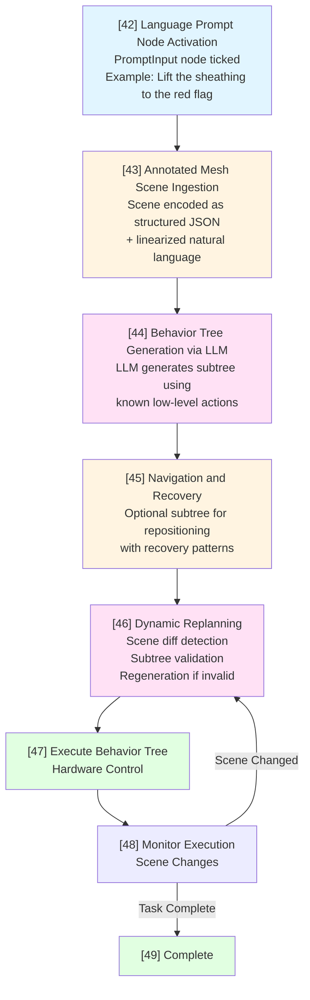
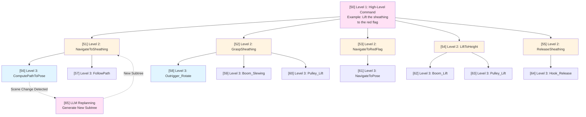

import DownloadButtons from '@site/src/components/DownloadButtons';
import DiagramDownload from '@site/src/components/DiagramDownload';

<DownloadButtons 
  title="Text Scene Behavior Tree Auditable Visual Language Action System" 
  filename="TSBT-VLA-Patent" 
/>

# Patent: Text Scene Behavior Tree Auditable Visual Language Action System

**Title:** Text Scene Behavior Tree Auditable Visual Language Action System for Autonomous Equipment

**Inventors:** Brent Lee, Brad Lee

---

## BACKGROUND

Conventional research in Embodied Artificial Intelligence (AI) has historically concentrated on humanoid robots—machines that resemble human anatomy and are engineered to manipulate small objects, open doors, carry light payloads, and interact in controlled environments such as homes, offices, and laboratories. These humanoid platforms are often optimized for limited size, weight, and onboard compute, with processing power typically constrained to less than 20 TFLOPS (FP16). As a result, much of the reasoning within these systems is hidden within compact neural network models that rely heavily on latent embeddings and minimal explicit structure.

While such architectures are well-suited for dexterous manipulation and fast inference, they fall short in scenarios that demand auditability, robustness, and real-time accountability. This is particularly problematic in environments where mistakes can lead to severe damage or injury.

By contrast, autonomous equipment—a term encompassing heavy-duty robotic systems operating in industrial and construction domains—offers a new paradigm. Unlike humanoid robots, these machines are not constrained by human form. They include robotic excavators, mobile cranes, autonomous bulldozers, pavers, mining trucks, drilling rigs, warehouse logistics fleets, and robotic manufacturing arms.

Due to their larger size and more powerful infrastructure, autonomous equipment supports significantly more computational resources, often surpassing 100 TFLOPS (FP16) at the edge. Furthermore, because of their operational scale and power, mistakes from these systems carry far greater consequences, including the potential for lethal accidents, catastrophic structural failures, or disruption of multi-million-dollar industrial processes.

In these settings, the need for auditable, interpretable, and modifiable decision-making becomes paramount. Every sensor reading, every action decision, and every trajectory plan must be explainable—not just to developers, but also to safety officers, regulators, insurance reviewers, and on-site human supervisors.

This invention addresses this critical requirement by providing a fully textual, human-auditable pipeline that captures the world state, user intent, and system response in a recursive planning structure built on Behavior Trees. By utilizing structured XML and symbolic reasoning powered by a large language model (LLM), we allow for high-level instructions to be translated into verifiable low-level robot behaviors in a way that is modular, inspectable, and reversible.

The system's design is inherently flexible, supporting use cases in both industrial automation (e.g., robotic welding, pick-and-place logistics, CNC coordination) and construction automation (e.g., dynamic rebar placement, grading and leveling, crane lifting plans, autonomous compaction). These domains benefit immensely from the auditability and extensibility offered by this architecture.

---

## EVOLUTION OF VISUAL LANGUAGE ACTION (VLA) SYSTEMS

Visual Language Action (VLA) systems form a growing class of architectures that seek to enable robots to perform tasks based on natural language commands and visual understanding. Over time, VLA systems have evolved from direct perception-to-action pipelines into modular, semantically grounded reasoning frameworks.

### Common Types of VLA Architectures:

**1. Multimodal Transformer-Based VLA**

- These systems rely on joint training of language and vision models (e.g., CLIP-based backbones).
- **Example Systems:** SayCan (Google), Visual ChatGPT (Microsoft).
- **Strengths:** High generalization in known environments; ease of deployment for lightweight agents.
- **Weaknesses:** Hidden reasoning in latent space; no clear introspection into decision paths.

**2. Scene Graph + Language Planners**

- Utilize a symbolic representation of the scene (scene graph) which is interpreted via text-based planners.
- **Examples:** PASTA, VIMA.
- **Strengths:** Enables goal decomposition, modular task representation.
- **Weaknesses:** Limited to pre-defined relationships and lacks real-time plan adaptation.

**3. Symbolic Text-First VLA (This Invention)**

- Inputs (language, vision, sensor readings) are explicitly converted to human-readable text.
- Output is a structured, interpretable Behavior Tree in XML format.
- Designed for use cases where auditability is critical.
- **Advantages:** Recursive plan generation; reactivity; traceability; regulation compliance.

### Limitations of Traditional VLA Pipelines:

Traditional VLA systems often operate on a dual-rate architecture, where the vision-language model (VLM) operates slowly in the background to generate intermediate goals, while a separate Action Model rapidly reacts to produce control signals. This split model leads to blurred responsibility across modules, especially in safety-critical domains. Furthermore, pre-trained vision encoders used in such pipelines often apply hardcoded bounding boxes, semantic segmentations, or object classifiers, which are difficult to modify or correct.

This invention proposes a fully symbolic approach where every transformation layer—from 3D point cloud to scene mesh, from sensor data to temporal logs, from intent to behavior—is explicitly represented in text. The language model sees, reasons over, and responds to the world in a format that humans can understand and verify.

**This strategy improves:**
- Interoperability across hardware platforms
- Certifiability for high-risk industries
- Developer productivity in debugging and plan optimization
- Transparency in collaborative robotics and fleet coordination

It establishes the foundation for a new class of systems where Visual Language Action planning is no longer opaque, but rather fully accessible and auditable.

---

## SUMMARY

This invention introduces a novel, auditable, text-based architecture—**Text Scene Behavior Tree Auditable Visual Language Action System (TSBT-VLA)**—that enables robust, interpretable, and recursively updatable robotic planning pipelines for autonomous equipment.

---

## SYSTEM OVERVIEW

Referring now to Figure 3, there is shown a system architecture diagram illustrating the complete TSBT-VLA system. In one embodiment, the system operates on the following key stages:

**1. Sensor Integration (Element [1]):**

- In one embodiment, element [1] receives input from depth cameras, LIDAR, GPS, IMUs, odometry, and arm joint encoders, which are streamed into Sensor Topics using Data Distribution Service (DDS).

**2. Text Conversion (Element [2]):**

- Element [2] constructs three types of text inputs from the sensory data received from element [1]:
  - **Text World (Element [3]):** A semantic 3D environment description generated from object segmentation, point cloud extrusion, and mesh reconstruction, as further detailed in Figure 1.
  - **Sensor Text (Element [4]):** A temporal log of raw sensor outputs (e.g., arm power usage over the last 10 ticks).
  - **High-Level Action (Element [5]):** A user instruction issued from phone, tablet, or desktop UI, as further detailed in Figure 2.

**3. Language Model Inference (Element [6]):**

- In one embodiment, element [6] comprises a large language model (e.g., LLaMA 3, Claude, DeepSeek-R1) that consumes the inputs from elements [3], [4], and [5] to generate a Behavior Tree XML subtree describing task decomposition (e.g., lifting, moving, welding, sorting).
- Subtrees are generated recursively by element [6], enabling dynamic reinterpretation based on changing context.

**4. Behavior Tree Execution (Element [8]):**

- Element [7] receives the Behavior Tree XML from element [6] and performs subtree generation with recursive decomposition.
- The Behavior Tree is hosted on element [8], which comprises a Navigation Server that ticks the tree continuously.
- Element [9] receives execution commands from element [8] and triggers discrete hardware actions, including:
  - Wheel Twist, Joint Twist, Actuator Movement
  - LED Color/Brightness, Fan Speed
  - User Text Prompt, Speaker Output
  - Signal WiFi/Bluetooth

**Figure 3: System Architecture** illustrates the complete system flow:

<DiagramDownload filename="FIGURE-3-System-Architecture" />



<DiagramDownload filename="FIGURE-3-System-Architecture" />

---

## DEFINITIONS

**Behavior Tree (BT):** A modular control structure used to manage robot tasks. Nodes represent actions or decisions, and are evaluated in order depending on success or failure. Subtrees allow hierarchical planning.

**XML (eXtensible Markup Language):** A structured text format for representing data hierarchies, used here to define behavior tree logic in machine-readable and human-readable form.

**Scene Graph:** A symbolic representation of a 3D scene using objects, relationships, and attributes (e.g., positions, affordances).

---

## TEXT FORMATTING FOR SCENE REPRESENTATION

### Text World Example:

```
Scene: Industrial Floor

- WeldingBot_02 is stationed at (5.1, 1.2, 0.0).
- Pipe_11 is positioned on Table_03, graspable and marked for welding.
- EmergencyStop is accessible at control panel.
```

### Sensor Text Example:

```
[ArmJointTorque] = [55.4Nm, 54.8Nm, 56.0Nm]
[BatteryTemp] = 52.3°C
[LaserDistance] = [0.5m, 0.49m, 0.48m]
```

These entries are used by the LLM to reason about task safety, energy levels, or motion feasibility.

---

## FIGURE 1: 3D WORLD TO TEXT

Referring now to Figure 1, there is shown a flowchart illustrating the conversion of 3D scene data into semantic text representation. In one embodiment, the system processes multiple sensor inputs as follows:



<DiagramDownload filename="FIGURE-1-3D-World-to-Text" />

As shown in Figure 1, the 3D World to Text track processes multiple sensor inputs. In one embodiment:

- Elements [10] through [17] comprise the sensor sources, including RGB cameras (element [10]), LiDAR sensors (element [11]), depth cameras (element [12]), ultrasonic sensors (element [13]), infrared sensors (element [14]), IMU sensors (element [15]), GPS (element [16]), and odometry sensors (element [17]).

- Element [10] provides RGB images to element [18], which comprises an Object Segmentation Module that outputs 2D polygons or pixel masks (element [19]).

- Elements [11] through [17] provide their respective data streams to element [20], which aggregates the data into a Point Map containing 3D spatial data.

- Element [21] comprises an Object Extruder that receives the 2D polygon/pixel mask from element [19] and the point cloud data from element [20], combining them to create 3D meshes.

- Element [22] receives the output from element [21] and stores the 3D World Scene containing mesh geometry and metadata (agents, workpieces, obstacles, motion).

- Element [23] comprises a 3D World to Text Converter that traverses the scene graph from element [22] and generates semantic text descriptions.

- Element [24] outputs the Text World, which is a semantic text description sent to the LLM (see element [6] in Figure 3).

---

## FIGURE 2: USER INPUT TO ACTION

Referring now to Figure 2, there is shown a flowchart illustrating the processing of user input from various interfaces. In one embodiment:



<DiagramDownload filename="FIGURE-2-User-Input-to-Action" />

As shown in Figure 2, the User Input to Action track processes user commands through multiple pathways. In one embodiment:

- Elements [25] through [28] comprise input interfaces including a phone app (element [25]), tablet (element [26]), laptop (element [27]), and desktop (element [28]), each including microphone hardware for voice input.

- In the Speech Input Path, elements [25] through [28] provide voice input to element [29], which comprises a Voice to Text Model that converts voice audio into text transcription. Element [29] outputs text to element [30].

- In the Chat Input Path, elements [25] through [28] provide text messages to element [31], which comprises a Chat Interface. Element [31] outputs text to element [32].

- Elements [30] and [32] provide text input to element [33], which comprises a Text Sanitizer that performs text cleaning, intent parsing, metadata addition, and node creation.

- Element [33] outputs to element [34], which comprises a Behavior Tree Node containing high-level action, metadata tags, and parameters.

- Element [34] provides input to element [35], which comprises a Navigation Server that contains the Behavior Tree, inserts nodes, and executes the tree.

- Element [35] triggers element [36], which performs Language Model Inference to generate a subtree for the high-level action (see element [6] in Figure 3).

---

## CONCEPTUAL PIPELINE

Referring now to Figure 4, there is shown a flowchart illustrating the high-level flow from language prompt to robot control. In one embodiment:



<DiagramDownload filename="FIGURE-4-Conceptual-Pipeline" />

As shown in Figure 4, the conceptual pipeline operates as follows:

- Element [37] receives a language prompt and annotated scene context, which may include the Text World from element [24] (Figure 1) and High-Level Action from element [5] (Figure 3).

- Element [37] provides input to element [38], which comprises an LLM that performs text-to-BT (Behavior Tree) reasoning. In one embodiment, the LLM engine can be chosen based on token limit, latency, and domain grounding.

- Element [38] generates output to element [39], which comprises a Behavior Tree in BT XML format with structured task decomposition.

- Element [39] provides input to element [40], which comprises a Navigation Server (e.g., ROS 2 Navigation Server) that performs Behavior Tree execution.

- Element [40] outputs execution commands to element [41], which comprises a Low-Level Robot Control system that generates hardware actions including wheel control, joint control, and actuator control.

In one embodiment, element [40] is implemented with ROS 2 Jazzy or equivalent navigation framework.

---

## EXECUTION FLOW

Referring now to Figure 5, there is shown a flowchart detailing the step-by-step execution process. In one embodiment, the execution flow operates as follows:



<DiagramDownload filename="FIGURE-5-Execution-Flow" />

As shown in Figure 5, the execution flow comprises the following steps:

**Step 1 - Language Prompt Node Activation (Element [42]):**

- In one embodiment, element [42] receives activation of a `PromptInput` node in the Behavior Tree. Element [42] includes the instruction and optionally a snapshot of the scene from element [22] (Figure 1).
- **Example:** "Lift the sheathing to the red flag"

**Step 2 - Annotated Mesh Scene Ingestion (Element [43]):**

- Element [43] receives scene data from element [22] (Figure 1) and encodes it into a hybrid of structured JSON and linearized natural language.

**Example JSON:**
```json
{
  "objects": [
    { "id": "sheathing", "category": "sheathing", "position": [1.2, 0.5, 0.0] },
    { "id": "red_flag", "category": "flag", "color": "red", "position": [2.5, 0.8, 2.0] }
  ],
  "relations": [["sheathing", "below", "red_flag"]]
}
```

**Linearized:** "The sheathing is at (1.2, 0.5, 0.0). The red flag is above it at (2.5, 0.8, 2.0)."

**Step 3 - Behavior Tree Generation via LLM (Element [44]):**

- Element [44] receives input from element [43] and element [38] (Figure 4) and generates a subtree using known low-level actions and recovery patterns.

**Example Output:**
```xml
<Sequence>
    <Outrigger_Rotate rotation="170"/>
    <Outrigger_Extend extension="0.350"/>
    <Visual_Find ObjectClass="sheathing" objectId="{targetSheathing}"/>
    <Boom_Slewing rotation="45"/>
    <Boom_Lift extension="3.0"/>
    <Pulley_Lift Distance="2.5"/>
    <Boom_Slewing rotation="90"/>
    <Pulley_Lift Distance="-1.5"/>
    <Hook_Release/>
</Sequence>
```

**Step 4 - Navigation and Recovery (Element [45]):**

- Element [45] receives input from element [44] and optionally generates a subtree for repositioning with recovery patterns:
```xml
<Prompt>
    <PromptInput>Navigate To Pose With Replanning and Recovery</PromptInput>
    <RecoveryNode number_of_retries="6">
        <ComputePathToPose goal="{goal}"/>
        <FollowPath path="{path}"/>
        <RoundRobin>
            <ClearCostmap/>
            <Spin/>
            <BackUp/>
        </RoundRobin>
    </RecoveryNode>
</Prompt>
```

**Step 5 - Dynamic Replanning (Element [46]):**

- Element [46] receives input from element [48] and performs dynamic replanning. In one embodiment, on every tick:
  - Element [46] generates a scene diff (delta of object states)
  - Element [46] validates the active subtree
  - If invalid, element [46] regenerates that subtree using element [38] (Figure 4)

**Example Prompt:** "Sheathing moved 0.3m to the right. Current subtree targets its old position. Replan only the sequence starting at Boom_Lift."

- Element [46] outputs to element [47] when valid, or loops back for regeneration when invalid.

**Step 6 - Execute Behavior Tree (Element [47]):**

- Element [47] receives the validated Behavior Tree from element [44] or element [46] and executes hardware control commands, which are sent to element [41] (Figure 4) or element [9] (Figure 3).

**Step 7 - Monitor Execution (Element [48]):**

- Element [48] monitors execution and scene changes. If scene changes are detected, element [48] signals element [46] to trigger replanning. If the task is complete, element [48] signals element [49].

**Step 8 - Complete (Element [49]):**

- Element [49] indicates task completion.

---

## RECURSIVE DECOMPOSITION & AUDITABILITY

Referring now to Figure 6, there is shown a diagram illustrating how high-level actions are decomposed recursively. In one embodiment:



<DiagramDownload filename="FIGURE-6-Recursive-Decomposition" />

As shown in Figure 6, the recursive decomposition operates as follows:

- Element [50] comprises a Level 1 high-level command (e.g., "Lift the sheathing to the red flag").

- Element [50] decomposes into Level 2 actions including NavigateToSheathing (element [51]), GraspSheathing (element [52]), NavigateToRedFlag (element [53]), LiftToHeight (element [54]), and ReleaseSheathing (element [55]).

- Element [51] further decomposes into Level 3 actions including ComputePathToPose (element [56]) and FollowPath (element [57]).

- Element [52] further decomposes into Level 3 actions including Outrigger_Rotate (element [58]), Boom_Slewing (element [59]), and Pulley_Lift (element [60]).

- Element [53] decomposes into NavigateToPose (element [61]).

- Element [54] decomposes into Boom_Lift (element [62]) and Pulley_Lift (element [63]).

- Element [55] decomposes into Hook_Release (element [64]).

- When a scene change is detected at element [56], element [65] performs LLM Replanning to generate a new subtree, which is fed back to element [51].

**Key Features:**
- High-Level Actions (element [50]) are preserved in the output Behavior Tree.
- Each node (elements [50] through [64]) is logged with inputs, generated subtree, and tick result.
- The recursive decomposition enables backtracing of decisions and reproducibility for debugging or audits.

---

## CLAIMS

1. A system for translating sensor and scene data into a text-based world and sensor log for use in language models.

2. A recursive behavior tree engine where high-level actions are converted to behavior tree XML subtrees.

3. A symbolic, text-based approach to Visual-Language-Action planning prioritizing interpretability.

4. An auditable logging framework maintaining full prompt, scene, sensor, and tree outputs at every inference step.

5. An autonomous equipment-specific implementation for high-risk environments where decision transparency is prioritized.

---

## CONCLUSION

The TSBT-VLA system enables transparent, structured robotic planning using natural language and symbolic world models. Its recursive behavior tree design and text-first reasoning pipeline are ideal for high-risk, high-compute environments in industrial automation and construction robotics.

It transforms black-box actions into auditable logic, bridging intuitive instruction and precise actuation through a modular, explainable architecture.

---

## NUMBERED ELEMENT REFERENCE

This section provides a comprehensive reference to all numbered elements shown in the figures:

### Figure 3: System Architecture Elements

- **[1] Sensor Integration Layer** - Receives input from depth cameras, LiDAR, GPS, IMUs, odometry, and arm joint encoders. Streams data into Sensor Topics using Data Distribution Service (DDS).

- **[2] Text Conversion Layer** - Constructs three types of text inputs from sensory data: Text World [3], Sensor Text [4], and High-Level Action [5].

- **[3] Text World** - A semantic 3D environment description generated from object segmentation, point cloud extrusion, and mesh reconstruction. See Figure 1 for detailed processing.

- **[4] Sensor Text** - A temporal log of raw sensor outputs (e.g., arm power usage over the last 10 ticks).

- **[5] High-Level Action** - A user instruction issued from phone, tablet, or desktop UI. See Figure 2 for detailed processing.

- **[6] Language Model Inference** - Comprises a large language model (e.g., LLaMA 3, Claude, DeepSeek-R1) that consumes inputs from elements [3], [4], and [5] to generate Behavior Tree XML subtrees.

- **[7] Behavior Tree XML** - Contains subtree generation with recursive decomposition. Receives XML from element [6].

- **[8] Behavior Tree Execution** - Comprises a Navigation Server that hosts and continuously ticks the Behavior Tree. Receives input from element [7].

- **[9] Hardware Control Layer** - Receives execution commands from element [8] and triggers discrete hardware actions including wheel control, joint control, actuator control, LED control, speaker output, and communication signals.

### Figure 1: 3D World to Text Elements

- **[10] RGB Camera (Vision Sensors)** - Provides RGB images for object segmentation.

- **[11] LiDAR** - Provides point cloud data for 3D spatial mapping.

- **[12] Depth Camera** - Provides depth map data for 3D spatial mapping.

- **[13] Ultrasonic Sensors** - Provide distance measurements for spatial mapping.

- **[14] Infrared (IR) Sensors** - Provide thermal and proximity data.

- **[15] IMU Sensors (Inertial Measurement Units)** - Provide orientation and motion data.

- **[16] GPS** - Provides localization data.

- **[17] Odometry (Wheel/Motor Encoders)** - Provides motion tracking data.

- **[18] Object Segmentation Module** - Receives RGB images from element [10] and outputs 2D polygons or pixel masks.

- **[19] 2D Polygon/Pixel Mask** - Output from element [18], used for creating 3D meshes.

- **[20] Point Map** - Aggregates 3D spatial data from elements [11] through [17].

- **[21] Object Extruder** - Combines the 2D polygon/pixel mask from element [19] with point cloud data from element [20] to create 3D meshes.

- **[22] 3D World Scene** - Receives output from element [21] and stores mesh geometry and metadata (agents, workpieces, obstacles, motion).

- **[23] 3D World to Text Converter** - Traverses the scene graph from element [22] and generates semantic text descriptions.

- **[24] Text World** - Outputs semantic text description sent to the LLM (see element [6] in Figure 3).

### Figure 2: User Input to Action Elements

- **[25] Phone App** - Input interface with microphone hardware for voice input and text messaging capability.

- **[26] Tablet** - Input interface with microphone hardware for voice input and text messaging capability.

- **[27] Laptop** - Input interface with microphone hardware for voice input and text messaging capability.

- **[28] Desktop** - Input interface with microphone hardware for voice input and text messaging capability.

- **[29] Voice to Text Model** - Receives voice input from elements [25] through [28] and converts voice audio into text transcription.

- **[30] Text Input (Speech Path)** - Output from element [29] in the speech input path.

- **[31] Chat Interface** - Receives text messages from elements [25] through [28].

- **[32] Text Input (Chat Path)** - Output from element [31] in the chat input path.

- **[33] Text Sanitizer** - Receives text input from elements [30] and [32]. Performs text cleaning, intent parsing, metadata addition, and node creation.

- **[34] Behavior Tree Node** - Receives output from element [33]. Contains high-level action, metadata tags, and parameters.

- **[35] Navigation Server** - Receives input from element [34]. Contains the Behavior Tree, inserts nodes, and executes the tree.

- **[36] Language Model Inference** - Triggered by element [35] to generate a subtree for the high-level action. See element [6] in Figure 3.

### Figure 4: Conceptual Pipeline Elements

- **[37] Language Prompt + Annotated Scene Context** - Receives language prompt and annotated scene context, which may include Text World from element [24] (Figure 1) and High-Level Action from element [5] (Figure 3).

- **[38] LLM (Text-to-BT Reasoning)** - Receives input from element [37] and performs text-to-BT (Behavior Tree) reasoning. In one embodiment, the LLM engine can be chosen based on token limit, latency, and domain grounding.

- **[39] Behavior Tree (BT XML Format)** - Receives output from element [38]. Contains structured task decomposition in XML format.

- **[40] Navigation Server** - Receives input from element [39]. Comprises a ROS 2 Navigation Server that performs Behavior Tree execution.

- **[41] Low-Level Robot Control** - Receives execution commands from element [40]. Generates hardware actions including wheel control, joint control, and actuator control.

### Figure 5: Execution Flow Elements

- **[42] Language Prompt Node Activation** - Receives activation of a `PromptInput` node in the Behavior Tree. Includes the instruction and optionally a snapshot of the scene from element [22] (Figure 1).

- **[43] Annotated Mesh Scene Ingestion** - Receives scene data from element [22] (Figure 1) and encodes it into a hybrid of structured JSON and linearized natural language.

- **[44] Behavior Tree Generation via LLM** - Receives input from element [43] and element [38] (Figure 4). Generates a subtree using known low-level actions and recovery patterns.

- **[45] Navigation and Recovery** - Receives input from element [44]. Optionally generates a subtree for repositioning with recovery patterns.

- **[46] Dynamic Replanning** - Receives input from element [48]. Performs scene diff detection, subtree validation, and regeneration if invalid. Uses element [38] (Figure 4) for regeneration.

- **[47] Execute Behavior Tree** - Receives the validated Behavior Tree from element [44] or element [46]. Executes hardware control commands, which are sent to element [41] (Figure 4) or element [9] (Figure 3).

- **[48] Monitor Execution** - Monitors execution and scene changes. If scene changes are detected, signals element [46] to trigger replanning. If task is complete, signals element [49].

- **[49] Complete** - Indicates task completion.

### Figure 6: Recursive Decomposition Elements

- **[50] Level 1: High-Level Command** - Comprises a Level 1 high-level command (e.g., "Lift the sheathing to the red flag").

- **[51] Level 2: NavigateToSheathing** - Decomposes from element [50]. Further decomposes into Level 3 actions [56] and [57].

- **[52] Level 2: GraspSheathing** - Decomposes from element [50]. Further decomposes into Level 3 actions [58], [59], and [60].

- **[53] Level 2: NavigateToRedFlag** - Decomposes from element [50]. Decomposes into Level 3 action [61].

- **[54] Level 2: LiftToHeight** - Decomposes from element [50]. Decomposes into Level 3 actions [62] and [63].

- **[55] Level 2: ReleaseSheathing** - Decomposes from element [50]. Decomposes into Level 3 action [64].

- **[56] Level 3: ComputePathToPose** - Decomposes from element [51]. Triggers element [65] when scene change is detected.

- **[57] Level 3: FollowPath** - Decomposes from element [51].

- **[58] Level 3: Outrigger_Rotate** - Decomposes from element [52].

- **[59] Level 3: Boom_Slewing** - Decomposes from element [52].

- **[60] Level 3: Pulley_Lift** - Decomposes from element [52].

- **[61] Level 3: NavigateToPose** - Decomposes from element [53].

- **[62] Level 3: Boom_Lift** - Decomposes from element [54].

- **[63] Level 3: Pulley_Lift** - Decomposes from element [54].

- **[64] Level 3: Hook_Release** - Decomposes from element [55].

- **[65] LLM Replanning** - Triggered by element [56] when scene change is detected. Generates a new subtree, which is fed back to element [51].

---

## FIGURE REFERENCES

This patent document references the following figures:

- **Figure 1: 3D World to Text** - Conversion of sensor data into semantic text representation (Elements [10] through [24])
- **Figure 2: User Input to Action** - Processing of user commands from various interfaces (Elements [25] through [36])
- **Figure 3: System Architecture** - Complete system overview showing all components (Elements [1] through [9])
- **Figure 4: Conceptual Pipeline** - High-level flow from prompt to control (Elements [37] through [41])
- **Figure 5: Execution Flow** - Detailed step-by-step execution process (Elements [42] through [49])
- **Figure 6: Recursive Decomposition** - Hierarchical task breakdown and replanning (Elements [50] through [65])

---

## Related Documentation

- [TSBT-VLA System Overview](overview.md) - Complete system overview
- [3D World to Text Track](3d-world-to-text.md) - Detailed 3D scene to text conversion
- [Sensor to Text Track](sensor-to-text.md) - Sensor data text conversion
- [User Input to Action Track](user-input-to-action.md) - Natural language to behavior tree
- [Large Language Model Processing](llm-processing.md) - LLM reasoning and subtree generation
- [TSBT-VLA Implementation](../../tsbt-vla-system-implementation/overview.md) - Implementation using YOLOv11, DeepSeek, ROS 2, and Nav 2

