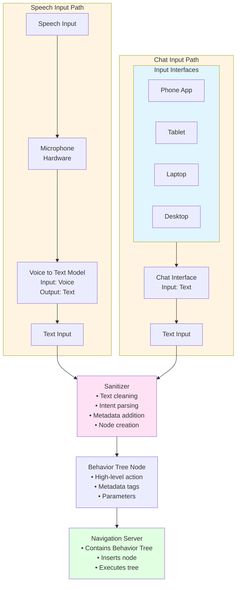

# Track: User Input to Action

This track processes natural language input from various user interfaces and converts it into behavior tree nodes that can be executed by the Navigation Server.

## Overview

The User Input to Action track handles two types of input:
1. **Speech Input**: Voice commands from microphone
2. **Chat Input**: Text commands from mobile/desktop applications

Both inputs are sanitized, parsed, and converted into behavior tree nodes that are inserted into the Navigation Server's behavior tree.

## Processing Flow



## Component Details

### Input Interfaces

#### Phone App

**Interface Type**: Mobile application
**Input Method**: Touch screen, voice input
**Communication**: Network (WiFi/Bluetooth) to robot

#### Tablet

**Interface Type**: Tablet application
**Input Method**: Touch screen, voice input, keyboard
**Communication**: Network (WiFi/Bluetooth) to robot

#### Laptop / Desktop

**Interface Type**: Web application or desktop client
**Input Method**: Keyboard, voice input
**Communication**: Network (WiFi/Ethernet) to robot

---

### Speech Input Processing

#### Microphone

**Hardware**: Audio input device
**ROS 2 Topic**: `/audio/microphone` (audio_msgs/AudioData)

**Purpose**: Captures voice input from user

#### Voice to Text Model

**Input**: Audio stream from microphone
**Output**: Text transcription

**Implementation**: 
- Speech recognition model (e.g., Whisper, Speech-to-Text API)
- Processes audio in real-time or batched
- Handles multiple languages and accents

**ROS 2 Topic**: 
- Input: `/audio/microphone` (audio_msgs/AudioData)
- Output: `/audio/transcription` (std_msgs/String)

**Example**:
- Audio Input: User speaks "Lift the sheathing to the red flag"
- Text Output: "Lift the sheathing to the red flag"

---

### Chat Input Processing

#### Chat Interface

**Input**: Text message from user interface
**Communication**: Network protocol (HTTP REST API, ROS 2 service, WebSocket)

**ROS 2 Service**: `/tsbt_vla/chat_input` (std_msgs/String)

**Example Input**: 
```
"Navigate to position A while avoiding obstacles"
```

---

### Text Sanitizer

The Sanitizer processes text input from both speech and chat sources and creates behavior tree nodes.

**Input**: Text string (from Voice-to-Text or Chat)

**Output**: Behavior Tree Node

**Processing Steps**:

1. **Text Cleaning**:
   - Remove noise, filler words
   - Normalize capitalization
   - Correct common speech-to-text errors
   - Standardize terminology

2. **Intent Parsing**:
   - Identify action type (navigate, lift, grasp, etc.)
   - Extract object references
   - Detect location references
   - Parse parameters

3. **Metadata Addition**:
   - Add source type (speech/chat)
   - Add timestamp
   - Add user identification
   - Add priority level
   - Add safety constraints

4. **Programmatic Pre-parsing**:
   - Extract explicit parameters
   - Resolve object IDs
   - Validate command syntax
   - Add contextual hints

**Example Input**:
```
"Lift the sheathing to the red flag"
```

**Sanitized Output (Behavior Tree Node)**:
```xml
<BehaviorTreeNode>
  <Type>HighLevelAction</Type>
  <Action>LiftSheathingToRedFlag</Action>
  <Source>speech</Source>
  <Timestamp>2025-01-15T10:23:45.123Z</Timestamp>
  <User>user_001</User>
  <Priority>normal</Priority>
  <Metadata>
    <ObjectReferences>
      <Sheathing>detect_by_class</Sheathing>
      <RedFlag>detect_by_class_and_color</RedFlag>
    </ObjectReferences>
    <SafetyConstraints>
      <MaxHeight>5.0m</MaxHeight>
      <WeightLimit>2.0ton</WeightLimit>
    </SafetyConstraints>
  </Metadata>
</BehaviorTreeNode>
```

**Alternative Format (Simplified)**:
```json
{
  "type": "high_level_action",
  "action": "LiftSheathingToRedFlag",
  "source": "speech",
  "timestamp": "2025-01-15T10:23:45.123Z",
  "user": "user_001",
  "priority": "normal",
  "metadata": {
    "object_references": {
      "sheathing": "detect_by_class",
      "red_flag": "detect_by_class_and_color"
    },
    "safety_constraints": {
      "max_height": "5.0m",
      "weight_limit": "2.0ton"
    }
  }
}
```

---

### Navigation Server

The Navigation Server contains and manages the Behavior Tree.

**Responsibilities**:
1. **Behavior Tree Management**: Maintains the master behavior tree
2. **Node Insertion**: Inserts new behavior tree nodes from user input
3. **Execution**: Executes the behavior tree using BehaviorTree.CPP
4. **LLM Integration**: Sends high-level actions to LLM for subtree generation

**Behavior Tree Structure**:
```xml
<BehaviorTree ID="MainTree">
  <!-- User input nodes are inserted here -->
  <UserActionNode action="LiftSheathingToRedFlag" metadata="..."/>
  
  <!-- Generated subtrees appear here -->
  <Sequence name="LiftSheathingToRedFlag">
    <!-- LLM-generated subtree -->
  </Sequence>
  
  <!-- Other behavior tree nodes -->
</BehaviorTree>
```

**Integration with LLM**:
- High-level action nodes trigger LLM processing
- LLM generates behavior tree XML subtrees
- Subtrees are inserted into the master tree
- Recursive decomposition continues as needed

**See**: [Large Language Model Processing](llm-processing.md) for details on LLM integration.

---

## Behavior Tree Node Types

### High-Level Action Nodes

Most user input creates **high-level action nodes** that require LLM processing:

**Examples**:
- `LiftSheathingToRedFlag`
- `NavigateToPositionA`
- `WeldPipe11ToStructure`
- `MoveCraneBoom3MetersForward`

**Characteristics**:
- Abstract, goal-oriented
- Require decomposition into low-level actions
- Trigger LLM subtree generation
- May generate additional high-level actions recursively

### Low-Level Action Nodes

Some sanitized input may directly create low-level nodes (less common):

**Examples**:
- `Outrigger_Rotate rotation="90"`
- `Boom_Extend Extention="5"`

**Characteristics**:
- Direct hardware control
- Executed immediately
- No LLM processing required

---

## ROS 2 Integration

### Topics

**Audio Input**:
- `/audio/microphone` (audio_msgs/AudioData) - Raw audio
- `/audio/transcription` (std_msgs/String) - Transcribed text

**Chat Input**:
- `/tsbt_vla/chat_input` (std_msgs/String) - Text commands

**Behavior Tree Nodes**:
- `/navigation_server/behavior_tree/nodes` (custom message) - Node insertions

### Services

**Chat Input Service**:
```bash
ros2 service call /tsbt_vla/chat_input \
    std_msgs/String \
    "{data: 'Lift the sheathing to the red flag'}"
```

**Get Current Behavior Tree**:
```bash
ros2 service call /navigation_server/get_behavior_tree \
    nav2_msgs/GetBehaviorTree \
    "{request: true}"
```

---

## Configuration

```yaml
tsbt_vla:
  user_input:
    speech:
      enabled: true
      voice_to_text_model: "whisper"
      language: "en-US"
      microphone_topic: "/audio/microphone"
      
    chat:
      enabled: true
      interfaces:
        - "phone_app"
        - "tablet"
        - "laptop"
        - "desktop"
        
    sanitizer:
      enable_preprocessing: true
      add_metadata: true
      validate_syntax: true
      object_resolution: true
      
    behavior_tree:
      default_priority: "normal"
      insert_mode: "append"  # or "replace", "insert_at"
      enable_llm_processing: true
```

---

## Example Flow

### Complete Example: Speech Input

1. **User speaks**: "Lift the sheathing to the red flag"
2. **Microphone captures**: Audio stream
3. **Voice-to-Text processes**: Audio → "Lift the sheathing to the red flag"
4. **Sanitizer processes**:
   - Cleans text
   - Parses intent → `LiftSheathingToRedFlag`
   - Adds metadata
   - Creates behavior tree node
5. **Navigation Server receives**: Behavior tree node
6. **Navigation Server inserts**: Node into behavior tree
7. **LLM processes**: High-level action → Generates subtree
8. **Behavior Tree executes**: Subtree is ticked and executed

### Complete Example: Chat Input

1. **User types**: "Navigate to position A while avoiding obstacles"
2. **Chat interface sends**: Text via ROS 2 service
3. **Sanitizer processes**: (same as speech path)
4. **Navigation Server**: Inserts node and processes

---

## Next Steps

- [3D World to Text Track](3d-world-to-text.md) - Scene understanding
- [Sensor to Text Track](sensor-to-text.md) - Sensor data conversion
- [Large Language Model Processing](llm-processing.md) - LLM subtree generation
- [Behavior Tree Node Reference](../../behavior-tree-node-reference.md) - Complete node reference

