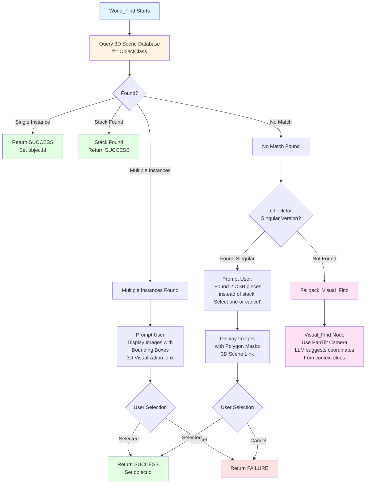

# World_Find Action Node

`World_Find` is a high-level behavior tree action node that searches the 3D world scene database for objects by their class. It provides fast scene lookups by querying previously detected and registered objects in the 3D scene graph.

## Overview

`World_Find` performs fast searches through the 3D world scene database to locate objects by their `objectClass`. Unlike `Visual_Find`, which actively searches using pan-tilt cameras, `World_Find` queries the existing 3D scene representation for objects that have already been detected and registered.

## Arguments

- `ObjectClass` (Text) - The class of object to search for
  - Example: `OSB`, `Stack_OSB`, `Truck`, `Building`
- `objectId` (Output) - The identifier of the found object instance (output to blackboard)
  - Example: `{foundObjectId}`

## XML Example

```xml
<World_Find ObjectClass="Stack_OSB" objectId="{osbStackId}"/>
```

## Behavior Tree Logic

The `World_Find` node uses BehaviorTree.CPP v4.6+ fallback mechanisms to handle various scenarios:



## Implementation Details

### 3D Scene Database

The 3D world scene is maintained as a database that maps object instances to their metadata. This can be implemented using:

- **OGRE3D**: Scene graph with custom metadata attached to scene nodes
- **MoveIt 2**: Collision object database with semantic labels
- **Custom Scene Graph**: A map/dictionary structure holding object instances

Each object in the scene contains:
- **Object Class**: The semantic class (e.g., `OSB`, `Stack_OSB`, `Truck`)
- **Instance ID**: Unique identifier for this object instance
- **Position**: 3D coordinates and orientation
- **Bounding Box**: 2D polygon or pixel mask for visualization
- **Metadata**: Additional properties (size, color, etc.)

### Scene Database Query

```cpp
// Pseudocode for scene database query
std::vector<ObjectInstance> results = sceneDatabase.queryByClass(objectClass);
if (results.empty()) {
    // Try fallback: singular version for stack classes
    if (objectClass.starts_with("Stack_")) {
        std::string singularClass = objectClass.substr(6); // Remove "Stack_" prefix
        results = sceneDatabase.queryByClass(singularClass);
        if (results.size() >= 2) {
            // Prompt user about multiple singular instances
            return promptUserForSelection(results);
        }
    }
    return BT::NodeStatus::FAILURE; // Trigger fallback to Visual_Find
}
```

### Handling Multiple Instances

When multiple instances of the same class are found, `World_Find` prompts the user (human or AI manager/supervisor) via the chat channel:

**Example Prompt:**
> "I found multiple instances of `ObjectClass`. Please select which one to use, or cancel the operation."

The prompt includes:
- **2D Images**: Showing each detected object with polygon bounding boxes or pixel masks
- **3D Visualization Link**: Direct link to view the objects in the 3D scene
- **Interactive Selection**: User can click on the desired object or cancel

### Handling Stack vs. Singular Mismatch

When searching for a stack class (e.g., `Stack_OSB`) but only finding singular instances (e.g., two separate `OSB` pieces):

**Example Prompt:**
> "I could not find the stack of OSB; however, I found two pieces of OSB that I have highlighted on the visual. Please click on the OSB piece you would like me to find or cancel the Find"

The system displays:
- **Highlighted Images**: Each OSB piece with polygon bounding boxes or pixel masks
- **3D Scene Link**: Link to inspect objects in 3D space
- **Selection Interface**: Click to select or cancel

### Fallback to Visual_Find

If `World_Find` fails to find the object in the scene database, it fails and triggers a fallback node (using BehaviorTree.CPP v4.6+ fallback mechanism):

```xml
<Fallback>
    <World_Find ObjectClass="Stack_OSB" objectId="{osbId}"/>
    
    <!-- Fallback: Use Visual_Find with pan-tilt camera -->
    <Visual_Find ObjectClass="Stack_OSB" objectId="{osbId}"/>
</Fallback>
```

`Visual_Find` then:
- Uses the LLM to suggest pan-tilt camera coordinates based on context
- May use context from previous nodes (e.g., `<Find_Context location="on top of the truck">`)
- Actively searches the environment using computer vision

## Context Integration

`World_Find` can use context from previous behavior tree nodes to refine searches:

### Example: Context from User Input

If the user input was: *"Grab the stack of OSB off the truck and put it next to the building"*

The LLM may generate context nodes:

```xml
<Sequence>
    <!-- Find context for pickup location -->
    <Find_Context location="on top of the truck">
        <Fallback>
            <World_Find ObjectClass="Truck" objectId="{truckId}"/>
            <User_Notify Message="Which truck or where is the truck?"/>
        </Fallback>
    </Find_Context>
    
    <!-- Find the OSB stack -->
    <World_Find ObjectClass="Stack_OSB" objectId="{osbId}"/>
    
    <!-- Find context for placement location -->
    <Find_Context location="next to the building">
        <Fallback>
            <World_Find ObjectClass="Building" objectId="{buildingId}"/>
            <!-- LLM may decide it knows a likely building and location -->
        </Fallback>
    </Find_Context>
    
    <!-- Continue with Object_Pick, Travel, etc. -->
</Sequence>
```

The LLM may parse context further:
- `<Find_Context location="on top of the truck">` may trigger `World_Find` for `ObjectClass="Truck"` first
- If multiple trucks found, prompt user
- If no truck found, ask user: "Which truck or where is the truck?"

## C++ Implementation Example (BehaviorTree.CPP v4.6+)

```cpp
#include <behaviortree_cpp/bt_factory.h>
#include <behaviortree_cpp/behavior_tree.h>
#include <rclcpp/rclcpp.hpp>

class WorldFindNode : public BT::StatefulActionNode
{
public:
    WorldFindNode(const std::string& name, const BT::NodeConfig& config)
        : BT::StatefulActionNode(name, config)
    {
        node_ = rclcpp::Node::make_shared("world_find_node");
        scene_db_client_ = node_->create_client<robot_interfaces::srv::QueryScene>(
            "/scene_database/query");
        user_prompt_pub_ = node_->create_publisher<robot_interfaces::msg::UserPrompt>(
            "/user/chat_prompt", 10);
    }

    static BT::PortsList providedPorts()
    {
        return {
            BT::InputPort<std::string>("ObjectClass"),
            BT::OutputPort<std::string>("objectId")
        };
    }

    BT::NodeStatus onStart() override
    {
        std::string object_class;
        if (!getInput("ObjectClass", object_class))
        {
            RCLCPP_ERROR(node_->get_logger(), "Missing input: ObjectClass");
            return BT::NodeStatus::FAILURE;
        }

        object_class_ = object_class;
        found_instances_.clear();

        // Query scene database
        auto req = std::make_shared<robot_interfaces::srv::QueryScene::Request>();
        req->object_class = object_class;
        req->query_type = robot_interfaces::srv::QueryScene::Request::BY_CLASS;

        auto result = scene_db_client_->async_send_request(req);
        if (rclcpp::spin_until_future_complete(node_, result, std::chrono::seconds(2)) !=
            rclcpp::FutureReturnCode::SUCCESS)
        {
            RCLCPP_WARN(node_->get_logger(), "Scene database query failed");
            return BT::NodeStatus::FAILURE;
        }

        found_instances_ = result.get()->instances;

        if (found_instances_.empty())
        {
            // Try fallback: singular version for stack classes
            if (object_class_.find("Stack_") == 0)
            {
                std::string singular = object_class_.substr(6);
                auto req2 = std::make_shared<robot_interfaces::srv::QueryScene::Request>();
                req2->object_class = singular;
                req2->query_type = robot_interfaces::srv::QueryScene::Request::BY_CLASS;
                
                auto result2 = scene_db_client_->async_send_request(req2);
                if (rclcpp::spin_until_future_complete(node_, result2) ==
                    rclcpp::FutureReturnCode::SUCCESS)
                {
                    auto singular_instances = result2.get()->instances;
                    if (singular_instances.size() >= 2)
                    {
                        // Prompt user about multiple singular instances
                        promptUserForSingularInstances(singular_instances);
                        return BT::NodeStatus::RUNNING;
                    }
                }
            }
            
            RCLCPP_INFO(node_->get_logger(), 
                "No instances of %s found in scene", object_class_.c_str());
            return BT::NodeStatus::FAILURE;
        }

        if (found_instances_.size() == 1)
        {
            setOutput("objectId", found_instances_[0].id);
            RCLCPP_INFO(node_->get_logger(), 
                "Found single instance: %s", found_instances_[0].id.c_str());
            return BT::NodeStatus::SUCCESS;
        }

        // Multiple instances: prompt user
        promptUserForSelection(found_instances_);
        return BT::NodeStatus::RUNNING;
    }

    BT::NodeStatus onRunning() override
    {
        // Check if user has made a selection
        if (selected_object_id_.empty())
        {
            return BT::NodeStatus::RUNNING;
        }

        setOutput("objectId", selected_object_id_);
        return BT::NodeStatus::SUCCESS;
    }

private:
    void promptUserForSelection(const std::vector<ObjectInstance>& instances)
    {
        auto prompt = robot_interfaces::msg::UserPrompt();
        prompt.message = "I found multiple instances of " + object_class_ + 
                        ". Please select which one to use, or cancel the operation.";
        
        for (const auto& inst : instances)
        {
            prompt.images.push_back(inst.bounding_box_image);
            prompt.links.push_back("/3d_scene?object=" + inst.id);
        }
        
        user_prompt_pub_->publish(prompt);
    }

    void promptUserForSingularInstances(const std::vector<ObjectInstance>& instances)
    {
        auto prompt = robot_interfaces::msg::UserPrompt();
        prompt.message = "I could not find the stack of " + object_class_.substr(6) +
                        "; however, I found " + std::to_string(instances.size()) +
                        " pieces that I have highlighted on the visual. "
                        "Please click on the piece you would like me to find or cancel the Find";
        
        for (const auto& inst : instances)
        {
            prompt.images.push_back(inst.bounding_box_image);
            prompt.links.push_back("/3d_scene?object=" + inst.id);
        }
        
        user_prompt_pub_->publish(prompt);
    }

    rclcpp::Node::SharedPtr node_;
    rclcpp::Client<robot_interfaces::srv::QueryScene>::SharedPtr scene_db_client_;
    rclcpp::Publisher<robot_interfaces::msg::UserPrompt>::SharedPtr user_prompt_pub_;
    std::string object_class_;
    std::vector<ObjectInstance> found_instances_;
    std::string selected_object_id_;
};

BT_REGISTER_NODES(factory)
{
    factory.registerNodeType<WorldFindNode>("World_Find");
}
```

## Usage Examples

### Example 1: Simple Object Search

```xml
<Sequence>
    <World_Find ObjectClass="OSB" objectId="{osbId}"/>
    <Object_Pick Object_Name="{osbId}" Articulation_Group=""/>
</Sequence>
```

### Example 2: With Fallback to Visual_Find

```xml
<Fallback>
    <World_Find ObjectClass="Stack_OSB" objectId="{stackId}"/>
    <Visual_Find ObjectClass="Stack_OSB" objectId="{stackId}"/>
</Fallback>
```

### Example 3: Context-Aware Search

```xml
<Sequence>
    <Find_Context location="on top of the truck">
        <World_Find ObjectClass="Truck" objectId="{truckId}"/>
    </Find_Context>
    
    <World_Find ObjectClass="Stack_OSB" objectId="{osbId}"/>
    
    <Object_Pick Object_Name="{osbId}" Articulation_Group=""/>
</Sequence>
```

## Integration with 3D Scene Systems

### OGRE3D Integration

Objects can be stored in OGRE3D scene nodes with attached metadata:

```cpp
Ogre::SceneNode* objectNode = sceneManager->createSceneNode();
objectNode->setUserAny(Ogre::Any(ObjectMetadata{
    .class_name = "OSB",
    .instance_id = "osb_001",
    .position = {1.0, 2.0, 0.5}
}));
```

### MoveIt 2 Integration

Collision objects can be registered with semantic labels:

```cpp
moveit_msgs::msg::CollisionObject obj;
obj.id = "osb_001";
obj.type.key = "OSB";
// ... set geometry and pose
```

## Next Steps

- [Object_Pick](object_pick.md) - Complete pick operation using found object
- [Visual_Find](../api-reference/behavior-tree-high-level-nodes.md#visual_find) - Active camera-based search
- [Behavior Tree Node Reference](node-reference.md) - Complete node documentation
- [TSBT-VLA System Overview](../architecture/tsbt-vla-system/overview.md) - How nodes are generated

