import DownloadButtons from '@site/src/components/DownloadButtons';

# CAD-to-Behavior Engine Implementation Details

<DownloadButtons 
  title="CAD-to-Behavior Engine Implementation Details"
  filename="cad-to-behavior-engine-implementation-details"
/>

This document provides detailed technical implementation information for the CAD-to-Behavior Engine system.

## System Architecture

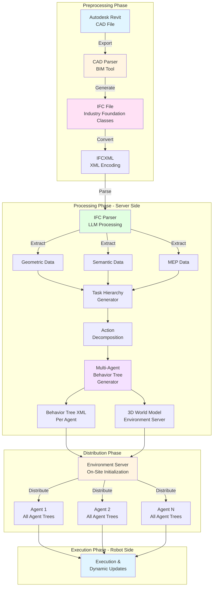

## CAD Integration and Preprocessing

### CAD Parser BIM Tool

The preprocessing phase begins with a **CAD Parser BIM Tool** that operates on design files from Autodesk Revit or other CAD/BIM sources.

**Process Flow**:

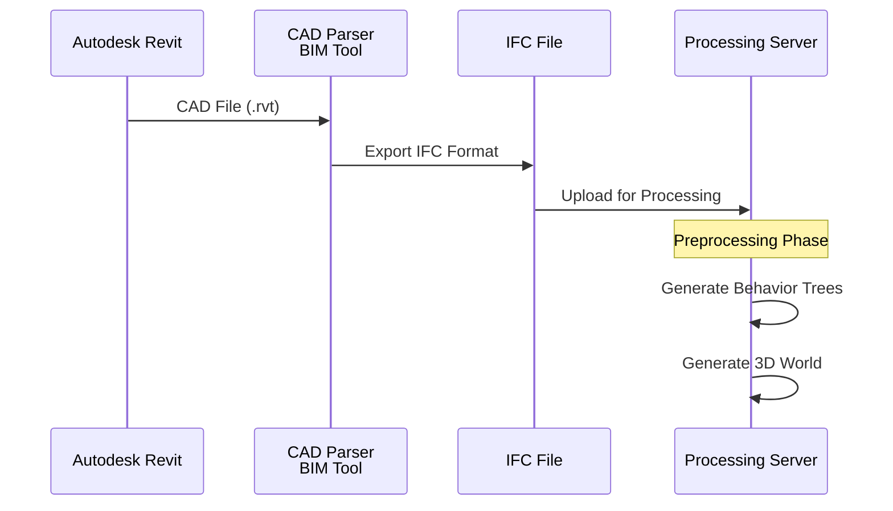

**Key Functions**:
1. **File Import**: Receives CAD files from Autodesk Revit or other sources
2. **IFC Export**: Converts CAD data to Industry Foundation Classes (IFC) format
3. **Data Validation**: Ensures IFC file contains necessary geometric and semantic data
4. **Preprocessing**: Prepares IFC file for server-side processing

### IFC File Format

**Industry Foundation Classes (IFC)** is an open, international standard for Building Information Modeling (BIM) data.

**File Extensions**:
- `.ifc` - Binary or text-based IFC format
- `.ifcxml` - XML encoding of IFC data

**IFC Structure**:
```
IFC File
├── Geometric Data (walls, floors, roofs, etc.)
├── Semantic Data (material properties, classifications)
├── Spatial Relationships (connections, hierarchies)
├── MEP Data (mechanical, electrical, plumbing)
└── Metadata (project info, version, author)
```

## IFC Processing

### IFCXML Processing

IFC data can be expressed as XML, making it easier to process with standard tools and LLMs.

**IFCXML Example**:
```xml
<ifc:IfcWall id="i123">
    <ifc:Name>Wall-001</ifc:Name>
    <ifc:GlobalId>3qKx$v$9H0zP3$v$9H0z</ifc:GlobalId>
    <ifc:OwnerHistory>
        <!-- Owner information -->
    </ifc:OwnerHistory>
    <ifc:ObjectPlacement>
        <!-- Spatial placement -->
    </ifc:ObjectPlacement>
    <ifc:Representation>
        <!-- Geometric representation -->
    </ifc:Representation>
</ifc:IfcWall>
```

**Advantages of IFCXML**:
- ✅ Easy to handle with standard XML tools
- ✅ Hierarchical and explicit structure
- ✅ LLM-friendly format for semantic processing
- ✅ Web-based tool compatibility

**Disadvantages**:
- ❌ Much larger file size than binary IFC
- ❌ Slower to load for large models

### LLM-Based Processing

A **Large Language Model (LLM)** is used to read through the IFC file and extract semantic meaning.

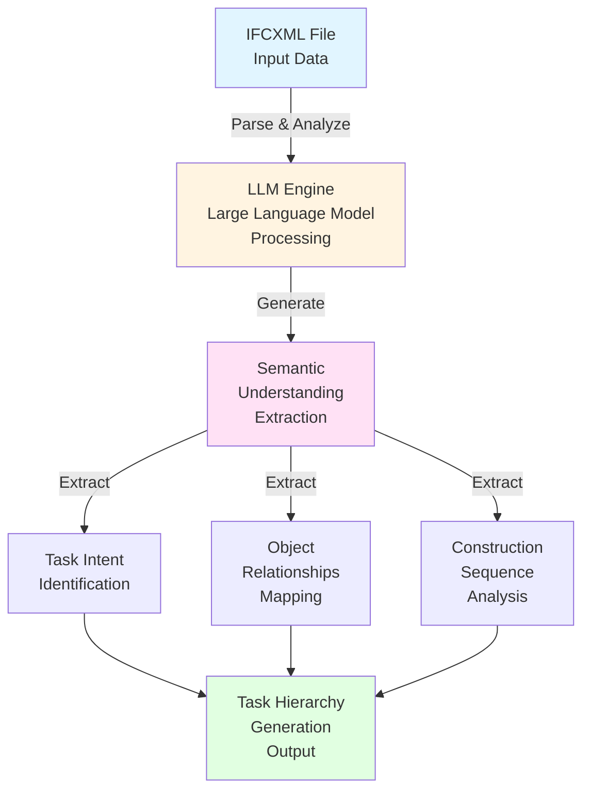

**LLM Processing Steps**:
1. **Parse IFCXML**: Read and understand the XML structure
2. **Extract Semantics**: Identify construction intent and relationships
3. **Generate Task Hierarchy**: Create high-level task breakdown
4. **Identify Dependencies**: Understand task sequencing requirements
5. **Extract Constraints**: Identify spatial and temporal constraints

### Procedural Processing Methods

The system uses a combination of **procedural methods** to process different sections of the IFC file:

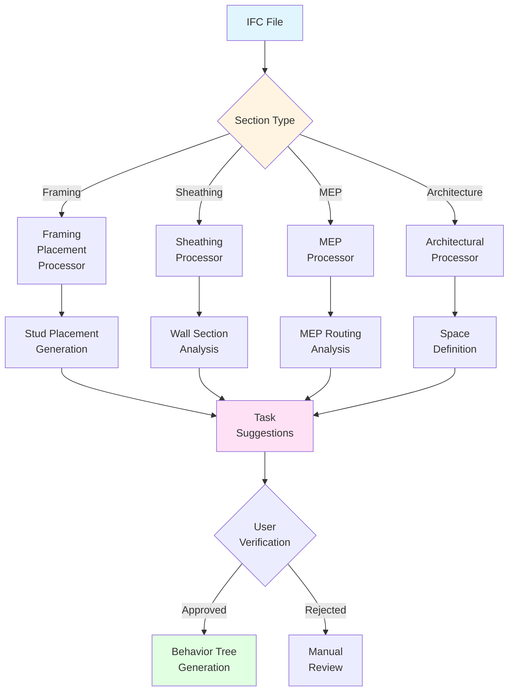

**Procedural Processing Examples**:

1. **Framing Placement**: Focus on wall framing and stud placement
   - Analyzes wall dimensions
   - Generates stud spacing suggestions
   - Creates framing sequence

2. **Sheathing Processing**: Focus on wall sheathing for specific sections
   - Identifies sheathing requirements
   - Determines installation sequence
   - Generates material requirements

3. **MEP Processing**: Focus on mechanical, electrical, and plumbing
   - Identifies MEP routing
   - Determines installation sequence
   - Generates coordination tasks

**User Verification and Warnings**:

When IFC data is incomplete or requires interpretation:
- ⚠️ **User Verification Required**: System prompts user to verify suggestions
- ⚠️ **Engineering Review Warning**: System warns that licensed engineers (mechanical, structural) must review suggestions
- 📋 **Audit Log**: All decisions and suggestions are logged for review

## MEP Data Correlation

### Well-Defined IFC Requirements

For optimal operation, IFC files should be well-defined by different trades:

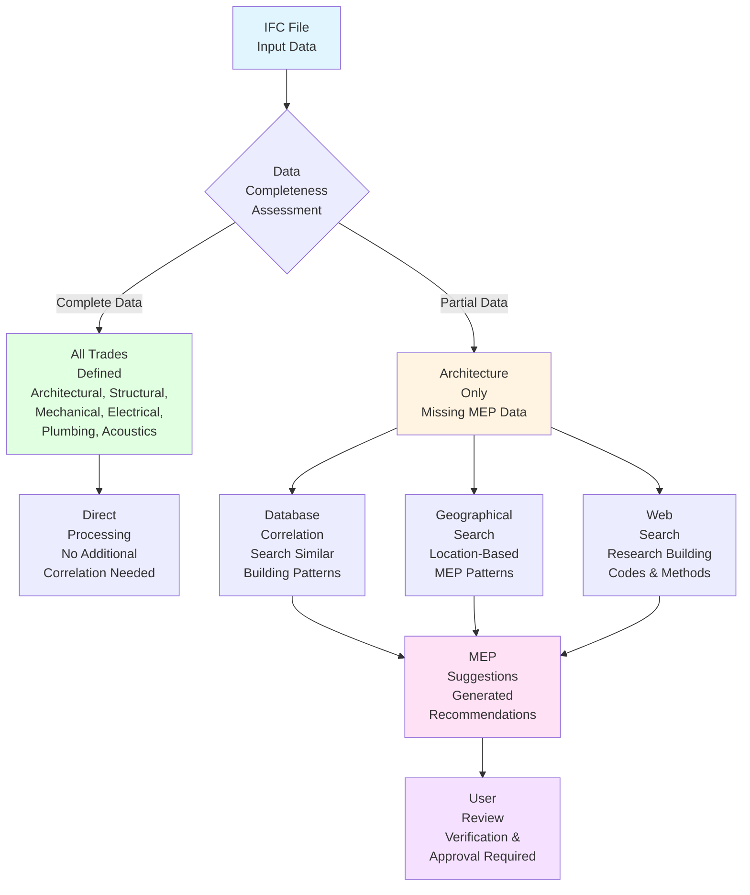

**Required Trades**:
- ✅ **Architectural**: Building layout, spaces, walls, floors
- ✅ **Structural**: Framing, load-bearing elements
- ✅ **Mechanical**: HVAC systems, ductwork
- ✅ **Electrical**: Wiring, panels, fixtures
- ✅ **Plumbing**: Pipes, fixtures, connections
- ✅ **Acoustics**: Sound requirements, materials

### Database Correlation

When only architecture is defined, the system uses:

1. **Database of Well-Defined IFC Files**: Contains examples with all MEPs defined
2. **Fine-Tuning**: Uses machine learning to find similar building patterns
3. **Procedural Search**: Searches for similar:
   - Wall sizes and configurations
   - Climate zones
   - Geographical locations
   - Building types

4. **Correlation Analysis**: Determines how MEPs correlate with architecture in similar buildings

### Web Search Integration

The LLM can also use the internet to:
- 🔍 Check typical building methods for specific areas
- 🔍 Research local building codes and requirements
- 🔍 Find similar building examples
- 🔍 Research material specifications

**Audit Logging**: All web searches and database queries are logged with:
- Search queries
- Results used
- Models loaded
- Decisions made

## Behavior Tree Generation

### Multi-Agent Behavior Tree Structure

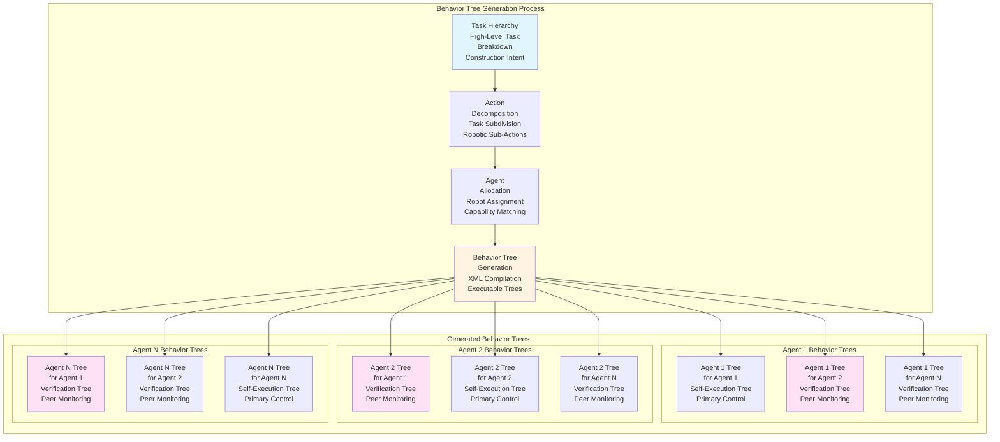

**Key Concept**: Each agent receives behavior trees for **all agents** in the fleet. This enables:
- **Identity Verification**: Agents can verify expected behaviors of peers
- **Coordination**: Agents understand what other agents are doing
- **Collision Prevention**: Agents can predict and avoid conflicts
- **Task Coordination**: Agents can coordinate complex multi-robot operations

### Behavior Tree XML Format

Generated behavior trees are in XML format compatible with BehaviorTree.CPP:

```xml
<root>
    <BehaviorTree>
        <Sequence name="ConstructionTask">
            <Action name="MoveToLocation" target="wall_001"/>
            <Action name="PlaceFraming" studs="16" spacing="16in"/>
            <Action name="InstallSheathing" material="plywood"/>
        </Sequence>
    </BehaviorTree>
</root>
```

## 3D World Generation

The Environment Server maintains a 3D world model containing:

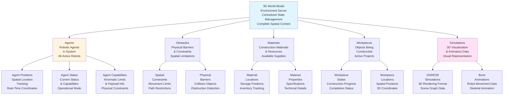

### Simulation Data Format

**OGRE3D Format**: Simulation data is stored in OGRE3D format for 3D visualization and physics simulation.

**Bone Animations**: Robot movements are represented as bone animations:
- **Storage**: Bone animations saved for replay in software like Blender
- **Conversion**: ROS 2 to bone animation converters (bidirectional)
- **Portability**: Bone animations with metadata are more portable and inspectable
- **Industry Tools**: Compatible with existing animation industry tools

**Animation Workflow**:
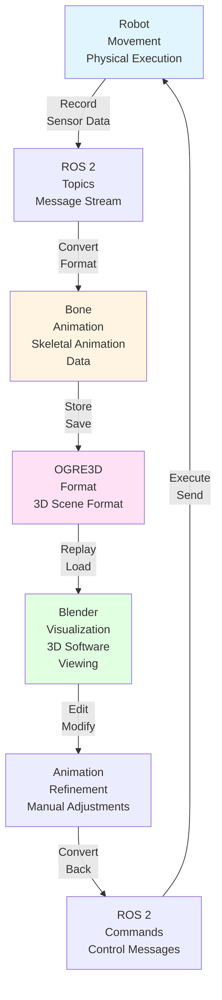

## Server-Side Processing

### Computational Requirements

The CAD-to-Behavior Engine runs on a **large server** (not on robots) due to:

1. **LLM Inference**: Large language model processing requires significant computational resources
2. **IFC Parsing**: Complex geometric and semantic data processing
3. **Multi-Agent Generation**: Generating behavior trees for multiple robots simultaneously
4. **Simulation**: Collision detection and path planning simulation
5. **Database Queries**: MEP correlation and pattern matching
6. **Web Search**: Internet-based research and validation

### Processing Pipeline

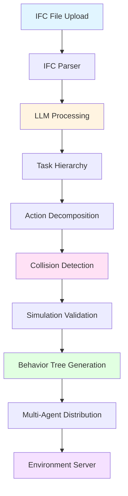

## On-Site Initialization

### Distribution Process

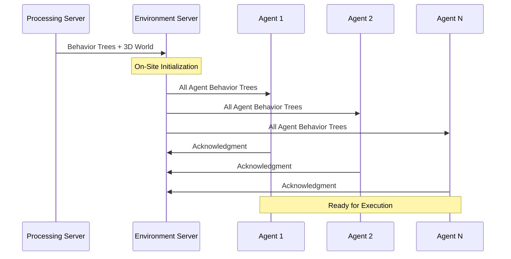

**Initialization Steps**:
1. **Upload**: Behavior trees and 3D world uploaded to Environment Server
2. **Distribution**: Each agent receives behavior trees for all agents
3. **Verification**: Agents verify they have correct behavior tree sets
4. **Synchronization**: All agents synchronized to same state
5. **Ready**: System ready for coordinated execution

## Dynamic Updates

### Update Mechanism

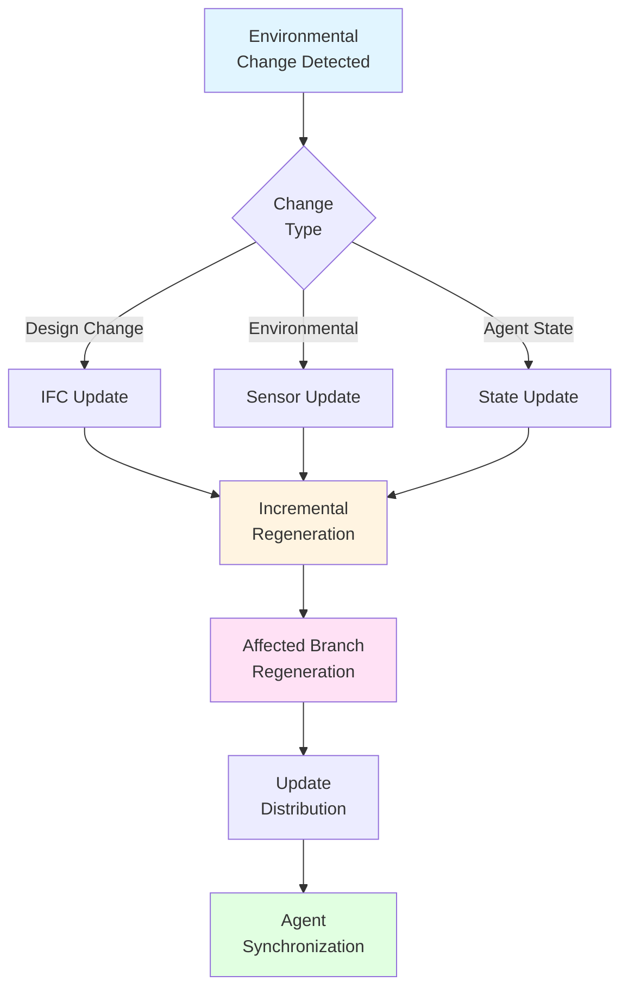

**Update Types**:
- **Design Changes**: IFC file modifications
- **Environmental Changes**: Obstacle detection, material changes
- **Agent State Changes**: Robot failures, task completion
- **Incremental Updates**: Only affected behavior tree branches regenerated

## Agent vs Robot Distinction

### Agent (Computational Brain)

- **Definition**: The computational brain that processes information, makes decisions, and executes behavior trees
- **Location**: Can run on server or on robot (in embodied AI, runs on robot)
- **Function**: Logic, intelligence, decision-making
- **CAD-to-Behavior Engine**: Runs on server, not on robot

### Robot (Physical Manifestation)

- **Definition**: The physical hardware - actuators, sensors, mechanical systems
- **Location**: Physical presence at construction site
- **Function**: Execution of physical tasks
- **Embodiment**: In embodied AI, agent lives within robot body

### Embodied AI Context

In embodied AI systems:
- Agent processes sensor data in real-time
- Agent controls actuators directly
- Agent lives within robot body
- CAD-to-Behavior Engine provides behavior trees to agent

## Version Control and Auditability

### Version-Controlled Repository

All behavior trees and environment data stored in version-controlled repositories:

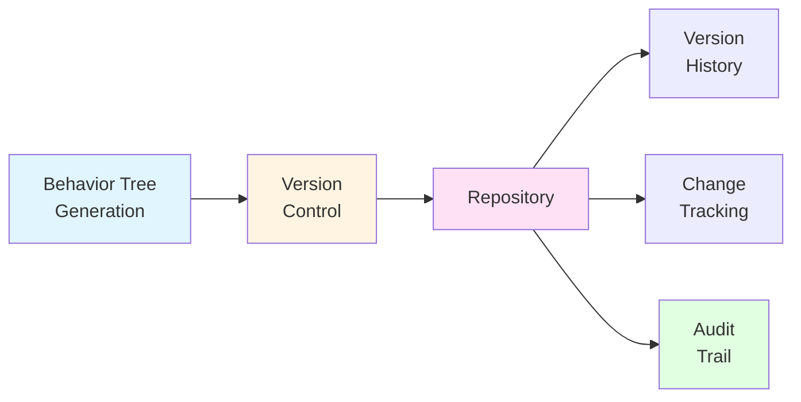

**Audit Information**:
- ✅ All LLM decisions logged
- ✅ Web searches and results tracked
- ✅ Database models used for correlation
- ✅ User verifications and approvals
- ✅ Engineering review warnings
- ✅ Complete version history
- ✅ Traceability from CAD to execution

## Next Steps

- [Overview](overview.md) - System overview and architecture
- [Patent Documentation](patent.md) - Complete patent specification

