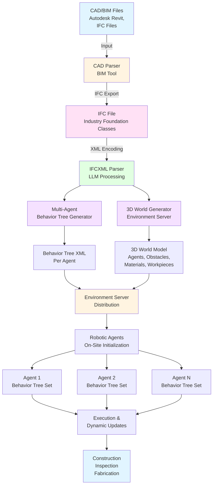
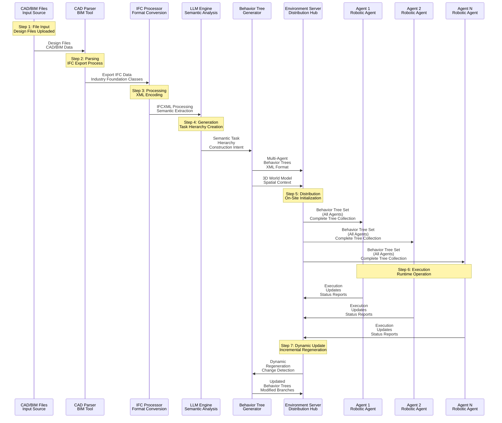

import DownloadButtons from '@site/src/components/DownloadButtons';

# CAD-to-Behavior Engine Overview

<DownloadButtons 
  title="CAD-to-Behavior Engine Overview"
  filename="cad-to-behavior-engine-overview"
/>

The **CAD-to-Behavior Engine** is a system that automatically generates executable robotic behavior trees from Computer-Aided Design (CAD) and Building Information Modeling (BIM) data. This enables autonomous robotic systems to interpret architectural, structural, and spatial design data to create machine-executable instructions that reflect construction intent.

## System Architecture

## Key Components

### 1. CAD/BIM Parser Module

**Purpose**: Receives and interprets digital design files containing spatial, geometric, and semantic information.

**Input Formats**:
- Autodesk Revit files (.rvt)
- Industry Foundation Classes (IFC) files (.ifc, .ifcxml)
- Other CAD/BIM formats

**Output**: Standardized IFC data structure

### 2. IFC Processing Engine

**Purpose**: Converts IFC data into machine-readable hierarchical representation.

**Features**:
- XML encoding support (IFCXML)
- LLM-based semantic interpretation
- Procedural methods for section-specific processing
- MEP (Mechanical, Electrical, Plumbing) correlation analysis

### 3. Behavior Tree Compiler

**Purpose**: Transforms hierarchical task representation into executable behavior trees.

**Output**: XML-based behavior tree definitions compatible with robotic navigation frameworks (e.g., BehaviorTree.CPP, ROS 2 Nav 2)

### 4. Environment Server

**Purpose**: Maintains and distributes spatial context data derived from CAD/BIM files.

**Contains**:
- Agent representations
- Obstacles and spatial constraints
- Materials and workpieces
- Simulation data (OGRE3D format)
- Bone animations for robot movements

### 5. Action Decomposition Engine

**Purpose**: Subdivides high-level design tasks into executable robotic sub-actions.

**Capabilities**:
- Task sequencing optimization
- Robot allocation based on capabilities
- Collision detection and prevention
- Multi-agent coordination

### 6. Synchronization Interface

**Purpose**: Deploys and updates executable behavior trees to autonomous robotic agents.

**Features**:
- Multi-agent behavior tree distribution
- Dynamic updates based on environmental changes
- Version control and auditability
- Distributed consensus protocols

## Data Flow

## Multi-Agent Coordination

```mermaid
flowchart TB
    subgraph Input["CAD Parser Output<br/>Generated Data<br/>Preprocessing Results"]
        direction TB
        A["IFC File<br/>Building Information<br/>Model Data<br/>Geometric & Semantic Data"]
        A --> B["Multi-Agent<br/>Behavior Tree<br/>Executable Instructions<br/>XML Format Trees"]
        B --> C["3D World Model<br/>Spatial Context<br/>Environment Data<br/>Complete Scene Graph"]
    end
    
    C --> D
    
    subgraph Server["Environment Server<br/>Centralized Coordination<br/>State Management Hub"]
        direction TB
        D["Shared State<br/>Common Knowledge<br/>Synchronized Data<br/>Global System State"]
        D --> E["Agent Registry<br/>Robot Database<br/>Capability Tracking<br/>Robot Inventory"]
        D --> F["Spatial Context<br/>3D World State<br/>Position Tracking<br/>Real-Time Coordinates"]
    end
    
    E --> G1
    
    subgraph Agent1["Agent 1<br/>Robotic Agent<br/>First Robot in Fleet"]
        direction TB
        G1["Behavior Tree<br/>for Agent 1<br/>Self-Execution<br/>Primary Control Tree"]
        G1 --> G2["Behavior Tree<br/>for Agent 2<br/>Verification<br/>Peer Monitoring Tree"]
        G2 --> G3["Behavior Tree<br/>for Agent N<br/>Verification<br/>Peer Monitoring Tree"]
    end
    
    G3 --> H1
    
    subgraph Agent2["Agent 2<br/>Robotic Agent<br/>Second Robot in Fleet"]
        direction TB
        H1["Behavior Tree<br/>for Agent 1<br/>Verification<br/>Peer Monitoring Tree"]
        H1 --> H2["Behavior Tree<br/>for Agent 2<br/>Self-Execution<br/>Primary Control Tree"]
        H2 --> H3["Behavior Tree<br/>for Agent N<br/>Verification<br/>Peer Monitoring Tree"]
    end
    
    H3 --> I1
    
    subgraph AgentN["Agent N<br/>Robotic Agent<br/>Nth Robot in Fleet"]
        direction TB
        I1["Behavior Tree<br/>for Agent 1<br/>Verification<br/>Peer Monitoring Tree"]
        I1 --> I2["Behavior Tree<br/>for Agent 2<br/>Verification<br/>Peer Monitoring Tree"]
        I2 --> I3["Behavior Tree<br/>for Agent N<br/>Self-Execution<br/>Primary Control Tree"]
    end
    
    style A fill:#e1f5ff
    style B fill:#fff4e1
    style C fill:#ffe1f5
    style D fill:#e1ffe1
    style E fill:#f5e1ff
```

**Key Concept**: Each agent maintains behavior trees for all other agents in the fleet. This enables:
- **Identity Verification**: Agents can verify expected behaviors of peers
- **Coordination**: Agents understand what other agents are doing
- **Collision Prevention**: Agents can predict and avoid conflicts
- **Task Coordination**: Agents can coordinate complex multi-robot operations

## Agent vs Robot

**Agent**: The computational brain that processes information, makes decisions, and executes behavior trees. The agent contains the logic and intelligence.

**Robot**: The physical manifestation of the agent - the hardware, actuators, sensors, and mechanical systems.

**Embodied AI Context**: In embodied AI systems, the agent lives within the robot body, processing sensor data and controlling actuators in real-time. However, the CAD-to-Behavior Engine itself runs on a large server (not on the robot) due to the computational requirements for processing CAD/BIM data and generating behavior trees.

## System Characteristics

### Computational Requirements

- **Server-Side Processing**: The CAD-to-Behavior Engine runs on a large server due to:
  - LLM inference requirements
  - Complex IFC parsing and processing
  - Multi-agent behavior tree generation
  - Simulation and collision detection
  - Database queries for MEP correlation

### Scalability

- **Multi-Agent Support**: Generates behavior trees for multiple robots simultaneously
- **Dynamic Updates**: Behavior trees can be updated in real-time based on environmental changes
- **Version Control**: All behavior trees and environment data stored in version-controlled repositories

### Auditability

- **Decision Logging**: All LLM decisions and web searches are logged
- **Model Tracking**: Database models used for MEP correlation are tracked
- **Version History**: Complete history of behavior tree changes
- **Traceability**: Full trace from CAD file to executed behavior

## Use Cases

1. **Construction**: Automated construction tasks based on building designs
2. **Inspection**: Robotic inspection of structures matching design specifications
3. **Fabrication**: Automated fabrication of building components
4. **Coordination**: Multi-robot coordination for complex construction projects

## Next Steps

- [Patent Documentation](patent.md) - Complete patent specification with claims
- [Implementation Details](implementation-details.md) - Detailed technical implementation
