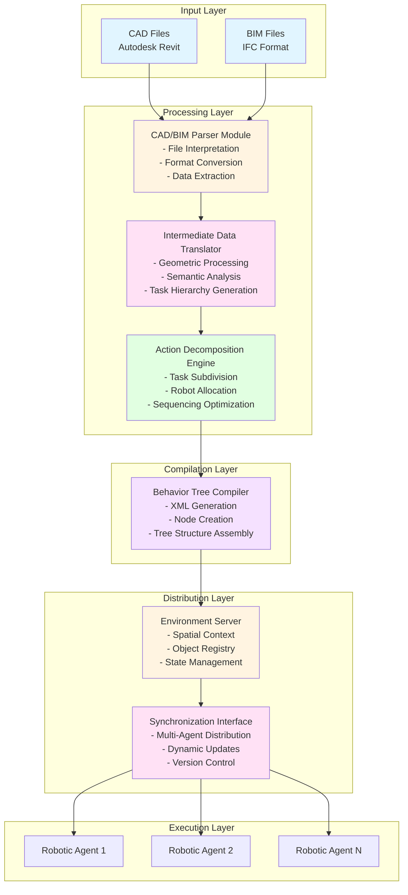
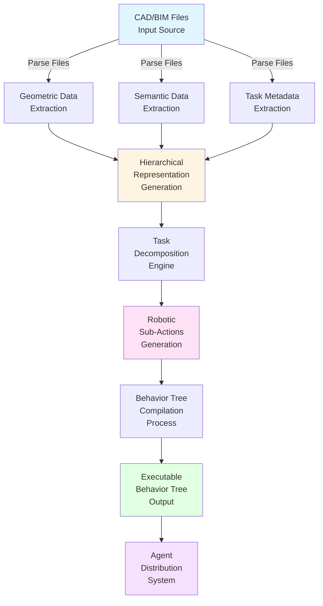
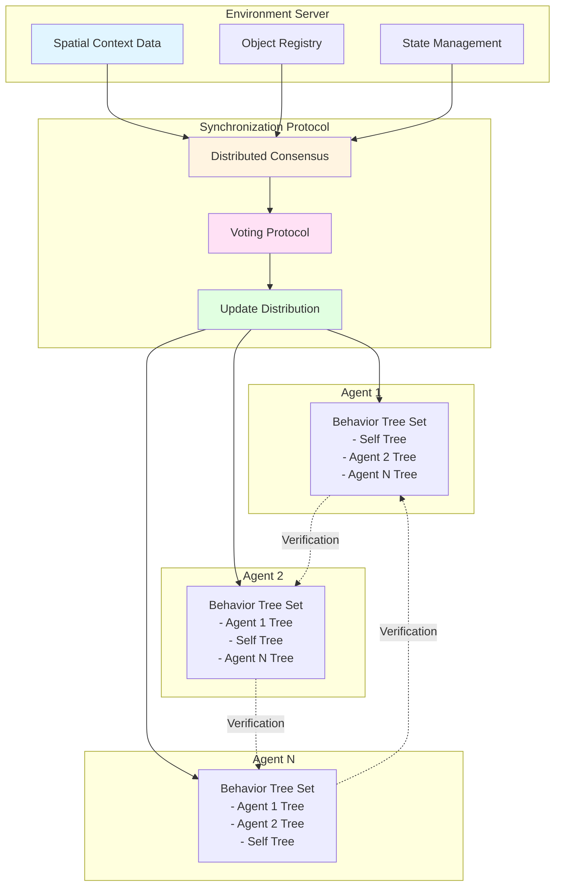

import DownloadButtons from '@site/src/components/DownloadButtons';

# CAD-to-Behavior Engine Patent

<DownloadButtons 
  title="CAD-to-Behavior Engine Patent"
  filename="cad-to-behavior-engine-patent"
/>

**Title**: System and Method for Automated Generation of Executable Robotic Behavior Trees from CAD and BIM Data

## Patent Abstract

A system and method are disclosed for automatically generating executable robotic behavior trees from Computer-Aided Design (CAD) and Building Information Modeling (BIM) data. The invention enables autonomous robotic systems to interpret architectural, structural, and spatial design data to create machine-executable instructions that reflect construction intent. The method includes parsing CAD/BIM files to extract geometric, semantic, and task-related information, translating these data into hierarchical task representations, and compiling the resulting models into behavior trees executable by a robotic control system. The system further includes an environment server for managing spatial and object information, a decomposition engine for converting high-level design tasks into robotic sub-actions, and a synchronization protocol to distribute executable trees among multiple agents. This enables cooperative robotic construction, inspection, or fabrication operations that dynamically adapt to environmental and design changes. The disclosed framework provides a modular, auditable, and scalable approach to connecting digital building models with real-world robotic execution.

## System Architecture Diagram

## Data Processing Flow

## Multi-Agent Coordination System

**Labeled Elements**:
- **Spatial Context Data**: 3D world model with agents, obstacles, materials, and workpieces
- **Object Registry**: Database of all objects and their properties in the environment
- **State Management**: Tracks current state of all agents and environment
- **Distributed Consensus**: Protocol for coordinating updates across agents
- **Voting Protocol**: Mechanism for agents to agree on behavior tree changes
- **Update Distribution**: System for pushing updated behavior trees to agents
- **Behavior Tree Set**: Each agent maintains trees for all agents for verification and coordination

## Patent Claims

### Independent Claim 1 (System Claim)

A system for generating executable robotic behavior trees from CAD and BIM data, comprising:

1. **a CAD/BIM parser module** configured to receive and interpret digital design files containing spatial, geometric, and semantic information;

2. **an intermediate data translator** configured to convert the interpreted design information into a machine-readable hierarchical representation of construction or task operations;

3. **a behavior tree compiler** configured to transform the hierarchical representation into an executable behavior tree comprising a plurality of interconnected action nodes;

4. **an environment server** configured to maintain and distribute spatial context data derived from the CAD/BIM files;

5. **an action decomposition engine** configured to subdivide high-level design tasks into executable robotic sub-actions; and

6. **a synchronization interface** configured to deploy and update the executable behavior tree to one or more autonomous robotic agents operating within the modeled environment.

### Independent Claim 2 (Method Claim)

A method for automatically generating executable robotic behavior trees from CAD and BIM data, the method comprising:

1. receiving one or more CAD or BIM files defining a physical environment and associated tasks;

2. extracting from the files at least one of: geometric structures, semantic attributes, and object metadata;

3. generating a task hierarchy based on the extracted information;

4. decomposing the task hierarchy into modular robotic sub-actions;

5. compiling the decomposed tasks into an executable behavior tree structure;

6. transmitting the executable behavior tree to a robotic operating system for task execution; and

7. dynamically updating the behavior tree in response to environmental or design changes detected during operation.

### Dependent Claims

**Claim 3**: The system of claim 1, wherein the CAD/BIM parser exports data in an Industry Foundation Classes (IFC) format.

**Claim 4**: The system of claim 1, wherein the behavior tree compiler outputs XML-based behavior tree definitions compatible with a robotic navigation framework.

**Claim 5**: The system of claim 1, wherein the action decomposition engine employs a machine learning model to optimize task sequencing or robot allocation.

**Claim 6**: The system of claim 1, wherein the synchronization interface coordinates multiple agents via a distributed consensus or voting protocol.

**Claim 7**: The method of claim 2, further comprising simulating task execution in a virtual environment to validate the behavior tree prior to deployment.

**Claim 8**: The method of claim 2, wherein environmental updates trigger incremental regeneration of affected branches in the behavior tree.

**Claim 9**: The system of claim 1, wherein the behavior tree and environment data are stored in a version-controlled repository for auditability and traceability.

**Claim 10**: The method of claim 2, wherein robot-specific parameters, including kinematic and payload capabilities, are incorporated during task decomposition.

**Claim 11**: The system of claim 1, wherein each robotic agent maintains behavior trees for all other agents in a multi-agent system for identity verification and coordination.

**Claim 12**: The system of claim 1, wherein the intermediate data translator processes IFCXML data using a large language model for semantic interpretation.

**Claim 13**: The system of claim 1, wherein the environment server maintains simulation data in OGRE3D format with bone animations for robot movements.

**Claim 14**: The method of claim 2, wherein the CAD/BIM parser makes suggestions for missing MEP (Mechanical, Electrical, Plumbing) data based on database correlation and geographical similarities.

**Claim 15**: A non-transitory computer-readable medium storing instructions which, when executed by a processor, perform the steps of claim 2.

## Protection Scope Summary

This claim structure ensures broad coverage of:

- ✅ **Both system and method embodiments** - Protects both the apparatus and the process
- ✅ **Integration of CAD/BIM preprocessing with behavior tree generation** - Covers the complete pipeline
- ✅ **Dynamic updates, multi-agent coordination, and modular architecture** - Protects real-time and distributed aspects
- ✅ **Implementation flexibility** - Covers ROS2-based, AI-driven, and simulation-validated workflows
- ✅ **IFC and IFCXML processing** - Protects specific BIM format handling
- ✅ **Multi-agent behavior tree distribution** - Protects the unique coordination mechanism
- ✅ **LLM-based semantic interpretation** - Protects AI-driven processing
- ✅ **Version control and auditability** - Protects compliance and traceability features

## Technical Specifications

### Supported File Formats

- **CAD Formats**: Autodesk Revit (.rvt), AutoCAD (.dwg), and other industry-standard formats
- **BIM Formats**: Industry Foundation Classes (IFC) - IFC2x3, IFC4, IFCXML
- **Output Formats**: XML-based behavior tree definitions, OGRE3D simulation data, bone animation formats

### Integration Standards

- **IFC Standards**: buildingSMART IFC schema compliance
- **Behavior Tree Standards**: Compatible with BehaviorTree.CPP, ROS 2 Nav 2
- **Animation Standards**: Bone animation formats compatible with Blender and industry tools

## Next Steps

- [Overview](overview.md) - System overview and architecture
- [Implementation Details](implementation-details.md) - Technical implementation guide

