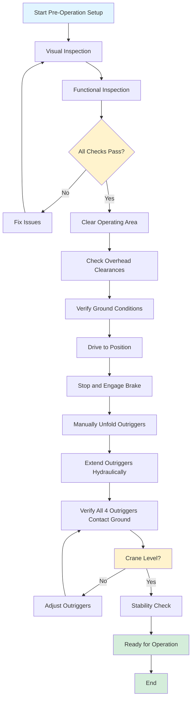
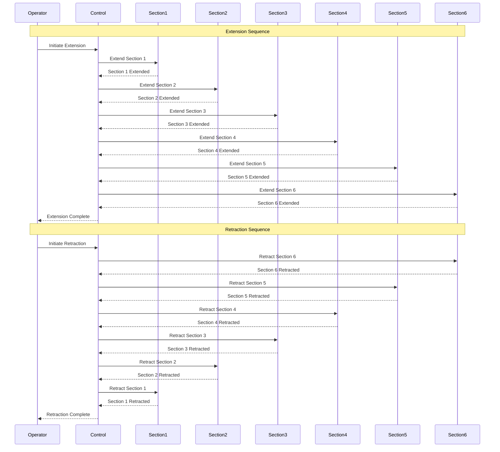
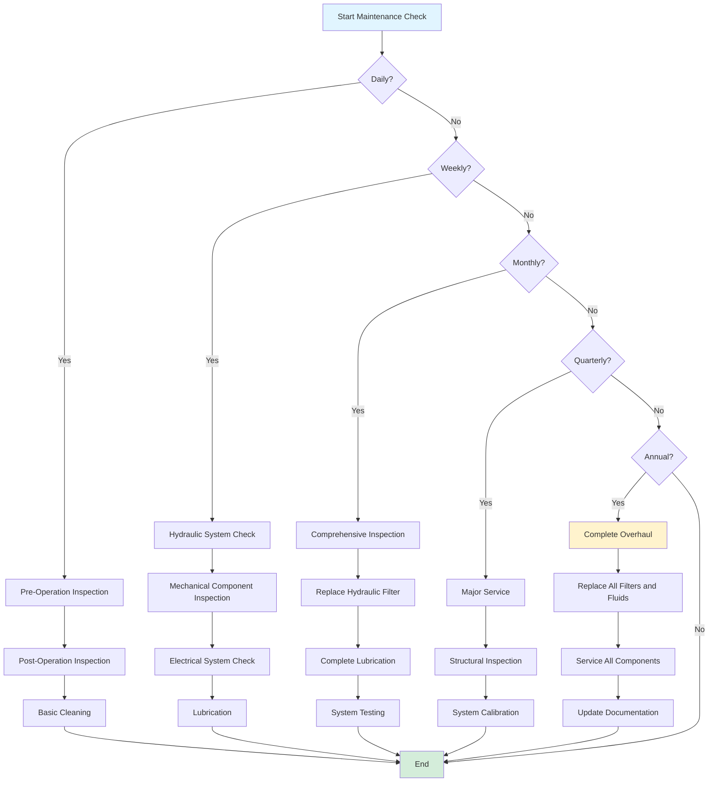
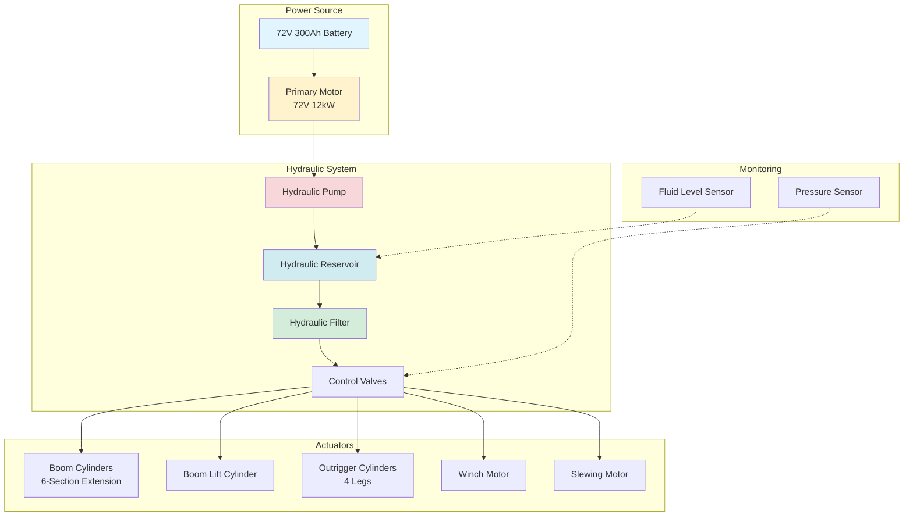
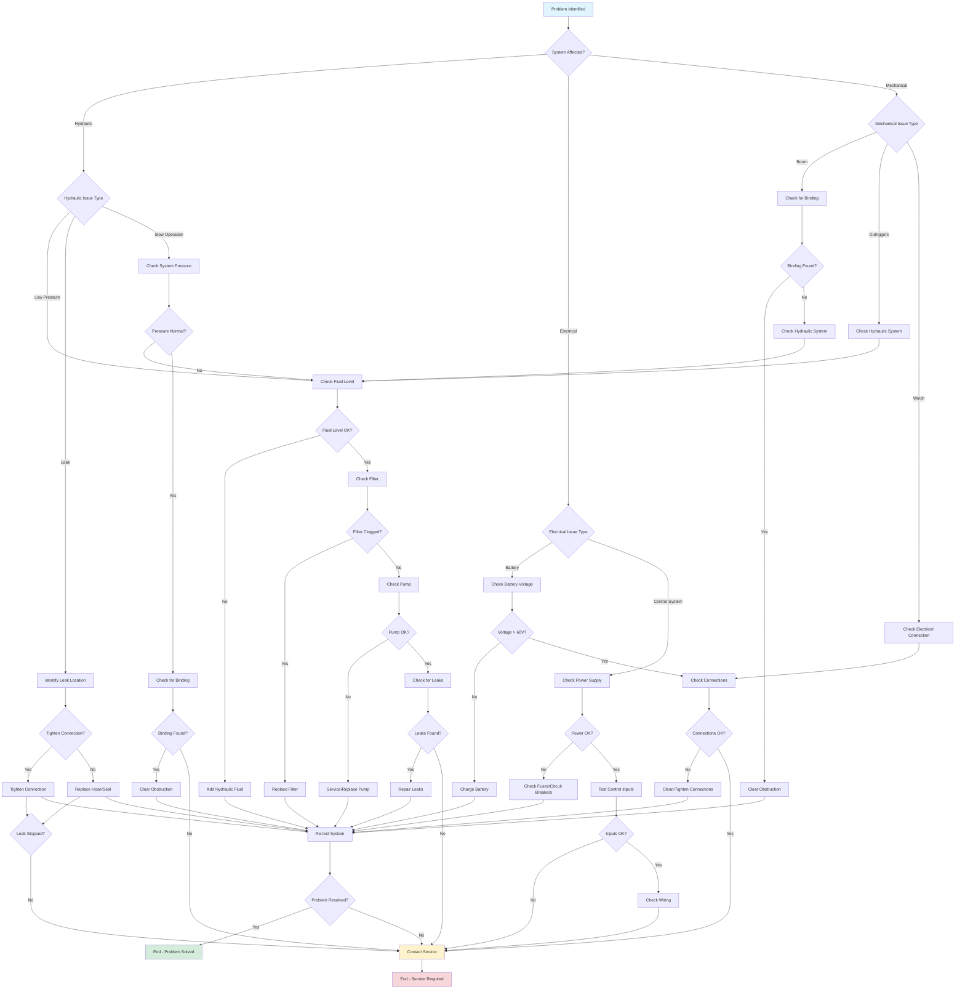

# Mini Crane Tracked 3000kg Hydraulic - Operating and Maintenance Manual

**Model:** Mini Crane Tracked 3000kg Hydraulic  
**Manufacturer:** RoboCon  
**Year:** 2025  
**Manual Version:** 1.0

---

## Table of Contents

1. [Introduction](#introduction)
2. [Safety Guidelines](#safety-guidelines)
3. [Technical Specifications](#technical-specifications)
4. [Operating Instructions](#operating-instructions)
5. [Maintenance Procedures](#maintenance-procedures)
6. [Troubleshooting](#troubleshooting)
7. [Parts Lists](#parts-lists)
8. [Appendices](#appendices)

---

## Introduction

### Overview

The Mini Crane Tracked 3000kg Hydraulic is a revolutionary foldable crane assembly designed for compact storage, rapid deployment, and versatile material handling operations. This hydraulic variant utilizes high-power hydraulic cylinder mechanisms for boom extension and retraction, providing maximum lifting force suitable for heavy-duty operations.

### Key Features

- **6-Section Telescopic Boom**: Sequential extension/retraction for maximum reach
- **Hydraulic Actuation**: High-power hydraulic cylinders for boom lift extension/retraction
- **High Load Capacity**: Maximum payload of 6,614 lbs (3,000 kg)
- **Compact Folding Design**: Folds to footprint of 2.62 ft × 2.62 ft (0.8 m × 0.8 m) for efficient storage
- **Tracked Mobility**: All-terrain tracked undercarriage for operation on various surfaces
- **Hydraulic Outriggers**: Four extensible outrigger legs with hydraulic support for stability
- **Configurable End Module**: Hook, vacuum-suction, or fork assembly options

### Intended Use

The Mini Crane Tracked 3000kg Hydraulic is designed for:
- Construction material handling and panel installation
- Manufacturing assembly operations
- Warehousing load handling
- Infrastructure maintenance tasks
- Multi-crane cooperative lifting operations

### Important Notice

**READ THIS MANUAL COMPLETELY BEFORE OPERATING THE CRANE.** Failure to follow operating instructions and safety guidelines may result in serious injury, death, or property damage. Keep this manual with the crane at all times.

---

## Safety Guidelines

### General Safety Warnings

⚠️ **WARNING**: Operating this crane without proper training and understanding of safety procedures can result in serious injury or death.

⚠️ **WARNING**: Never exceed the maximum rated capacity of 6,614 lbs (3,000 kg).

⚠️ **WARNING**: Always ensure outriggers are fully deployed and stable before lifting operations.

⚠️ **WARNING**: Maintain safe distances from power lines, overhead obstructions, and personnel during operation.

### Pre-Operation Safety Checklist

Before each operation, verify:

- [ ] All safety guards and covers are in place
- [ ] Hydraulic system is properly filled and free of leaks
- [ ] Battery voltage is adequate (72V system, minimum 60V)
- [ ] All outriggers are functional and pads are secure
- [ ] Boom sections are clean and free of obstructions
- [ ] Winch rope is in good condition (Φ8mm × 45m, 4-strand)
- [ ] Emergency stop systems are functional
- [ ] Operating area is clear of personnel and obstructions
- [ ] Load weight does not exceed rated capacity
- [ ] Weather conditions are suitable for operation

### Operating Safety Rules

1. **Never operate the crane in winds exceeding 25 mph (40 km/h)**
2. **Always use outriggers when lifting loads**
3. **Never lift loads over personnel**
4. **Maintain minimum 10 ft (3 m) clearance from power lines**
5. **Never exceed maximum operating radius of 34.4 ft (10.5 m)**
6. **Always retract boom before moving the crane**
7. **Use proper rigging and lifting attachments**
8. **Inspect load before lifting**
9. **Never leave crane unattended with load suspended**
10. **Follow all local safety regulations and codes**

### Emergency Procedures

**Emergency Stop**: Press the emergency stop button immediately if:
- Load becomes unstable
- Hydraulic system failure occurs
- Personnel are in danger
- Equipment malfunction is detected

**In Case of Hydraulic Leak**:
1. Stop operation immediately
2. Lower load safely if possible
3. Shut down hydraulic system
4. Do not operate until leak is repaired

**In Case of Power Failure**:
1. Emergency lowering system will activate
2. Load will lower slowly to ground
3. Do not attempt to operate until power is restored

---

## Technical Specifications

### Physical Dimensions

| Property | Value |
|----------|-------|
| **Weight** | 5,952 lbs (2,700 kg) |
| **Folded Width** | 2.62 ft (0.8 m) |
| **Folded Height** | 6.07 ft (1.85 m) |
| **Folded Length** | 11.48 ft (3.5 m) |
| **Maximum Operating Radius** | 34.4 ft (10.5 m) |
| **Maximum Tip Height** | 35.4 ft (10.8 m) |
| **Boom Sections** | 6-section telescopic |
| **Outriggers** | 4 extensible legs (hydraulic support) |

### Lifting Specifications

| Property | Value |
|----------|-------|
| **Max Payload** | 6,614 lbs (3,000 kg) |
| **Maximum Lifting Angle** | 78 degrees |
| **Lifting Speed** | 6.0 deg/s |
| **Slewing Range** | 360 degrees continuous |
| **Slewing Speed** | 6 deg/s |
| **Winch Hook Lift Speed** | Variable (hydraulic controlled) |
| **Winch Rope Material** | Steel |
| **Winch Rope Size** | Φ8mm × 45m |
| **Winch Rope Strands** | 4 |

### Outrigger Specifications

| Property | Value |
|----------|-------|
| **Outrigger Folding** | Manual |
| **Outrigger Support** | Hydraulic |
| **Max Extension - Lateral** | 4,300 mm (14.1 ft) |
| **Max Extension - Rear** | 3,700 mm (12.1 ft) |
| **Max Extension - Front** | 4,300 mm (14.1 ft) |
| **Outrigger Pad** | Standard size (see parts list) |

### Mobility Specifications

| Property | Value |
|----------|-------|
| **Travel Mode** | Hydraulic tracked drive |
| **Max Travel Speed** | 1.55 mi/h (2.5 km/h) |
| **Maximum Grade** | 25 degrees (36% grade) |
| **Track Width** | 220 mm (pitch) |
| **Track Section** | 50 sections per side |
| **Track Pitch** | 72 mm |

### Power System Specifications

| Property | Value |
|----------|-------|
| **Battery Voltage** | 72V DC |
| **Battery Power** | 300 Ah |
| **Battery Capacity** | 21.6 kWh |
| **Battery Type** | Lithium Iron Phosphate (LFP) |
| **Charging Voltage (VAC)** | 240.0 V |
| **Charging Current** | 12.5 A |
| **Charging Power** | 3,000 W |

### Hydraulic System Specifications

| Property | Value |
|----------|-------|
| **Primary Motor Voltage** | 72V DC |
| **Primary Motor Power** | 12,000 W (12 kW) |
| **Secondary Motor Voltage** | 220V AC |
| **Secondary Motor Power** | 3,000 W (3 kW) |
| **Hydraulic Fluid Type** | See maintenance section |
| **Maximum System Pressure** | 18 MPa (2,610 psi) |
| **Tank Capacity** | See maintenance section |

---

## Operating Instructions

### Initial Setup

#### 1. Pre-Operation Inspection

Before first use each day, perform the following inspections:

**Visual Inspection**:
- Check for visible damage to boom, tracks, and outriggers
- Inspect hydraulic hoses for cracks, abrasions, or leaks
- Verify all safety decals are present and legible
- Check winch rope for fraying, kinks, or damage
- Inspect hook and lifting attachments

**Functional Inspection**:
- Test emergency stop button
- Verify battery voltage (should be 65V or higher)
- Check hydraulic fluid level
- Test outrigger extension/retraction
- Test boom extension/retraction (without load)
- Test slewing function
- Test winch operation

#### 2. Site Preparation

1. **Clear Operating Area**:
   - Remove all obstacles and debris
   - Mark safe operating boundaries
   - Ensure adequate space for boom extension
   - Verify ground stability

2. **Check Overhead Clearances**:
   - Identify all power lines
   - Maintain minimum 10 ft (3 m) clearance from power lines
   - Check for overhead obstructions
   - Verify adequate vertical clearance for maximum tip height (35.4 ft)

3. **Ground Conditions**:
   - Ensure ground is level and stable
   - Check for underground utilities
   - Verify ground can support crane weight (5,952 lbs) plus load
   - Use outrigger pads on soft ground

#### 3. Positioning the Crane

1. **Drive to Position**:
   - Use travel mode to position crane
   - Maximum travel speed: 1.55 mi/h
   - Do not exceed 25-degree grade
   - Position with adequate clearance for boom extension

2. **Deploy Outriggers**:
   - Stop crane completely
   - Engage parking brake
   - Manually unfold outriggers
   - Extend outriggers using hydraulic controls
   - Extend to maximum safe extension for stability
   - Verify all four outriggers are in contact with ground
   - Check that crane is level using built-in level indicator

3. **Stability Check**:
   - Verify crane is stable and level
   - Check that outrigger pads are properly positioned
   - Ensure no outriggers are on unstable ground
   - Test stability by applying slight load before full operation

#### Pre-Operation Setup Sequence

The following diagram illustrates the complete pre-operation setup sequence:

### Basic Operations

#### Boom Extension and Retraction

**Extending the Boom**:

1. **Verify Readiness**:
   - Outriggers fully deployed and stable
   - Load properly rigged
   - Clear path for boom extension
   - Personnel clear of operating area

2. **Extend Boom Sections**:
   - The 6-section telescopic boom extends sequentially
   - Use hydraulic control to extend sections one at a time
   - Monitor extension length indicator
   - Do not exceed maximum operating radius (34.4 ft)
   - Extend slowly and smoothly

3. **Boom Lifting**:
   - After extension, adjust boom angle using lifting control
   - Maximum lifting angle: 78 degrees
   - Lifting speed: 6.0 deg/s
   - Monitor load during lifting operation

**Retracting the Boom**:

1. **Lower Load First**:
   - Lower load to ground or support structure
   - Release load from hook
   - Retract winch rope

2. **Lower Boom**:
   - Lower boom to horizontal position
   - Reduce boom angle gradually

3. **Retract Sections**:
   - Retract boom sections sequentially
   - Retract from outermost section inward
   - Monitor retraction to prevent binding
   - Complete retraction before moving crane

#### Boom Extension and Retraction Sequence

The following diagram illustrates the 6-section boom extension and retraction sequence:

#### Slewing Operation

**Rotating the Crane**:

1. **Pre-Slewing Check**:
   - Verify load is secure
   - Check for obstructions in slewing path
   - Ensure personnel are clear
   - Verify adequate clearance

2. **Slewing**:
   - Use slewing control to rotate crane
   - Maximum slewing speed: 6 deg/s
   - Rotate smoothly and gradually
   - Continuous 360-degree rotation available
   - Monitor load stability during rotation

3. **Slewing Safety**:
   - Never slew with load over personnel
   - Maintain safe distance from obstructions
   - Stop slewing if load becomes unstable
   - Use slow speed for precise positioning

#### Winch Operation

**Lifting Loads**:

1. **Rigging**:
   - Use appropriate rigging for load
   - Verify load weight does not exceed 6,614 lbs
   - Check hook and attachments are secure
   - Inspect winch rope condition

2. **Lifting**:
   - Use winch control to lift load
   - Lift slowly and smoothly
   - Monitor load stability
   - Do not exceed rated capacity
   - Use hydraulic control for precise positioning

3. **Lowering**:
   - Lower load slowly and smoothly
   - Maintain control at all times
   - Lower to secure support before releasing
   - Retract winch rope after load is released

**Winch Rope Specifications**:
- Material: Steel
- Diameter: Φ8mm
- Length: 45m
- Strands: 4
- Inspect regularly for wear and damage

#### End Module Configuration

The crane supports multiple end module configurations:

**Hook Assembly**:
- Standard hook for rope/cable attachment
- Provides rotational freedom during lifting
- Suitable for various load types

**Vacuum-Suction Assembly**:
- Removably attaches to panels through pneumatic suction
- Ideal for flat, smooth surfaces
- Enables rapid attachment and release

**Fork Assembly**:
- Lifts panels through mechanical engagement
- Provides stable support for palletized loads
- Precision positioning for material placement

**Changing End Modules**:
1. Lower boom to accessible position
2. Retract boom sections if necessary
3. Remove current end module
4. Install desired end module
5. Verify secure attachment
6. Test function before operation

### Advanced Operations

#### Multi-Crane Coordination

The Mini Crane can coordinate with other cranes for cooperative lifting:

1. **Communication Setup**:
   - Establish communication between cranes
   - Verify coordination system is active
   - Set up task allocation

2. **Coordinated Lifting**:
   - Plan lifting sequence
   - Synchronize movements
   - Monitor load distribution
   - Maintain communication throughout operation

3. **Safety Considerations**:
   - All cranes must be properly set up
   - Clear communication protocols
   - Designated coordinator
   - Emergency stop procedures for all units

#### Precision Positioning

For precise material placement:

1. Use slow, controlled movements
2. Utilize fine control modes
3. Monitor position indicators
4. Use visual guidance systems
5. Make small adjustments gradually

### Shutdown Procedures

**After Operation**:

1. **Secure Load**:
   - Lower load to ground or support
   - Release load from hook
   - Retract winch rope

2. **Retract Boom**:
   - Lower boom to horizontal
   - Retract all boom sections
   - Secure boom in transport position

3. **Retract Outriggers**:
   - Retract outriggers using hydraulic control
   - Manually fold outriggers
   - Secure outriggers in transport position

4. **System Shutdown**:
   - Turn off hydraulic system
   - Engage parking brake
   - Turn off main power
   - Disconnect battery if storing for extended period

5. **Post-Operation Inspection**:
   - Check for any damage or issues
   - Note any problems for maintenance
   - Clean crane if necessary
   - Secure crane for storage

---

## Maintenance Procedures

### Daily Maintenance

**Before Each Operation**:
- Visual inspection of all components
- Check hydraulic fluid level
- Verify battery voltage
- Test emergency stop
- Check winch rope condition
- Inspect outriggers and pads

**After Each Operation**:
- Clean crane of debris and dirt
- Check for leaks or damage
- Note any operational issues
- Secure crane for storage

#### Maintenance Schedule Flowchart

The following diagram illustrates the maintenance schedule and decision flow:

### Weekly Maintenance

**Hydraulic System**:
- Check hydraulic fluid level
- Inspect hoses for damage or leaks
- Check hydraulic filter condition
- Verify system pressure
- Test all hydraulic functions

**Mechanical Components**:
- Inspect boom sections for damage
- Check track condition and tension
- Inspect outrigger mechanisms
- Verify all bolts and fasteners are tight
- Lubricate moving parts as specified

**Electrical System**:
- Check battery connections
- Inspect wiring for damage
- Test all electrical functions
- Verify charging system operation
- Check control panel functions

### Monthly Maintenance

**Comprehensive Inspection**:
- Complete visual inspection of all components
- Check for wear on moving parts
- Inspect structural components
- Verify safety systems
- Test all operational functions

**Hydraulic System Service**:
- Change hydraulic filter
- Check hydraulic fluid condition
- Inspect hydraulic pump and motors
- Verify valve operation
- Check for system leaks

**Battery Maintenance**:
- Check battery voltage and capacity
- Inspect battery connections
- Clean battery terminals
- Verify charging system
- Check battery mounting

### Quarterly Maintenance

**Major Service**:
- Complete system inspection
- Replace worn components
- Service hydraulic system
- Calibrate sensors and indicators
- Update software if applicable

**Structural Inspection**:
- Inspect boom sections for cracks or damage
- Check track frame and components
- Inspect outrigger structure
- Verify all welds and connections
- Check for corrosion

### Annual Maintenance

**Complete Overhaul**:
- Comprehensive inspection of all systems
- Replace all filters and fluids
- Service all hydraulic components
- Inspect and service electrical system
- Calibrate all sensors and controls
- Update all documentation

### Hydraulic System Maintenance

**Hydraulic Fluid**:
- Type: See manufacturer specifications (refer to [Factory Questions](./mini-crane-tracked-3000kg-hydraulic-questions) for specific type)
- Change interval: Every 500 operating hours or 6 months
- Check level: Daily
- Filter replacement: Monthly

#### Hydraulic System Diagram

The following diagram illustrates the hydraulic system components and flow:

**Hydraulic Filter**:
- Replace every 250 operating hours
- Check condition monthly
- Use only specified filter type

**Hydraulic Hoses**:
- Inspect daily for damage
- Replace if cracked, abraded, or leaking
- Check connections regularly
- Maximum service life: 5 years

**Hydraulic Pump and Motors**:
- Check operation daily
- Monitor for unusual noise or vibration
- Service annually or per manufacturer schedule
- Replace if performance degrades

### Battery Maintenance

**Battery Specifications**:
- Type: Lithium Iron Phosphate (LFP)
- Voltage: 72V
- Capacity: 300 Ah
- Energy: 21.6 kWh

**Charging**:
- Use only specified charger (240V AC, 12.5A, 3000W)
- Charge in well-ventilated area
- Do not charge if battery is damaged
- Follow charging procedures exactly

**Battery Care**:
- Keep battery clean and dry
- Check connections regularly
- Do not discharge below minimum voltage (60V)
- Store in cool, dry location if removing
- Replace if capacity degrades significantly

### Winch Rope Maintenance

**Inspection**:
- Inspect daily before use
- Check for fraying, kinks, or damage
- Verify proper winding on drum
- Check hook and attachments

**Replacement**:
- Replace if any strand is broken
- Replace if excessive wear is visible
- Replace if kinks cannot be removed
- Maximum service life: 2 years or per manufacturer

**Care**:
- Keep rope clean and lubricated
- Store properly when not in use
- Avoid sharp edges and abrasion
- Do not exceed rated capacity

### Track Maintenance

**Track Inspection**:
- Check track condition daily
- Inspect for damage or excessive wear
- Verify proper track tension
- Check track pads and links

**Track Adjustment**:
- Adjust track tension as needed
- Follow manufacturer specifications
- Check after first 50 hours of operation
- Recheck monthly

**Track Replacement**:
- Replace if pads are worn excessively
- Replace if links are damaged
- Replace if track cannot maintain proper tension
- Follow manufacturer procedures

### Lubrication Schedule

**Daily**:
- Boom pivot points
- Outrigger pivot points
- Winch mechanism
- Track rollers

**Weekly**:
- All pivot and hinge points
- Slewing mechanism
- Control linkages
- Moving parts

**Monthly**:
- Complete lubrication of all moving parts
- Use specified lubricants only
- Follow manufacturer lubrication chart

---

## Troubleshooting

### Common Problems and Solutions

#### Troubleshooting Flowchart

The following diagram provides a systematic approach to troubleshooting common issues:

#### Hydraulic System Issues

**Problem: Low Hydraulic Pressure**
- **Causes**: Low fluid level, clogged filter, pump issue
- **Solutions**:
  1. Check hydraulic fluid level
  2. Replace hydraulic filter
  3. Inspect pump for damage
  4. Check for system leaks
  5. Verify pump motor operation

**Problem: Hydraulic Leak**
- **Causes**: Damaged hose, loose connection, seal failure
- **Solutions**:
  1. Identify leak location
  2. Tighten connections if loose
  3. Replace damaged hoses
  4. Replace failed seals
  5. Do not operate until leak is repaired

**Problem: Slow or No Boom Extension**
- **Causes**: Low hydraulic pressure, valve issue, binding
- **Solutions**:
  1. Check hydraulic system pressure
  2. Inspect extension valves
  3. Check for boom binding
  4. Verify pump operation
  5. Check for obstructions

#### Electrical System Issues

**Problem: Battery Not Charging**
- **Causes**: Charger issue, battery problem, connection issue
- **Solutions**:
  1. Check charger connections
  2. Verify charger is functioning
  3. Check battery connections
  4. Test battery voltage
  5. Replace charger or battery if needed

**Problem: Low Battery Voltage**
- **Causes**: Battery discharge, charging issue, battery failure
- **Solutions**:
  1. Charge battery fully
  2. Check charging system
  3. Test battery capacity
  4. Replace battery if capacity is low
  5. Check for parasitic loads

**Problem: Control System Not Responding**
- **Causes**: Electrical fault, control panel issue, wiring problem
- **Solutions**:
  1. Check power supply
  2. Inspect control panel
  3. Check wiring connections
  4. Test control inputs
  5. Replace faulty components

#### Mechanical Issues

**Problem: Boom Will Not Extend/Retract**
- **Causes**: Hydraulic issue, mechanical binding, obstruction
- **Solutions**:
  1. Check hydraulic system
  2. Inspect for binding or obstructions
  3. Check boom sections for damage
  4. Verify extension mechanism
  5. Lubricate if necessary

**Problem: Outriggers Will Not Extend**
- **Causes**: Hydraulic issue, mechanical binding, damage
- **Solutions**:
  1. Check hydraulic system
  2. Inspect outrigger mechanism
  3. Check for binding or damage
  4. Verify hydraulic connections
  5. Lubricate moving parts

**Problem: Winch Not Operating**
- **Causes**: Electrical issue, mechanical problem, rope jam
- **Solutions**:
  1. Check electrical connections
  2. Inspect winch mechanism
  3. Check for rope jam
  4. Verify motor operation
  5. Test control inputs

#### Performance Issues

**Problem: Reduced Lifting Capacity**
- **Causes**: Hydraulic system issue, structural problem, overload
- **Solutions**:
  1. Check hydraulic system pressure
  2. Verify load weight
  3. Inspect for structural damage
  4. Check boom extension
  5. Verify system calibration

**Problem: Excessive Vibration**
- **Causes**: Unbalanced load, mechanical issue, structural problem
- **Solutions**:
  1. Check load balance
  2. Inspect mechanical components
  3. Check for structural damage
  4. Verify boom alignment
  5. Check track condition

### When to Contact Service

Contact authorized service if:
- Hydraulic system failure
- Structural damage detected
- Electrical system failure
- Performance degradation
- Safety system malfunction
- Any issue you cannot resolve

**Service Contact Information**:
- RoboCon Support: [support.roboconinc.com](https://support.roboconinc.com)
- Emergency Service: [Contact information]

---

## Parts Lists

### Major Components

**Boom System**:
- 6-section telescopic boom assembly
- Boom extension cylinders (hydraulic)
- Boom lift cylinder
- Boom pivot mechanism
- Extension/retraction controls

**Outrigger System**:
- 4 outrigger legs (manual fold, hydraulic extend)
- Outrigger pads
- Hydraulic extension cylinders
- Outrigger pivot mechanisms

**Winch System**:
- Winch motor (hydraulic)
- Winch drum
- Steel rope (Φ8mm × 45m, 4-strand)
- Hook assembly
- Rope guide system

**Hydraulic System**:
- Primary hydraulic pump motor (72V, 12kW)
- Secondary motor (220V, 3kW)
- Hydraulic reservoir
- Hydraulic valves
- Hydraulic hoses and fittings
- Hydraulic filter

**Power System**:
- Battery pack (72V, 300Ah, LFP)
- Battery charger (240V AC, 12.5A, 3000W)
- Power distribution system
- Battery management system

**Track System**:
- Track assemblies (220mm pitch, 72mm section, 50 sections)
- Track drive motors
- Track tensioners
- Track rollers and idlers

**Control System**:
- Control panel
- Emergency stop system
- Sensors and indicators
- Communication systems

### Consumable Parts

**Filters**:
- Hydraulic filter (replace every 250 hours)
- Air filter (if applicable)

**Fluids**:
- Hydraulic fluid (specify type and quantity)
- Lubricants (specify types)

**Wear Items**:
- Winch rope (Φ8mm × 45m, 4-strand)
- Track pads
- Hydraulic hoses
- Seals and gaskets

### Replacement Parts Ordering

When ordering replacement parts, provide:
- Model: Mini Crane Tracked 3000kg Hydraulic
- Serial number: [Located on identification plate]
- Part number: [From parts list]
- Description: [Component description]

**Parts Ordering**:
- Contact: RoboCon Parts Department
- Website: [Parts ordering portal]
- Phone: [Contact number]

---

## Appendices

### Appendix A: Specifications Summary

**Quick Reference Specifications**:

| Category | Specification |
|----------|--------------|
| Max Payload | 6,614 lbs (3,000 kg) |
| Weight | 5,952 lbs (2,700 kg) |
| Folded Dimensions | 2.62 ft × 6.07 ft × 11.48 ft |
| Max Operating Radius | 34.4 ft (10.5 m) |
| Max Tip Height | 35.4 ft (10.8 m) |
| Boom Sections | 6-section telescopic |
| Battery | 72V, 300Ah, 21.6 kWh |
| Charging | 240V AC, 12.5A, 3000W |
| Max Travel Speed | 1.55 mi/h (2.5 km/h) |
| Max Grade | 25 degrees (36%) |

### Appendix B: Maintenance Schedule

**Daily**:
- Pre-operation inspection
- Post-operation inspection
- Basic cleaning

**Weekly**:
- Hydraulic system check
- Mechanical component inspection
- Electrical system check
- Lubrication

**Monthly**:
- Comprehensive inspection
- Hydraulic filter replacement
- Complete lubrication
- System testing

**Quarterly**:
- Major service
- Structural inspection
- System calibration

**Annually**:
- Complete overhaul
- Fluid replacement
- Component service
- Documentation update

### Appendix C: Safety Decals and Labels

All safety decals must be:
- Present and legible
- Replaced if damaged or missing
- Located as specified by manufacturer

**Key Safety Decals**:
- Maximum load capacity
- Operating radius chart
- Safety warnings
- Emergency procedures
- Contact information

### Appendix D: Warranty Information

**Warranty Coverage**:
- See warranty documentation provided with crane
- Contact RoboCon for warranty claims
- Maintain maintenance records for warranty

**Warranty Contact**:
- RoboCon Warranty Department
- [Contact information]

### Appendix E: Contact Information

**RoboCon Support**:
- Website: [support.roboconinc.com](https://support.roboconinc.com)
- Email: [support email]
- Phone: [support phone]
- Hours: [support hours]

**Emergency Service**:
- 24/7 Emergency Hotline: [phone number]

**Parts Department**:
- Website: [parts portal]
- Email: [parts email]
- Phone: [parts phone]

---

## Document Control

**Manual Version**: 1.0  
**Last Updated**: [Date]  
**Next Review**: [Date]  
**Document Owner**: RoboCon Technical Documentation

**Revision History**:

| Version | Date | Changes | Author |
|---------|------|---------|--------|
| 1.0 | [Date] | Initial release | RoboCon |

---

**END OF MANUAL**

*This manual is based on the SPYDERCRANE URW295 operating and workshop manuals, adapted for the RoboCon Mini Crane Tracked 3000kg Hydraulic with 6-section telescopic boom and updated specifications.*

