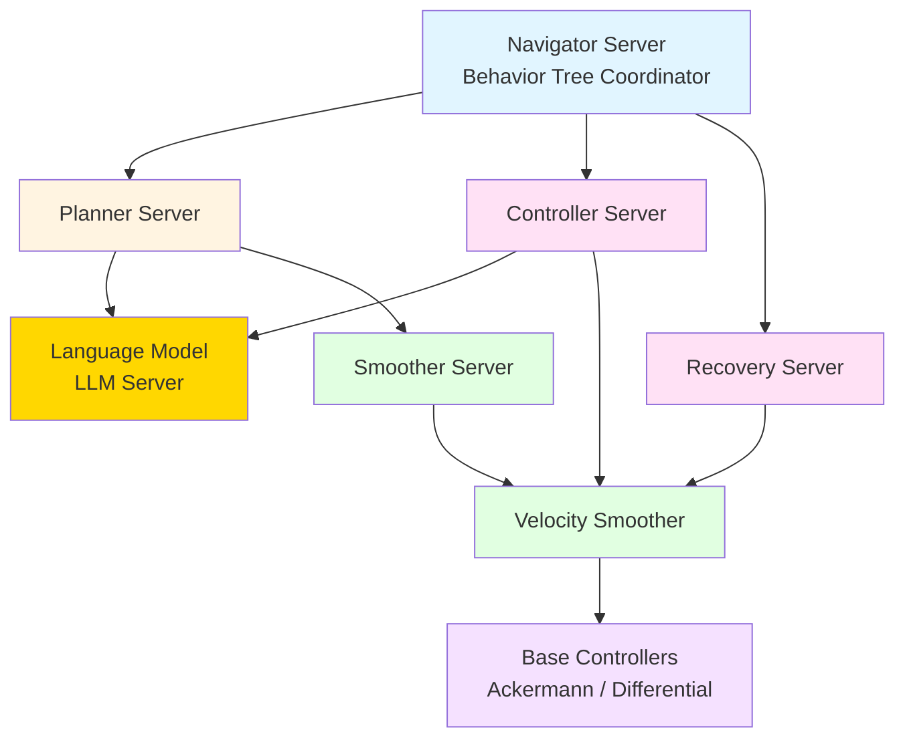
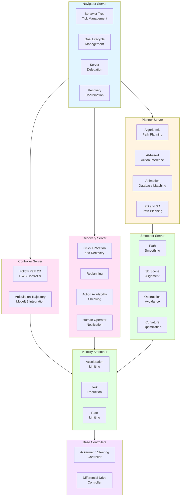
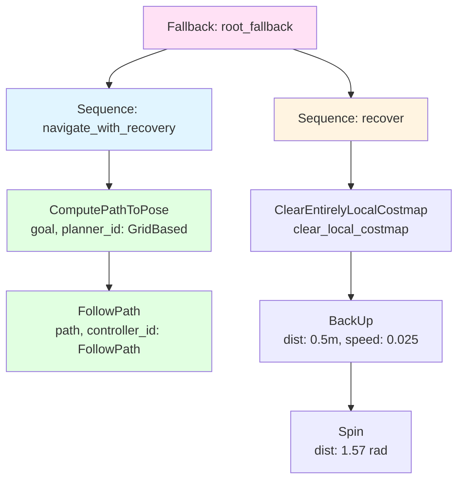

# Navigation Stack

Complete Nav 2 navigation stack setup and configuration for ROBOCON OS.

## Stack Architecture

The ROBOCON Nav 2 stack consists of:



## Core Components



### 1. Navigator Server

Central coordinator managing behavior tree execution.

**Key Features**:
- Behavior tree tick management
- Server delegation
- Goal lifecycle management
- Recovery coordination

### 2. Planner Server

Generates paths from start to goal using hybrid planning.

**Capabilities**:
- Algorithmic path planning
- Animation database matching
- 2D and 3D path planning

**AI Integration**:
- Communicates with **Language Model (LLM) Server** for AI-based action inference
- Does NOT contain inference directly - delegates to LLM Server
- Receives planning suggestions from LLM Server

### 3. Controller Server

Executes trajectories and tracks path following.

**Modes**:
- **Follow Path 2D**: DWB controller for mobile base
- **Articulation Trajectory**: MoveIt 2 integration for arms

**AI Integration**:
- Communicates with **Language Model (LLM) Server** for trajectory creation
- Does NOT contain inference directly - delegates to LLM Server
- Receives trajectory suggestions from LLM Server

### 4. Language Model (LLM) Server

Centralized AI/LLM inference service for navigation tasks.

**Purpose**: 
- Provides AI/LLM inference capabilities to other navigation servers
- Handles all Large Language Model prompts and responses
- Supports planning and trajectory creation through AI

**Key Features**:
- Centralized LLM inference endpoint
- Handles prompts from Planner Server and Controller Server
- Provides AI-based planning suggestions
- Generates AI-optimized trajectories
- Manages LLM model loading and inference

**Communication**:
- Receives inference requests from other servers
- Returns AI-generated planning and trajectory suggestions
- Called whenever AI/LLM inference is needed

**Communication Pattern**:
```
Planner Server → LLM Server (Planning Inference Request)
LLM Server → Planner Server (AI Planning Suggestions)

Controller Server → LLM Server (Trajectory Inference Request)
LLM Server → Controller Server (AI Trajectory Suggestions)
```

**Benefits**:
- Centralized AI model management
- Consistent inference across services
- Efficient resource utilization
- Easy model updates and switching

### 5. Smoother Server

Refines paths for optimal execution.

**Features**:
- Path smoothing
- 3D scene alignment
- Obstruction avoidance
- Curvature optimization

### 5. Recovery Server

Handles navigation failures and recovery.

**Behaviors**:
- Stuck detection and recovery
- Replanning
- Action availability checking
- Human operator notification

### 6. Velocity Smoother

Smooths velocity commands before execution.

**Functions**:
- Acceleration limiting
- Jerk reduction
- Rate limiting

### 7. Base Controllers

Convert velocity commands to motor commands.

**Types**:
- Ackermann Steering Controller
- Differential Drive Controller

## Configuration

### Minimal Configuration

```yaml
nav2_bringup:
  use_sim_time: false
  
  bt_navigator:
    ros__parameters:
      global_frame: "map"
      robot_base_frame: "base_link"
      odom_topic: "odom"
      
  planner_server:
    ros__parameters:
      planner_plugins: ["GridBased"]
      
  controller_server:
    ros__parameters:
      controller_plugins: ["FollowPath"]
      
  smoother_server:
    ros__parameters:
      smoother_plugins: ["simple_smoother"]
      
  recovery_server:
    ros__parameters:
      recovery_plugins: ["spin", "backup"]
```

### Full Configuration Example

See [Nav 2 Integration](../architecture/nav2-integration.md) for complete configuration.

## Launch Configuration

### Basic Launch File

```python
from launch import LaunchDescription
from launch_ros.actions import Node
from nav2_common.launch import RewrittenYaml

def generate_launch_description():
    return LaunchDescription([
        Node(
            package='nav2_bringup',
            executable='nav2_bringup',
            name='nav2_bringup',
            output='screen',
            parameters=[{
                'use_sim_time': False,
            }],
        ),
    ])
```

### With LLM Server

```python
from launch import LaunchDescription
from launch_ros.actions import Node

def generate_launch_description():
    return LaunchDescription([
        # Language Model Server (must be started first)
        Node(
            package='robocon_llm_server',
            executable='llm_server_node',
            name='llm_server',
            output='screen',
        ),
        
        # Standard Nav 2 servers
        Node(
            package='nav2_bringup',
            executable='nav2_bringup',
            name='nav2_bringup',
        ),
    ])
```

### With Custom Servers

```python
from launch import LaunchDescription
from launch_ros.actions import Node

def generate_launch_description():
    return LaunchDescription([
        # Language Model Server
        Node(
            package='robocon_llm_server',
            executable='llm_server_node',
            name='llm_server',
        ),
        
        # Standard Nav 2 servers
        Node(
            package='nav2_bringup',
            executable='nav2_bringup',
            name='nav2_bringup',
        ),
        
        # Marketplace custom server
        Node(
            package='robocon_nav2_custom',
            executable='custom_planner_server',
            name='custom_planner',
        ),
    ])
```

## Integration Points

### Data Flow

```mermaid
flowchart LR
    subgraph Inputs[Input Topics]
        Odom[/odom<br/>nav_msgs/Odometry]
        Scan[/scan<br/>sensor_msgs/LaserScan]
        Map[/map<br/>nav_msgs/OccupancyGrid]
        Goal[/goal_pose<br/>geometry_msgs/PoseStamped]
    end
    
    subgraph Nav2Stack[Nav 2 Stack]
        Navigator[Navigator Server]
        Planner[Planner Server]
        Controller[Controller Server]
        Recovery[Recovery Server]
        LLMServer[Language Model<br/>LLM Server]
    end
    
    subgraph Outputs[Output Topics]
        CmdVel[/cmd_vel<br/>geometry_msgs/Twist]
        Plan[/plan<br/>nav_msgs/Path]
        Status[/navigation_status<br/>custom]
    end
    
    Odom --> Navigator
    Scan --> Navigator
    Map --> Navigator
    Goal --> Navigator
    
    Navigator --> Planner
    Navigator --> Controller
    Navigator --> Recovery
    
    Planner --> LLMServer
    Controller --> LLMServer
    
    Planner --> Plan
    Controller --> CmdVel
    Navigator --> Status
    
    style Inputs fill:#e1f5ff
    style Nav2Stack fill:#fff4e1
    style Outputs fill:#e1ffe1
```

### Coordinate Frames


## Behavior Tree Integration

The Navigator Server uses behavior trees to coordinate navigation:



**XML Definition**:

```xml
<root main_tree_to_execute="MainTree">
  <BehaviorTree ID="MainTree">
    <Fallback name="root_fallback">
      <Sequence name="navigate_with_recovery">
        <ComputePathToPose goal="{goal}" path="{path}" planner_id="GridBased"/>
        <FollowPath path="{path}" controller_id="FollowPath"/>
      </Sequence>
      <Sequence name="recover">
        <ClearEntirelyLocalCostmap name="clear_local_costmap" service_name="local_costmap/clear_entirely_local_costmap"/>
        <BackUp backup_dist="0.5" backup_speed="0.025" cmd_vel="{cmd_vel}" time_allowance="10.0"/>
        <Spin spin_dist="1.57" cmd_vel="{cmd_vel}" time_allowance="10.0"/>
      </Sequence>
    </Fallback>
  </BehaviorTree>
</root>
```

## Troubleshooting

### Stack Not Starting

1. Check all servers are launched
2. Verify parameter files are correct
3. Ensure ROS 2 topics are available
4. Check for conflicting nodes

### Navigation Failing

1. Verify costmaps are updating
2. Check odometry is publishing correctly
3. Ensure map frame is set correctly
4. Verify footprint is configured

### Performance Issues

1. Adjust controller frequency
2. Reduce costmap resolution
3. Optimize planner parameters
4. Check system resources

## Next Steps

- [Nav 2 Integration](../architecture/nav2-integration.md) - Detailed component documentation
- [Path Planning](./path-planning.md) - Path planning configuration
- [Planners](./planners.md) - Planner selection
- [Costmaps](./costmaps.md) - Costmap setup
