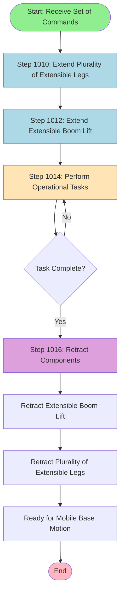
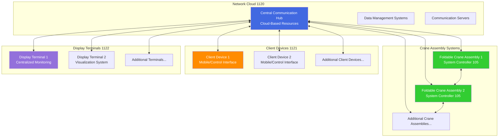
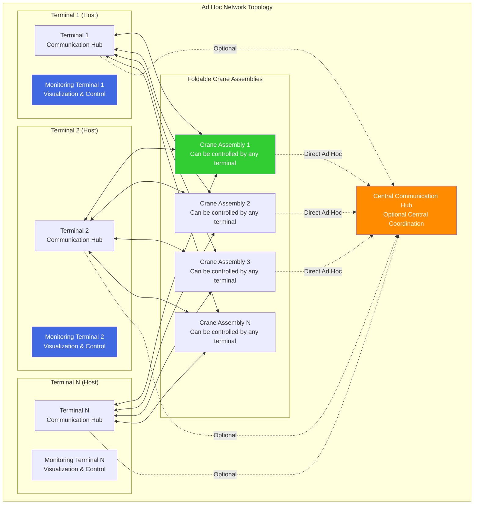

# Systems and Methods for Foldable Crane Assemblies - Patent Draft

**Patent Title:** Systems and Methods for Foldable Crane Assemblies  
**Field:** Crane assemblies, mobile lifting devices, construction equipment  
**Status:** Patent Draft with Analysis

---

## Table of Contents

1. [Field](#field)
2. [Related Art](#related-art)
3. [Summary](#summary)
4. [Brief Description of Figures](#brief-description-of-figures)
5. [Detailed Description](#detailed-description)
6. [Claims](#claims)
7. [Abstract](#abstract)
8. [Patent Analysis and Improvements](#patent-analysis-and-improvements)

---

## Field

[0001] The present disclosure is generally directed to crane assemblies, and more specifically to systems and methods for foldable crane assemblies with extensible boom lifts and configurable end modules.

---

## Related Art

[0002] Mobile crane assemblies and lifting devices are widely used in construction, manufacturing, and material handling applications to lift, move, and position heavy loads. Traditional crane systems typically include a fixed or mobile base, a boom assembly for extending reach, and various lifting mechanisms such as cables, hooks, or specialized end-effectors. These systems are designed to provide the mechanical advantage and positioning capabilities needed to handle loads that would otherwise be impossible to move manually.

[0003] Conventional mobile crane assemblies often suffer from several limitations that affect their operational efficiency and versatility. Many existing systems have limited mobility due to their size and weight, making them difficult to transport between job sites or maneuver in confined spaces. The boom assemblies in traditional cranes are typically rigid or have limited articulation, which restricts their ability to reach around obstacles or work in complex environments. Additionally, most conventional crane systems require significant setup time and space for stabilization, often necessitating the deployment of large outriggers or counterweights that further limit their mobility and increase their operational footprint.

[0004] Current crane assemblies also face challenges in terms of versatility and adaptability. Many systems are designed for specific applications and cannot easily be reconfigured for different types of loads or tasks. The end-effectors or attachment mechanisms are often specialized for particular load types, requiring separate equipment or extensive modifications to handle different materials or objects. This lack of adaptability results in increased equipment costs and reduced operational flexibility for users who need to handle diverse types of loads.

[0005] Furthermore, existing mobile crane systems typically have large storage and transport requirements when not in use. The boom assemblies, support structures, and stabilization components often cannot be compacted sufficiently to allow for efficient storage or transport in standard vehicles or containers. This creates logistical challenges and increases operational costs, particularly for applications that require frequent relocation of equipment.

[0006] Accordingly, what is needed are systems and methods that provide enhanced mobility, versatility, and compactness for crane assemblies while maintaining operational capability and stability.

---

## Summary

[0007] In some aspects of the disclosure, a method for controlling a foldable crane assembly comprises: in response to receiving a set of commands, causing a plurality of extensible legs to extend such as to support a foldable crane assembly and causing an extensible boom lift of the foldable crane assembly to extend, the foldable crane assembly comprising a mobile base; and prior to the mobile base of the foldable crane assembly being in motion, causing the extensible boom lift to retract and causing the plurality of extensible legs to retract.

[0008] In some aspects, the foldable crane assembly further comprises an end module configured to couple to the extensible boom lift. In some aspects, the end module is automatically configurable to operate as at least one of a hook assembly configured to use a rope to hold a panel, a vacuum-suction assembly configured to removably attach to the panel, a fork assembly configured to lift the panel, or one or more end-effectors. In some aspects, the one or more end-effectors are removably attached to the end module and comprise at least one of a robotic arm, a rotary drill, a screwdriver, a nail driver, or a gripper. In some aspects, the mobile base comprises wheels and motors configured to facilitate a movement of the foldable crane assembly. In some aspects, the foldable crane assembly is configured to fold to a footprint that is equal to or less than 1.2 m × 1.2 m. In some aspects, the set of commands are received from a controller that jointly operates two or more end-effectors. In some aspects, the controller uses a 2D-lidar sensor and a 3D-lidar sensor to obtain environmental data to enable navigation and task execution. In some aspects, the controller uses a visual-language-action model to convert natural-language instructions into a behavior tree, e.g., in XML format. In some aspects, the extensible boom lift is configured to couple to the mobile base.

[0009] In some aspects, the techniques described herein relate to a non-transitory computer-readable medium for storing instructions that, when executed by a processor, cause the processor to perform operations comprising: receiving a set of commands for controlling a foldable crane assembly; in response to receiving the set of commands, causing a plurality of extensible legs to extend to support the foldable crane assembly and causing an extensible boom lift of the foldable crane assembly to extend, the foldable crane assembly comprising a mobile base; and prior to the mobile base being in motion, causing the extensible boom lift to retract and causing the plurality of extensible legs to retract.

[0010] In some aspects, the operations further comprise causing an end module to couple to the extensible boom lift, the end module being configurable to automatically operate as at least one of a hook assembly that uses a rope to hold a panel, a vacuum-suction assembly configured to removably attach to the panel, a fork assembly configured to lift the panel, or one or more end-effectors. In some aspects, the operations further comprise receiving the set of commands from a controller configured to execute instructions for jointly operating two or more end-effectors, wherein the controller is configured to process data from a 2D-lidar sensor and a 3D-lidar sensor to obtain environmental data to enable navigation and task execution, and wherein the controller is configured to execute a visual-language-action model to convert natural-language instructions into a behavior tree. In some aspects, the operations further comprise coordinating the foldable crane assembly with one or more additional foldable crane assemblies to perform cooperative lifting operations, wherein the coordinating comprises exchanging operational status information and synchronizing movements between multiple foldable crane assemblies.

[0011] In some aspects, the techniques described herein relate to a foldable crane assembly comprising: a mobile base; an extensible boom lift configured to couple to the mobile base; an end module configured to couple to the extensible boom lift, the end module being automatically configurable to operate as at least one of: a hook assembly configured to use a rope to hold a panel, a vacuum-suction assembly configured to removably attach to the panel, a fork assembly configured to lift a panel, or one or more end-effectors; and a plurality of extensible legs configured to support the foldable crane assembly.

[0012] In some aspects, the mobile base comprises wheels and motors configured to facilitate a movement of the foldable crane assembly. In some aspects, the one or more end-effectors are removably attached to the end module and comprise at least one of a robotic arm, a rotary drill, a screwdriver, a nail driver, or a gripper. In some aspects, the foldable crane assembly further comprises a controller that jointly operates two or more end-effectors. In some aspects, the controller uses a 2D-lidar sensor and a 3D-lidar sensor to obtain environmental data to enable navigation and task execution, and wherein the controller uses a visual-language-action model to convert natural-language instructions into a behavior tree. In some aspects, the foldable crane assembly is configured to fold to a footprint equal to or less than 1.2 m × 1.2 m.

[0013] Aspects of the present disclosure can involve a system, which can involve means for receiving a set of commands for controlling a foldable crane assembly, means for extending a plurality of extensible legs to support the foldable crane assembly, means for extending an extensible boom lift of the foldable crane assembly, means for using the extended foldable crane assembly to perform a set of operational tasks, and means for retracting the extensible boom lift and the plurality of extensible legs prior to a mobile base of the foldable crane assembly being in motion.

---

## Brief Description of Figures

[0014] FIG. 1 illustrates an exemplary block diagram of a foldable crane system according to various embodiments of the present disclosure.

[0015] FIG. 2 illustrates an exemplary isometric view of a foldable crane assembly according to various embodiments of the present disclosure.

[0016] FIGS. 3A-3D illustrate exemplary multiple views of a foldable crane assembly according to various embodiments of the present disclosure.

[0017] FIG. 4A illustrates an exemplary isometric view of a foldable crane assembly in an extended configuration according to various embodiments of the present disclosure.

[0018] FIG. 4B illustrates an exemplary side view of a foldable crane assembly in an extended configuration according to various embodiments of the present disclosure.

[0019] FIGS. 5A-5B illustrate exemplary assembled and exploded views of a foldable boom lift assembly according to various embodiments of the present disclosure.

[0020] FIGS. 6A-6B illustrate exemplary assembled and exploded views of a track system assembly according to various embodiments of the present disclosure.

[0021] FIGS. 7A-7B illustrate exemplary views of a foldable boom assembly according to various embodiments of the present disclosure.

[0022] FIG. 8 illustrates an exemplary perspective view of a foldable crane assembly with various components according to various embodiments of the present disclosure.

[0023] FIG. 9 illustrates an exemplary block diagram of a system controller according to various embodiments of the present disclosure.

[0024] FIG. 10 is a flowchart illustrating an exemplary process for controlling a foldable crane assembly in accordance with various embodiments of the present disclosure.

[0025] FIG. 11 illustrates an exemplary network configuration for a foldable crane system according to various embodiments of the present disclosure.

[0026] FIG. 12 illustrates an example computing environment according to various embodiments of the present disclosure.

---

## Detailed Description

[0027] The following detailed description provides details of the figures and example implementations of the present application. Reference numerals and descriptions of redundant elements between figures are omitted for clarity. Terms used throughout the description are provided as examples and are not intended to be limiting. For example, the use of the term "automatic" may involve fully automatic or semi-automatic implementations involving user or administrator control over certain aspects of the implementation, depending on the desired implementation of one of ordinary skill in the art practicing implementations of the present application. Selection can be conducted by a user through a user interface or other input means, or can be implemented through a desired algorithm. Example implementations as described herein can be utilized either singularly or in combination and the functionality of the example implementations can be implemented through any means according to the desired implementations.

[0028] The limitations of existing crane assemblies create significant operational challenges in various industries. Traditional mobile cranes often require extensive setup procedures, including the deployment of stabilizing outriggers that can extend several meters from the base unit. This setup process is time-consuming and requires substantial clear space around the crane, which may not be available in congested work sites or urban environments. The inability to quickly deploy and retract these systems limits their effectiveness in applications requiring rapid response or frequent repositioning.

[0029] The lack of modularity in conventional crane systems presents another significant problem. Most existing cranes are designed with fixed end-effectors or require complex mechanical modifications to change between different types of lifting attachments. This inflexibility means that operators often need multiple specialized pieces of equipment to handle different types of loads, increasing both capital costs and logistical complexity. The inability to quickly reconfigure the crane for different tasks reduces operational efficiency and limits the versatility of the equipment.

[0030] Storage and transportation challenges further compound the problems with existing crane assemblies. Many mobile cranes cannot be folded or compacted to a size that allows for efficient transport or storage. This results in higher transportation costs, increased storage space requirements, and logistical difficulties when moving equipment between job sites. The large footprint of these systems when stored also limits their applicability in space-constrained environments.

[0031] Various embodiments herein provide foldable crane assemblies that can be compacted to a small footprint for storage and transport while maintaining full operational capability when deployed. The systems include configurable end modules that can be automatically reconfigured to operate as hook assemblies using ropes to hold panels, vacuum-suction assemblies for removably attaching to panels, fork assemblies for lifting panels, or various end-effectors including robotic arms, rotary drills, screwdrivers, nail drivers, and grippers. The extensible boom lifts provide enhanced reach and positioning capability, while intelligent control systems coordinate the deployment and retraction of various components including the plurality of extensible legs that provide stable support during operations. These assemblies offer enhanced mobility through compact mobile bases and can be quickly deployed and retracted as needed for different operational requirements, with the entire assembly capable of folding to a footprint equal to or less than 1.2 m × 1.2 m. The control system may utilize 2D-lidar and 3D-lidar sensors to obtain environmental data for navigation and task execution, and employ visual-language-action models to convert natural-language instructions into behavior trees for coordinated operation of multiple end-effectors. In some cases, multiple foldable crane assemblies may be coordinated to work together on complex lifting tasks, with distributed control systems enabling dynamic task allocation and real-time coordination between crane units. The multi-crane coordination capabilities may enable cooperative handling of large loads, synchronized positioning operations, and adaptive task distribution based on individual crane capabilities and positioning.

[0032] In this document, the terms "leg" and "support arm" may be used interchangeably. Similarly, the terms "mobile base" and "base portion" and the terms "end module" and "end-effector" may be used interchangeably.

### FIG. 1: Foldable Crane System Functional Block Diagram

```mermaid
graph TB
    subgraph "Base Portion 100"
        Wheels["Wheels 101<br/>Mobility System"]
        Motors["Motors 102<br/>Drive System"]
        Interface["Interface 103<br/>Communication & Control"]
        PowerSupply["Power Supply 104<br/>Electrical Power"]
        SystemController["System Controller 105<br/>Primary Control Unit"]
        BasebandProcessor["Baseband Processor 106<br/>Signal Processing"]
        SensorSystems107["Sensor Systems 107<br/>Environmental Sensing"]
    end
    
    subgraph "Lift Portion 110"
        ExtensibleBoom["Extensible Boom Lift<br/>Telescoping Sections"]
        VerticalAdjust["Vertical Adjustment<br/>Height Control"]
    end
    
    subgraph "Platform Portion 120"
        SensorSystems121["Sensor Systems 121<br/>2D-LiDAR, 3D-LiDAR"]
        RoboticArms["Robotic Arms 122<br/>End-Effectors"]
        ProjectionSystem["Projection System 123<br/>Visual Display"]
    end
    
    subgraph "Extensible Legs"
        Leg1["Leg 1<br/>Support Arm"]
        Leg2["Leg 2<br/>Support Arm"]
        Leg3["Leg 3<br/>Support Arm"]
        Leg4["Leg 4<br/>Support Arm"]
    end
    
    Base Portion 100 --> Lift Portion 110
    Lift Portion 110 --> Platform Portion 120
    Base Portion 100 -.-> Extensible Legs
    
    SystemController --> Wheels
    SystemController --> Motors
    SystemController --> ExtensibleBoom
    SystemController --> RoboticArms
    SystemController --> ProjectionSystem
    SystemController --> Leg1
    SystemController --> Leg2
    SystemController --> Leg3
    SystemController --> Leg4
    
    PowerSupply --> SystemController
    PowerSupply --> Motors
    PowerSupply --> ProjectionSystem
    
    SensorSystems107 --> SystemController
    SensorSystems121 --> SystemController
    
    style Base Portion 100 fill:#E6F3FF
    style Lift Portion 110 fill:#FFF4E6
    style Platform Portion 120 fill:#E6FFE6
    style SystemController fill:#FFE6E6
```

[0033] FIG. 1 illustrates a functional diagram of a foldable crane system, in accordance with an example implementation. The foldable crane assembly may include a base portion 100, a lift portion 110, and a platform portion 120.

[0034] The base portion 100 comprises a mobile base that may include wheels 101, motors 102, and an interface 103. The mobile base may be configured as a mobile platform to move on the ground. The base portion 100 may also contain a power supply 104, a system controller 105, a baseband processor 106, and sensor systems 107. The wheels 101 and motors 102 are configured to facilitate movement of the foldable crane assembly. The interface 103 may allow for communication and control of the foldable crane assembly. The power supply 104 may provide electrical power to the various components of the foldable crane assembly. The system controller 105 and baseband processor 106 may process data and control the operations of the foldable crane assembly. The sensor systems 107 may collect data about the environment surrounding the foldable crane assembly. Wheels 101 may also be replaced with other means (e.g., tracked treads) to facilitate the desired implementation for various terrain conditions.

[0035] The lift portion 110 may be disposed between the base portion 100 and the platform portion 120 and comprises an extensible boom lift configured to couple to the mobile base. The lift portion 110 may be configured to raise and lower the platform portion 120 relative to the base portion 100. This vertical adjustment capability may allow the foldable crane assembly to operate at different heights as needed for various lifting and positioning tasks. The extensible boom lift may comprise multiple telescoping sections that can extend and retract to provide variable reach and positioning capabilities.

[0036] The platform portion 120 may include sensor systems 121, robotic arms 122, and a projection system 123, and may function as an end module configured to couple to the extensible boom lift. The sensor systems 121 may provide additional environmental data collection capabilities and can include 2D-lidar sensors and 3D-lidar sensors to obtain environmental data to enable navigation and task execution. The sensor systems 121 can also include a vision system configured to obtain target assembly data.

[0037] The robotic arms 122 may function as end-effectors that are removably attached to the end module and enable the system to perform physical tasks and manipulations. The end module may be automatically configurable to operate as at least one of a hook assembly configured to use a rope to hold a panel, a vacuum-suction assembly configured to removably attach to a panel, a fork assembly configured to lift a panel, or one or more end-effectors comprising robotic arms, rotary drills, screwdrivers, nail drivers, or grippers. The projection system 123 may be used to display information or project patterns onto surfaces in the foldable crane assembly's environment. In an example, the projection system 123 can project visual guidance onto a work surface for assisting in material placement and positioning operations.

[0038] The layered structure of the foldable crane assembly may allow for modular design and easy maintenance. The base portion 100 may provide mobility and core processing capabilities, while the lift portion 110 enables vertical positioning and extension of the platform portion 120. The platform portion 120 may support task-specific components such as the configurable end-effectors and additional sensor systems 121. The foldable crane assembly may be configured to fold to a footprint that is equal to or less than 1.2 m × 1.2 m, and may include a plurality of extensible legs configured to support the foldable crane assembly during operation.

[0039] FIG. 2 depicts an isometric view of the foldable crane assembly that demonstrates the physical structure and configuration when positioned for transport or storage. The assembly comprises a mobile base that incorporates a tracked undercarriage system designed to provide both mobility and stability across various terrain types. The tracked undercarriage features continuous track elements that distribute the weight of the crane assembly over a larger surface area compared to traditional wheeled systems, enabling operation on soft or uneven surfaces while maintaining traction and maneuverability. The mobile base may house various control and power components, e.g., within a compact enclosure such as to protect the internal systems from environmental conditions while maintaining accessibility for maintenance and operation.

[0040] As depicted, the extensible boom lift is configured to couple to the mobile base through a mounting interface that, in operation, allows for rotational positioning of the boom assembly relative to the base platform. In the configuration shown in FIG. 2, the extensible boom lift is positioned in a retracted state where the telescoping sections are nested together to minimize the overall length and height of the assembly. The boom lift comprises multiple telescoping sections that can extend sequentially to achieve various reach distances and positioning capabilities when deployed for operational use. The telescoping sections are mechanically integrated through guide systems and extension mechanisms that maintain structural alignment and load-bearing capacity throughout the extension range. The rotatable coupling between the extensible boom lift and mobile base enables the boom to be oriented in different directions relative to the base platform, providing operational flexibility for positioning loads and accessing work areas from various angles.

[0041] A control box mounted on the mobile base may feature ventilation openings that allow for thermal management of the internal electronic components and control systems. The control box houses various electronic systems that manage the operation of the extensible boom lift, the mobile base system, and other operational components of the crane assembly. The ventilation openings are strategically positioned to promote airflow through the control box while preventing the ingress of moisture and debris that could affect the electronic systems.

[0042] Multiple articulating support arms are positioned at the assembly and are shown in a retracted configuration that minimizes the overall footprint of the crane when folded for transport or storage. The support arms serve as stabilizing elements when deployed during operational use, providing stability and load distribution for the crane assembly. The articulating design of the support arms allows them to be positioned in various configurations depending on the operational requirements and ground conditions. The mechanical integration of these support arms with the mobile base creates a stable platform that can adapt to different operational scenarios while maintaining the compact profile needed for efficient transport and storage.

[0043] The overall design of the foldable crane assembly integrates the mechanical components in a compact configuration that balances the requirements for operational functionality with the need for efficient transport and storage. The boom lift structure incorporates several pivot points and joints that enable various positioning capabilities while maintaining structural integrity under load conditions. The tracked base provides a stable platform for crane operations while allowing the assembly to traverse different terrain types without requiring additional ground preparation or stabilization equipment. The compact integration of all mechanical and control systems within the mobile base and boom lift structure creates a self-contained crane assembly that can be rapidly deployed and retracted as operational conditions require.

[0044] FIGS. 3A-3D show various perspectives of the foldable crane assembly that demonstrate the spatial relationships and mechanical configurations of system components. FIG. 3A is a top view of the foldable crane assembly with a plurality of extensible legs deployed in an extended configuration. The legs are arranged in a symmetrical pattern extending outward from a central column structure, providing distributed support during operational use. The symmetrical arrangement creates a stable base platform that distributes load forces evenly across the supporting surface while maintaining balance during lifting operations. Any number of legs may be positioned, e.g., at regular angular intervals around the central column structure to optimize stability and load distribution characteristics.

[0045] FIG. 3B is an isometric view of the foldable crane assembly, revealing the three-dimensional configuration that comprises the extensible boom lift portion and mobile base integrated into a unified mechanical system. The mobile base provides a platform that houses the control electronics and mechanical interfaces that support the operation of the extensible boom lift portion. The assembly comprises mechanical components that allow for folding and unfolding operations, enabling the system to transition between compact transport configurations and extended operational configurations as needed for different applications.

[0046] FIG. 3C is a side view of the foldable crane assembly that illustrates the profile configuration of the device, and FIG. 3D provides a front view of the foldable crane assembly. The spatial arrangement of the mechanical components allows the assembly to fold into a configuration that minimizes storage space requirements while maintaining accessibility to all operational systems and interfaces.

[0047] As discussed in greater detail further below, the assembly may comprise an end module that couples to the extensible boom lift and provides the interface for various operational attachments and end-effectors. The end module may comprise a platform portion that can support multiple end-effectors simultaneously, allowing the crane assembly to perform complex tasks that require multiple tools or attachments working in coordination. The platform portion may be configured with mounting interfaces, power connections, and control interfaces that enable various end-effectors to be attached and operated as part of the integrated crane system. The mechanical design of the assembly creates a compact footprint when the plurality of extensible legs and boom lift mechanism are retracted, while providing substantial operational capability when the components are extended for active use.

[0048] FIG. 4A illustrates the foldable crane assembly in an extended operational configuration. The assembly comprises a plurality of extensible legs that are deployed outward from the mobile base in a radial pattern, creating a stable support platform that distributes operational loads across a wider footprint. The plurality of extensible legs extend at predetermined angles from the mobile base, with each leg comprising telescoping sections that allow for length adjustment to accommodate varying ground conditions and stability requirements. The deployment transforms the crane assembly from a compact transport configuration into a stable operational platform capable of handling substantial loads.

[0049] The extensible boom lift is shown in an extended configuration where multiple telescoping sections have been deployed to achieve substantial reach and height capabilities. The boom lift extends upward and outward from the mobile base at an angle that provides optimal positioning for load handling while maintaining structural stability. The lift comprises multiple telescoping sections that extend sequentially, with each section supported by the preceding section through mechanical interfaces. The extensible lift comprises pivot joints positioned at various locations along the boom structure, enabling articulated movement and positioning that allows the boom to be oriented in various configurations relative to the mobile base.

[0050] At the distal end of the extensible boom lift, a boom tip provides the mechanical interface for coupling with an end module. The boom tip comprises mounting interfaces, mechanical connections, and control interfaces that enable various types of end modules to be attached and operated as part of the integrated crane system. The end module shown in FIG. 4A is configured as a hook assembly that utilizes a rope to hold a panel. The rope extends from the hook assembly to the panel, providing a flexible connection that allows the panel to be lifted and positioned while maintaining rotational freedom during the handling operation.

[0051] The panel being handled by the crane assembly represents one type of load that may be managed through the configurable end module system. The hook assembly configuration enables the crane to handle loads that can be secured through rope or cable connections, providing versatility for various types of materials and objects that may need to be lifted and positioned. The rope connection between the hook assembly and panel allows for controlled lifting while accommodating load movement during positioning operations. The pivot joints within the extensible boom lift enable the boom tip and attached end module to be positioned at various angles and orientations, providing flexibility needed to access different work areas and position loads with precision.

[0052] As further shown in FIG. 4B, the foldable crane assembly is illustrated in a side view that provides additional perspective on the extended operational configuration. The tracked mobile base provides the foundational platform for the entire assembly, with the track system enabling mobility across various terrain types while supporting operational loads generated during lifting operations. The plurality of extensible legs are deployed outward from the mobile base to create stabilizing support points that distribute crane loads across a wider area. The extensible legs comprise telescoping sections that allow for individual length adjustment, enabling the crane assembly to adapt to uneven ground conditions while maintaining level operation.

[0053] The extensible boom lift extends upward from the mobile base at an operational angle that balances reach capability with structural stability and load capacity. The boom lift comprises multiple telescoping sections with support brackets positioned along the length to maintain structural integrity during extended operations. The pivot joints integrated within the extensible boom lift enable articulated movement that allows different sections to be positioned at various angles relative to each other and to the mobile base. This articulated capability expands the operational envelope of the crane assembly. The boom tip provides the mounting interface for the end module, which in FIG. 4B comprises a hook assembly that utilizes cables or ropes to suspend and control a load.

[0054] The load shown suspended from the hook assembly demonstrates the crane assembly's capability to handle rectangular panels or similar flat materials that may be encountered in construction, manufacturing, or material handling applications. The hook assembly end module provides a secure attachment point for cables or ropes while allowing the load to maintain some degree of rotational freedom during lifting and positioning operations. The end module may be configurable as different types of load handling interfaces depending on operational requirements. The end module may be configured as a vacuum-suction assembly that can removably attach to panels through pneumatic suction, or as a fork assembly that can lift panels through mechanical engagement. The configurable nature of the end module enables the crane assembly to adapt to different types of loads and operational requirements while maintaining the same basic boom lift and stabilization infrastructure.

[0055] Referring to FIGS. 5A-5B, the extensible boom lift assembly comprises a hydraulic cylinder mechanism that enables controlled extension and retraction of the boom sections during operational deployment and storage configurations. FIG. 5A shows an assembled view of a portion of the extensible boom lift, featuring the hydraulic cylinder mechanism integrated with structural mounting components that provide the mechanical interface between the boom sections and the actuation system. The hydraulic cylinder mechanism comprises a cylindrical housing that contains the hydraulic piston and associated sealing components, with external mounting points that connect to the boom structure through mechanical fasteners and brackets. The assembly includes a hydraulic valve assembly for managing the hydraulic fluid flow and pressure within the cylinder mechanism, providing the motive force for extending and retracting the telescoping sections of the extensible boom lift.

[0056] The mounting brackets integrated within the boom lift assembly provide structural attachment points that distribute the operational loads between the hydraulic cylinder mechanism and the boom structure. These mounting brackets ensure that the forces generated during extension and retraction operations are properly transferred through the mechanical framework while maintaining proper alignment with the boom sections throughout the range of motion. The mounting brackets may be fabricated from high-strength materials that can withstand the cyclic loading conditions encountered during repeated extension and retraction cycles, preventing binding or misalignment that could impair the smooth operation of the telescoping mechanism.

[0057] FIG. 5B presents an exploded view of the same assembly, revealing the individual components and their spatial relationships within the boom lift mechanism. The exploded view displays the hydraulic cylinder as a separate component from the mounting brackets and structural elements, illustrating how these components integrate to form the complete boom lift actuation system. The hydraulic cylinder comprises an elongated cylindrical body with mounting flanges at each end that provide the mechanical interface to the mounting brackets and boom structure. The exploded view demonstrates how the mounting brackets are positioned to align with corresponding attachment points on both the hydraulic cylinder and the boom structure, creating a secure mechanical assembly that can withstand the operational loads encountered during boom extension and retraction operations.

[0058] The structural components revealed in the exploded view comprise various brackets, fasteners, and interface elements that work together to create a robust mechanical connection between the hydraulic actuation system and the extensible boom lift structure. The hydraulic cylinder mechanism may be designed as a modular component that can be removed and serviced independently of the boom structure, with the mounting brackets providing standardized connection interfaces that facilitate maintenance operations. The assembly enables the boom to transition between folded and extended configurations while maintaining structural integrity, with the mounting brackets positioned to accommodate the geometric changes that occur during these transitions.

[0059] Referring to FIGS. 6A-6B, the track system assembly comprises two parallel track sections that provide the mobility foundation for the foldable crane assembly. FIG. 6A shows an assembled view of the track system, where the parallel track sections are positioned to create a stable undercarriage platform that distributes the weight of the crane assembly across a larger contact area. The parallel track sections feature rounded ends that provide smooth transitions during directional changes and reduce stress concentrations at the track termination points. Each track section comprises multiple wheel or roller components arranged along the length of the track, creating a continuous support system that enables movement across various surface types.

[0060] The internal mechanisms within each track section comprise various mechanical components that enable the track system to function as an integrated mobility platform. The track sections may house drive mechanisms, tensioning systems, and guide components that coordinate the movement of the individual wheel or roller elements during forward and reverse motion. The internal mechanisms may be protected from environmental contamination through sealed housings that prevent the ingress of dirt, moisture, and debris. The parallel arrangement of the track sections creates a stable platform that resists lateral movement while providing traction and maneuverability across different terrain conditions.

[0061] As further shown in FIG. 6B, the exploded view of the track system assembly reveals the internal components and their spatial relationships within the modular design framework. The exploded view demonstrates how the track sections separate to expose the internal frame structure, which may comprise longitudinal support members that maintain the structural integrity of each track section while providing mounting points for the various mechanical components. The mounting components shown in the exploded view may comprise brackets, fasteners, and interface elements that secure the wheel assemblies and drive mechanisms within the track sections. The modular design of the track system enables individual components to be accessed for maintenance, repair, or replacement without requiring complete disassembly of the entire mobility platform.

[0062] The wheel assemblies revealed in the exploded view comprise multiple wheel units arranged in a linear configuration along the length of each track section. Each wheel unit may comprise individual wheels or rollers that are mounted on bearing systems to enable smooth rotation during track movement. The linear configuration of the wheel assemblies creates a continuous support system that enables the track sections to conform to irregular surface contours while maintaining traction and stability. The wheel units may be designed as modular components that can be individually serviced or replaced, reducing maintenance complexity and minimizing downtime during service operations.

[0063] The guide rails shown in the exploded view provide the structural framework that maintains proper alignment of the wheel assemblies and ensures smooth operation of the track system throughout its range of motion. The guide rails may comprise parallel structural members that extend along the length of each track section, providing mounting surfaces for the wheel assemblies and maintaining proper spacing between the individual wheel units. The support structures revealed in the exploded view may comprise cross-members, bracing elements, and reinforcement components that enhance the structural integrity of the track system while maintaining the modular design characteristics.

[0064] Referring to FIGS. 7A and 7B, the foldable boom assembly comprises a telescoping boom structure that may transition between folded and extended configurations to accommodate different operational and storage requirements. FIG. 7A shows a perspective view of the boom assembly in a folded configuration, where the telescoping boom structure comprises multiple sections that nest together to create a compact arrangement suitable for transport and storage applications. The boom assembly comprises a mounting base positioned at one end that provides the mechanical interface for coupling the boom structure to the mobile base of the crane assembly.

[0065] The telescoping boom structure comprises a series of interconnected segments that may extend and retract in a sequential manner to achieve various reach distances and positioning capabilities. Each segment within the telescoping boom structure may comprise structural walls, guide systems, and mechanical interfaces that enable the segments to slide relative to each other while maintaining proper alignment and load-bearing capacity throughout the extension range. The interconnected segments are arranged in a nested configuration when the boom assembly is in the folded state, with each successive segment positioned inside the preceding segment to minimize the overall length and volume of the boom structure.

[0066] The boom assembly may comprise various mechanical connection points that serve multiple functions in maintaining structural integrity and enabling controlled extension operations. These connection points may comprise pivot interfaces, guide brackets, and support elements that ensure proper alignment of the segments during telescoping operations while distributing operational loads throughout the boom structure. The mechanical design of the connection points enables the boom assembly to maintain structural integrity while accommodating the geometric changes that occur as the segments extend and retract during operational cycles.

[0067] As further shown in FIG. 7B, a side view of the boom assembly segments demonstrates how the individual components align when extended to create a continuous structural beam capable of supporting operational loads. The segments may be arranged in a cascading pattern that illustrates the sequential extension sequence, with each segment extending from the preceding segment in a controlled manner that maintains proper structural alignment throughout the extension process. Each segment comprises mounting brackets positioned at strategic locations that provide attachment points for extension mechanisms, guide systems, and structural reinforcement elements.

[0068] The connection points integrated within each segment enable the telescoping motion while maintaining structural stability throughout the operational range of the boom assembly. These connection points may comprise sliding interfaces, bearing systems, and guide mechanisms that allow smooth extension and retraction while preventing binding or misalignment between adjacent segments. The connection points may be designed to accommodate the loads generated during lifting operations while maintaining the precision needed for accurate positioning of the boom tip and attached end modules. The structural design of the connection points enables the boom assembly to function as a unified structural system when extended, despite comprising multiple individual segments that may move relative to each other during telescoping operations.

[0069] The design of the boom assembly enables the structure to compact into a smaller footprint when folded, providing advantages for transport and storage applications where space constraints may be a consideration. When the segments are retracted into the nested configuration shown in FIG. 7A, the boom assembly may achieve a compact footprint that facilitates efficient storage and transport of the crane assembly. The compact folded configuration may be achieved through the coordinated retraction of the boom segments, the retraction of the extensible legs, and the positioning of other crane components in their storage configurations.

[0070] The telescoping boom structure may provide substantial reach and height capabilities when deployed in the extended configuration, while maintaining the ability to fold into the compact storage arrangement when operational use is not required. The sequential extension of the segments enables the boom assembly to achieve various intermediate positions between the fully retracted and fully extended configurations, providing operational flexibility for different types of lifting and positioning tasks. The boom assembly may comprise extension mechanisms that control the deployment and retraction of the individual segments, ensuring that the telescoping operations occur in a coordinated manner that maintains structural integrity and operational safety. The extension mechanisms may comprise hydraulic systems, mechanical actuators, or other motive systems that provide the force needed to extend and retract the boom segments against operational loads and gravitational forces.

[0071] FIG. 8 depicts a crane basket that is removably mounted to the end of a boom tip 4 of the extensible boom lift system. The crane basket comprises a structural interface or platform for securing any number of tools. As depicted the platform serves to hold the robotic arm 2, which connects to the platform through mechanical fasteners and interface elements that enable the robotic arm 2 to function as one of the configurable end-effectors for the crane assembly. The robotic arm 2 may comprise multiple articulated segments with rotational joints that provide multiple degrees of freedom for positioning and manipulation tasks, enabling the crane assembly to perform complex operations that require precise control and positioning capabilities.

[0072] The boom tip 4 comprises mounting interfaces, power connections, and control signal pathways that enable different types of end-effectors to be attached and operated as part of the integrated crane system. The boom tip 4 serves as the primary interface between the extensible boom lift structure and the operational components, with the mechanical design of the boom tip 4 enabling rapid reconfiguration between different end-effector types depending on the operational requirements. A pivot joint 5 is positioned between components to enable rotational movement and articulated positioning of the operational elements relative to the boom structure. The pivot joint 5 may comprise bearing systems, rotational interfaces, and mechanical stops that control the range of motion while maintaining structural integrity under operational loads. It enables the boom tip 4 and attached end-effectors to be oriented in various positions relative to the boom structure, providing enhanced operational flexibility for accessing different work areas and positioning loads with precision.

[0073] An R-pin secures connections between components and may serve as a removable fastening element that enables rapid reconfiguration of the component arrangements. The R-pin may comprise a spring-loaded mechanism or quick-release interface that allows components to be connected and disconnected without requiring specialized tools or extensive disassembly procedures.

[0074] The robotic arm 2 represents one example of the configurable end-effectors that may be integrated with the crane assembly through the mounting bracket 1 and boom tip 4 interfaces. The one or more end-effectors may comprise a rotary drill, a screwdriver, a nail driver, or a gripper, with each type of end-effector providing specific operational capabilities for different types of tasks. A rotary drill end-effector may be configured to perform drilling operations in various materials, with the drill mechanism receiving power and control signals through the boom tip interface. A screwdriver end-effector may comprise rotational drive mechanisms and torque control systems that enable precise fastening operations, while a nail driver end-effector may provide impact mechanisms for driving fasteners into construction materials. A gripper end-effector may comprise articulated fingers or clamping mechanisms that enable the crane assembly to grasp and manipulate objects of various shapes and sizes.

[0075] The projection system 123 integrated within the platform portion 120 provides information display capabilities that enhance the operational effectiveness of the crane assembly during various tasks. The projection system 123 may project visual information, alignment guides, or operational status indicators onto work surfaces or display screens to assist operators in positioning loads, aligning components, or monitoring system performance. The projection system 123 may comprise laser projectors, LED display systems, or other optical devices that can generate visible patterns or information displays in the work area. The integration of the projection system 123 with the overall crane system enables real-time display of operational parameters, load positioning guides, or safety information that may assist operators in performing complex tasks with enhanced precision and safety. The projection system 123 may receive control signals from the system controller 105 and coordinate with the sensor systems 121 to provide contextual information displays that adapt to the current operational scenario and environmental conditions.

### FIG. 9: System Controller Architecture Block Diagram

```mermaid
graph TB
    subgraph "System Controller 105"
        subgraph "Computational Components"
            Processor["Computational Processor 910<br/>Primary Processing Unit"]
            Planner["Computational Planner 920<br/>Advanced Planning Capabilities"]
        end
        
        subgraph "System Memory 911"
            ML["Machine Learning Module 912<br/>Adaptive Operational Models"]
            BT["Behavior Tree Module 913<br/>Structured Control Frameworks"]
        end
    end
    
    subgraph "Input Sources"
        Sensor107["Sensor Systems 107<br/>2D-LiDAR, 3D-LiDAR, IMU"]
        Sensor121["Sensor Systems 121<br/>Vision Systems"]
        CAD["User Supplied CAD Plans<br/>Positioning Information"]
        Encoders["Encoder Feedback Signals<br/>Component Positions"]
        Commands["Command Inputs<br/>Operational Actions"]
        InterCrane["Inter-Crane Communication<br/>Multi-Crane Coordination"]
    end
    
    subgraph "Control Outputs"
        ArmCtrl["Arm Control Signals<br/>Robotic Arms & End-Effectors"]
        LiftCtrl["Lift Control Signals<br/>Boom Lift & Extensible Legs"]
        DriveCtrl["Drive Control Signals<br/>Motors & Wheels"]
        ProjectorCtrl["Projector Control Signals<br/>Information Display"]
        OutputCtrl["Output Control Signals<br/>Data Transmission & Status"]
        SignalCtrl["Signal Control Outputs<br/>Subsystem Communication"]
        InterCraneOut["Inter-Crane Communication Signals<br/>Task Coordination"]
    end
    
    Sensor107 --> Processor
    Sensor121 --> Processor
    CAD --> Processor
    Encoders --> Processor
    Commands --> Processor
    InterCrane --> Processor
    
    Processor --> Planner
    Processor --> ML
    Processor --> BT
    
    ML --> Processor
    BT --> Processor
    Planner --> Processor
    
    Processor --> ArmCtrl
    Processor --> LiftCtrl
    Processor --> DriveCtrl
    Processor --> ProjectorCtrl
    Processor --> OutputCtrl
    Processor --> SignalCtrl
    Processor --> InterCraneOut
    
    style Processor fill:#4169E1,color:#fff
    style Planner fill:#32CD32,color:#fff
    style ML fill:#FF8C00,color:#fff
    style BT fill:#9370DB,color:#fff
    style Sensor107 fill:#87CEEB
    style Sensor121 fill:#87CEEB
    style Commands fill:#87CEEB
```



### FIG. 10: Process Flowchart for Controlling Foldable Crane Assembly



### FIG. 11: Network Configuration for Foldable Crane System



### Multi-Crane Coordination System with Ad Hoc Network



[0082] FIG. 10 is a flowchart illustrating an exemplary process for controlling a foldable crane assembly, e.g., through a sequential process that coordinates the deployment and retraction of various mechanical components. The method comprises a step 1010 that initiates the operational deployment sequence in response to receiving a set of commands for controlling the foldable crane assembly. The set of commands may originate from the system controller 105 or may be received from external control systems, operator interfaces, or automated planning systems that specify the desired operational configuration for the crane assembly. In response to receiving the set of commands, the method causes a plurality of extensible legs to extend to support the foldable crane assembly, with the extension process providing the stable foundation needed for subsequent boom lift operations. The plurality of extensible legs may extend outward from the mobile base in a coordinated manner that distributes the crane assembly weight across a wider footprint than the mobile base alone, creating the stability platform needed for safe lifting operations.

[0083] At step 1012 an extensible boom lift of the foldable crane assembly is caused to extend following the deployment of the plurality of extensible legs. The extensible boom lift extension may occur through the coordinated operation of hydraulic cylinder mechanisms, telescoping sections, and pivot joints that enable the boom structure to achieve the desired reach and positioning capabilities for the specific operational task. Step 1012 may comprise sequential extension of multiple telescoping sections within the extensible boom lift, with each section extending in a controlled manner that maintains structural alignment and load-bearing capacity throughout the extension process. The computational processor 910 and computational planner 920 within the system controller 105 may coordinate the extension sequence to ensure that the boom lift achieves the proper positioning while maintaining operational safety and structural integrity. The boom tip at the distal end of the extensible boom lift may be positioned to enable attachment and operation of various end modules and end-effectors as the boom reaches the extended configuration specified by the received commands.

[0084] At step 1014 the extended foldable crane assembly may be used to perform a number of operational tasks, comprising, for example, coordinating the operation of various end-effectors attached to the boom tip, positioning loads through the extended boom lift mechanism, and executing complex manipulation tasks that require the enhanced reach and positioning capabilities provided by the extended configuration. The operational tasks performed during step 1014 may include material handling operations, construction assembly tasks, or precision positioning operations that utilize the configurable end modules and robotic arms integrated within the platform portion 120. The system controller 105 may coordinate these operational tasks through the computational processor 910 and computational planner 920, ensuring that the various mechanical subsystems work together effectively while maintaining operational safety and structural integrity throughout the task execution process.

[0085] Prior to the mobile base of the foldable crane assembly being set in motion, the process transitions to step 1016, where the extensible boom lift and the plurality of extensible legs are caused to retract into their storage configurations. This step ensures that all extended components are properly secured and positioned before the mobile base begins to move to another location, thus preventing potential damage to the boom lift mechanism or extensible legs that could occur if these components remained extended during transport. The retraction process may occur in a coordinated sequence where the extensible boom lift retracts first, followed by the retraction of the plurality of extensible legs, creating a compact configuration suitable for mobile operations.

[0086] The process may be implemented through software instructions stored within the system memory 911 and executed by the computational processor 910, with the behavior tree module 913 providing structured control frameworks that ensure consistent execution of the deployment and retraction sequences. The machine learning module 912 may enable the system controller 105 to optimize the timing and coordination of the various steps based on operational experience and environmental conditions, improving the efficiency and reliability of the control process over time. The integration of the computational planner 920 with the step-by-step control process enables the method to adapt the deployment and retraction sequences to accommodate different operational scenarios while maintaining the safety protocols that prevent component damage during transitions between mobile and operational configurations.

[0087] Referring to FIG. 11, the foldable crane system may be configured to operate within a distributed network architecture that enables remote monitoring, control, and coordination capabilities. The network configuration comprises a network cloud 1120 that serves as the central communication hub for coordinating data exchange and control signals between system components and external interfaces. The network cloud 1120 may comprise cloud-based computing resources, communication servers, and data management systems that facilitate real-time coordination between the foldable crane assembly and remote control systems. This distributed architecture enables the system controller 105 to communicate with external planning systems, receive operational commands from remote operators, and transmit operational status and sensor data to monitoring systems at different geographical locations while enabling coordination between multiple crane assemblies.

[0088] Multiple client devices 1121 are connected to the network cloud 1120 through bidirectional communication links that enable command transmission and status reporting. Each client device 1121 may comprise computing systems, mobile devices, or specialized control interfaces that enable operators to monitor crane operations, transmit operational commands, and receive real-time feedback from the sensor systems 107 and sensor systems 121. The client devices 1121 may provide user interfaces that display operational parameters such as boom lift position, extensible leg deployment status, load conditions, and environmental data. The bidirectional communication capability enables operators to adjust operational parameters, modify planned movement sequences, and respond to changing operational conditions in real-time while maintaining coordination with the computational processor 910 and computational planner 920.

[0089] A display terminal 1122 is connected to the network cloud 1120 and serves as a centralized monitoring and control station for coordinating multiple crane operations or providing enhanced visualization capabilities for complex operational scenarios. The display terminal 1122 may comprise large-format displays, multiple monitor configurations, or specialized visualization systems that can present comprehensive operational data from multiple crane assemblies simultaneously. The display terminal 1122 may receive data streams from the computational processor 910 and sensor systems throughout the foldable crane assembly, presenting this information in formats that enable operators to monitor system performance, track operational progress, and identify potential issues requiring intervention or operational adjustments.

[0090] The network topology demonstrates a star configuration where the network cloud 1120 functions as the central connection point coordinating communication between all peripheral devices. This star topology provides advantages in communication reliability, data security, and system scalability by centralizing communication management functions while enabling flexible connection of various client devices 1121 and display terminals 1122 as operational requirements change. The centralized architecture enables the network cloud 1120 to coordinate data exchange between the machine learning module 912 and behavior tree module 913 and external planning systems, allowing the computational planner 920 to incorporate external operational data when generating movement sequences and operational plans. The network cloud 1120 may also facilitate data logging and operational analysis by collecting performance data from multiple crane assemblies.

[0091] The distributed control capabilities enhance operational flexibility by allowing remote operators to coordinate crane operations from locations that provide optimal visibility or safety conditions. The client devices 1121 enable operators to maintain safe distances from potentially hazardous operational areas while retaining full control over the extensible boom lift, plurality of extensible legs, and various end-effectors. The network cloud 1120 may implement communication protocols and data encryption systems that ensure secure transmission of control commands and operational data while preventing unauthorized access. The integration of the projection system 123 with the network architecture enables remote operators to coordinate visual guidance and alignment information that can be projected at the operational site to assist with load positioning, tool alignment, and operational guidance while operators monitor and control crane operations remotely.

[0092] Referring to FIG. 12, a computing system 1100 illustrates an example computing environment with an example computer device suitable for use in some example implementations of the foldable crane assembly control system. The computing system 1100 provides the computational infrastructure that enables the advanced control and operational capabilities of the foldable crane assembly through integrated hardware and software components. Computer device 1205 in computing environment 1100 can include one or more processing units, cores, or processors 1210, memory 1215 (e.g., RAM, ROM, and/or the like), internal storage 1220 (e.g., magnetic, optical, solid state storage, and/or organic), and/or I/O interface 1225, any of which can be coupled on a communication mechanism or bus 1230 for communicating information or embedded in the computer device 1205. I/O interface 1225 is also configured to receive images from cameras or provide images to projectors or displays, depending on the desired implementation.

[0093] Computer device 1205 can be communicatively coupled to input/user interface 1235 and output device/interface 1240. Either one or both of input/user interface 1235 and output device/interface 1240 can be a wired or wireless interface and can be detachable. Input/user interface 1235 may include any device, component, sensor, or interface, physical or virtual, that can be used to provide input (e.g., buttons, touch-screen interface, keyboard, a pointing/cursor control, microphone, camera, braille, motion sensor, optical reader, and/or the like). Output device/interface 1240 may include a display, television, monitor, printer, speaker, braille, or the like. In some example implementations, input/user interface 1235 and output device/interface 1240 can be embedded with or physically coupled to the computer device 1205. In other example implementations, other computer devices may function as or provide the functions of input/user interface 1235 and output device/interface 1240 for a computer device 1205.

[0094] Examples of computer device 1205 may include, but are not limited to, highly mobile devices (e.g., smartphones, devices in vehicles and other machines, devices carried by humans and animals, and the like), mobile devices (e.g., tablets, notebooks, laptops, personal computers, portable televisions, radios, and the like), and devices not designed for mobility (e.g., desktop computers, other computers, information kiosks, televisions with one or more processors embedded therein and/or coupled thereto, radios, and the like). The computing device 1205 may be integrated within the base portion 100 of the foldable crane assembly or may be implemented as a distributed computing architecture that spans multiple physical locations while maintaining coordinated control over the crane operations.

[0095] Computer device 1205 can be communicatively coupled (e.g., via I/O interface 1225) to external storage 1245 and network 1250 for communicating with any number of networked components, devices, and systems, including one or more computer devices of the same or different configuration. Computer device 1205 or any connected computer device can be functioning as, providing services of, or referred to as a server, client, thin server, general machine, special-purpose machine, or another label. The network 1250 may provide connectivity to the network cloud 1120, enabling coordination with client devices 1121 and display terminals 1122 for remote monitoring and control operations.

[0096] I/O interface 1225 can include, but is not limited to, wired and/or wireless interfaces using any communication or I/O protocols or standards (e.g., Ethernet, 802.11x, Universal System Bus, WiMax, modem, a cellular network protocol, and the like) for communicating information to and/or from at least all the connected components, devices, and network in computing environment 1100. Network 1250 can be any network or combination of networks (e.g., the Internet, local area network, wide area network, a telephonic network, a cellular network, satellite network, and the like). The input output interface 1225 may comprise multiple communication protocols and interface standards that enable the computing device 1205 to exchange data with the sensor systems 107, sensor systems 121, motors 102, and other operational components throughout the crane assembly.

[0097] Computer device 1205 can use and/or communicate using computer-usable or computer-readable media, including transitory media and non-transitory media. Transitory media include transmission media (e.g., metal cables, fiber optics), signals, carrier waves, and the like. Non-transitory media include magnetic media (e.g., disks and tapes), optical media (e.g., CD ROM, digital video disks, Blu-ray disks), solid state media (e.g., RAM, ROM, flash memory, solid-state storage), and other non-volatile storage or memory. The computing system 1100 enables the implementation of non-transitory computer-readable medium storage for instructions that, when executed by a processor, cause the processor to perform operations comprising the control sequences and operational coordination functions described throughout the crane assembly control methods.

[0098] Computer device 1205 can be used to implement techniques, methods, applications, processes, or computer-executable instructions in some example computing environments. Computer-executable instructions can be retrieved from transitory media, and stored on and retrieved from non-transitory media. The executable instructions can originate from one or more of any programming, scripting, and machine languages (e.g., C, C++, C#, Java, Visual Basic, Python, Perl, JavaScript, and others). The processor 1210 may execute instructions stored on non-transitory computer-readable media that cause the processor 1210 to perform operations comprising receiving commands for controlling the foldable crane assembly, extending the plurality of extensible legs and extensible boom lift, using the extended assembly for operational tasks, and retracting components prior to mobile base movement operations.

[0099] Processor(s) 1210 can execute under any operating system (OS) (not shown), in a native or virtual environment. One or more applications can be deployed that include logic unit 1260, application programming interface (API) unit 1265, input unit 1270, output unit 1275, and inter-unit communication mechanism 1295 for the different units to communicate with each other, with the OS, and with other applications (not shown). The described units and elements can be varied in design, function, configuration, or implementation and are not limited to the descriptions provided. Processor(s) 1210 can be in the form of hardware processors such as central processing units (CPUs) or in a combination of hardware and software units. The processor 1210 may comprise single-core or multi-core processing architectures that provide the computational capacity needed to execute the machine learning module 912 algorithms, behavior tree module 913 control structures, and computational planner 920 optimization functions in real-time during crane operations.

[0100] In some example implementations, when information or an execution instruction is received by API unit 1265, it may be communicated to one or more other units (e.g., logic unit 1260, input unit 1270, output unit 1275). In some instances, logic unit 1260 may be configured to control the information flow among the units and direct the services provided by API unit 1265, input unit 1270, output unit 1275, in some example implementations described above. For example, the flow of one or more processes or implementations may be controlled by logic unit 1260 alone or in conjunction with API unit 1265. The input unit 1270 may be configured to obtain input for the calculations described in the example implementations, and the output unit 1275 may be configured to provide output based on the calculations described in example implementations.

[0101] Some portions of the detailed description are presented in terms of algorithms and symbolic representations of operations within a computer. These algorithmic descriptions and symbolic representations are the means used by those skilled in the data processing arts to convey the essence of their innovations to others skilled in the art. An algorithm is a series of defined steps leading to a desired end state or result. In example implementations, the steps carried out require physical manipulations of tangible quantities for achieving a tangible result. The processor bus 1295 provides internal communication pathways within the processor 1210 that enable coordinated operation between the logic unit 1260, API unit 1265, input unit 1270, and output unit 1275.

[0102] Unless specifically stated otherwise, as apparent from the discussion, it is appreciated that throughout the description, discussions utilizing terms such as "processing," "computing," "calculating," "determining," "displaying," or the like, can include the actions and processes of a computer system or other information processing device that manipulates and transforms data represented as physical (electronic) quantities within the computer system's registers and memories into other data similarly represented as physical quantities within the computer system's memories or registers or other information storage, transmission or display devices. The system bus 1230 provides the primary communication pathway that connects the processor 1210, memory 1215, internal storage 1220, and input output interface 1225 within the computing device 1205, enabling coordinated data transfer between the various components while maintaining synchronization and data integrity during high-speed operations.

---

## Claims

What is claimed is:

1. A method for controlling a foldable crane assembly, the method comprising:

receiving a set of commands for controlling a foldable crane assembly;

extending a plurality of extensible legs to support the foldable crane assembly;

extending an extensible boom lift of the foldable crane assembly;

using the foldable crane assembly to perform a set of operational tasks; and

prior to a mobile base of the foldable crane assembly being in motion, retracting the extensible boom lift and retracting the plurality of extensible legs.

2. The method of claim 1, further comprising coupling an end module to the extensible boom lift.

3. The method of claim 2, further comprising automatically configuring the end module to operate as at least one of a hook assembly configured to use a rope to hold a panel, a vacuum-suction assembly configured to removably attach to the panel, a fork assembly configured to lift the panel, or one or more end-effectors.

4. The method of claim 3, further comprising removably attaching the one or more end-effectors to the end module, wherein the one or more end-effectors comprise at least one of a robotic arm, a rotary drill, a screwdriver, a nail driver, or a gripper.

5. The method of claim 1, further comprising activating wheels and motors of the mobile base to facilitate movement of the foldable crane assembly.

6. The method of claim 1, wherein retracting comprises folding the foldable crane assembly to a footprint that is equal to or less than 1.2 m × 1.2 m.

7. The method of claim 1, wherein receiving comprises receiving the set of commands from a controller that jointly operates two or more end-effectors.

8. The method of claim 7, further comprising obtaining environmental data using a 2D-lidar sensor and a 3D-lidar sensor to enable navigation and task execution.

9. The method of claim 7, further comprising executing a visual-language-action model to convert natural-language instructions into a behavior tree.

10. The method of claim 1, wherein extending comprises coupling the extensible boom lift to the mobile base through a rotatable interface.

11. A non-transitory computer-readable medium for storing instructions that, when executed by a processor, cause the processor to perform operations comprising:

receiving a set of commands for controlling a foldable crane assembly;

in response to receiving the set of commands, causing a plurality of extensible legs to extend to support the foldable crane assembly and causing an extensible boom lift of the foldable crane assembly to extend, the foldable crane assembly comprising a mobile base; and

prior to the mobile base being in motion, causing the extensible boom lift to retract and causing the plurality of extensible legs to retract.

12. The non-transitory computer-readable medium of claim 11, wherein the operations further comprise causing an end module to couple to the extensible boom lift, the end module being configurable to automatically operate as at least one of a hook assembly that uses a rope to hold a panel, a vacuum-suction assembly configured to removably attach to the panel, a fork assembly configured to lift the panel, or one or more end-effectors.

13. The non-transitory computer-readable medium of claim 11, wherein the operations further comprise receiving the set of commands from a controller configured to execute instructions for jointly operating two or more end-effectors, wherein the controller is configured to process data from a 2D-lidar sensor and a 3D-lidar sensor to obtain environmental data to enable navigation and task execution, and wherein the controller is configured to execute a visual-language-action model to convert natural-language instructions into a behavior tree.

14. The non-transitory computer-readable medium of claim 11, wherein the operations further comprise coordinating the foldable crane assembly with one or more additional foldable crane assemblies to perform cooperative lifting operations, wherein the coordinating comprises exchanging operational status information and synchronizing movements between multiple foldable crane assemblies.

15. A foldable crane assembly comprising:

a mobile base;

an extensible boom lift configured to couple to the mobile base;

an end module configured to couple to the extensible boom lift, the end module being automatically configurable to operate as at least one of: 

a hook assembly configured to use a rope to hold a panel; 

a vacuum-suction assembly configured to removably attach to the panel;

a fork assembly configured to lift the panel; or 

one or more end-effectors; and

a plurality of extensible legs configured to support the foldable crane assembly.

16. The foldable crane assembly of claim 15, wherein the mobile base comprises wheels and motors configured to facilitate a movement of the foldable crane assembly.

17. The foldable crane assembly of claim 15, wherein the one or more end-effectors are removably attached to the end module and comprise at least one of a robotic arm, a rotary drill, a screwdriver, a nail driver, or a gripper.

18. The foldable crane assembly of claim 15, further comprising a controller that jointly operates two or more end-effectors.

19. The foldable crane assembly of claim 18, wherein the controller uses a 2D-lidar sensor and a 3D-lidar sensor to obtain environmental data to enable navigation and task execution, and wherein the controller uses a visual-language-action model to convert natural-language instructions into a behavior tree.

20. The foldable crane assembly of claim 16, wherein the foldable crane assembly is configured to fold to a footprint equal to or less than 1.2 m × 1.2 m.

---

## Abstract

Systems and methods herein involve a foldable crane assembly comprising extensible boom lifts and configurable end modules. The foldable crane assembly comprises a mobile base, an extensible boom lift configured to couple to the mobile base, an end module configured to couple to the extensible boom lift, and a plurality of extensible legs configured to support the foldable crane assembly. The end module is automatically configurable to operate as a hook assembly utilizing rope to hold a panel, a vacuum-suction assembly to removably attach to a panel, or a fork assembly to lift a panel.

---

## Patent Analysis and Improvements

This section provides a comprehensive analysis of the patent draft and identifies critical areas that need improvement to better encompass the innovations, particularly for the electric variant with 5-joint outrigger system.

### Critical Omissions and Required Improvements

#### 1. Actuation System Specificity

**Current State:** The patent draft mentions "hydraulic cylinder mechanisms" in several places (e.g., [0055], [0070]) but does not comprehensively address alternative actuation systems.

**Required Improvement:** 

- **Primary Claim Language:** The claims should specify that actuation systems can be "hydraulic systems, mechanical actuators, or other motive systems" with full electric actuation as the primary implementation. This broadens protection while clearly establishing the electric variant as the preferred embodiment.

- **Implementation Details:** In the detailed description, explicitly state:
  - Electric actuation systems (electric linear actuators, ball-screw mechanisms, electric servo motors) as the primary embodiment
  - Hydraulic systems as an alternative embodiment for high-load applications
  - Mechanical actuators (gear-driven, chain-driven) as additional alternatives

- **Rationale:** This approach provides broader patent protection while clearly documenting the electric variant's innovations. The electric actuation system represents a significant advancement over traditional hydraulic systems in terms of precision, maintenance, and environmental impact.

#### 2. Outrigger Joint Count Specificity

**Current State:** The patent draft mentions "plurality of extensible legs" but does not specify the number of joints per outrigger or the advantages of multi-joint systems.

**Required Improvement:**

- **Claim Language:** Keep joint counts general in the main claims (e.g., "plurality of articulated joints") to maintain broad protection. However, add dependent claims that specify:
  - "wherein each extensible leg comprises at least three articulated joints"
  - "wherein each extensible leg comprises at least five articulated joints"
  - "wherein the articulated joints enable automatic deployment and terrain adaptation"

- **Implementation Details:** In the detailed description, provide comprehensive documentation of the 5-joint outrigger system:
  - **Joint 1: Base Rotation** - Rotates outrigger base relative to crane chassis (360° rotation capability, electric servo motor with position feedback)
  - **Joint 2: Primary Extension/Flexion** - Flexes Segment 1 (retracted: vertical up, deployed: horizontal or lower). Main outrigger section extension/retraction with variable extension length, controlled by electric linear actuator or ball-screw mechanism
  - **Joint 3: Secondary Extension/Flexion** - Flexes Segment 2 (retracted: parallel to Segment 1, engaged: orthogonal). Secondary section for extended reach with additional extension capability, controlled by electric actuator synchronized with Joint 2
  - **Joint 4: Horizontal Extension** - Extends Segment 3 (telescoping inside Segment 2). Horizontal extension with telescoping segment 3, controlled by electric linear actuator
  - **Joint 5: Ground Contact/Flex** - Rotates foot for terrain gripping (connected to segment 3). Final ground contact point with adaptive flex for vertical adjustment and flex compensation, controlled by electric actuator with force feedback for ground contact

- **Benefits Section:** Document the advantages of the 5-joint system:
  - Automatic deployment and self-leveling
  - High maneuverability for optimal stability positioning
  - Uneven terrain adaptation (5 joints allow adaptation to highly irregular ground surfaces)
  - Precise leveling for maintaining crane stability on slopes
  - Compact retraction (folds into minimal space when retracted)

#### 3. Multi-Crane Coordination System Enhancement

**Current State:** The patent mentions multi-crane coordination but describes only a star topology with central hub.

**Required Improvement:**

- **Ad Hoc Network Architecture:** Expand the network topology description to include:
  - **Ad Hoc Network Capability:** The system should support ad hoc networks where monitoring, visualization, and controller terminals can be multiplied. Each terminal can control any number of foldable crane assemblies.
  - **Flexible Connectivity:** The foldable crane assembly may not necessarily be connected to a central hub. Instead, it might be in an ad hoc network with the terminal as the host. That terminal may connect to the communication hub, OR the foldable crane might communicate directly to the central communication hub through an ad hoc network by the terminal.
  - **Distributed Control:** Multiple terminals can simultaneously monitor and control any crane in the network, providing redundancy and operational flexibility.

- **Implementation Details:** Add specific claims and descriptions covering:
  - Ad hoc network formation protocols
  - Terminal-to-crane communication (direct or through hub)
  - Multi-terminal access to single crane
  - Dynamic network reconfiguration
  - Fallback mechanisms when central hub is unavailable

#### 4. FIG. 1 Diagram Improvements

**Current State:** FIG. 1 shows a basic functional block diagram but lacks detail on the interaction between components.

**Required Improvement:**

- Add more detailed signal flows showing:
  - Control signal paths from System Controller 105
  - Power distribution from Power Supply 104
  - Sensor data feedback loops
  - Inter-component communication protocols

#### 5. FIG. 9 Diagram Improvements

**Current State:** The System Controller Architecture diagram is functional but could be more readable.

**Required Improvement:**

- Simplify the diagram layout:
  - Group related components more clearly
  - Use distinct colors/shapes for different component types
  - Show data flow more explicitly
  - Add labels for primary data paths

#### 6. Additional Technical Specifications

**Missing Elements:**

- **Electric Actuation Specifications:**
  - Power consumption specifications
  - Actuator response times
  - Force/torque ratings for each joint
  - Battery system integration
  - Charging system details

- **5-Joint Outrigger Specifications:**
  - Range of motion for each joint
  - Load capacity at various joint configurations
  - Deployment time specifications
  - Force feedback thresholds

- **Control System Specifications:**
  - Real-time performance requirements
  - Latency specifications
  - Safety interlocks and protocols
  - Error handling and recovery procedures

### Recommended Patent Strengthening Strategies

1. **Broad Base Claims with Specific Dependent Claims:** Maintain broad language in independent claims while adding detailed dependent claims that protect specific implementations (5-joint system, electric actuation, ad hoc networking).

2. **Multiple Embodiment Approach:** Clearly document both hydraulic and electric embodiments, with electric as primary, to establish broader protection.

3. **Network Architecture Claims:** Add independent claims specifically covering the ad hoc network architecture and multi-terminal control capabilities.

4. **Joint System Claims:** Add dependent claims covering the specific joint configurations and their operational benefits.

5. **Integration Claims:** Add claims covering the integration of visual-language-action models, behavior trees, and sensor fusion systems.

### Conclusion

The patent draft provides a solid foundation for protecting foldable crane assembly innovations. However, to fully encompass the electric variant's unique features—particularly the 5-joint outrigger system and ad hoc network architecture—the following improvements are critical:

1. Explicitly address actuation system alternatives (electric primary, hydraulic/mechanical alternatives)
2. Document the 5-joint outrigger system with detailed joint descriptions and benefits
3. Expand multi-crane coordination to include ad hoc network topologies
4. Enhance diagrams for better clarity and technical communication
5. Add technical specifications for electric actuation and control systems

These improvements will strengthen the patent's protection while clearly documenting the innovative aspects of the foldable crane assembly system.

