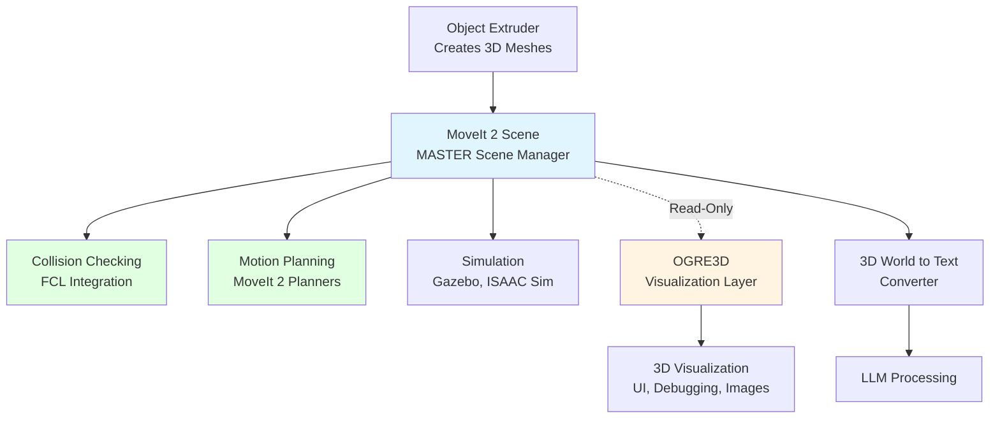
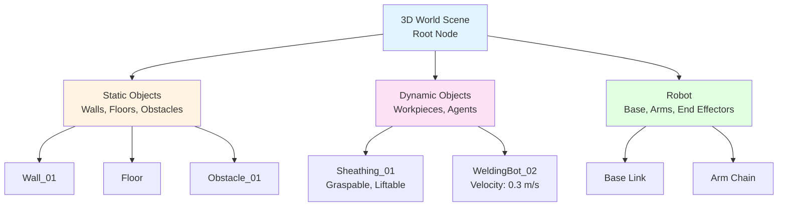

# 3D World Scene

The 3D World Scene is a comprehensive, unified representation of the robot's environment that combines geometric meshes with semantic metadata. It serves as the master scene representation for collision checking, simulation, and LLM reasoning.

## Architecture Decision: MoveIt2 Scene vs OGRE3D

### Recommendation: **MoveIt2 Scene as Master**

**MoveIt2 Scene should be the master** because:

1. **Native ROS 2 Integration**: Built specifically for ROS 2 and MoveIt 2
2. **Collision Checking**: Built-in FCL (Flexible Collision Library) integration
3. **Motion Planning**: Direct integration with motion planning pipelines
4. **Simulation Ready**: Works with Gazebo, ISAAC Sim, and other simulators
5. **Proven in Production**: Used extensively in industrial robotics
6. **Active Maintenance**: Active development and ROS 2 community support

### OGRE3D: Optional Visualization Layer

**OGRE3D can be used as a visualization layer** (not master):

- **Headless Rendering**: OGRE3D supports headless rendering for image generation
- **High-Quality Graphics**: Better for visualization and debugging
- **Use Case**: Optional visualization UI, image generation for documentation
- **Architecture**: OGRE3D reads from MoveIt2 Scene for visualization, does NOT modify scene

### Architecture



## MoveIt2 Scene Implementation

### Scene Manager

MoveIt 2 uses `moveit_core::PlanningScene` as the scene manager, which maintains:
- **Collision Objects**: 3D meshes with collision geometries
- **Attached Objects**: Objects attached to robot links
- **World Objects**: Static and dynamic objects in the environment
- **Scene Graph**: Hierarchical representation of objects

### Scene Structure

```cpp
#include <moveit/planning_scene/planning_scene.h>
#include <moveit/planning_scene_interface/planning_scene_interface.h>
#include <moveit_msgs/msg/collision_object.hpp>
#include <shape_msgs/msg/mesh.hpp>

class World3DSceneManager {
public:
    World3DSceneManager(rclcpp::Node::SharedPtr node) {
        node_ = node;
        
        // Initialize MoveIt 2 Planning Scene Interface
        planning_scene_interface_ = std::make_shared<
            moveit::planning_interface::PlanningSceneInterface
        >();
        
        // Initialize scene monitor for collision checking
        scene_monitor_ = std::make_shared<planning_scene_monitor::PlanningSceneMonitor>(
            node_, "robot_description"
        );
        
        // Publisher for scene updates
        scene_pub_ = node_->create_publisher<moveit_msgs::msg::PlanningScene>(
            "/planning_scene", 10
        );
    }
    
    // Add object to scene
    void addObjectToScene(
        const std::string& object_id,
        const shape_msgs::msg::Mesh& mesh,
        const geometry_msgs::msg::Pose& pose,
        const ObjectMetadata& metadata
    );
    
    // Remove object from scene
    void removeObjectFromScene(const std::string& object_id);
    
    // Update object pose
    void updateObjectPose(
        const std::string& object_id,
        const geometry_msgs::msg::Pose& pose
    );
    
    // Get scene for collision checking
    planning_scene::PlanningScenePtr getPlanningScene();
    
private:
    rclcpp::Node::SharedPtr node_;
    moveit::planning_interface::PlanningSceneInterfacePtr planning_scene_interface_;
    planning_scene_monitor::PlanningSceneMonitorPtr scene_monitor_;
    rclcpp::Publisher<moveit_msgs::msg::PlanningScene>::SharedPtr scene_pub_;
    
    // Metadata storage
    std::map<std::string, ObjectMetadata> object_metadata_;
};
```

## Object Metadata Structure

```cpp
struct ObjectMetadata {
    std::string id;
    std::string object_class;  // "workpiece", "obstacle", "agent", etc.
    geometry_msgs::msg::Pose pose;
    geometry_msgs::msg::Vector3 dimensions;
    
    // Semantic properties
    std::vector<std::string> affordances;  // ["graspable", "liftable"]
    std::string material_type;
    double hazard_level;  // 0.0 to 1.0
    
    // Motion information (for agents)
    geometry_msgs::msg::Twist velocity;
    geometry_msgs::msg::Accel acceleration;
    std::vector<geometry_msgs::msg::PoseStamped> predicted_trajectory;
    
    // Timestamp
    rclcpp::Time timestamp;
    std::string frame_id;
};
```

## Adding Objects to 3D World Scene

### Complete Example: From Object Extruder to 3D World

```python
import rclpy
from rclpy.node import Node
from robocon_tsbt_vla_msgs.msg import Mesh3D, ObjectMetadata
from moveit_msgs.msg import CollisionObject, PlanningScene
from shape_msgs.msg import Mesh, MeshTriangle
from geometry_msgs.msg import Pose, Point, Quaternion
import numpy as np

class ObjectExtruderToWorld3D(Node):
    def __init__(self):
        super().__init__('object_extruder_to_world_3d')
        
        # Subscribe to Object Extruder output
        self.mesh_sub = self.create_subscription(
            Mesh3D,
            '/object_extruder/mesh_3d',
            self.mesh_callback,
            10
        )
        
        # Publisher for MoveIt 2 Planning Scene
        self.scene_pub = self.create_publisher(
            PlanningScene,
            '/planning_scene',
            10
        )
        
        # Scene interface
        from moveit.planning_interface import PlanningSceneInterface
        self.planning_scene = PlanningSceneInterface()
        
        self.get_logger().info('3D World Scene Manager Started')
    
    def mesh_callback(self, msg: Mesh3D):
        """Add mesh from Object Extruder to 3D World Scene"""
        
        try:
            # Step 1: Convert Mesh3D to MoveIt 2 CollisionObject
            collision_object = self._mesh_to_collision_object(msg)
            
            # Step 2: Add to Planning Scene
            self.planning_scene.apply_collision_object(collision_object)
            
            # Step 3: Store metadata
            self._store_metadata(msg)
            
            # Step 4: Publish scene update
            scene_msg = PlanningScene()
            scene_msg.world.collision_objects.append(collision_object)
            scene_msg.is_diff = True
            self.scene_pub.publish(scene_msg)
            
            self.get_logger().info(
                f'Added object {msg.object_id} to 3D World Scene'
            )
            
        except Exception as e:
            self.get_logger().error(f'Error adding object to scene: {e}')
    
    def _mesh_to_collision_object(self, mesh_msg: Mesh3D) -> CollisionObject:
        """Convert Mesh3D message to MoveIt 2 CollisionObject"""
        
        collision_object = CollisionObject()
        collision_object.id = mesh_msg.object_id
        collision_object.header = mesh_msg.header
        collision_object.operation = CollisionObject.ADD
        
        # Create shape_msgs::Mesh from Mesh3D
        mesh = Mesh()
        
        # Convert vertices
        for vertex in mesh_msg.vertices:
            point = Point()
            point.x = float(vertex.x)
            point.y = float(vertex.y)
            point.z = float(vertex.z)
            mesh.vertices.append(point)
        
        # Convert triangles/faces
        for face in mesh_msg.faces:
            triangle = MeshTriangle()
            triangle.vertex_indices = [int(face.v1), int(face.v2), int(face.v3)]
            mesh.triangles.append(triangle)
        
        # Set mesh primitive
        from shape_msgs.msg import SolidPrimitive
        collision_object.meshes.append(mesh)
        collision_object.mesh_poses.append(mesh_msg.pose)
        
        return collision_object
    
    def _store_metadata(self, mesh_msg: Mesh3D):
        """Store object metadata for semantic reasoning"""
        
        metadata = {
            'id': mesh_msg.object_id,
            'class': mesh_msg.object_class,
            'pose': mesh_msg.pose,
            'affordances': list(mesh_msg.affordances),
            'material_type': mesh_msg.material_type,
            'hazard_level': mesh_msg.hazard_level,
            'timestamp': self.get_clock().now(),
            'frame_id': mesh_msg.header.frame_id
        }
        
        # Store in internal database or publish to metadata topic
        self._publish_metadata(metadata)
    
    def _publish_metadata(self, metadata: dict):
        """Publish metadata for 3D World to Text Converter"""
        
        from robocon_tsbt_vla_msgs.msg import ObjectMetadata as MetadataMsg
        
        metadata_msg = MetadataMsg()
        metadata_msg.object_id = metadata['id']
        metadata_msg.object_class = metadata['class']
        metadata_msg.pose = metadata['pose']
        metadata_msg.affordances = metadata['affordances']
        metadata_msg.material_type = metadata['material_type']
        metadata_msg.hazard_level = metadata['hazard_level']
        metadata_msg.timestamp = metadata['timestamp']
        metadata_msg.frame_id = metadata['frame_id']
        
        # Publish to metadata topic (for Text Converter)
        # metadata_pub.publish(metadata_msg)
```

### C++ Example: Adding Object to Scene

```cpp
#include <moveit_msgs/msg/collision_object.hpp>
#include <moveit_msgs/msg/planning_scene.hpp>
#include <shape_msgs/msg/mesh.hpp>
#include <rclcpp/rclcpp.hpp>

class World3DSceneManager : public rclcpp::Node {
public:
    World3DSceneManager() : Node("world_3d_scene_manager") {
        scene_pub_ = this->create_publisher<moveit_msgs::msg::PlanningScene>(
            "/planning_scene", 10
        );
        
        mesh_sub_ = this->create_subscription<robocon_tsbt_vla_msgs::msg::Mesh3D>(
            "/object_extruder/mesh_3d",
            10,
            std::bind(&World3DSceneManager::mesh_callback, this, std::placeholders::_1)
        );
    }
    
private:
    void mesh_callback(const robocon_tsbt_vla_msgs::msg::Mesh3D::SharedPtr msg) {
        // Convert to CollisionObject
        moveit_msgs::msg::CollisionObject collision_object;
        collision_object.id = msg->object_id;
        collision_object.header = msg->header;
        collision_object.operation = moveit_msgs::msg::CollisionObject::ADD;
        
        // Convert mesh
        shape_msgs::msg::Mesh mesh;
        for (const auto& vertex : msg->vertices) {
            geometry_msgs::msg::Point point;
            point.x = vertex.x;
            point.y = vertex.y;
            point.z = vertex.z;
            mesh.vertices.push_back(point);
        }
        
        for (const auto& face : msg->faces) {
            shape_msgs::msg::MeshTriangle triangle;
            triangle.vertex_indices = {face.v1, face.v2, face.v3};
            mesh.triangles.push_back(triangle);
        }
        
        collision_object.meshes.push_back(mesh);
        collision_object.mesh_poses.push_back(msg->pose);
        
        // Publish scene update
        moveit_msgs::msg::PlanningScene scene;
        scene.world.collision_objects.push_back(collision_object);
        scene.is_diff = true;
        scene_pub_->publish(scene);
        
        RCLCPP_INFO(this->get_logger(), "Added object %s to 3D World Scene", 
                    msg->object_id.c_str());
    }
    
    rclcpp::Publisher<moveit_msgs::msg::PlanningScene>::SharedPtr scene_pub_;
    rclcpp::Subscription<robocon_tsbt_vla_msgs::msg::Mesh3D>::SharedPtr mesh_sub_;
};
```

## Scene Graph Structure

The 3D World Scene maintains a hierarchical scene graph:



## Collision Checking

MoveIt 2 Scene provides built-in collision checking:

```cpp
#include <moveit/collision_detection/collision_common.h>
#include <moveit/planning_scene/planning_scene.h>

bool checkCollision(
    planning_scene::PlanningScenePtr scene,
    const std::string& object_id_1,
    const std::string& object_id_2
) {
    collision_detection::CollisionRequest request;
    collision_detection::CollisionResult result;
    
    // Check collision between objects
    scene->checkCollision(request, result);
    
    return result.collision;
}

bool checkRobotCollision(
    planning_scene::PlanningScenePtr scene,
    const robot_state::RobotState& robot_state,
    const std::string& object_id
) {
    collision_detection::CollisionRequest request;
    collision_detection::CollisionResult result;
    
    // Check robot collision with object
    scene->checkCollision(request, result, robot_state);
    
    return result.collision;
}
```

## Scene Query Operations

### Get Object by ID

```python
def get_object(self, object_id: str) -> Optional[CollisionObject]:
    """Get object from scene by ID"""
    objects = self.planning_scene.get_objects()
    return objects.get(object_id, None)
```

### Get Objects by Class

```python
def get_objects_by_class(self, object_class: str) -> List[CollisionObject]:
    """Get all objects of a specific class"""
    objects = []
    for obj_id, metadata in self.object_metadata_.items():
        if metadata['class'] == object_class:
            obj = self.get_object(obj_id)
            if obj:
                objects.append(obj)
    return objects
```

### Spatial Queries

```python
def get_objects_in_range(
    self, 
    center: Point, 
    radius: float
) -> List[CollisionObject]:
    """Get objects within radius of center point"""
    objects = []
    for obj_id, metadata in self.object_metadata_.items():
        obj_center = metadata['pose'].position
        distance = self._euclidean_distance(center, obj_center)
        if distance <= radius:
            obj = self.get_object(obj_id)
            if obj:
                objects.append(obj)
    return objects
```

## Integration with 3D World to Text Converter

The 3D World Scene is converted to text for LLM processing:

```python
class SceneToTextConverter:
    def convert_scene_to_text(self, scene: PlanningScene) -> str:
        """Convert 3D World Scene to text description"""
        text_parts = []
        
        # Get all objects
        objects = self.planning_scene.get_objects()
        
        for obj_id, obj in objects.items():
            metadata = self.object_metadata_.get(obj_id, {})
            
            # Generate text description
            desc = self._object_to_text(obj, metadata)
            text_parts.append(desc)
        
        # Add spatial relationships
        relationships = self._compute_spatial_relationships(objects)
        text_parts.extend(relationships)
        
        return "\n".join(text_parts)
```

## Configuration

```yaml
world_3d_scene:
  frame_id: "map"  # World frame
  
  collision_checking:
    enabled: true
    check_frequency: 10.0  # Hz
    
  update_rate: 1.0  # Hz - Scene update frequency
  
  mesh_quality:
    max_faces_per_object: 10000
    decimation_threshold: 50000
    
  metadata:
    enable_motion_tracking: true
    motion_prediction_horizon: 5.0  # seconds
```

## ROS 2 Topics

**Input**:
- `/object_extruder/mesh_3d` (robocon_tsbt_vla_msgs/Mesh3D) - Meshes from Object Extruder

**Output**:
- `/planning_scene` (moveit_msgs/msg/PlanningScene) - Scene updates
- `/world_3d_scene/metadata` (robocon_tsbt_vla_msgs/ObjectMetadata) - Object metadata

**Services**:
- `/world_3d_scene/add_object` - Add object to scene
- `/world_3d_scene/remove_object` - Remove object from scene
- `/world_3d_scene/get_object` - Get object by ID
- `/world_3d_scene/query_objects` - Spatial queries

## Next Steps

- [Object Extruder](object-extruder.md) - Creating 3D meshes from polygons
- [3D World to Text Converter](../../tsbt-vla-system/3d-world-to-text.md) - Converting scene to text

