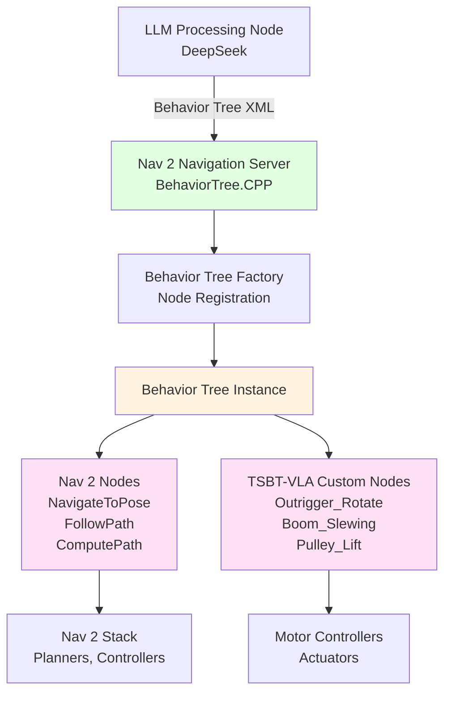

# Behavior Tree Execution with Nav 2 and BehaviorTree.CPP

This document covers the implementation of behavior tree execution using **ROS 2 Nav 2 Navigation Server** and **BehaviorTree.CPP v4.6**.

## Overview

The Navigation Server hosts and executes behavior trees generated by the LLM. It uses BehaviorTree.CPP v4.6 for tree execution and integrates with ROS 2 Nav 2 for navigation actions.

## Architecture



## Nav 2 Integration

### Navigation Server Setup

```python
import rclpy
from rclpy.node import Node
from nav2_msgs.action import NavigateToPose
from rclpy.action import ActionClient
from behaviortree_cpp_v3 import BehaviorTreeFactory, TreeNode

class NavigationServerNode(Node):
    def __init__(self):
        super().__init__('navigation_server_node')
        
        # Nav 2 action clients
        self.navigate_to_pose_client = ActionClient(
            self,
            NavigateToPose,
            'navigate_to_pose'
        )
        
        # Behavior Tree factory
        self.bt_factory = BehaviorTreeFactory()
        self.register_nodes()
        
        # Behavior tree instance
        self.bt_tree = None
    
    def register_nodes(self):
        # Register Nav 2 nodes
        self.bt_factory.registerNodeType("NavigateToPose", NavigateToPoseBTNode)
        self.bt_factory.registerNodeType("ComputePathToPose", ComputePathToPoseBTNode)
        self.bt_factory.registerNodeType("FollowPath", FollowPathBTNode)
        
        # Register TSBT-VLA custom nodes
        self.bt_factory.registerNodeType("Outrigger_Rotate", OutriggerRotateBTNode)
        self.bt_factory.registerNodeType("Boom_Slewing", BoomSlewingBTNode)
        self.bt_factory.registerNodeType("Pulley_Lift", PulleyLiftBTNode)
        
        # Register custom control nodes
        self.bt_factory.registerNodeType("PromptInput", PromptInputBTNode)
        self.bt_factory.registerNodeType("RecoveryNode", RecoveryNodeBTNode)
```

## BehaviorTree.CPP Integration

### Custom Node Implementation

#### Nav 2 Action Node (NavigateToPose)

```cpp
#include <behaviortree_cpp_v3/bt_factory.h>
#include <rclcpp/rclcpp.hpp>
#include <nav2_msgs/action/navigate_to_pose.hpp>
#include <rclcpp_action/rclcpp_action.hpp>

class NavigateToPoseBTNode : public BT::SyncActionNode {
public:
    NavigateToPoseBTNode(const std::string& name, const BT::NodeConfiguration& config)
        : BT::SyncActionNode(name, config) {
        // Initialize Nav 2 action client
        node_ = rclcpp::Node::make_shared("navigate_to_pose_bt_node");
        action_client_ = rclcpp_action::create_client<nav2_msgs::action::NavigateToPose>(
            node_, "navigate_to_pose"
        );
    }
    
    static BT::PortsList providedPorts() {
        return {BT::InputPort<geometry_msgs::msg::PoseStamped>("goal")};
    }
    
    BT::NodeStatus tick() override {
        geometry_msgs::msg::PoseStamped goal;
        if (!getInput("goal", goal)) {
            return BT::NodeStatus::FAILURE;
        }
        
        // Send goal to Nav 2
        auto goal_msg = nav2_msgs::action::NavigateToPose::Goal();
        goal_msg.pose = goal;
        
        auto send_goal_options = rclcpp_action::Client<nav2_msgs::action::NavigateToPose>::SendGoalOptions();
        send_goal_options.result_callback = [](const auto& result) {
            // Handle result
        };
        
        auto future = action_client_->async_send_goal(goal_msg, send_goal_options);
        
        // Wait for result
        auto result = future.get();
        if (result.code == rclcpp_action::ResultCode::SUCCEEDED) {
            return BT::NodeStatus::SUCCESS;
        } else {
            return BT::NodeStatus::FAILURE;
        }
    }

private:
    rclcpp::Node::SharedPtr node_;
    rclcpp_action::Client<nav2_msgs::action::NavigateToPose>::SharedPtr action_client_;
};
```

#### TSBT-VLA Custom Node (Outrigger_Rotate)

```cpp
#include <behaviortree_cpp_v3/bt_factory.h>
#include <rclcpp/rclcpp.hpp>
#include <geometry_msgs/msg/twist.hpp>

class OutriggerRotateBTNode : public BT::SyncActionNode {
public:
    OutriggerRotateBTNode(const std::string& name, const BT::NodeConfiguration& config)
        : BT::SyncActionNode(name, config) {
        node_ = rclcpp::Node::make_shared("outrigger_rotate_bt_node");
        publisher_ = node_->create_publisher<geometry_msgs::msg::Twist>(
            "/outrigger/rotate", 10
        );
    }
    
    static BT::PortsList providedPorts() {
        return {BT::InputPort<double>("rotation")};
    }
    
    BT::NodeStatus tick() override {
        double rotation;
        if (!getInput("rotation", rotation)) {
            return BT::NodeStatus::FAILURE;
        }
        
        // Publish rotation command
        auto msg = geometry_msgs::msg::Twist();
        msg.angular.z = rotation;
        publisher_->publish(msg);
        
        // Wait for completion (simplified)
        rclcpp::sleep_for(std::chrono::seconds(1));
        
        return BT::NodeStatus::SUCCESS;
    }

private:
    rclcpp::Node::SharedPtr node_;
    rclcpp::Publisher<geometry_msgs::msg::Twist>::SharedPtr publisher_;
};
```

### Custom Control Nodes

#### PromptInput Node (for recursive decomposition)

```cpp
class PromptInputBTNode : public BT::SyncActionNode {
public:
    PromptInputBTNode(const std::string& name, const BT::NodeConfiguration& config)
        : BT::SyncActionNode(name, config) {}
    
    static BT::PortsList providedPorts() {
        return {BT::InputPort<std::string>("prompt_input")};
    }
    
    BT::NodeStatus tick() override {
        std::string prompt;
        if (!getInput("prompt_input", prompt)) {
            return BT::NodeStatus::FAILURE;
        }
        
        // Send to LLM for subtree generation
        // This would trigger LLM processing
        // For now, mark as running and let parent handle
        
        return BT::NodeStatus::RUNNING;
    }
};
```

## Loading and Executing Behavior Trees

### Python Implementation

```python
from behaviortree_cpp_v3 import BehaviorTreeFactory
from std_msgs.msg import String

class BehaviorTreeExecutor:
    def __init__(self, node):
        self.node = node
        self.factory = BehaviorTreeFactory()
        self.register_nodes()
        self.tree = None
    
    def register_nodes(self):
        # Register all custom nodes
        pass
    
    def load_tree_from_xml(self, xml_string):
        """Load behavior tree from LLM-generated XML"""
        self.tree = self.factory.createTreeFromText(xml_string)
        self.node.get_logger().info("Behavior tree loaded from XML")
    
    def execute_tick(self):
        """Execute one tick of the behavior tree"""
        if self.tree is None:
            return
        
        status = self.tree.tickRoot()
        return status
```

### Subtree Insertion

```python
def insert_subtree(self, parent_node_name, subtree_xml):
    """Insert a generated subtree into the main tree"""
    subtree = self.factory.createTreeFromText(subtree_xml)
    
    # Find parent node in main tree
    parent_node = self.tree.findNode(parent_node_name)
    if parent_node:
        # Insert subtree as child
        parent_node.addChild(subtree.rootNode())
        self.node.get_logger().info(f"Inserted subtree under {parent_node_name}")
```

## ROS 2 Integration

### Topics

| Topic | Type | Description |
|-------|------|-------------|
| `/navigation_server/behavior_tree/xml` | `std_msgs/String` | Receive behavior tree XML |
| `/navigation_server/behavior_tree/status` | `std_msgs/String` | Tree execution status |

### Services

| Service | Type | Description |
|---------|------|-------------|
| `/navigation_server/load_tree` | Custom | Load behavior tree from XML |
| `/navigation_server/insert_subtree` | Custom | Insert subtree into tree |

## Launch File

```xml
<launch>
    <!-- Nav 2 Bringup -->
    <include file="$(find nav2_bringup)/launch/navigation2.launch.py">
        <arg name="use_sim_time" value="false"/>
    </include>
    
    <!-- Navigation Server with Behavior Tree -->
    <node pkg="robocon_navigation_server" 
          exec="navigation_server_node" 
          name="navigation_server_node">
        <param name="bt_factory_path" value="$(find robocon_navigation_server)/config/nodes.xml"/>
    </node>
</launch>
```

## Configuration

```yaml
navigation_server:
  behavior_tree:
    library: "behaviortree_cpp_v3"
    version: "4.6"
    execution_rate: 10.0  # Hz
    
  nav2:
    enabled: true
    planner: "nav2_navfn_planner"
    controller: "nav2_dwb_controller"
    
  custom_nodes:
    - "Outrigger_Rotate"
    - "Outrigger_Extend"
    - "Boom_Slewing"
    - "Boom_Lift"
    - "Pulley_Lift"
    - "Hook_Release"
```

## Recursive Decomposition

When a high-level action node is encountered:

1. **Detect High-Level Node**: PromptInput or custom high-level node
2. **Extract Action**: Get the action description
3. **Request LLM Subtree**: Send to LLM processing node
4. **Receive Subtree**: Get generated XML
5. **Insert Subtree**: Replace high-level node with generated subtree
6. **Continue Execution**: Continue ticking the tree

## Next Steps

- [TSBT-VLA Implementation Overview](overview.md) - Complete implementation guide
- [Track 4: DeepSeek LLM](track4-deepseek-llm.md) - LLM integration
- [Nav 2 Integration](../../nav2-integration.md) - Nav 2 overview

