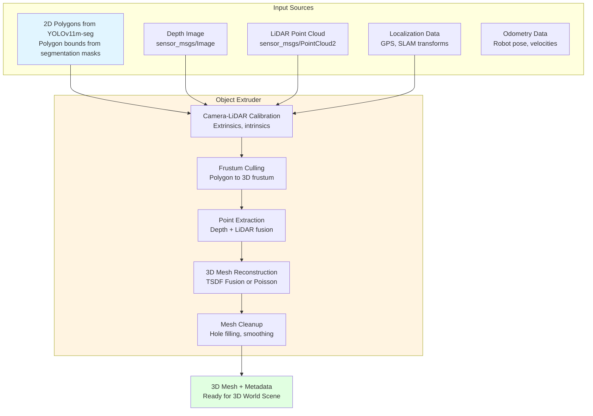

# Object Extruder

The Object Extruder transforms 2D polygons (or pixel masks) from YOLOv11m-seg into watertight 3D meshes by fusing segmentation data with LiDAR point clouds and depth camera information.

## Overview

The Object Extruder is a critical component that bridges 2D object detection and 3D scene understanding. It takes polygon bounds from YOLOv11m-seg segmentation masks and combines them with spatial sensor data to create accurate 3D meshes for the 3D World Scene.

**Key Advantage**: Using YOLOv11m-seg polygon bounds is faster than pixel masks because:
- Polygons are already simplified geometric representations
- Less data to process (dozens of vertices vs. thousands of pixels)
- Direct geometric operations without mask rasterization overhead
- Better suited for frustum-based point cloud extraction

## Architecture



## Input Format

### Polygon Input from YOLOv11m-seg

YOLOv11m-seg outputs instance segmentation masks that can be exported as polygon bounds:

```python
from ultralytics import YOLO
import numpy as np

model = YOLO("yolov11m-seg.pt")  # Segmentation model
results = model("image.jpg")

# Extract polygon bounds for each detected object
for r in results:
    # Get segmentation masks
    if r.masks is not None:
        for i, mask in enumerate(r.masks):
            # Method 1: Get polygon from mask data
            mask_data = mask.data.cpu().numpy()
            contours, _ = cv2.findContours(
                (mask_data * 255).astype(np.uint8),
                cv2.RETR_EXTERNAL,
                cv2.CHAIN_APPROX_SIMPLE
            )
            
            # Simplify contour to polygon
            epsilon = 0.02 * cv2.arcLength(contours[0], True)
            polygon = cv2.approxPolyDP(contours[0], epsilon, True)
            
            # Polygon format: list of (x, y) tuples in image coordinates
            polygon_points = [(p[0][0], p[0][1]) for p in polygon]
            
            # Get bounding box
            bbox = r.boxes[i].xyxy[0].cpu().numpy()
            
            # Object metadata
            class_id = int(r.boxes[i].cls[0])
            confidence = float(r.boxes[i].conf[0])
            
            # Send to Object Extruder
            extruder_input = {
                "polygon": polygon_points,
                "bbox": bbox,
                "class_id": class_id,
                "class_name": model.names[class_id],
                "confidence": confidence,
                "image_timestamp": r.boxes[i].timestamp,
                "image_frame_id": "camera_optical_frame"
            }
```

### ROS 2 Message Format

```cpp
// robocon_tsbt_vla_msgs/msg/Polygon3DInput.msg
std_msgs/Header header
geometry_msgs/Polygon polygon_2d  // Polygon in image coordinates
geometry_msgs/PoseStamped camera_pose  // Camera pose at detection time
string object_class
float32 confidence
sensor_msgs/Image depth_image  // Corresponding depth image
sensor_msgs/PointCloud2 lidar_cloud  // LiDAR point cloud
```

## Processing Pipeline

### Step 1: Camera-LiDAR Calibration

**Purpose**: Establish coordinate transformations between camera, LiDAR, and world frames.

```python
import tf2_ros
import numpy as np
from scipy.spatial.transform import Rotation

class CameraLidarCalibration:
    def __init__(self, tf_buffer):
        self.tf_buffer = tf_buffer
        
    def get_extrinsics(self, camera_frame, lidar_frame):
        """Get transformation from LiDAR to camera frame"""
        try:
            transform = self.tf_buffer.lookup_transform(
                camera_frame,
                lidar_frame,
                rclpy.time.Time()
            )
            t = transform.transform.translation
            q = transform.transform.rotation
            return self.transform_to_matrix(t, q)
        except tf2_ros.TransformException as e:
            self.get_logger().error(f"Transform error: {e}")
            return None
    
    def get_camera_intrinsics(self):
        """Get camera intrinsic matrix from calibration"""
        # Load from ROS 2 camera_info topic or parameter
        return np.array([
            [fx, 0, cx],
            [0, fy, cy],
            [0, 0, 1]
        ])
```

### Step 2: Frustum Culling

**Purpose**: Convert 2D polygon to 3D viewing frustum for efficient point cloud extraction.

```python
class FrustumCuller:
    def __init__(self, camera_intrinsics, image_width, image_height):
        self.K = camera_intrinsics
        self.width = image_width
        self.height = image_height
        
    def polygon_to_frustum(self, polygon_2d, depth_min, depth_max):
        """
        Convert 2D polygon to 3D viewing frustum.
        
        Args:
            polygon_2d: List of (x, y) image coordinates
            depth_min: Minimum depth in meters
            depth_max: Maximum depth in meters
            
        Returns:
            frustum_planes: 6 planes defining the frustum
        """
        # Convert polygon to normalized camera coordinates
        normalized_points = []
        for x, y in polygon_2d:
            # Undistort if needed (assuming already corrected)
            x_norm = (x - self.K[0, 2]) / self.K[0, 0]
            y_norm = (y - self.K[1, 2]) / self.K[1, 1]
            normalized_points.append([x_norm, y_norm])
        
        # Create frustum planes
        # Near plane: z = depth_min
        # Far plane: z = depth_max
        # Side planes: from polygon edges
        
        frustum_planes = self._compute_frustum_planes(
            normalized_points, depth_min, depth_max
        )
        
        return frustum_planes
    
    def _compute_frustum_planes(self, points_2d, z_near, z_far):
        """Compute 6 planes: near, far, and 4 side planes"""
        planes = []
        
        # Near and far planes
        planes.append(np.array([0, 0, 1, -z_near]))  # Near: z = z_near
        planes.append(np.array([0, 0, -1, z_far]))   # Far: z = -z_far
        
        # Side planes from polygon edges
        origin = np.array([0, 0, 0])
        for i in range(len(points_2d)):
            p1 = np.array([points_2d[i][0], points_2d[i][1], z_near])
            p2 = np.array([points_2d[(i+1) % len(points_2d)][0], 
                           points_2d[(i+1) % len(points_2d)][1], z_near])
            
            # Plane through origin, p1, p2
            normal = np.cross(p1, p2)
            normal = normal / np.linalg.norm(normal)
            d = 0  # Plane passes through origin
            planes.append(np.append(normal, d))
        
        return np.array(planes)
```

### Step 3: Point Cloud Extraction

**Purpose**: Extract relevant 3D points from depth image and LiDAR within the frustum.

```python
import open3d as o3d
from sensor_msgs.msg import PointCloud2
from sensor_msgs_py import point_cloud2

class PointExtractor:
    def __init__(self, calibration):
        self.calibration = calibration
        
    def extract_from_depth(self, depth_image, polygon_2d, camera_intrinsics):
        """
        Extract 3D points from depth image within polygon.
        
        Args:
            depth_image: sensor_msgs/Image (depth/range image)
            polygon_2d: List of (x, y) image coordinates
            camera_intrinsics: Camera intrinsic matrix
            
        Returns:
            points_3d: Nx3 numpy array of 3D points in camera frame
        """
        # Convert depth image to numpy
        depth_array = self._image_to_array(depth_image)
        height, width = depth_array.shape
        
        # Create binary mask from polygon
        mask = np.zeros((height, width), dtype=np.uint8)
        polygon_array = np.array(polygon_2d, dtype=np.int32)
        cv2.fillPoly(mask, [polygon_array], 255)
        
        # Extract points
        points_3d = []
        fx, fy = camera_intrinsics[0, 0], camera_intrinsics[1, 1]
        cx, cy = camera_intrinsics[0, 2], camera_intrinsics[1, 2]
        
        for v in range(height):
            for u in range(width):
                if mask[v, u] > 0:
                    depth = depth_array[v, u]
                    if depth > 0 and not np.isnan(depth):
                        # Back-project to 3D
                        x = (u - cx) * depth / fx
                        y = (v - cy) * depth / fy
                        z = depth
                        points_3d.append([x, y, z])
        
        return np.array(points_3d)
    
    def extract_from_lidar(self, lidar_cloud, frustum_planes, transform_lidar_to_camera):
        """
        Extract LiDAR points within frustum.
        
        Args:
            lidar_cloud: sensor_msgs/PointCloud2
            frustum_planes: Frustum planes in camera frame
            transform_lidar_to_camera: 4x4 transformation matrix
            
        Returns:
            points_3d: Nx3 numpy array in camera frame
        """
        # Convert ROS 2 point cloud to Open3D
        points = point_cloud2.read_points(
            lidar_cloud, field_names=("x", "y", "z"), skip_nans=True
        )
        points_array = np.array(list(points))
        
        # Transform to camera frame
        points_homogeneous = np.column_stack([points_array, np.ones(len(points_array))])
        points_camera = (transform_lidar_to_camera @ points_homogeneous.T).T[:, :3]
        
        # Frustum culling
        points_in_frustum = []
        for point in points_camera:
            inside = True
            for plane in frustum_planes:
                # Plane equation: ax + by + cz + d = 0
                # Point is inside if distance is positive
                distance = np.dot(plane[:3], point) + plane[3]
                if distance < 0:
                    inside = False
                    break
            if inside:
                points_in_frustum.append(point)
        
        return np.array(points_in_frustum)
    
    def fuse_points(self, depth_points, lidar_points):
        """
        Fuse points from depth and LiDAR.
        
        Args:
            depth_points: Nx3 array from depth camera
            lidar_points: Mx3 array from LiDAR
            
        Returns:
            fused_points: Combined point cloud
        """
        # Combine point clouds
        all_points = np.vstack([depth_points, lidar_points])
        
        # Remove duplicates using voxel downsampling
        pcd = o3d.geometry.PointCloud()
        pcd.points = o3d.utility.Vector3dVector(all_points)
        
        # Voxel downsampling to remove duplicates and noise
        pcd_downsampled = pcd.voxel_down_sample(voxel_size=0.01)  # 1cm voxel
        
        return np.asarray(pcd_downsampled.points)
```

### Step 4: 3D Mesh Reconstruction

**Purpose**: Create watertight 3D mesh from point cloud.

```python
class MeshReconstructor:
    def __init__(self, method='tsdf'):
        self.method = method
        
    def reconstruct_mesh(self, point_cloud, method='tsdf'):
        """
        Reconstruct 3D mesh from point cloud.
        
        Methods:
        - 'tsdf': TSDF (Truncated Signed Distance Function) fusion - fast, robust
        - 'poisson': Poisson Surface Reconstruction - accurate, smooth
        - 'alpha_shapes': Alpha Shapes - good for concave geometry
        - 'ball_pivoting': Ball-Pivoting Algorithm - handles thin objects
        
        Args:
            point_cloud: Nx3 numpy array or Open3D PointCloud
            method: Reconstruction method
            
        Returns:
            mesh: Open3D TriangleMesh
        """
        if isinstance(point_cloud, np.ndarray):
            pcd = o3d.geometry.PointCloud()
            pcd.points = o3d.utility.Vector3dVector(point_cloud)
            
            # Estimate normals
            pcd.estimate_normals(
                search_param=o3d.geometry.KDTreeSearchParamHybrid(
                    radius=0.1, max_nn=30
                )
            )
            pcd.orient_normals_consistent_tangent_plane(k=15)
        else:
            pcd = point_cloud
        
        if method == 'tsdf':
            return self._reconstruct_tsdf(pcd)
        elif method == 'poisson':
            return self._reconstruct_poisson(pcd)
        elif method == 'alpha_shapes':
            return self._reconstruct_alpha_shapes(pcd)
        elif method == 'ball_pivoting':
            return self._reconstruct_ball_pivoting(pcd)
        else:
            raise ValueError(f"Unknown method: {method}")
    
    def _reconstruct_tsdf(self, pcd):
        """TSDF fusion - fast and robust for real-time applications"""
        # Create TSDF volume
        volume = o3d.pipelines.integration.ScalableTSDFVolume(
            voxel_length=0.005,  # 5mm voxels
            sdf_trunc=0.04,      # 4cm truncation distance
            color_type=o3d.pipelines.integration.TSDFVolumeColorType.RGB8
        )
        
        # Create dummy camera pose (identity)
        camera_pose = np.eye(4)
        
        # Convert point cloud to RGBD image (simplified)
        # In real implementation, use actual RGBD from camera
        rgbd_image = self._pointcloud_to_rgbd(pcd)
        
        # Integrate into TSDF
        volume.integrate(rgbd_image, self._get_camera_intrinsics(), camera_pose)
        
        # Extract mesh
        mesh = volume.extract_triangle_mesh()
        
        return mesh
    
    def _reconstruct_poisson(self, pcd):
        """Poisson Surface Reconstruction - accurate and smooth"""
        mesh, densities = o3d.geometry.TriangleMesh.create_from_point_cloud_poisson(
            pcd, depth=9
        )
        
        # Remove low density vertices (outliers)
        vertices_to_remove = densities < np.quantile(densities, 0.01)
        mesh.remove_vertices_by_mask(vertices_to_remove)
        
        return mesh
    
    def _reconstruct_alpha_shapes(self, pcd):
        """Alpha Shapes - good for concave geometry"""
        alpha = 0.03  # Adjust based on point density
        mesh = o3d.geometry.TriangleMesh.create_from_point_cloud_alpha_shape(
            pcd, alpha
        )
        return mesh
    
    def _reconstruct_ball_pivoting(self, pcd):
        """Ball-Pivoting Algorithm - handles thin objects well"""
        # Estimate radius for ball pivoting
        distances = pcd.compute_nearest_neighbor_distance()
        avg_dist = np.mean(distances)
        radius = 3 * avg_dist
        
        radii = [radius, radius * 2, radius * 4]
        mesh = o3d.geometry.TriangleMesh.create_from_point_cloud_ball_pivoting(
            pcd, o3d.utility.DoubleVector(radii)
        )
        return mesh
```

### Step 5: Mesh Cleanup

**Purpose**: Post-process mesh for quality and completeness.

```python
class MeshCleanup:
    def cleanup_mesh(self, mesh):
        """
        Clean up and optimize mesh.
        
        Operations:
        - Remove duplicate vertices/faces
        - Fill holes
        - Smooth surface
        - Decimate if needed
        """
        # Remove duplicates
        mesh.remove_duplicated_vertices()
        mesh.remove_duplicated_triangles()
        mesh.remove_degenerate_triangles()
        mesh.remove_non_manifold_edges()
        
        # Fill holes
        mesh = mesh.fill_holes()
        
        # Smooth (Laplacian smoothing)
        mesh = mesh.filter_smooth_laplacian(
            number_of_iterations=5,
            lambda_filter=0.5
        )
        
        # Simplify if too many faces
        if len(mesh.triangles) > 50000:
            mesh = mesh.simplify_quadric_decimation(
                target_number_of_triangles=10000
            )
        
        # Compute normals
        mesh.compute_vertex_normals()
        mesh.compute_triangle_normals()
        
        return mesh
```

## Complete ROS 2 Implementation

```python
import rclpy
from rclpy.node import Node
from sensor_msgs.msg import Image, PointCloud2
from geometry_msgs.msg import Polygon, PoseStamped
from robocon_tsbt_vla_msgs.msg import Polygon3DInput, Mesh3D
import open3d as o3d
import numpy as np
import cv2

class ObjectExtruderNode(Node):
    def __init__(self):
        super().__init__('object_extruder_node')
        
        # Initialize components
        self.calibration = CameraLidarCalibration(self)
        self.frustum_culler = FrustumCuller(
            self.calibration.get_camera_intrinsics(),
            width=1920, height=1080
        )
        self.point_extractor = PointExtractor(self.calibration)
        self.mesh_reconstructor = MeshReconstructor(method='poisson')
        self.mesh_cleanup = MeshCleanup()
        
        # Subscribers
        self.polygon_sub = self.create_subscription(
            Polygon3DInput,
            '/object_segmentation/polygon_3d_input',
            self.polygon_callback,
            10
        )
        
        # Publishers
        self.mesh_pub = self.create_publisher(
            Mesh3D,
            '/object_extruder/mesh_3d',
            10
        )
        
    def polygon_callback(self, msg):
        """Process polygon input and create 3D mesh"""
        try:
            # Step 1: Extract polygon points
            polygon_2d = [(p.x, p.y) for p in msg.polygon_2d.points]
            
            # Step 2: Create frustum
            depth_min = 0.1  # 10cm
            depth_max = 20.0  # 20m
            frustum_planes = self.frustum_culler.polygon_to_frustum(
                polygon_2d, depth_min, depth_max
            )
            
            # Step 3: Extract points from depth
            depth_points = self.point_extractor.extract_from_depth(
                msg.depth_image,
                polygon_2d,
                self.calibration.get_camera_intrinsics()
            )
            
            # Step 4: Extract points from LiDAR
            transform_lidar_to_camera = self.calibration.get_extrinsics(
                msg.header.frame_id,
                msg.lidar_cloud.header.frame_id
            )
            lidar_points = self.point_extractor.extract_from_lidar(
                msg.lidar_cloud,
                frustum_planes,
                transform_lidar_to_camera
            )
            
            # Step 5: Fuse points
            fused_points = self.point_extractor.fuse_points(
                depth_points, lidar_points
            )
            
            if len(fused_points) < 100:
                self.get_logger().warn("Not enough points for mesh reconstruction")
                return
            
            # Step 6: Reconstruct mesh
            mesh = self.mesh_reconstructor.reconstruct_mesh(
                fused_points, method='poisson'
            )
            
            # Step 7: Cleanup
            mesh = self.mesh_cleanup.cleanup_mesh(mesh)
            
            # Step 8: Transform to world frame
            mesh = self._transform_to_world(mesh, msg.camera_pose)
            
            # Step 9: Create output message
            mesh_msg = self._mesh_to_message(mesh, msg)
            
            # Step 10: Publish
            self.mesh_pub.publish(mesh_msg)
            
        except Exception as e:
            self.get_logger().error(f"Error processing polygon: {e}")
```

## Integration with 3D World Scene

After creating a 3D mesh, the Object Extruder publishes it to the 3D World Scene for collision checking, motion planning, and text conversion.

### Example: Adding Mesh to 3D World Scene

```python
# After mesh reconstruction in Object Extruder
mesh_msg = Mesh3D()
mesh_msg.header.frame_id = "map"
mesh_msg.object_id = "sheathing_01"
mesh_msg.object_class = "sheathing"
mesh_msg.pose = camera_pose_in_world  # Transform to world frame
mesh_msg.vertices = [Point(x=v[0], y=v[1], z=v[2]) for v in mesh.vertices]
mesh_msg.faces = [Face(v1=f[0], v2=f[1], v3=f[2]) for f in mesh.triangles]
mesh_msg.affordances = ["graspable", "liftable"]
mesh_msg.material_type = "wood"
mesh_msg.confidence = msg.confidence

# Publish to 3D World Scene
mesh_pub.publish(mesh_msg)
```

**See**: [3D World Scene](3d-world-scene.md#adding-objects-to-3d-world-scene) for complete implementation examples.

## Configuration

```yaml
object_extruder:
  reconstruction:
    method: "poisson"  # tsdf, poisson, alpha_shapes, ball_pivoting
    depth_min: 0.1  # meters
    depth_max: 20.0  # meters
    
  mesh_quality:
    voxel_size: 0.01  # 1cm for point cloud downsampling
    max_faces: 10000  # Maximum faces after decimation
    smooth_iterations: 5
    
  fusion:
    depth_weight: 0.7  # Weight for depth camera points
    lidar_weight: 0.3  # Weight for LiDAR points
    
  performance:
    use_gpu: true  # Use GPU acceleration if available
    max_processing_time: 0.5  # seconds
```

## Performance Considerations

**Why Polygons are Faster**:

1. **Data Size**: 
   - Polygon: ~50-200 vertices (300-1200 floats)
   - Pixel mask: 640x480 = 307,200 pixels (307,200 bools)

2. **Processing Speed**:
   - Polygon frustum culling: O(n) where n = polygon vertices
   - Mask rasterization + processing: O(w×h) where w×h = image size

3. **Memory**:
   - Polygons: ~KB per object
   - Masks: ~MB per object

**Optimization Tips**:

- Use YOLOv11m-seg polygon export
- Simplify polygons to 50-100 vertices before processing
- Cache camera intrinsics and transforms
- Use voxel downsampling for point clouds
- Choose TSDF for real-time, Poisson for accuracy

## Next Steps

- [3D World Scene](3d-world-scene.md) - Complete scene implementation and management
  - [Adding Objects to 3D World Scene](3d-world-scene.md#adding-objects-to-3d-world-scene) - Integration examples
  - Architecture decision: MoveIt2 Scene as master (with optional OGRE3D visualization)
- [3D World to Text Track](../../tsbt-vla-system/3d-world-to-text.md) - Overall track documentation

