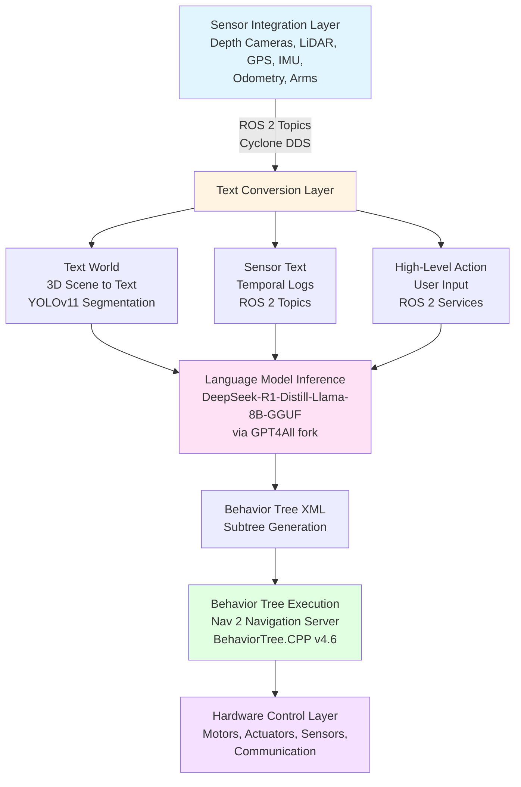

# TSBT-VLA System Implementation

This section provides implementation-specific details for the TSBT-VLA System using:

- **YOLOv11** for object segmentation
- **DeepSeek-R1-Distill-Llama-8B-GGUF** for large language model processing
- **ROS 2** for communication and data distribution
- **Nav 2** for navigation and path planning

## Overview

The ROBOCON OS implementation of TSBT-VLA uses specific technologies that provide optimal performance for edge-deployed robotic systems. This implementation guide covers:

1. **Track 1 Implementation**: YOLOv11 object segmentation for 3D World to Text
2. **Track 2 Implementation**: ROS 2 sensor integration for Sensor to Text
3. **Track 3 Implementation**: ROS 2 services and topics for User Input to Action
4. **Track 4 Implementation**: DeepSeek LLM with GPT4All fork for behavior tree generation
5. **Navigation Integration**: Nav 2 and BehaviorTree.CPP for behavior tree execution

## Implementation Architecture



## Implementation Tracks

### Track 1: 3D World to Text (YOLOv11)

**Technology**: YOLOv11 for object segmentation

**Implementation Details**:
- YOLOv11 model (nano/small/medium/large variants)
- ROS 2 node: `object_segmentation_node`
- Output: 2D polygons or pixel masks
- Integration with Object Extruder for 3D mesh creation

**See**: [Track 1 Implementation: YOLOv11 Object Segmentation](track1-yolov11.md)

---

### Track 2: Sensor to Text (ROS 2)

**Technology**: ROS 2 topics and messages

**Implementation Details**:
- ROS 2 sensor driver integration
- Topic subscription and aggregation
- Temporal log generation
- Text conversion from sensor data

**See**: [Track 2 Implementation: ROS 2 Sensor Integration](track2-ros2-sensors.md)

---

### Track 3: User Input to Action (ROS 2)

**Technology**: ROS 2 services and topics

**Implementation Details**:
- ROS 2 service: `/tsbt_vla/chat_input`
- ROS 2 topic: `/audio/microphone` and `/audio/transcription`
- Voice-to-text integration
- Behavior tree node insertion via ROS 2

**See**: [Track 3 Implementation: ROS 2 User Input](track3-ros2-user-input.md)

---

### Track 4: Large Language Model (DeepSeek)

**Technology**: DeepSeek-R1-Distill-Llama-8B-GGUF via GPT4All fork

**Implementation Details**:
- Model: DeepSeek-R1-Distill-Llama-8B-GGUF
- Framework: Forked GPT4All
- Hardware: AMD RX 7600 XT with ROCm acceleration
- Edge deployment (no cloud dependency)

**See**: [Track 4 Implementation: DeepSeek LLM](track4-deepseek-llm.md)

---

### Navigation and Execution (Nav 2 + BehaviorTree.CPP)

**Technology**: ROS 2 Nav 2 Navigation Server + BehaviorTree.CPP v4.6

**Implementation Details**:
- Nav 2 Navigation Server for behavior tree hosting
- BehaviorTree.CPP v4.6 for tree execution
- Custom TSBT-VLA nodes
- ROS 2 integration for hardware control

**See**: [Behavior Tree Execution with Nav 2](behavior-tree-execution.md)

## Hardware Requirements

### AI Computer (Primary Processing)

- **Motherboard**: ASRock B450M
- **GPU**: AMD Radeon RX 7600 XT
- **CPU**: AMD processor (compatible with B450M)
- **RAM**: 16GB+ recommended
- **Storage**: NVMe SSD for model storage
- **OS**: Ubuntu 24.04 LTS

### Edge Deployment Considerations

- ROCm for AMD GPU acceleration
- Edge-optimized model quantization (GGUF format)
- Real-time inference requirements
- Network connectivity for multi-robot coordination

## Software Stack

### Core Components

- **ROS 2**: Humble or Iron distribution
- **YOLOv11**: Ultralytics implementation
- **DeepSeek**: GPT4All fork with ROCm support
- **Nav 2**: Navigation2 stack
- **BehaviorTree.CPP**: v4.6

### Dependencies

```yaml
ros2:
  distribution: humble  # or iron
  packages:
    - rclcpp
    - sensor_msgs
    - nav2_msgs
    - std_msgs

yolo:
  package: ultralytics
  version: latest

deepseek:
  model: DeepSeek-R1-Distill-Llama-8B-GGUF
  framework: gpt4all-fork
  rocm: enabled

navigation:
  stack: nav2
  version: humble

behavior_tree:
  library: behaviortree_cpp_v3
  version: 4.6
```

## Performance Expectations

### Object Segmentation (YOLOv11)

- **YOLOv11n (nano)**: ~30-50 FPS on RX 7600 XT
- **YOLOv11s (small)**: ~20-30 FPS on RX 7600 XT
- **YOLOv11m (medium)**: ~10-20 FPS on RX 7600 XT
- **YOLOv11l (large)**: ~5-10 FPS on RX 7600 XT

### LLM Inference (DeepSeek)

- **Context Window**: 128k tokens (131,072 tokens)
- **Inference Speed**: Real-time capable with GPU acceleration
- **Model Size**: ~8B parameters, quantized to GGUF format
- **Memory**: ~8-16GB GPU memory recommended

### ROS 2 Communication

- **Topic Latency**: Less than 10ms for sensor topics
- **Service Response**: Less than 100ms for command processing
- **DDS**: Cyclone DDS for deterministic communication

## Configuration Files

### ROS 2 Launch Files

```xml
<!-- tsbt_vla.launch.py -->
<launch>
    <!-- Object Segmentation Node -->
    <node pkg="robocon_object_segmentation" 
          exec="object_segmentation_node" 
          name="object_segmentation_node">
        <param name="model_path" value="/path/to/yolov11_model.pt"/>
    </node>
    
    <!-- LLM Processing Node -->
    <node pkg="robocon_tsbt_vla" 
          exec="llm_processing_node" 
          name="llm_processing_node">
        <param name="model_path" value="/path/to/deepseek-model.gguf"/>
    </node>
    
    <!-- Navigation Server -->
    <include file="$(find nav2_bringup)/launch/navigation2.launch.py"/>
</launch>
```

## Next Steps

- [Track 1: YOLOv11 Object Segmentation](track1-yolov11.md) - YOLOv11 implementation details
- [Track 2: ROS 2 Sensor Integration](track2-ros2-sensors.md) - ROS 2 sensor topics and messages
- [Track 3: ROS 2 User Input](track3-ros2-user-input.md) - ROS 2 services and voice input
- [Track 4: DeepSeek LLM](track4-deepseek-llm.md) - DeepSeek model deployment and inference
- [Behavior Tree Execution](behavior-tree-execution.md) - Nav 2 and BehaviorTree.CPP integration

