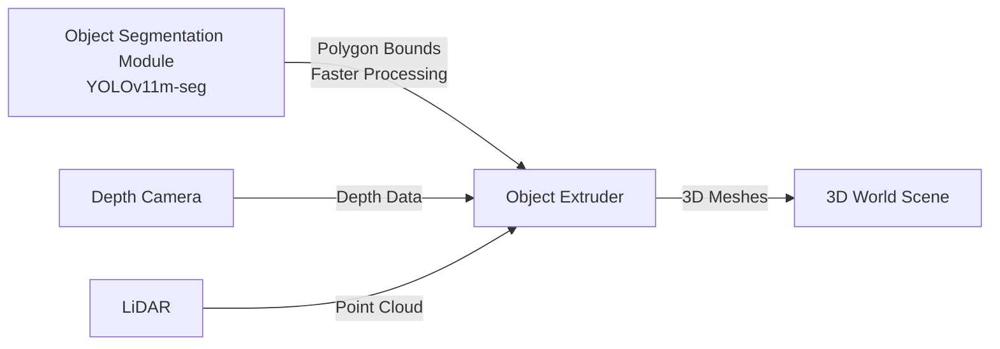

# Track 1 Implementation: YOLOv11 Object Segmentation

This document covers the implementation of Track 1 (3D World to Text) using **YOLOv11** for object segmentation.

## Overview

YOLOv11 (You Only Look Once version 11) is used as the implementation of the Object Segmentation Module. It processes RGB camera images and outputs 2D polygons (bounding boxes) or pixel masks (segmentation masks) that are used by the Object Extruder to create 3D meshes.

## YOLOv11 Model

### Model Variants

**Available Sizes**:
- **YOLOv11n (nano)**: Fastest, suitable for real-time applications (30-50 FPS)
- **YOLOv11s (small)**: Balanced performance (20-30 FPS)
- **YOLOv11m (medium)**: Higher accuracy (10-20 FPS)
- **YOLOv11l (large)**: Highest accuracy (5-10 FPS)

**Recommended**: YOLOv11n for real-time robotic applications on edge hardware.

### Model Architecture

YOLOv11 is built on the YOLO architecture with:
- Backbone: CSPDarknet
- Neck: PANet
- Head: YOLO detection head
- Support for instance segmentation

### Model Format

- **Training**: `.pt` (PyTorch format)
- **Inference**: `.pt` (PyTorch) or `.onnx` (ONNX Runtime)
- **Optimization**: Can be exported to TensorRT or ONNX for faster inference

## ROS 2 Node Implementation

### Node Structure

**Package**: `robocon_object_segmentation`

**Node Name**: `object_segmentation_node`

### Python Implementation

```python
#!/usr/bin/env python3
import rclpy
from rclpy.node import Node
from sensor_msgs.msg import Image
from cv_bridge import CvBridge
from ultralytics import YOLO
from robocon_tsbt_vla_msgs.msg import ObjectDetection, Polygon2D
import numpy as np

class ObjectSegmentationNode(Node):
    def __init__(self):
        super().__init__('object_segmentation_node')
        
        # Load YOLOv11 model
        model_path = self.declare_parameter('model_path', '/path/to/yolov11n.pt').value
        self.model = YOLO(model_path)
        self.bridge = CvBridge()
        
        # Subscribe to camera topic
        self.subscription = self.create_subscription(
            Image,
            '/camera/image_raw',
            self.image_callback,
            10
        )
        
        # Publish detection results
        self.detection_pub = self.create_publisher(
            ObjectDetection,
            '/object_segmentation/detections',
            10
        )
        
        self.get_logger().info('YOLOv11 Object Segmentation Node Started')
        
    def image_callback(self, msg):
        # Convert ROS Image to OpenCV format
        cv_image = self.bridge.imgmsg_to_cv2(msg, 'rgb8')
        
        # Run YOLOv11 inference
        results = self.model.predict(
            cv_image, 
            verbose=False,
            conf=0.6,  # Confidence threshold
            iou=0.4    # NMS threshold
        )
        
        # Convert to polygon format
        detections = self._convert_to_detections(results, msg.header)
        
        # Publish
        self.detection_pub.publish(detections)
    
    def _convert_to_detections(self, yolo_results, header):
        detection_msg = ObjectDetection()
        detection_msg.header = header
        
        for result in yolo_results:
            # Extract boxes and masks
            boxes = result.boxes
            masks = result.masks if result.masks is not None else None
            
            for i, box in enumerate(boxes):
                # Extract bounding box
                x1, y1, x2, y2 = box.xyxy[0].cpu().numpy()
                
                # Create polygon
                polygon = Polygon2D()
                
                # Use segmentation mask if available, otherwise use bounding box
                if masks is not None:
                    # Get mask for this detection
                    mask = masks.data[i].cpu().numpy()
                    # Convert mask to polygon points
                    from skimage import measure
                    contours = measure.find_contours(mask, 0.5)
                    if len(contours) > 0:
                        # Use largest contour
                        contour = contours[0]
                        for point in contour:
                            point_2d = Point2D()
                            point_2d.x = float(point[1])
                            point_2d.y = float(point[0])
                            polygon.points.append(point_2d)
                else:
                    # Use bounding box as polygon
                    from geometry_msgs.msg import Point32
                    polygon.points = [
                        Point32(x=x1, y=y1, z=0.0),  # Top-left
                        Point32(x=x2, y=y1, z=0.0),  # Top-right
                        Point32(x=x2, y=y2, z=0.0),  # Bottom-right
                        Point32(x=x1, y=y2, z=0.0)   # Bottom-left
                    ]
                
                # Add metadata
                polygon.object_class = int(box.cls[0])
                polygon.confidence = float(box.conf[0])
                polygon.class_name = self.model.names[int(box.cls[0])]
                
                detection_msg.polygons.append(polygon)
        
        return detection_msg

def main(args=None):
    rclpy.init(args=args)
    node = ObjectSegmentationNode()
    rclpy.spin(node)
    node.destroy_node()
    rclpy.shutdown()

if __name__ == '__main__':
    main()
```

### C++ Implementation (using ONNX Runtime)

```cpp
#include <rclcpp/rclcpp.hpp>
#include <sensor_msgs/msg/image.hpp>
#include <cv_bridge/cv_bridge.h>
#include <robocon_tsbt_vla_msgs/msg/object_detection.hpp>
#include <onnxruntime_cxx_api.h>
#include <opencv2/opencv.hpp>

class ObjectSegmentationNode : public rclcpp::Node {
public:
    ObjectSegmentationNode() : Node("object_segmentation_node") {
        // Load ONNX model
        std::string model_path = this->declare_parameter("model_path", "/path/to/yolov11n.onnx").as_string();
        session_ = initialize_onnx_model(model_path);
        
        // Subscribe to camera
        subscription_ = this->create_subscription<sensor_msgs::msg::Image>(
            "/camera/image_raw", 10,
            std::bind(&ObjectSegmentationNode::image_callback, this, std::placeholders::_1)
        );
        
        // Publish detections
        detection_pub_ = this->create_publisher<robocon_tsbt_vla_msgs::msg::ObjectDetection>(
            "/object_segmentation/detections", 10
        );
    }

private:
    void image_callback(const sensor_msgs::msg::Image::SharedPtr msg) {
        // Convert ROS Image to OpenCV
        cv_bridge::CvImagePtr cv_ptr = cv_bridge::toCvCopy(msg, "rgb8");
        
        // Preprocess image
        cv::Mat preprocessed = preprocess_image(cv_ptr->image);
        
        // Run inference
        auto outputs = run_inference(preprocessed);
        
        // Post-process to get detections
        auto detections = post_process(outputs, msg->header);
        
        // Publish
        detection_pub_->publish(detections);
    }
    
    // ONNX Runtime inference methods
    Ort::Session* initialize_onnx_model(const std::string& model_path);
    std::vector<float> run_inference(const cv::Mat& image);
    robocon_tsbt_vla_msgs::msg::ObjectDetection post_process(
        const std::vector<float>& outputs, 
        const std_msgs::msg::Header& header
    );
    
    cv::Mat preprocess_image(const cv::Mat& image);
    
    Ort::Session* session_;
    rclcpp::Subscription<sensor_msgs::msg::Image>::SharedPtr subscription_;
    rclcpp::Publisher<robocon_tsbt_vla_msgs::msg::ObjectDetection>::SharedPtr detection_pub_;
};
```

## Output Format

### 2D Polygons (Bounding Boxes)

```cpp
// Polygon from bounding box
Polygon2D polygon;
polygon.points = [
    Point2D(x=x1, y=y1),  // Top-left
    Point2D(x=x2, y=y1),  // Top-right
    Point2D(x=x2, y=y2),  // Bottom-right
    Point2D(x=x1, y=y2)   // Bottom-left
];
polygon.object_class = 0;  // Class ID
polygon.confidence = 0.95;
polygon.class_name = "sheathing";
```

### Pixel Masks (Segmentation)

```cpp
// Polygon from segmentation mask
Polygon2D polygon;
// Contour points extracted from mask
for (auto& point : mask_contour) {
    Point2D p;
    p.x = point.x;
    p.y = point.y;
    polygon.points.append(p);
}
polygon.object_class = 0;
polygon.confidence = 0.92;
polygon.class_name = "sheathing";
```

## Model Training

### Dataset Preparation

1. **Collect Images**: RGB images from robot cameras
2. **Annotate**: Label objects with bounding boxes and/or segmentation masks
3. **Format**: YOLO format (`.txt` annotations) or COCO format (JSON)

### Training Script

```python
from ultralytics import YOLO

# Load pre-trained YOLOv11 model
model = YOLO('yolo11n.pt')  # or yolo11s.pt, yolo11m.pt, yolo11l.pt

# Train on custom dataset
results = model.train(
    data='dataset.yaml',
    epochs=100,
    imgsz=640,
    batch=16,
    device='cuda',  # or 'cpu' or 'rocm' for AMD GPUs
    project='robocon_object_detection',
    name='yolov11_custom'
)
```

### Dataset Configuration (`dataset.yaml`)

```yaml
path: /path/to/dataset
train: train/images
val: val/images
test: test/images

nc: 10  # Number of classes
names:
  0: workpiece
  1: obstacle
  2: agent
  3: tool
  4: sheathing
  5: red_flag
  6: pipe
  7: table
  8: emergency_stop
  9: control_panel
```

## ROS 2 Topics

**Input**:
- `/camera/image_raw` (sensor_msgs/Image) - RGB camera images

**Output**:
- `/object_segmentation/detections` (robocon_tsbt_vla_msgs/ObjectDetection) - Detected polygons

**Parameters**:
- `model_path` - Path to YOLOv11 model file (`.pt` or `.onnx`)
- `confidence_threshold` - Minimum confidence for detections (default: 0.6)
- `nms_threshold` - Non-maximum suppression threshold (default: 0.4)
- `output_type` - "polygon" or "pixel_mask"

## Integration with Object Extruder

The Object Segmentation Node outputs polygons that are consumed by the Object Extruder. **Using YOLOv11m-seg with polygon bounds is faster** than pixel masks for the Object Extruder because polygons are already simplified geometric representations.



**Key Benefits of Polygon Bounds**:
- **Faster Processing**: Polygons (~50-200 vertices) vs pixel masks (307,200 pixels)
- **Reduced Memory**: KB per object vs MB per object
- **Direct Geometric Operations**: Frustum culling without mask rasterization
- **Better for Real-Time**: Optimized for Object Extruder pipeline

**See**: [Object Extruder Implementation](object-extruder.md) for detailed implementation and [Adding Objects to 3D World Scene](3d-world-scene.md#adding-objects-to-3d-world-scene) for integration examples.

### Exporting Polygon Bounds from YOLOv11m-seg

```python
from ultralytics import YOLO
import cv2
import numpy as np

model = YOLO("yolov11m-seg.pt")  # Segmentation model
results = model("image.jpg")

for r in results:
    if r.masks is not None:
        for i, mask in enumerate(r.masks):
            # Get mask data
            mask_data = mask.data.cpu().numpy().squeeze()
            
            # Find contours and extract polygon
            contours, _ = cv2.findContours(
                (mask_data * 255).astype(np.uint8),
                cv2.RETR_EXTERNAL,
                cv2.CHAIN_APPROX_SIMPLE
            )
            
            if len(contours) > 0:
                # Simplify contour to polygon (Douglas-Peucker)
                epsilon = 0.02 * cv2.arcLength(contours[0], True)
                polygon = cv2.approxPolyDP(contours[0], epsilon, True)
                
                # Convert to list of (x, y) points
                polygon_points = [(p[0][0], p[0][1]) for p in polygon]
                
                # Send to Object Extruder
                # See Object Extruder documentation for message format
```

## Performance Optimization

### For Real-Time Performance

1. **Use YOLOv11n**: Nano variant for fastest inference
2. **Reduce Image Size**: 480x480 or 640x640 input resolution
3. **GPU Acceleration**: Use CUDA or ROCm for GPU inference
4. **Batch Processing**: Process multiple frames if possible
5. **Model Quantization**: INT8 quantization for faster inference

### ROCm Optimization (AMD GPUs)

```bash
# Install ROCm-compatible PyTorch
pip install torch torchvision --index-url https://download.pytorch.org/whl/rocm5.7

# Set environment variable
export HIP_VISIBLE_DEVICES=0

# Run inference
python object_segmentation_node.py --device rocm
```

## Configuration

```yaml
object_segmentation:
  model:
    type: "yolov11"
    path: "/path/to/yolov11n.pt"
    size: "nano"  # nano, small, medium, large
    
  inference:
    image_size: 640
    confidence_threshold: 0.6
    nms_threshold: 0.4
    max_detections: 50
    
  output:
    polygon_type: "polygon"  # or "pixel_mask"
    include_metadata: true
    
  performance:
    device: "cuda"  # or "cpu" or "rocm"
    batch_size: 1
    num_threads: 4
```

## Next Steps

- [Track 2: ROS 2 Sensor Integration](track2-ros2-sensors.md) - Sensor data processing
- [Track 4: DeepSeek LLM](track4-deepseek-llm.md) - LLM processing
- [3D World to Text Track](../../tsbt-vla-system/3d-world-to-text.md) - Overall track overview
- [Object Segmentation Module](../../tsbt-vla-system/object-segmentation-module.md) - Module details

