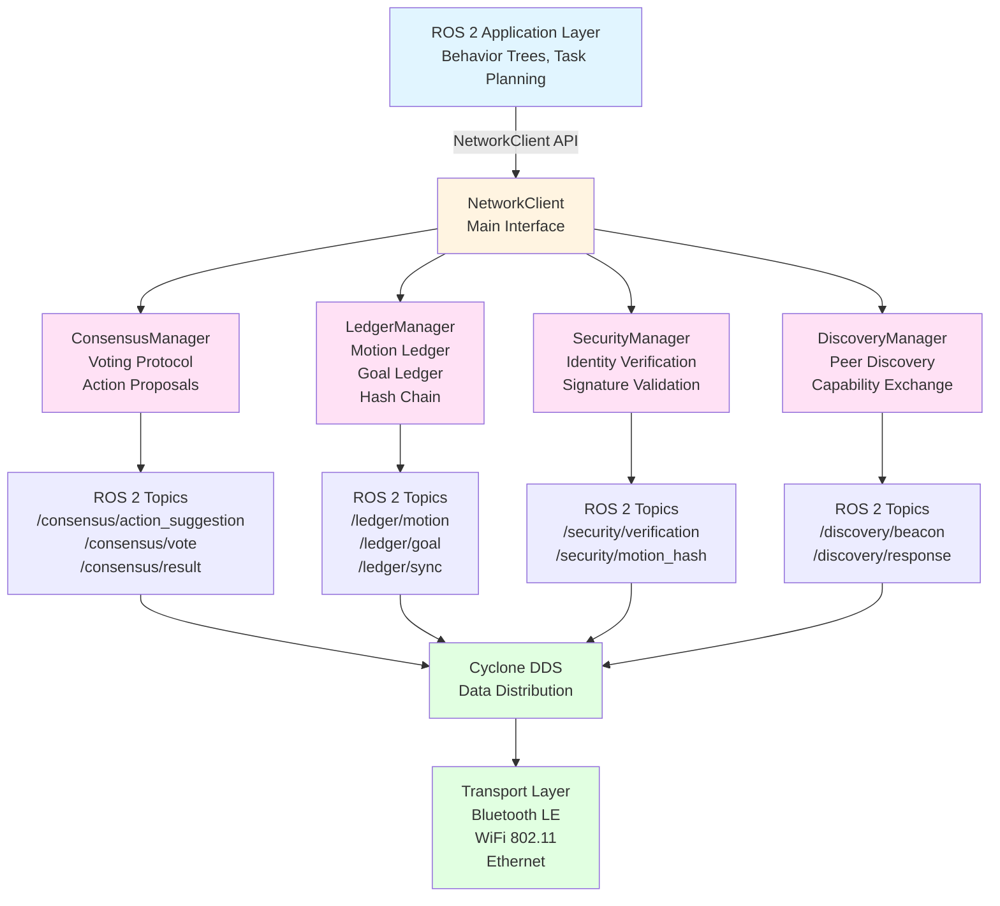

# Zero-Trust Consensus Protocol Implementation

This section provides implementation-specific details for the Zero-Trust Consensus Protocol in C++ within the ROS 2 system. The protocol is implemented by the ROBOCON OS Network Client and integrates deeply with ROS 2 Jazzy and Cyclone DDS.

## Overview

The Zero-Trust Consensus Protocol implementation uses:

- **ROS 2 Jazzy** for communication infrastructure
- **Cyclone DDS** for Data Distribution Service (DDS) implementation
- **C++17/20** for core implementation
- **Cryptography libraries** (OpenSSL or similar) for digital signatures and hashing
- **BehaviorTree.CPP** for behavior tree execution and synchronization

## Implementation Architecture

## Core Components

### 1. NetworkClient Class

The main interface that coordinates all protocol components.

### 2. ConsensusManager Class

Handles the voting protocol and consensus-based task allocation.

### 3. LedgerManager Class

Manages blockchain-style motion and goal ledgers with cryptographic hashing.

### 4. SecurityManager Class

Implements progressive zero-trust verification.

### 5. DiscoveryManager Class

Handles peer discovery and capability exchange.

## ROS 2 Integration

The protocol integrates with ROS 2 through custom message types and DDS topics. All communication flows through Cyclone DDS, which provides reliable, low-latency message distribution.

## Next Steps

- [Network Client Implementation](network-client.md) - Core NetworkClient class implementation
- [Consensus Manager Implementation](consensus-manager.md) - Voting protocol implementation
- [Ledger Manager Implementation](ledger-manager.md) - Motion and goal ledger implementation
- [Security Manager Implementation](security-manager.md) - Zero-trust verification implementation
- [Discovery Manager Implementation](discovery-manager.md) - Peer discovery implementation
- [ROS 2 Messages and Topics](ros2-integration.md) - Custom ROS 2 message definitions

