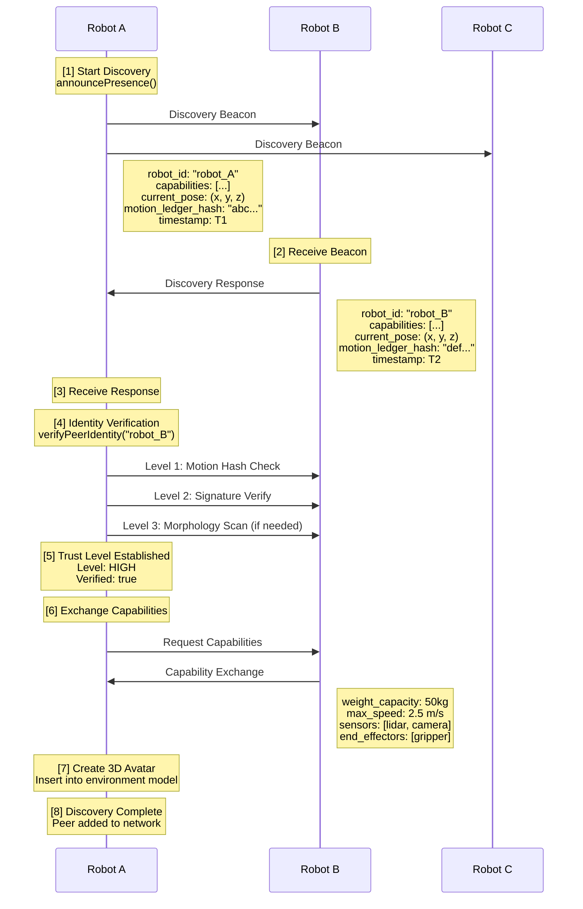

# Discovery Protocol Flow

The Discovery Protocol enables robotic agents to locate and identify nearby peers within the operational environment. This document details the step-by-step flow of the discovery process.

## Overview

Discovery operates in multiple phases:
1. **Beacon Broadcast**: Agents announce their presence
2. **Peer Response**: Receiving agents respond with identification
3. **Capability Exchange**: Agents exchange capabilities and current state
4. **Identity Verification**: Progressive verification begins
5. **Trust Establishment**: Trust level determined
6. **Environment Integration**: Peer robots added to shared environment model

## Discovery Flow Diagram



## Step-by-Step Process

### Step 1: Beacon Broadcast

**Initiator:** Robot A calls `announcePresence()` or `discoverPeers()`

**Action:**
- Robot A broadcasts a discovery beacon via DDS topic `/robocon/discovery/beacon`
- Beacon contains:
  - `robot_id`: Unique identifier
  - `capabilities`: High-level capability list
  - `current_pose`: Current position and orientation
  - `motion_ledger_hash`: Hash of recent motion ledger entries
  - `timestamp`: Current time
  - `version`: Protocol version

**Transport Options:**
- **Bluetooth LE**: Used for proximity discovery (fast, low power)
- **WiFi 802.11**: Used for longer-range discovery (slower, more data)

### Step 2: Peer Response

**Initiator:** Robot B receives discovery beacon

**Action:**
- Robot B validates beacon structure
- Robot B creates response beacon with its own information
- Response sent via DDS topic `/robocon/discovery/response`

**Response Contains:**
- `robot_id`: Robot B's identifier
- `capabilities`: Robot B's capabilities
- `current_pose`: Robot B's current position
- `motion_ledger_hash`: Robot B's ledger hash
- `timestamp`: Response time

### Step 3: Identity Verification (Progressive)

**Initiator:** Robot A receives response from Robot B

**Action:** Progressive verification begins

#### Level 1: Motion Hash Verification

```cpp
// Robot A requests motion ledger hash from Robot B
std::string expected_hash = ledger_manager.getLatestMotionHash("robot_B");
std::string received_hash = response.motion_ledger_hash;

if (expected_hash == received_hash || expected_hash.empty()) {
    // Hash matches or first-time discovery
    // Proceed to Level 2
}
```

**Purpose:** Verify Robot B has consistent motion history

#### Level 2: Signature Verification

```cpp
// Robot A verifies digital signature
bool verified = security_manager.verifySignature(
    response.data,
    response.signature,
    robot_b_public_key
);

if (verified) {
    // Signature valid
    // Proceed to Level 3 if needed
}
```

**Purpose:** Verify message authenticity

#### Level 3: Private Action Replay (Optional)

```cpp
// If hash comparison fails, request action replay
if (hash_mismatch) {
    // Request recent action replay from Robot B
    auto replay_data = requestActionReplay("robot_B", last_n_actions);
    
    // Verify replay data matches expected motions
    if (verifyReplayData(replay_data)) {
        // Trust established
    }
}
```

**Purpose:** Verify Robot B can replay recent actions accurately

#### Level 4: Morphology Scanning (Advanced)

```cpp
// Use stereo vision and LiDAR to verify physical characteristics
MorphologyData morphology = scanPeerMorphology("robot_B");

// Compare with expected morphology
if (morphology.matches(expected)) {
    // Physical verification passed
}
```

**Purpose:** Physical verification of robot characteristics

### Step 4: Trust Level Establishment

**Result:** Trust level determined based on verification results

**Trust Levels:**
- **UNVERIFIED**: No verification performed
- **LOW**: Motion hash matches
- **MEDIUM**: Signature verified
- **HIGH**: Full verification including replay or morphology
- **TRUSTED**: Long-term verified relationship

```cpp
enum class TrustLevel {
    UNVERIFIED = 0,
    LOW = 1,
    MEDIUM = 2,
    HIGH = 3,
    TRUSTED = 4
};
```

### Step 5: Capability Exchange

**Initiator:** After trust establishment, detailed capabilities exchanged

**Capabilities Include:**
- Weight lifting capacity
- Movement speed and range
- Sensor capabilities (LiDAR, cameras, IMU)
- End effector configurations
- Battery capacity
- Current task assignments

**Exchange Format:**
```json
{
    "robot_id": "robot_B",
    "capabilities": {
        "weight_capacity_kg": 50.0,
        "max_speed_mps": 2.5,
        "sensors": ["lidar", "camera", "imu"],
        "end_effectors": ["gripper", "hook"],
        "battery_level": 0.85,
        "current_task": "idle"
    }
}
```

### Step 6: Environment Integration

**Action:** Peer robot added to shared environment model

**Integration Steps:**
1. Create 3D avatar based on morphological data
2. Insert into environment server
3. Begin tracking position updates
4. Enable collision detection
5. Start motion prediction

### Step 7: Ongoing Discovery

**Continuous Process:**
- Discovery beacons sent periodically (configurable interval)
- Peer status updated based on last_seen timestamp
- Peer removed if timeout exceeded

## Transport-Agnostic Implementation

The discovery protocol works across multiple transport mechanisms:

### Bluetooth LE

**Use Case:** Proximity discovery bursts

**Advantages:**
- Low power consumption
- Fast discovery
- Good for initial contact

**Implementation:**
```cpp
// Bluetooth LE discovery
void discoverPeersBluetooth() {
    // Scan for BLE devices
    auto devices = ble_scan();
    
    for (auto& device : devices) {
        if (isRoboConDevice(device)) {
            // Establish connection
            establishBLEConnection(device);
            // Exchange discovery beacons
        }
    }
}
```

### WiFi 802.11

**Use Case:** Longer-range exchanges with substantial data

**Advantages:**
- Longer range
- Higher bandwidth
- More reliable for data exchange

**Implementation:**
```cpp
// WiFi discovery via DDS multicast
void discoverPeersWiFi() {
    // DDS automatically handles multicast discovery
    // Peers discovered via DDS participant discovery
    auto participants = dds_participant_discovery();
    
    for (auto& participant : participants) {
        if (isRoboConParticipant(participant)) {
            // Exchange discovery beacons via DDS topics
            exchangeDiscoveryBeacons(participant);
        }
    }
}
```

## Timeout and Retry Mechanisms

### Discovery Timeout

**Configuration:**
- Default timeout: 5000ms
- Configurable per discovery call

**Behavior:**
- If no response received within timeout, discovery fails
- Retry with exponential backoff
- Maximum retry attempts: 3

### Peer Lifecycle

**States:**
1. **DISCOVERING**: Actively discovering peers
2. **DISCOVERED**: Peer found and verified
3. **ACTIVE**: Peer actively communicating
4. **INACTIVE**: Peer not seen for configured period
5. **REMOVED**: Peer removed after extended inactivity

## Discovery Message Format

### Discovery Beacon

```cpp
struct DiscoveryBeacon {
    std::string robot_id;
    std::string robot_type;  // "robot", "tablet", "laptop"
    std::vector<std::string> capabilities;
    Pose current_pose;
    std::string motion_ledger_hash;
    std::chrono::system_clock::time_point timestamp;
    std::string protocol_version;
    std::string signature;
};
```

### Discovery Response

```cpp
struct DiscoveryResponse {
    std::string robot_id;
    std::string responding_to;  // robot_id that sent beacon
    std::vector<std::string> capabilities;
    Pose current_pose;
    std::string motion_ledger_hash;
    std::chrono::system_clock::time_point timestamp;
    std::string signature;
    bool willing_to_exchange;  // Indicates willingness to exchange detailed info
};
```

## Error Handling

### Common Errors

1. **Timeout**: No response received within timeout period
   - **Action**: Retry with exponential backoff

2. **Invalid Signature**: Signature verification fails
   - **Action**: Reject peer, log security event

3. **Hash Mismatch**: Motion hash doesn't match expected value
   - **Action**: Request action replay or escalate verification

4. **Network Failure**: Transport layer failure
   - **Action**: Switch to alternative transport mechanism

## Configuration Parameters

```yaml
discovery:
  bluetooth_scan_duration_ms: 2000
  wifi_broadcast_interval_ms: 5000
  discovery_timeout_ms: 10000
  max_retry_attempts: 3
  peer_timeout_seconds: 30
  enable_morphology_scan: true
```

## Next Steps

- [Voting Flow](voting-flow.md) - Detailed voting protocol flow
- [API Reference](api-reference.md) - Complete API documentation
- [Code Examples](examples.md) - Example code implementations

