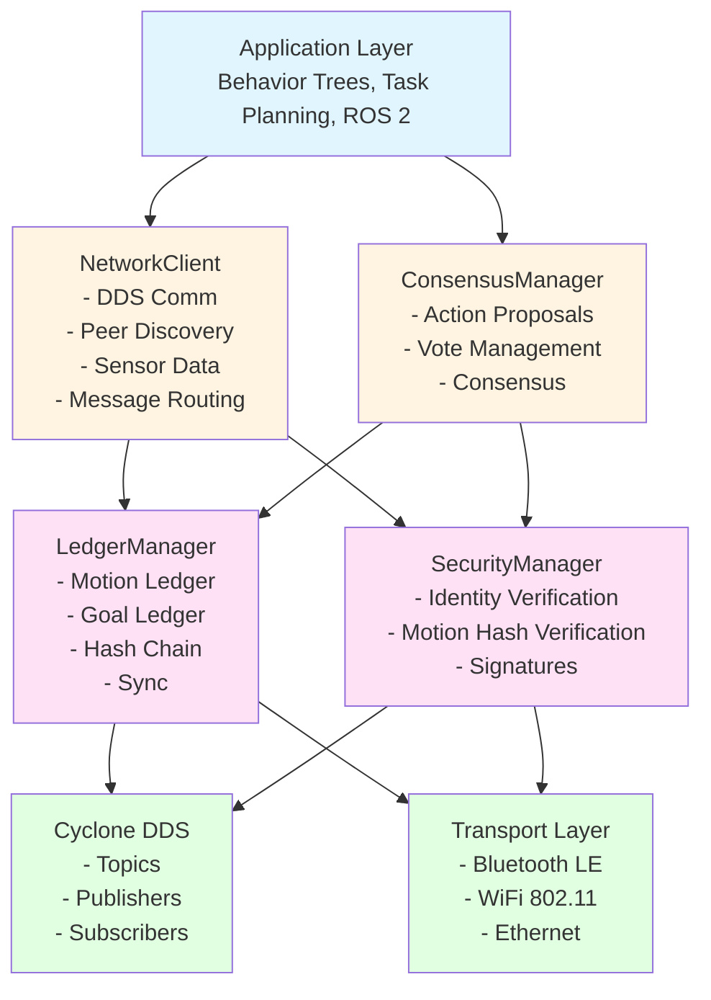

# Zero-Trust Consensus Protocol Overview

The **Zero-Trust Consensus Protocol** is a patent-pending consensus-based multi-robot task allocation system implemented by the ROBOCON OS Network Client. This protocol enables distributed decision-making among robotic agents through voting mechanisms while providing zero-trust identity verification and motion ledger authentication.

## Introduction

Unlike traditional centralized task allocation systems, the Zero-Trust Consensus Protocol operates **without requiring a centralized scheduler**. Robotic agents coordinate tasks through distributed consensus mechanisms, with each agent maintaining its own view of the network state.

### Key Features

- ✅ **Zero-Trust Security Model**: Progressive identity verification without assuming credentials are genuine
- ✅ **Consensus-Based Voting**: Distributed voting protocol for task allocation decisions
- ✅ **Motion Ledger**: Blockchain-style tamper-evident records of robot movements
- ✅ **Goal Ledger**: High-level natural language goals linked to motion entries
- ✅ **Transport-Agnostic**: Works over Bluetooth LE, WiFi 802.11, Ethernet, 5G, and more
- ✅ **Behavior Tree Integration**: Live synchronization of behavior trees between agents
- ✅ **Progressive Verification**: Multiple levels of identity verification

## Protocol Components

The Zero-Trust Consensus Protocol consists of several integrated components:

### 1. Discovery Protocol

Enables robotic agents to locate and identify nearby peers using transport-agnostic mechanisms.

**Features:**
- Bluetooth LE for proximity discovery bursts
- WiFi 802.11 for longer-range exchanges
- Selective identity revelation
- Capability exchange
- Real-time peer tracking

### 2. Voting Protocol

Facilitates consensus-based decision making for task allocation through a multi-phase voting process.

**Phases:**
1. **Action Suggestion**: Robot proposes an action
2. **Vote Intent Response**: Peers indicate willingness to participate
3. **Vote Ballot**: Peers cast yes/no votes
4. **Consensus Achievement**: Simple majority determines outcome
5. **Action Execution**: Approved actions inserted into behavior trees

### 3. Motion Ledger

Blockchain-style structure maintaining tamper-evident records of fine-grained robot motions.

**Characteristics:**
- Cryptographic hashing (SHA-256)
- Linked list structure (previous_hash → current_hash)
- Digital signatures for authentication
- Temporal ordering with timestamps
- Spatial indexing for pose queries

### 4. Goal Ledger

High-level natural language goals cross-linked to motion ledger entries.

**Structure:**
- Natural language goal descriptions
- Links to constituent motion entries
- Hierarchical relationships
- Temporal relationships
- Privacy hierarchy (most public)

### 5. Security Manager

Implements progressive zero-trust verification through multiple levels.

**Verification Levels:**
1. **Signature Verification**: Cryptographic signature validation
2. **Motion Hash Comparison**: Compare motion ledger hashes
3. **Private Action Replay**: Request replay of recent actions
4. **Morphology Scanning**: Physical verification using sensors

## System Architecture

## Protocol Flow Overview

### Discovery Flow

1. **Discovery Beacon Broadcast**: Agents broadcast discovery beacons
2. **Peer Response**: Receiving agents respond with identification
3. **Capability Exchange**: Agents exchange capabilities and current state
4. **Identity Verification**: Progressive verification begins
5. **Trust Level Establishment**: Trust level determined based on verification
6. **3D Avatar Creation**: Peer robots added to environment model

### Voting Flow

1. **Action Proposal**: Robot broadcasts action suggestion
2. **Vote Intent**: Peers respond with intent to vote
3. **Vote Collection**: Votes collected from participating agents
4. **Consensus Check**: Quorum and majority checked
5. **Executor Selection**: Best robot selected for execution
6. **Behavior Tree Update**: Action subtrees inserted into all participating agents
7. **Execution**: Synchronized action execution begins

## Security Model

The Zero-Trust Consensus Protocol implements a **progressive verification model** where:

1. **No Assumed Trust**: Never assumes signed credentials are genuine
2. **Progressive Disclosure**: Agents initially provide limited information
3. **Increasing Verification**: Verification requirements increase with task sensitivity
4. **Motion Hash Verification**: Blockchain-style verification of motion history
5. **Multi-Modal Verification**: Combines digital signatures, hashes, and physical scanning

## Integration with ROBOCON OS

The Zero-Trust Consensus Protocol is implemented by the **Network Client** repository (`RoboCon_Network-Client`) and integrates with:

- **ROBOCON OS**: Primary robot operating system
- **Behavior Trees**: Task execution and coordination
- **ROS 2 Jazzy**: Communication infrastructure
- **Cyclone DDS**: Data distribution service
- **Sensor Systems**: LiDAR, cameras, IMU for verification

## Next Steps

- [API Reference](api-reference.md) - Complete API documentation for all classes
- [Discovery Flow](discovery-flow.md) - Detailed discovery protocol flow diagrams
- [Voting Flow](voting-flow.md) - Detailed voting protocol flow diagrams
- [Code Examples](examples.md) - Example code in C, C++, and Python 3

## References

- **Patent**: Consensus-Based Zero-Trust Multi-Robot Task-Allocation System and Method
- **Implementation**: [RoboCon Network Client](https://github.com/roboconinc/RoboCon_Network-Client)
- **Related Documentation**: [Multi-Robot Communication](../architecture/multi-robot-communication.md)

