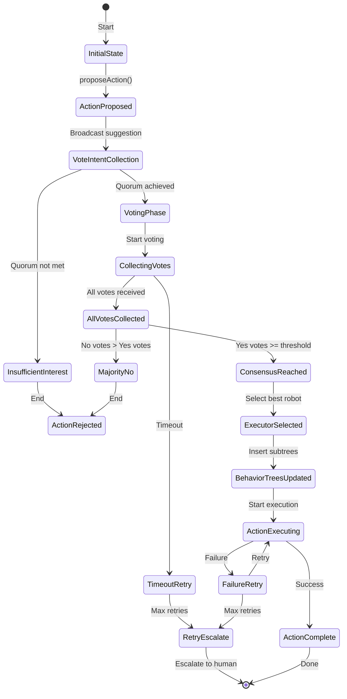

# Voting Protocol Flow

The Voting Protocol facilitates consensus-based decision making between robotic agents for task allocation. This document details the step-by-step flow of the voting process.

## Overview

The voting protocol operates in multiple phases:
1. **Action Suggestion**: Robot proposes an action
2. **Vote Intent Response**: Peers indicate willingness to participate
3. **Vote Ballot**: Peers cast yes/no votes
4. **Consensus Check**: Quorum and majority verified
5. **Executor Selection**: Best robot selected for execution
6. **Behavior Tree Update**: Action subtrees inserted into all participating agents
7. **Execution**: Synchronized action execution begins

## Voting Flow Diagram

```mermaid
sequenceDiagram
    participant A as Robot A<br/>(Proposer)
    participant B as Robot B
    participant C as Robot C
    
    Note over A: [1] Propose Action<br/>proposeAction(action)
    
    A->>B: ActionSuggestion
    A->>C: ActionSuggestion
    Note right of A: action_id: "action_001"<br/>action_type: "move_sheathing"<br/>target_location: "building_B_floor_2_room_5"<br/>estimated_cost: 150.0<br/>required_capabilities: ["manipulation", "navigation"]<br/>behavior_tree_node: "MoveSheathing"<br/>world_state_hash: "xyz..."<br/>timestamp: T1
    
    Note over B: [2] Receive Action Suggestion<br/>handleActionSuggestion()
    
    Note over B: [3] Evaluate Action<br/>- Check capabilities<br/>- Check resource availability<br/>- Verify world state
    
    B->>A: Vote Intent Response
    Note right of B: action_id: "action_001"<br/>voter_id: "robot_B"<br/>will_vote: true<br/>can_participate: true<br/>estimated_cost: 120.0<br/>timestamp: T2
    
    C->>A: Vote Intent Response
    
    Note over A: [4] Receive Vote Intent
    Note over A: [5] Collect Vote Intents<br/>Wait for vote_intent_timeout
    Note over A: [6] Start Voting Phase<br/>Broadcast vote request
    
    Note over B: [7] Cast Vote<br/>voteOnAction("action_001", true)
    
    B->>A: Vote Ballot
    Note right of B: action_id: "action_001"<br/>voter_id: "robot_B"<br/>vote: true (YES)<br/>reason: "Capable and available"<br/>timestamp: T3<br/>signature: "sig_B..."
    
    C->>A: Vote Ballot (YES)
    
    Note over A: [8] Collect Votes<br/>- Robot B: YES<br/>- Robot C: YES<br/>- Robot A: YES (proposer)
    
    Note over A: [9] Check Consensus<br/>Total votes: 3<br/>Yes votes: 3<br/>No votes: 0<br/>Consensus threshold: 0.5<br/>Quorum: 2/3 required<br/><br/>✓ Consensus reached!
    
    Note over A: [10] Select Executor<br/>- Robot B: cost 120.0<br/>- Robot C: cost 140.0<br/>- Robot A: cost 150.0<br/><br/>Executor: Robot B (lowest cost)
    
    A->>B: ConsensusResult
    A->>C: ConsensusResult
    Note right of A: action_id: "action_001"<br/>consensus_reached: true<br/>executor_id: "robot_B"<br/>yes_votes: 3<br/>total_votes: 3<br/>timestamp: T4
    
    Note over A,B,C: [12] Update Behavior Trees<br/>All robots insert action subtree<br/>Robot A: Monitor<br/>Robot B: Execute<br/>Robot C: Monitor
    
    Note over B: [13] Execute Action<br/>Robot B executes action<br/>All robots monitor progress
    
    B->>A: Action Complete
    B->>C: Action Complete
    Note over A,B,C: [14] Action Complete<br/>Notify all participants
```

## Step-by-Step Process

### Step 1: Action Proposal

**Initiator:** Robot A calls `proposeAction(action)`

**Action:**
- Robot A creates `ActionSuggestion` structure
- Action suggestion broadcast via DDS topic `/robocon/consensus/action_suggestion`
- Broadcast includes:
  - Unique action identifier
  - Action type and description
  - Target location or parameters
  - Estimated resource cost
  - Required capabilities
  - Behavior tree node structure
  - World state hash

**ActionSuggestion Structure:**
```cpp
ActionSuggestion action;
action.action_id = generateActionId();
action.proposer_id = "robot_A";
action.action_type = "move_sheathing";
action.target_location = "building_B_floor_2_room_5";
action.estimated_cost = 150.0;
action.required_capabilities = {"manipulation", "navigation"};
action.behavior_tree_node = "MoveSheathing";
action.world_state_hash = calculateWorldStateHash();
```

### Step 2: Vote Intent Response Phase

**Initiator:** Receiving robots (B, C) evaluate action

**Evaluation Process:**
1. **Capability Check**: Verify robot has required capabilities
2. **Resource Check**: Verify robot has available resources
3. **World State Check**: Verify world state hash matches
4. **Cost Estimation**: Estimate actual cost for this robot

**Vote Intent Response:**
```cpp
VoteIntentResponse intent;
intent.action_id = action.action_id;
intent.voter_id = "robot_B";
intent.will_vote = true;
intent.can_participate = true;
intent.estimated_cost = 120.0;  // Robot B's estimated cost
intent.reason = "Capable and available";
```

**Response Sent Via:** DDS topic `/robocon/consensus/vote_intent`

### Step 3: Vote Collection Phase

**Initiator:** Proposing robot (A) collects vote intents

**Timing:**
- Wait for `vote_intent_timeout` (default: 5000ms)
- Collect all vote intent responses
- Determine quorum (minimum participants required)

**Quorum Calculation:**
```cpp
uint32_t quorum_required = (total_peers * consensus_threshold) + 1;
bool has_quorum = vote_intents.size() >= quorum_required;
```

### Step 4: Vote Ballot Phase

**Initiator:** After quorum achieved, voting begins

**Vote Casting:**
- Each robot casts vote: `voteOnAction(action_id, vote)`
- Vote sent via DDS topic `/robocon/consensus/vote_ballot`

**Vote Structure:**
```cpp
Vote vote;
vote.action_id = "action_001";
vote.voter_id = "robot_B";
vote.vote = true;  // true = YES, false = NO
vote.reason = "Robot B can execute efficiently";
vote.signature = signVote(vote);
```

**Vote Collection:**
- Proposer collects votes until:
  - All vote intent participants have voted, OR
  - Vote timeout reached (default: 10000ms)

### Step 5: Consensus Check

**Initiator:** Proposer checks if consensus reached

**Consensus Criteria:**
1. **Quorum Met**: Minimum participants voted
2. **Majority Achieved**: Yes votes > No votes
3. **Threshold Met**: Yes votes >= (total_votes * consensus_threshold)

**Consensus Calculation:**
```cpp
ConsensusResult result;
result.action_id = action.action_id;
result.total_votes = votes.size();
result.yes_votes = countYesVotes(votes);
result.no_votes = countNoVotes(votes);

double yes_percentage = (double)result.yes_votes / result.total_votes;
result.consensus_reached = (yes_percentage >= consensus_threshold);

if (result.consensus_reached) {
    result.executor_id = selectExecutor(action, votes);
}
```

**Tie-Breaking:**
- If votes tied, deterministic tie-breaker uses robot-ID hash
- Robot with lowest hash ID wins

### Step 6: Executor Selection

**Initiator:** If consensus reached, select executor

**Selection Criteria:**
1. **Lowest Cost**: Robot with lowest estimated cost
2. **Best Capabilities**: Robot best matching required capabilities
3. **Availability**: Robot currently available
4. **Proximity**: Robot closest to target location

**Executor Selection:**
```cpp
std::string selectExecutor(const ActionSuggestion& action, 
                          const std::vector<Vote>& votes) {
    std::string best_executor;
    double best_cost = std::numeric_limits<double>::max();
    
    for (const auto& vote : votes) {
        if (vote.vote && vote.estimated_cost < best_cost) {
            best_cost = vote.estimated_cost;
            best_executor = vote.voter_id;
        }
    }
    
    return best_executor;
}
```

### Step 7: Consensus Result Broadcast

**Initiator:** Proposer broadcasts consensus result

**ConsensusResult Structure:**
```cpp
ConsensusResult result;
result.action_id = "action_001";
result.consensus_reached = true;
result.executor_id = "robot_B";
result.yes_votes = 3;
result.total_votes = 3;
result.consensus_timestamp = now();
```

**Broadcast Via:** DDS topic `/robocon/consensus/result`

### Step 8: Behavior Tree Update

**Action:** All participating robots update behavior trees

**Update Process:**
1. Insert action subtree into local behavior tree
2. Set execution state:
   - **Executor**: Execute action immediately
   - **Others**: Monitor executor's progress
3. Synchronize behavior trees across network

**Behavior Tree Insertion:**
```cpp
void updateBehaviorTree(const ConsensusResult& result) {
    BehaviorTreeNode action_node;
    action_node.node_id = result.action_id;
    action_node.node_type = "action";
    action_node.node_name = result.action.action_type;
    
    if (result.executor_id == robot_id) {
        // This robot is executor
        action_node.execution_mode = "execute";
    } else {
        // Monitor executor
        action_node.execution_mode = "monitor";
        action_node.monitor_target = result.executor_id;
    }
    
    behavior_tree.insertNode(action_node);
}
```

### Step 9: Action Execution

**Initiator:** Executor robot begins execution

**Execution Process:**
1. Executor robot executes action subtree
2. Other robots monitor executor's progress
3. Progress updates broadcast via motion ledger
4. All robots update their environment models

### Step 10: Completion Notification

**Initiator:** Executor notifies completion

**Completion Notification:**
```cpp
ActionCompletion completion;
completion.action_id = "action_001";
completion.executor_id = "robot_B";
completion.success = true;
completion.timestamp = now();
```

## Voting State Machine



## Fault Tolerance

### Voting Retries

**Configuration:**
- Maximum retry attempts: 3 (configurable)
- Exponential backoff between retries

**Retry Process:**
1. First attempt fails → Wait 2 seconds
2. Second attempt fails → Wait 4 seconds
3. Third attempt fails → Escalate to human operator

### Timeout Mechanisms

**Timeouts:**
- Vote intent timeout: 5000ms
- Vote collection timeout: 10000ms
- Action execution timeout: 300000ms (5 minutes, configurable)

**Timeout Handling:**
- If vote intent timeout: Retry with adjusted parameters
- If vote collection timeout: Use partial consensus if quorum met
- If execution timeout: Mark action as failed, escalate

### Escalation to Human Operator

**Triggers:**
- Consensus fails after all retries
- Execution failure
- Security verification failure
- Critical action requiring human approval

**Escalation Process:**
1. Generate escalation notification
2. Send to human operator interface
3. Wait for human decision
4. Execute based on human decision

## Configuration Parameters

```yaml
voting:
  vote_intent_timeout_ms: 5000
  vote_collection_timeout_ms: 10000
  consensus_threshold: 0.5  # Simple majority
  quorum_threshold: 0.67    # 2/3 of peers
  max_retry_attempts: 3
  executor_selection_strategy: "lowest_cost"  # or "best_capabilities"
  enable_tie_breaker: true
```

## Consensus Algorithms

### Simple Majority

**Algorithm:** Yes votes > No votes AND Yes votes >= (total_votes * threshold)

**Use Case:** Standard task allocation

### Unanimous Consensus

**Algorithm:** All votes must be YES

**Use Case:** Critical safety decisions

### Weighted Voting

**Algorithm:** Votes weighted by robot capabilities or trust level

**Use Case:** Complex multi-robot coordination

## Next Steps

- [Discovery Flow](discovery-flow.md) - Detailed discovery protocol flow
- [API Reference](api-reference.md) - Complete API documentation
- [Code Examples](examples.md) - Example code implementations

